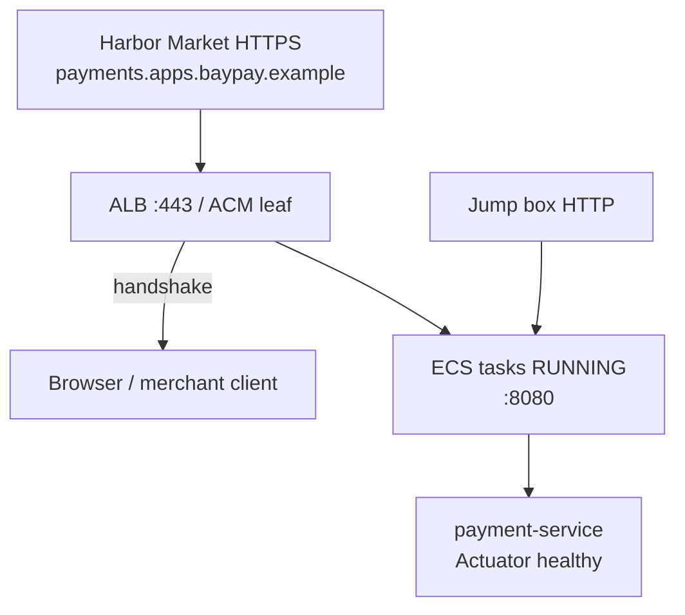

# INCIDENT-1402 — HTTPS handshake failures on the payments host

**Type:** INCIDENT  
**Module:** 14 — Security, High Availability and Disaster Recovery  
**Duration:** 45–75 minutes  
**Cost:** **$0** (pack path). **Real AWS bills if you poke a live account.**  
**awsLab:** no — paper plus files; do not apply  
**Region:** `us-west-2`  
**Lessons:** L-14.1, L-14.4  
**Diagram:** AEJE-D-065 (Certificate expiration)  
**Pack:** [incidents/production/INC-SEC-1402](../../incidents/production/INC-SEC-1402/README.md)  
**Trust notes:** [datasets/baypay-security/TRUST.md](../../datasets/baypay-security/TRUST.md)

This student guide does **not** contain a root-cause answer. Work the evidence in gate order. Do not open `solutions/INCIDENT-1402/` until the worksheet is filled through remediation.

**Cost warning:** This lab is synthetic files. Do not `terraform apply`, do not request ACM, do not edit Route 53, and do not attach a live listener “to reproduce.” If you already have leftover Module 11 resources, destroy them on that lab’s cleanup path — not as an experiment during this incident.

---

## Scenario

00:15 Pacific on a synthetic `baypay-prod` night in September 2026 (07:15 UTC). Harbor Market cannot complete HTTPS to `payments.apps.baypay.example`. The pager names `payment-service` on ECS in `us-west-2`. Riley Okonkwo is on call. Priya Nair says the tasks are still RUNNING. Sam Okada mentions a recent DNS cleanup ticket. You are the engineer on call. The incident pack is synthetic BayPay data.

---

## Business context

Avery Chen’s client (`11111111-1111-1111-1111-111111111111`, active USD account `22222222-2222-2222-2222-222222222221`) never leaves the browser when the handshake fails. Example payment `c1402b22-0000-4000-8000-111111111402` is stuck client-side. A handshake failure is not a domain decline and not a 502 from an empty target group.

Do not bounce Postgres. Do not bounce `dmgr-east`. Do not disable TLS to “restore HTTP.” Intended port, health path, and TLS notes live in [TRUST.md](../../datasets/baypay-security/TRUST.md). A live AWS account is **not** required. HTTP from a jump box to task `:8080` can succeed while merchants fail TLS. That is a **symptom class**, not an RCA. Quote this pack’s files.

---

## Learning objectives

- Follow gated evidence: client handshake first, then ACM describe, then Route 53 records.
- Separate “tasks are RUNNING” from “merchants can complete HTTPS.”
- Write stabilization that restores HTTPS without inventing a database outage.
- Write remediation that belongs in DNS-as-code and expiry alerting, not in a one-off console click you cannot replay.
- Produce a comms update that does not invent a security-group or Postgres story the files do not show.
- Record quotes on PF-security.md **in your words**, not by pasting the instructor folder.

---

## Architecture

Course diagram **AEJE-D-065** is this failure path. Until the PNG is on disk, use the mermaid below plus TRUST.md.



Alt text: Merchants hit HTTPS on payments.apps.baypay.example at the ALB. ECS tasks remain RUNNING on port 8080. A jump box can reach HTTP on the task port. The customer path is the handshake at the edge, not the Actuator JSON.

### Service list

| Service | In this pack? | Live apply? |
|---|---|---|
| Client TLS / openssl-style handshake | Yes — `tls-handshake.txt` | No |
| ACM describe | Yes — `acm-describe.txt` | Do not request a cert |
| Route 53 record list | Yes — `route53-records.txt` | Do not change DNS |
| ECS tasks | Named in the timeline (RUNNING) | No |
| RDS / NAT / EKS / security groups | No | Do not create |
| Kubernetes TLS Secret | No | Do not invent cluster Secret objects |

### Region assumptions

`us-west-2`. Cluster `baypay-prod-west`. Service `payment-service`. Teaching host `payments.apps.baypay.example`. Hosted zone `baypay.example` (synthetic). Paper DR region `us-east-1` is **out of scope** for this page.

### Least-privilege / security notes

- On-call needs `acm:DescribeCertificate`, `acm:ListCertificates`, `route53:ListResourceRecordSets`, and read on the ALB listener. Not `AdministratorAccess`. Not `iam:CreateAccessKey`.
- Do not paste a private key into the worksheet.
- Do not commit AWS keys while you screenshot the console.
- Do not turn TLS off on the listener.

### Failure scenario

Skipping to later files before a written hypothesis, or “fixing” prod by disabling HTTPS, fails Diagnostic method and Production awareness even if your eventual label matches a catalog title.

---

## Prerequisites

- [TRUST.md](../../datasets/baypay-security/TRUST.md) host, port, health, and TLS alert lines.
- Incident worksheet: [student-worksheet.md](../../incidents/production/INC-SEC-1402/student-worksheet.md).
- ARCHITECT-1401 literacy (identity/TLS is a failure domain) helps; you may still work this pack first.
- Optional PAKS: `docs/20-security/overview.md`. Lessons stand alone without it.

---

## Environment setup

No runtime required. Open the pack:

```text
incidents/production/INC-SEC-1402/
  README.md
  timeline.json
  student-worksheet.md
  evidence/          # gated — see timeline.json "gates"
```

This pack is a **gated subset**. Gate 1 is the client handshake. Gate 2 is ACM describe. Gate 3 is the Route 53 record list. The pack README documents what shipped and what was omitted.

Do not open `solutions/INCIDENT-1402/` until you have filled the worksheet through remediation.

Do not run `aws acm request-certificate` or `aws route53 change-resource-record-sets` against a paid account. The files are the estate.

---

## Challenge/tasks

1. Read the pack README and `timeline.json`. Note who paged, who mentioned a DNS cleanup, and when merchants failed HTTPS. Note task status.
2. **Gate 1:** open `evidence/tls-handshake.txt` only. Record what the client sees, the leaf dates if present, and whether HTTP to `:8080` from inside the VPC is mentioned. Write a first hypothesis and the next investigation.
3. **Gate 2:** after that hypothesis, open `evidence/acm-describe.txt`. Update the hypothesis. Quote certificate **status** and domain name. Do not close the RCA on a single word from the lab title.
4. **Gate 3:** open `evidence/route53-records.txt` only if it answers a question you already wrote about DNS names ACM or the ALB would need. Quote what is present and what a lookup does not return.
5. Write stabilization, remediation, and a 5-line comms update. Name people only as they appear in the timeline (Riley Okonkwo, Priya Nair, Sam Okada, Jordan Voss). Morgan Hale / `dmgr-east` is not a lever.
6. Copy **your** quotes (not the instructor RCA) into the incident inset on [PF-security.md](../../student/worksheets/PF-security.md).

---

## Validation

A complete worksheet has all six fields: hypothesis (updated per gate), evidence, next investigation, stabilization, remediation, comms. A lucky “the cert expired” with no quoted ACM status and no quoted Route 53 fact scores low on Diagnostic method (see rubric). Skipping to the Route 53 file before a written question also scores low. Opening the solution first fails Diagnostic method.

Instructor scores with [instructor/rubrics/INCIDENT-1402.md](../../instructor/rubrics/INCIDENT-1402.md).

---

## Troubleshooting

- You jumped to later files: stop, write what you *would* have asked, then continue.
- Tasks are RUNNING and merchants fail HTTPS: the Actuator path is not the customer path. Read the handshake first.
- You want to bounce Postgres or `dmgr-east`: re-read TRUST.md. This pack omitted database metrics on purpose.
- You want to disable TLS on the ALB: write the blast radius. Prefer restoring a valid leaf on :443.
- You want `aws acm` or `aws route53` against a shared account: write the change on paper. This lab does not require AWS.
- Jump-box HTTP to `:8080` works: that confirms the JVM, not the merchant handshake.

---

## Expected outcome

A written diagnosis path an instructor can score. You may be wrong on the first hypothesis; you may not skip gates. The student guide will not tell you which ACM status or which DNS name matters.

---

## Interview questions

1. Why is “the tasks are healthy” a weak first sentence when merchants fail HTTPS?
2. What does HTTP to task `:8080` from a jump box prove, and what does it not prove?
3. When do you attach a last-valid certificate versus waiting for a new issuance?
4. Why is turning the ALB listener back to HTTP a poor stabilization?
5. What would you page on *before* merchants fail a handshake?

---

## Architecture/trade-off questions

1. Edge TLS at the ALB versus a certificate inside the task — which object did merchants actually hit?
2. Calendar reminder versus “ticket at 30 days, page at 7 days” (TRUST.md) — who is awake at 00:15?
3. DNS records in Terraform versus a console cleanup of “unused” names — what inventory would you require first?
4. Why is a security-group change the wrong first move when the handshake itself fails?
5. How does this identity/TLS domain eat the ARCHITECT-1401 52-minute year even if every AZ is up?

---

## Cleanup

None for the pack. Do not delete the evidence files. No cloud resources to tear down on the grade path.

If you ignored the cost warning and touched a live account, destroy leftover ACM requests, Route 53 changes, ALB listeners, and any second-region experiments in `us-west-2` / `us-east-1` now.

---

## Cost estimate

**Grade path: $0.** Synthetic files only. No AWS API. No required ACM or Route 53 apply.

**Misuse path:** live ACM / Route 53 / ALB experiments can leave billed listeners and unused certificates. Do not do that for this lab.

---

## Hidden/revealable solution

The student guide does not include the answer. Submit the worksheet first. Instructors use `solutions/INCIDENT-1402/` and `instructor/rubrics/INCIDENT-1402.md`. Opening the solution before you write is a failed Diagnostic method score.

<details>
<summary>Reveal process check — after you have written three gate hypotheses</summary>

You should have quoted the handshake file, then an ACM status that is not a successful issuance, then a Route 53 fact about which names exist. If you only wrote “expired cert” and stopped, return to gates 2 and 3 before you open `solutions/`. The scored work is the quoted status plus the DNS inventory, not the catalog title.

</details>

---

## What you learned

RUNNING tasks are not a completed merchant handshake. HTTP to `:8080` is a different path from HTTPS on `payments.apps.baypay.example`. Stabilization (restore HTTPS) is a different sentence from remediation (DNS as code, expiry alerts, change-control). A lucky “certificate” label does not replace gate order. AEJE-D-065 is that split.

---

## Portfolio deliverable

Attach the completed INC-SEC-1402 worksheet. Record stabilize versus remediate and **your** evidence quotes on [student/worksheets/PF-security.md](../../student/worksheets/PF-security.md). Do not paste `solutions/INCIDENT-1402/`.
