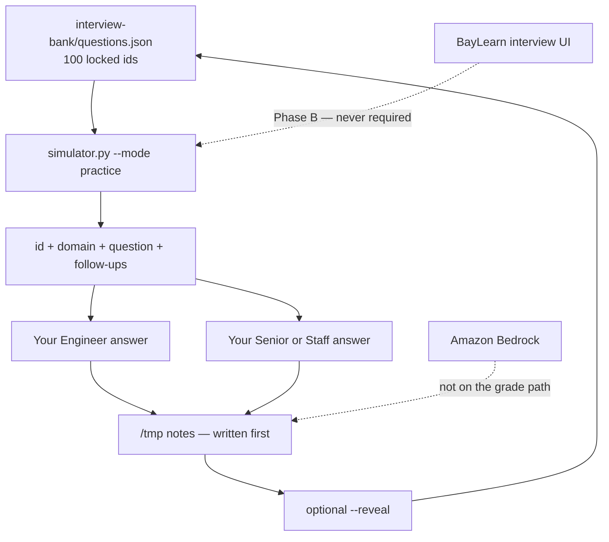

# INTERVIEW-1601 — Practice mode

**Type:** INTERVIEW  
**Module:** 16 — Advanced Engineer Interview Simulator  
**Duration:** 60–90 minutes (timed variant: **8 minutes** per item)  
**Cost:** **$0**  
**awsLab:** no  
**Region:** `us-west-2` if AWS is named  
**Lessons:** L-16.1–L-16.6 (any domain slice)  
**Rounds:** [datasets/baypay-interview/ROUNDS.md](../../datasets/baypay-interview/ROUNDS.md)  
**Modes:** [interview-bank/modes.md](../../interview-bank/modes.md)  
**Bank:** [interview-bank/questions.json](../../interview-bank/questions.json) (exactly **100** records)  
**Simulator:** [interview-bank/simulator.py](../../interview-bank/simulator.py)  
**Worksheet:** practice notes you write; portfolio design lives on [PF-design.md](../../student/worksheets/PF-design.md) after INTERVIEW-1604

This is **Phase A paper plus CLI**. You open a bank prompt, write **two maturity levels**, then compare. You are **not** logging into a BayLearn interview UI. You are **not** calling Amazon Bedrock. You are **not** applying Terraform. A live AWS account is **not** required.

**Cost warning:** The grade path is `python3` against a local JSON bank. Do not stand up Interview Accelerator, a portal session store, or a Bedrock “coach.” If leftover Module 11–12 resources exist, destroy them on those labs’ cleanup paths — not as an interview experiment.

---

## Scenario

09:10 Pacific on a synthetic interview morning, **2026-09-03**. Priya Nair is staffing a Staff loop for Harbor Market’s next volume week. Jordan Voss wants proof that you can talk **Engineer** and **Senior** (or **Staff**) on the same BayPay prompt without one memorized paragraph. Riley Okonkwo will not accept “I read the reveal first.” Sam Okada will try to `terraform apply` in `us-west-2` “so the answer is honest.” You refuse that.

You are the candidate. The company is fictional BayPay Financial Services. The prompt comes from the **100-question** bank. Avery Chen (`11111111-1111-1111-1111-111111111111`, active USD account `22222222-2222-2222-2222-222222222221`) still posts `POST /api/v1/payments`. Example payment for this lab: `c1601a11-0000-4000-8000-111111111601`.

---

## Business context

Harbor Bike Co charges Avery Chen `$84.00` through `payment-service` (Java 21, Spring Boot 3.5.5) on port `8080`. Finance does not pay for a spoken answer that recites `solutions/` or a model dump. Finance cares that a retry with an `Idempotency-Key` does not debit `…221` twice, and that you can say **why** at more than one seniority.

A Staff sentence names trade-offs and who owns the next change. An Engineer sentence names the mechanism. One paragraph reused at every level is a **fail** (ROUNDS.md). You write your answers **before** `--reveal`. Reveal is a self-check, not the assignment.

Do not bounce `dmgr-east`. Do not disable TLS. Do not invent a 101st question. Do not require the portal.

---

## Learning objectives

- Run `python3 interview-bank/simulator.py --mode practice` (or `--id AEJE-IQ-00N`) and treat the printed prompt as the only stem.
- Answer **3–5** bank items. For each item write **two** maturity levels (Engineer + Senior, or Senior + Staff). Principal is extra, not required.
- Keep answers **BayPay-scoped**: `POST /api/v1/payments`, Avery’s UUID, leftover ND is not the serving plane.
- Use the **timed variant** on at least one item: 8 minutes, same quality bar, clock started by you (or `--mode timed-interview`).
- Compare to the bank only **after** you stop writing. Do not require reveal first.
- Record ids, domains, and what changed between the two levels in your notes.

---

## Architecture

Phase A is files plus a local simulator. Until a BayLearn UI exists (Phase B, **not** required), use the mermaid plus ROUNDS.md.



Alt text: A candidate pulls one bank prompt from a local simulator, writes Engineer and Senior answers into notes, and only then may re-run with reveal. A portal UI and Bedrock are optional and not required to pass.

### Service list

| Piece | In this lab? | Live apply? |
|---|---|---|
| `interview-bank/questions.json` | Yes — 100 records | No |
| `simulator.py --mode practice` | Yes — grade path | No |
| Timed clock (8 minutes) | Yes — at least one item | No AWS timer |
| BayLearn portal / session store | Named only | Do not require |
| Amazon Bedrock | Named only | Do not call |
| ECS / EKS / RDS / ACM | Named in prompts only | Do not apply |

### Region assumptions

`us-west-2` when a prompt names AWS. Teaching host `payments.apps.baypay.example`. Health `/actuator/health/liveness` on `:8080`. Operated SLO in Module 13 notes stays **99.9%** unless a later design lab changes the contract.

### Least-privilege / security notes

- You need read on the bank and write on your notes. Not `AdministratorAccess`.
- Do not put PAN, CVV, or `BAYPAY_DB_PASSWORD` in an answer or a prompt.
- Avery’s UUID may be named. Do not put it on a metric label “to sound production.”

### Failure scenario

Revealing the bank answer before you write, pasting one paragraph into both maturity boxes, or applying EKS “so ECS vs EKS is real” fails Diagnostic method and Production awareness even if the topic title was correct.

---

## Prerequisites

- [ROUNDS.md](../../datasets/baypay-interview/ROUNDS.md) — practice vs timed vs rapid-fire.
- [modes.md](../../interview-bank/modes.md) and [interview-bank/README.md](../../interview-bank/README.md).
- `python3` on the PATH. No AWS CLI required.
- Ability to write two short spoken-style answers (6–12 sentences each) without a model.
- Lessons L-16.1–L-16.6 if present. This lab stands alone with the bank.
- If `questions.json` is not assembled yet: `python3 qa/merge_interview_bank.py` (does not add a 101st id).

---

## Environment setup

From the course root:

```bash
test -f interview-bank/simulator.py && echo "simulator present"
test -f interview-bank/questions.json || python3 qa/merge_interview_bank.py
test -f datasets/baypay-interview/ROUNDS.md && echo "rounds present"
mkdir -p /tmp/aeje-interview-1601
```

Draw the first **practice** prompt. Do **not** pass `--reveal` on this run:

```bash
python3 interview-bank/simulator.py --mode practice
```

Pin an id when you want a known stem (examples — pick any three to five):

```bash
python3 interview-bank/simulator.py --mode practice --id AEJE-IQ-012
python3 interview-bank/simulator.py --mode practice --domain Java/JVM
python3 interview-bank/simulator.py --mode practice --domain AWS
```

Timed variant (same quality bar). Start a clock yourself, or:

```bash
python3 interview-bank/simulator.py --mode timed-interview
```

Write `/tmp/aeje-interview-1601/answers.md` as you go. Leave the bank file untouched. Do not open `solutions/INTERVIEW-1601/` until three items have two maturity drafts.

You will **not** run `aws`, Terraform, kubectl, or Bedrock. You will **not** start a portal.

---

## Challenge/tasks

1. **Open without reveal.** Run `python3 interview-bank/simulator.py --mode practice` (or `--id`). Copy the **id**, **domain**, and **question** into your notes. Do not add `--reveal` yet.
2. **Pick 3–5 items.** Cover at least **two domains** (for example Java/JVM and AWS, or Production Engineering and WebSphere/Liberty). Do not invent prompts. Do not add AEJE-IQ-101.
3. **Two maturities each.** For every id write:
   - **Engineer** — mechanism, BayPay names, what you would measure or refuse.
   - **Senior** or **Staff** — same prompt, different scope: trade-off, who decides, what you will not do this quarter.
   - One sentence: what a **Principal** would add (optional; not graded as a full answer).
4. **Follow-ups.** Answer at least one printed follow-up per item in the higher maturity voice.
5. **Timed variant.** Repeat **one** item (or a fourth new id) under an **8-minute** clock. Same two-level bar. Mark `timed: yes` and the elapsed minutes. Quality does not drop because the clock ran.
6. **BayPay anchors.** Name Avery Chen, `POST /api/v1/payments`, and at least one refusal (`dmgr-east` bounce, TLS-off, NAT/EKS apply, PAN on a label) where the prompt invites it.
7. **Compare last.** Only after the draft is saved, re-run with `--reveal` **or** read the bank fields `engineerAnswer` / `seniorAnswer` / `staffAnswer`. Write 3–5 bullets: what you missed, what you over-claimed, what you will not copy verbatim into a live mock.
8. **Do not** paste the bank text back as “your” spoken answer. Comparison is a gap list, not a rewrite-from-key.

---

## Validation

- [ ] You used `python3 interview-bank/simulator.py --mode practice` (or `--id` / `--domain`) for the stems.
- [ ] You answered **3–5** real bank ids. Each has **two** maturity drafts that are not the same paragraph.
- [ ] At least **one** item is marked timed (**8 minutes**).
- [ ] `--reveal` was **not** required to start. You wrote first.
- [ ] Notes name Avery (`11111111-1111-1111-1111-111111111111`) or payment `c1601a11-…1601` at least once.
- [ ] No PAN, no `BAYPAY_DB_PASSWORD`, no access keys.
- [ ] No `aws` apply, no portal login, no Bedrock invoke.
- [ ] You did not add a 101st question or a second bank file.
- [ ] A notes file that only says “I would do well” is not complete.

Instructor scores with [instructor/rubrics/INTERVIEW-1601.md](../../instructor/rubrics/INTERVIEW-1601.md).

---

## Troubleshooting

| Symptom | What to check |
|---|---|
| `questions.json not assembled` | Run `python3 qa/merge_interview_bank.py`. Do not hand-write a second bank. |
| Tempted to `--reveal` to “know the shape” | Write a weaker draft first. Reveal after. |
| Both maturities are the same six sentences | Raise scope on the second: blast radius, owners, what you refuse this quarter. |
| Clock expired at 8:00 with one level | Keep the incomplete second level; mark time. Do not silently un-time it. |
| Wanted Bedrock to “sound Staff” | Stop. Your words are the grade. |
| Wanted to apply EKS because AEJE-IQ-064 names platforms | Paper. ARCHITECT-1102 already taught the table. |
| Copied `solutions/INTERVIEW-1601/` into notes | Diagnostic method fails. Rewrite in your words. |
| Portal 404 / no BayLearn UI | Expected. Phase A is the CLI. |

---

## Expected outcome

A notes file an instructor can score: 3–5 ids, two maturity voices each, one timed row, a short gap list after optional reveal. The bank’s `scoreRubric` is a self-check, not a script you recite. You may be unsure at Principal; you may not skip Engineer.

---

## Interview questions

1. Why is one memorized paragraph a fail even if it is factually dense?
2. What does an Engineer answer owe that a Staff answer must not merely repeat?
3. Why is `--reveal` optional after writing, and illegal as the first command?
4. How does an 8-minute clock change the **bar** versus the **length**?
5. Why is a BayLearn UI not required to pass Module 16?

---

## Architecture/trade-off questions

1. Practice (untimed, two levels) versus timed-interview (8 minutes) — what do you keep, what do you cut?
2. Pinning `--id AEJE-IQ-012` versus `--domain Java/JVM` — when is each honest prep?
3. Why keep exactly 100 questions with locked domain counts instead of generating more at runtime?
4. Paper CLI versus a portal session store — what failure mode does Phase A refuse to depend on?
5. When should you refuse to name leftover `PaymentCluster` as the serving plane in a JVM answer?

---

## Cleanup

No cloud resources on the grade path. Keep your notes if you will sit INTERVIEW-1605. Delete the temp directory if you do not need it.

```bash
# optional — keep answers.md if you will reuse ids in 1605
rm -rf /tmp/aeje-interview-1601
```

Do not delete `interview-bank/questions.json`. Do not commit PAN. If you ignored the cost warning and invoked Bedrock or applied a “demo interview” stack in `us-west-2`, destroy tagged leftovers (`Course=AEJE`, `Module=16`) the same day.

---

## Cost estimate

**Grade path: $0.** Local `python3`, JSON bank, a clock. No AWS API. No required model. No portal seat.

**Misuse path:** Bedrock tokens, an idle ALB (~$0.0225/hour), EKS or NAT “for a realistic AWS answer” are dollars and a lab failure. Extra-credit live infra cannot replace two written maturities.

---

## Hidden/revealable solution

Write three items first. Instructor files: `solutions/INTERVIEW-1601/`. Opening them before two-maturity drafts exist is a failed Diagnostic method score. The bank `--reveal` fields are a **self-check**, not this folder.

<details>
<summary>Reveal checklist — after you have written 3–5 items at two levels</summary>

Required: `simulator.py --mode practice` without reveal first; 3–5 real `AEJE-IQ-*` ids; Engineer plus Senior or Staff that are not clones; one 8-minute timed row; Avery or `c1601a11-…` named; no portal; no Bedrock; no AWS apply; gap list after optional reveal. One memorized paragraph in both boxes fails the checklist. Lucky topic-title match without two voices fails Diagnostic method.

</details>

---

## What you learned

Practice mode is **write twice, then compare**. Engineer names the mechanism on BayPay’s create path. Senior or Staff names the trade-off and the refusal. An 8-minute clock does not lower that bar. Phase A does not wait on a portal or a model. The bank stays 100 questions.

---

## Portfolio deliverable

Keep `/tmp/aeje-interview-1601/answers.md` (or a copy in your notes). INTERVIEW-1604’s [PF-design.md](../../student/worksheets/PF-design.md) is the Module 16 portfolio artifact; you may list this lab’s ids in its mode log. Do not paste `solutions/INTERVIEW-1601/` or raw `engineerAnswer` fields as if they were spoken.
