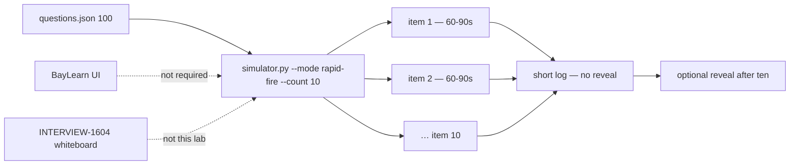

# INTERVIEW-1602 — Rapid fire

**Type:** INTERVIEW  
**Module:** 16 — Advanced Engineer Interview Simulator  
**Duration:** 25–45 minutes  
**Cost:** **$0**  
**awsLab:** no  
**Region:** `us-west-2` if AWS is named  
**Lessons:** L-16.1–L-16.7 (coverage, not depth)  
**Rounds:** [datasets/baypay-interview/ROUNDS.md](../../datasets/baypay-interview/ROUNDS.md)  
**Modes:** [interview-bank/modes.md](../../interview-bank/modes.md)  
**Bank:** [interview-bank/questions.json](../../interview-bank/questions.json) (exactly **100** records)  
**Simulator:** [interview-bank/simulator.py](../../interview-bank/simulator.py)  
**Worksheet:** short-answer log you write; system design is INTERVIEW-1604 / [PF-design.md](../../student/worksheets/PF-design.md)

This is **Phase A paper plus CLI**. You answer **ten** bank prompts in 60–90 seconds each. Depth is **not** the grade. You are **not** whiteboarding a 99.99% design. You are **not** calling Amazon Bedrock. You are **not** applying Terraform. A live AWS account is **not** required. A BayLearn interview UI is **not** required.

**Cost warning:** The grade path is `python3` against a local JSON bank. Do not buy a coaching seat or invoke a model to “sound faster.” Destroy leftover AWS from other modules on those labs’ paths — not during this drill.

---

## Scenario

11:40 Pacific on a synthetic screening block, **2026-09-03**. Jordan Voss runs a ten-item rapid fire before lunch. Priya Nair wants to hear whether you can name a mechanism, a refusal, and a next measurement without a Staff novel. Riley Okonkwo will stop you at ninety seconds. Sam Okada will try to open `--reveal` so the room “hears the official answer.” You refuse that.

You are the candidate. Prompts come from the locked **100-question** bank. Avery Chen (`11111111-1111-1111-1111-111111111111`, active USD account `22222222-2222-2222-2222-222222222221`) still owns the create path. Example payment for this lab: `c1602b22-0000-4000-8000-111111111602`. Harbor Market still posts `POST /api/v1/payments` to `payments.apps.baypay.example`.

---

## Business context

A screening loop is not a design review. Finance still cares that Avery’s `$84.00` authorize does not double-debit on retry. They do not care that you can recite `principalAnswer` for ten ids. A short, correct-enough sentence that names BayPay and a refusal beats a two-page dump you did not finish.

Rapid fire grades **coverage and tempo**, not INTERVIEW-1604 depth. Do not bounce `dmgr-east`. Do not disable TLS. Do not apply EKS. Do not invent AEJE-IQ-101. Do not require the portal.

---

## Learning objectives

- Run `python3 interview-bank/simulator.py --mode rapid-fire --count 10` and treat the ten printed stems as the set.
- Speak or write a **short** answer (about 60–90 seconds / 4–8 sentences) for each item.
- Hit mechanism + BayPay name + one refusal or next check. Do not chase Principal scope on every row.
- Log id, domain, one-line self-score, and whether you froze.
- Compare to `--reveal` only **after** all ten are logged. Reveal is not required to start.
- Leave system-design length for INTERVIEW-1604.

---

## Architecture

Rapid fire is the same bank, a different clock. Until Phase B UI exists, use the mermaid plus modes.md.



Alt text: The simulator prints ten bank prompts. The candidate answers each in sixty to ninety seconds and logs a short line. Reveal waits until the set is done. A portal and a system-design whiteboard are out of scope.

### Service list

| Piece | In this lab? | Live apply? |
|---|---|---|
| `simulator.py --mode rapid-fire --count 10` | Yes — grade path | No |
| `--seed` (reproducible set) | Optional | No |
| `--reveal` | After the set only | No |
| Timed 8-minute practice | INTERVIEW-1601 | Not the grade here |
| System design / PF-design | INTERVIEW-1604 | Not this lab |
| Bedrock / portal / AWS apply | Named only | Do not use |

### Region assumptions

`us-west-2` when a prompt names AWS. Process is still `payment-service` on `:8080`. Teaching SLO mention stays **99.9%** unless you are explicitly in an HA prompt — and even then you do not apply a second region.

### Least-privilege / security notes

- Read the bank. Write a short log. Not admin on the cell.
- No PAN, no live password, no access key in a 90-second answer.
- Avery’s UUID is allowed; a card number is not.

### Failure scenario

A ten-page Staff essay on item 1 and blank rows 2–10 fails Efficiency and the mode contract. Revealing all ten answers before you speak fails Diagnostic method. Applying NAT “because an AWS item appeared” fails Production awareness.

---

## Prerequisites

- INTERVIEW-1601 literacy helps (two voices). This lab does **not** require your practice notes.
- [ROUNDS.md](../../datasets/baypay-interview/ROUNDS.md) — “depth is not the grade.”
- `python3`. If `questions.json` is missing: `python3 qa/merge_interview_bank.py`.
- A timer you can see (phone or `sleep` is fine). No AWS clock.
- Lessons if present. The bank stands alone.

---

## Environment setup

From the course root:

```bash
test -f interview-bank/simulator.py && echo "simulator present"
test -f interview-bank/questions.json || python3 qa/merge_interview_bank.py
mkdir -p /tmp/aeje-interview-1602
```

Print **ten** prompts. Do **not** pass `--reveal`:

```bash
python3 interview-bank/simulator.py --mode rapid-fire --count 10
```

Reproducible classroom set (optional):

```bash
python3 interview-bank/simulator.py --mode rapid-fire --count 10 --seed 16
```

Narrow a domain only if you already completed a mixed set once:

```bash
python3 interview-bank/simulator.py --mode rapid-fire --count 10 --domain Java/JVM --seed 16
```

Write `/tmp/aeje-interview-1602/rapid.md` as you go. You will **not** run `aws`, Terraform, kubectl, Bedrock, or a portal. Do not open `solutions/INTERVIEW-1602/` until ten short answers exist.

---

## Challenge/tasks

1. **Print ten.** Run `python3 interview-bank/simulator.py --mode rapid-fire --count 10`. Copy each **id** and **domain** into the log before you answer.
2. **Sixty to ninety seconds.** For each item, speak or write **4–8 sentences**:
   - What the question is asking (one clause).
   - The BayPay mechanism or control you would name (`POST /api/v1/payments`, Actuator, task role ≠ execution role, idempotency, leftover ND out of path — as relevant).
   - One thing you will **not** do (bounce `dmgr-east`, TLS-off, apply EKS/NAT, put Avery on a metric label, claim proven RCA with no evidence).
3. **Stop.** When the timer fires, end the sentence. A partial short answer scores. A hidden extra paragraph after time does not.
4. **Do not Staff-novel.** If you feel a design lecture coming, write “trade-off: ___ / decide later in 1604” and move on.
5. **Log the row.** id, domain, elapsed seconds, `ok` / `thin` / `froze`, and your short text.
6. **All ten before reveal.** After item 10, you *may* re-run a single `--id … --reveal` for gaps. Do not paste bank answers back into the log as if you said them.
7. **Avery once.** Name Avery Chen or payment `c1602b22-0000-4000-8000-111111111602` in at least one answer so the loop stays on Harbor Market.
8. **Count is 10.** Do not change `--count` to 3 to “go deeper.” Depth is INTERVIEW-1604.

---

## Validation

- [ ] Command was `--mode rapid-fire --count 10` (seed optional).
- [ ] Ten ids are logged with short answers, not three essays.
- [ ] Each answer is roughly 60–90 seconds of speech (or 4–8 sentences).
- [ ] You did not `--reveal` before the set was finished.
- [ ] At least one answer names Avery / `…221` / `c1602b22-…` or `POST /api/v1/payments`.
- [ ] No PAN, no live secrets, no portal, no Bedrock, no AWS apply.
- [ ] You did not treat this lab as PF-design.
- [ ] A log that only lists ids with “I know this” is not complete.

Instructor scores with [instructor/rubrics/INTERVIEW-1602.md](../../instructor/rubrics/INTERVIEW-1602.md).

---

## Troubleshooting

| Symptom | What to check |
|---|---|
| Empty pool / file missing | Merge domains. Do not invent questions. |
| Spent 8 minutes on item 1 | That is the 1601 timed variant. Cut and continue. |
| Every answer starts “It depends” and never lands | Name one default (ECS Fargate apply default, modular monolith first, 99.9% operated SLO). |
| Wanted `--reveal` in the room | Finish ten. Then compare. |
| Recited INCIDENT-1301 instructor RCA on a P99 prompt | Symptom class only. Do not lecture a hallway label. |
| Applied ACM because a TLS item appeared | Paper. Stop. |
| Used Bedrock to compress Staff answers | Your short words are the grade. |
| Changed `--count` to 4 | Re-run with 10. Coverage is the mode. |

---

## Expected outcome

A ten-row log an instructor can time-check: real bank ids, short BayPay-scoped answers, honest `froze` marks, no pasted reveal text. You may miss nuance on HA/Security items. You may not skip items to write a design.

---

## Interview questions

1. What does rapid fire grade that practice mode does not?
2. Why is a correct Staff novel on two items a weaker 1602 than ten short landings?
3. When do you say “I would take that to a design round” instead of whiteboarding?
4. Why is `--reveal` after ten different from reveal-as-you-go?
5. How do you keep Avery Chen in a 90-second JVM answer without leaking PAN?

---

## Architecture/trade-off questions

1. `--count 10` mixed domains versus ten Java/JVM items — what does each prove?
2. Rapid fire versus INTERVIEW-1603 gated troubleshooting — which clock, which artifact?
3. Why must the bank stay 100 locked records when a generator could emit “more drill”?
4. Paper CLI versus a portal buzzer — what does Phase A refuse to require?
5. When is “ECS is the student apply default; EKS still wins when we need the Kubernetes API” enough for 1602, and when must you sit 1604?

---

## Cleanup

No cloud resources. Keep the log if you will sit INTERVIEW-1605 (you may reuse rapid fire **or** swap it for troubleshooting).

```bash
# optional
rm -rf /tmp/aeje-interview-1602
```

Do not delete the bank. If you invoked a model or applied AWS “to answer faster,” destroy it the same day. That path is a failure, not extra credit.

---

## Cost estimate

**Grade path: $0.** Local simulator, ten short answers, a phone timer.

**Misuse path:** Bedrock, EKS, NAT, ACM requests, or a paid interview UI are out of scope. An idle ALB from Module 11 is still on the order of **$0.0225/hour** — destroy leftovers; this lab did not need them.

---

## Hidden/revealable solution

Log ten short answers first. Instructor files: `solutions/INTERVIEW-1602/`. Opening them before the log exists is a failed Diagnostic method score. Sample landings there are **length and shape**, not scripts to recite.

<details>
<summary>Reveal checklist — after ten short answers exist</summary>

Required: `--mode rapid-fire --count 10`; ten ids; 4–8 sentence (or 60–90s) answers; no reveal-first; Avery or create-path named once; no portal; no Bedrock; no AWS apply; no PF-design substitute. Two beautiful essays and eight blanks fail Efficiency. Lucky topic titles with empty bodies fail Technical accuracy.

</details>

---

## What you learned

Rapid fire is **ten landings**, not one lecture. A short BayPay sentence plus a refusal is the unit of work. Reveal waits. Design depth waits for INTERVIEW-1604. Phase A stays `$0` and offline.

---

## Portfolio deliverable

Keep `/tmp/aeje-interview-1602/rapid.md`. You may attach a one-line pointer from [PF-design.md](../../student/worksheets/PF-design.md) mode log after 1604/1605. Do not paste `solutions/INTERVIEW-1602/` or bank `engineerAnswer` text as the spoken log.
