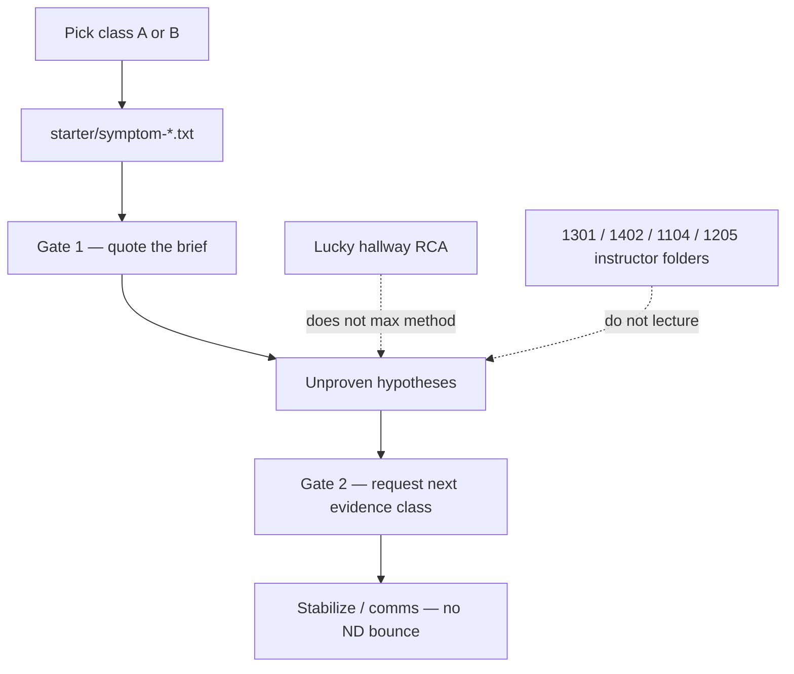

# INTERVIEW-1603 — Troubleshooting interview

**Type:** INTERVIEW  
**Module:** 16 — Advanced Engineer Interview Simulator  
**Duration:** 45–75 minutes  
**Cost:** **$0**  
**awsLab:** no  
**Region:** `us-west-2` if AWS is named  
**Lessons:** L-16.7 (production incident round)  
**Rounds:** [datasets/baypay-interview/ROUNDS.md](../../datasets/baypay-interview/ROUNDS.md)  
**Modes:** [interview-bank/modes.md](../../interview-bank/modes.md)  
**Symptom briefs:** [starter/symptom-https.txt](starter/symptom-https.txt) · [starter/symptom-p99.txt](starter/symptom-p99.txt)  
**Gating reminder:** [AEJE-D-068](../../datasets/baypay-ai/BAYOPS.md) evidence vs hypothesis (literacy)  
**Worksheet:** method notes you write; portfolio design is INTERVIEW-1604 / [PF-design.md](../../student/worksheets/PF-design.md)

This is an **oral or written troubleshooting interview** on a **symptom class**, not a trivia id. The simulator’s `--mode practice` bank is optional color; the grade is **gated thinking**. You are **not** calling Amazon Bedrock. You are **not** applying ACM, Route 53, AMP, or RDS. A BayLearn incident UI is **not** required.

**Cost warning:** Paper briefs only. Do not bounce a live database “to reproduce P99.” Do not request a paid certificate “to reproduce HTTPS.” Do not call Bedrock for a proven RCA.

---

## Scenario

14:05 Pacific on a synthetic on-call interview, **2026-09-03**. Priya Nair puts one symptom class on the table and starts a notepad. Riley Okonkwo will ask for the **next gate**, not a hallway title. Jordan Voss will try to say the Module 13 or 14 lab name as if that were diagnosis. Sam Okada will try to apply a fix in `us-west-2` so the story “has a graph.” Morgan Hale will offer `dmgr-east` again.

You pick **one** class:

- **A — HTTPS fail / tasks healthy.** Merchants cannot handshake `payments.apps.baypay.example`. Tasks are **RUNNING**. Jump-box HTTP `:8080` can be 200.
- **B — P99 up / rate down.** Completions drop. P99 leaves the teaching SLO. 5xx stay quiet.

Avery Chen (`11111111-1111-1111-1111-111111111111`, account `22222222-2222-2222-2222-222222222221`) is the merchant volume. Example payment `c1603c33-0000-4000-8000-111111111603`. You are the candidate. The briefs are synthetic.

---

## Business context

A handshake failure is not a domain decline. A late **201** is still a missed authorization window for Harbor Market. Finance does not pay for a lucky RCA sentence that matches a prior lab title. They pay for a method: **quote what you have → rank unproven hypotheses → name the next omitted evidence kind → stabilize without a leftover-cell bounce.**

Lucky RCA does **not** max Diagnostic method. Naming INCIDENT-1301, INCIDENT-1402, INCIDENT-1104, or INCIDENT-1205 instructor stories as **the** answer is out of scope for this interview. Symptom class is enough.

Do not bounce Postgres. Do not bounce `dmgr-east`. Do not disable TLS. Do not invent a metrics file so the story closes.

---

## Learning objectives

- Work **one** symptom class from the starter brief (HTTPS+RUNNING or P99+rate).
- Write or speak a **gated** path: evidence you can quote → hypotheses (`unproven` / `weakened` / `withdrawn`) → **next gate** → stabilize/comms.
- Keep every hypothesis unproven. A confident title is not a source.
- Refuse leftover ND, TLS-off, and live apply as the first move.
- Accept that a correct-looking RCA with no quotes and no next gate **cannot** max Diagnostic method (20%).
- Do **not** lecture instructor RCAs from 1301 / 1402 / 1104 / 1205.

---

## Architecture

Troubleshooting mode is a **symptom pack**, not `AEJE-IQ-*` trivia (modes.md). Until a portal exists, use the mermaid plus the brief you opened.



Alt text: The candidate opens one symptom brief, quotes it, lists unproven hypotheses, and names the next evidence class. A lucky root-cause title and prior instructor folders are not the method.

### Service list

| Piece | In this lab? | Live apply? |
|---|---|---|
| Symptom brief A or B | Yes — you **see** it | No |
| Oral or written method notes | Yes — grade path | No |
| Interview bank id | Optional color only | No |
| ACM / Route 53 / AMP / RDS | Named as omitted | Do not apply |
| `dmgr-east` / PaymentCluster | Named as leftover | Do not bounce |
| Bedrock / portal | Named only | Do not require |

### Region assumptions

`us-west-2` when AWS is named. Service `payment-service`. Host `payments.apps.baypay.example`. Port `8080`. Operated SLO **99.9%** / P99 **< 400 ms** in class B.

### Least-privilege / security notes

- Read the brief. Not `AdministratorAccess`.
- No PAN, no `BAYPAY_DB_PASSWORD`, no private key paste.
- Do not “open 8080 to the world so HTTPS does not matter.”

### Failure scenario

“It’s the expired cert” or “it’s cardinality” with **no brief quote** and **no next gate** is a lucky RCA: Technical accuracy may be partly right; Diagnostic method must **not** max. Opening `solutions/INCIDENT-1301/` (or 1402 / 1104 / 1205) and reading it into the interview is a method fail.

---

## Prerequisites

- [ROUNDS.md](../../datasets/baypay-interview/ROUNDS.md) troubleshooting row.
- Ability to quote a file you opened (same habit as Module 15 four buckets).
- INTERVIEW-1601 optional. You do not need ten rapid-fire items first.
- L-16.7 if present. The briefs stand alone.
- You will **not** open instructor RCAs for 1301, 1402, 1104, or 1205 to “prepare.”

---

## Environment setup

```bash
mkdir -p /tmp/aeje-interview-1603
cp labs/INTERVIEW-1603/starter/symptom-https.txt /tmp/aeje-interview-1603/
cp labs/INTERVIEW-1603/starter/symptom-p99.txt /tmp/aeje-interview-1603/
cd /tmp/aeje-interview-1603
```

Pick **one** brief and open it. Write `/tmp/aeje-interview-1603/method.md`.

Optional color (not the grade):

```bash
# extra — a bank prompt is not a substitute for the symptom brief
python3 interview-bank/simulator.py --mode practice --id AEJE-IQ-080
python3 interview-bank/simulator.py --mode practice --id AEJE-IQ-087
```

You will **not** run `aws`, `kubectl`, Terraform, or Bedrock. Do not create `evidence/db-down.txt` or a cert file so the story looks complete. Do not open `solutions/INTERVIEW-1603/` until Gate 1 quotes exist.

---

## Challenge/tasks

1. **Pick one class.** HTTPS fail / tasks healthy **or** P99 up / rate down. Write the class name at the top of `method.md`.
2. **Gate 1 — quote the brief.** Copy 4–8 short quotes you can defend:
   - Class A: Harbor HTTPS fail; tasks **RUNNING**; jump-box `:8080` liveness **200**; leftover cell **out of path**; omitted cert/ACM files.
   - Class B: rate **~180→~22**; P99 **~118 ms→~4.8 s**; 5xx quiet; Hikari pending **0**; omitted scrape/tag files.
3. **Hypotheses — unproven only.** Rank at least **three**. Status only `unproven`, `weakened`, or `withdrawn`. Withdraw “bounce `dmgr-east`” and “the database is down” if the brief contradicts them. **Do not** mark `proven`.
4. **Gate 2 — next evidence class.** Name the **kind** you would request next and why (handshake/SNI/leaf **class**, or scrape-health / label-cardinality **class**). Do not skip to bounce. Do not invent the omitted file.
5. **Stabilize and comms.** Four to six sentences for Priya / Riley / Harbor Market: what you know, what you do not, what you will not bounce, when the next update is. Name Avery’s create without PAN.
6. **Lucky-RCA trap.** If you already “know” a prior lab’s story, write one sentence: you will **not** treat it as proven here. Symptom class + next gate still required.
7. **Do not lecture** instructor RCAs from INCIDENT-1301, INCIDENT-1402, INCIDENT-1104, or INCIDENT-1205. Do not paste those `solutions/` folders.
8. **Optional oral.** Speak the same gates in ≤12 minutes. The written file is what is scored if there is no partner.

---

## Validation

- [ ] One symptom class chosen; the matching `starter/symptom-*.txt` is quoted.
- [ ] Gate 1 quotes include the **coexistence** (RUNNING + HTTPS fail, or rate/P99 move + 5xx quiet + pending 0).
- [ ] ≥3 hypotheses, none `proven`. Leftover-ND bounce withdrawn or refused.
- [ ] Next gate is an **evidence class**, not “fix it” and not a prior lab title.
- [ ] Comms name Avery’s path, a refusal, and a next update time.
- [ ] No AWS apply, no TLS-off, no Postgres/`dmgr-east` bounce, no Bedrock, no portal.
- [ ] You did not paste 1301/1402/1104/1205 instructor RCA text.
- [ ] A page that only states a root-cause title is not complete — Diagnostic method cannot max.

Instructor scores with [instructor/rubrics/INTERVIEW-1603.md](../../instructor/rubrics/INTERVIEW-1603.md).

---

## Troubleshooting

| Symptom | What to check |
|---|---|
| “I already know this lab” | You know a **class**. Quote *this* brief. Ask for the next omitted kind. |
| Only one hypothesis: bounce ND | Withdraw it. Riley’s line is in the brief. |
| Invented a cert dump or series-count file | Delete it. Omission is the teaching move. |
| Wanted ACM/Route 53/AMP apply | Paper. The interview is the method. |
| Wrote the 1104 `Path=/` story as proven | Wrong lab. Keep ALB/health **unproven** if you even mention it. |
| Wrote the 1301 tag-cardinality story as proven | Wrong lab. Next-gate the omitted scrape/tags; do not lecture. |
| Used Bedrock to “finish the RCA” | Stop. Unproven + next gate is the bar. |
| Opened `solutions/INCIDENT-*` to prep | Close them. That is not this interview. |

---

## Expected outcome

A method page (or spoken transcript) a Staff interviewer can score: quoted brief, unproven list, next evidence class, stabilize/comms. You may still be wrong about the underlying fault. You may not skip gates. Lucky title-match does not max Diagnostic method.

---

## Interview questions

1. Why can tasks be RUNNING while Harbor Market cannot POST?
2. Why can P99 and rate move together while 5xx stay boring?
3. What makes a lucky RCA fail the Diagnostic method bar?
4. What belongs in the 20-minute comms update when the next file is still omitted?
5. Why is leftover `dmgr-east` in the estate and still illegal to bounce here?

---

## Architecture/trade-off questions

1. Symptom-class interview versus bank-id practice — what does each prove?
2. Why keep hypotheses unproven when a prior module already used the same class?
3. Paper next-gate versus “apply the fix so we can see graphs” — cost and ethics?
4. Four-bucket write-up (Module 15) versus a spoken 12-minute loop — what must survive both?
5. When would you *stop* investigating and stabilize merchants first?

---

## Cleanup

None for the briefs. Do not add invented evidence files to `starter/`.

```bash
rm -rf /tmp/aeje-interview-1603
```

If you applied ACM, AMP, or bounced a leftover cell “to make the interview real,” that is a lab failure — destroy leftovers in `us-west-2` now.

---

## Cost estimate

**Grade path: $0.** Two text briefs and a method page. No AWS API. No required model. No portal.

**Misuse path:** ACM certificates, Route 53, AMP workspaces, live RDS, or Bedrock tokens are dollars and out of scope. Extra-credit graphs cannot replace Gate 1 quotes.

---

## Hidden/revealable solution

Write Gate 1 quotes first. Instructor files: `solutions/INTERVIEW-1603/`. That folder shows **method shape**, not a hidden RCA of 1301/1402/1104/1205. Opening it before quotes exist fails Diagnostic method. Opening those other solution folders to “get the title” also fails Diagnostic method.

<details>
<summary>Reveal checklist — after Gate 1 quotes and a next gate exist</summary>

Required: one class; brief quotes (RUNNING+:8080 or rate/P99/5xx/pending); ≥3 unproven hypotheses; ND bounce and “database is down” refused or withdrawn when the brief contradicts them; next **evidence class**; comms with Avery and a refusal; no instructor RCA lecture; no apply; no TLS-off; no Bedrock. Lucky RCA title without quotes and next gate **must not** max Diagnostic method.

</details>

---

## What you learned

A troubleshooting interview grades **gates**, not a hallway label. Symptom class A can hold RUNNING tasks and a failed merchant handshake at the same time. Symptom class B can hold a throughput collapse and a quiet 5xx tile. Lucky RCA does not max method. Prior instructor folders are not the script.

---

## Portfolio deliverable

Keep `/tmp/aeje-interview-1603/method.md`. INTERVIEW-1605 may reuse this class as the troubleshooting slice. [PF-design.md](../../student/worksheets/PF-design.md) remains the Module 16 design artifact — do not replace it with an RCA title. Do not paste `solutions/INTERVIEW-1603/` or other incident solutions.
