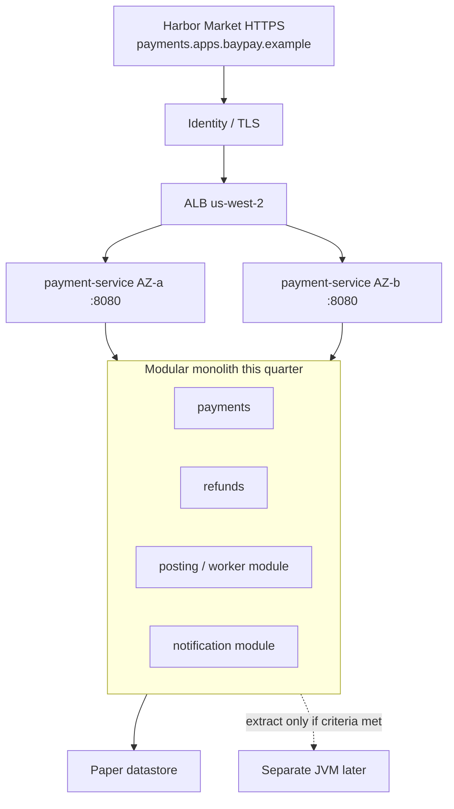

# INTERVIEW-1604 — System design

**Type:** INTERVIEW  
**Module:** 16 — Advanced Engineer Interview Simulator  
**Duration:** 60–90 minutes  
**Cost:** **$0**  
**awsLab:** no  
**Region:** `us-west-2` (paper)  
**Lessons:** L-16.8 (system design) · L-16.9 (leadership / architecture)  
**Rounds:** [datasets/baypay-interview/ROUNDS.md](../../datasets/baypay-interview/ROUNDS.md)  
**Modes:** [interview-bank/modes.md](../../interview-bank/modes.md)  
**Trust notes:** [datasets/baypay-security/TRUST.md](../../datasets/baypay-security/TRUST.md)  
**Ops notes:** [datasets/baypay-ops/OBSERVABILITY.md](../../datasets/baypay-ops/OBSERVABILITY.md)  
**Worksheet (portfolio):** [student/worksheets/PF-design.md](../../student/worksheets/PF-design.md)

This is **one BayPay system-design interview**. You pick **exactly one** prompt and write it on **PF-design.md**. You are **not** applying multi-AZ RDS, NAT, EKS, ACM, or a second region. You are **not** calling Amazon Bedrock. You are **not** opening a BayLearn whiteboard UI. Paper plus mermaid is enough to pass.

**Cost warning:** Grade path is the worksheet. A same-day `terraform apply` “so 99.99% is honest” is a lab failure, not extra credit.

---

## Scenario

15:30 Pacific on a synthetic Staff loop, **2026-09-03**. Priya Nair wants one page she can run at 02:00. Jordan Voss will try to extract five microservices because “interviews expect it.” Sam Okada will try to add `us-east-1` and a NAT Gateway so the slide matches a blog. Riley Okonkwo will ask what you will **not** ship this quarter.

You choose **one**:

1. **Payment create at 99.99%.** Design `POST /api/v1/payments` to an architecture goal of **99.99%** (~52 minutes/year). Multi-AZ **single-region** `us-west-2` is allowed to be complete. Multi-region is a DR sentence, not a free upgrade. Module 13 operated SLO stays **99.9%** unless you write a contract change.
2. **Modular monolith vs extract.** Decide whether BayPay keeps `payment-service` as the Java 21 / Spring Boot 3.5.5 modular monolith this quarter, or extracts a module (notification or `transaction-worker`). “Always microservices” is not a design.

Avery Chen (`11111111-1111-1111-1111-111111111111`, account `22222222-2222-2222-2222-222222222221`) is volume. Example payment `c1604d44-0000-4000-8000-111111111604`. Host `payments.apps.baypay.example`. You are the candidate.

---

## Business context

Harbor Bike Co still charges Avery `$84.00`. A retry with `Idempotency-Key` must not debit `…221` twice. A frozen account `…222` must not authorize. Edge TLS is how merchants arrive; HTTP `:8080` is not the customer path. `PaymentCluster` / `dmgr-east` is leftover ND — not the HA design and not a new extract target.

Finance does not fund a seventh JVM because an interview rubric somewhere else rewarded box-count. Finance also does not fund a second-region apply in a 90-minute lab. This page is the **Module 16 portfolio artifact** (COURSE_MANIFEST / Q-16). ARCHITECT-1401 and Module 3 lessons are literacy; you still write **this** interview in your words on PF-design.md.

---

## Learning objectives

- Pick **one** BayPay design prompt and refuse the other as “not this sitting” (you may sketch a two-sentence pointer).
- Draw a Staff-readable shape: clients → TLS/ALB → `payment-service` → paper datastore / module boundary.
- Write trade-offs (four nines vs multi-region; monolith vs network hop) with a **this-quarter** decision.
- Name failure domains or extract criteria; name what you will not apply.
- Keep Avery’s identifiers off metric labels; keep PAN out of the page.
- Complete [PF-design.md](../../student/worksheets/PF-design.md) in your words.

---

## Architecture

Course literacy: **AEJE-D-064** (99.99% domains) and the Module 3 modular-monolith story. Until PNGs exist, use the mermaid that matches **your** pick.



Alt text: Merchants enter HTTPS at the teaching host. TLS sits in front of a regional ALB. Payment-service tasks span two AZs. Inside the process, payments, refunds, posting, and notification stay modules unless extract criteria are met. A second region is not drawn as the default.

### Service list

| Piece | In this lab? | Live apply? |
|---|---|---|
| PF-design.md | Yes — **the** artifact | No |
| Paper multi-AZ / paper extract criteria | Yes | No |
| ECS Fargate (teaching default) | Named | Do not apply |
| EKS / OpenShift | Valid homes if you argue them | Do not apply |
| RDS / NAT / ACM / Route 53 / `us-east-1` | Named as refusals | Do not apply |
| Bedrock / portal whiteboard | Named only | Do not require |

### Region assumptions

`us-west-2`. Port `8080`. Health `/actuator/health/liveness` and `/actuator/health/readiness`. Architecture goal **99.99%** if you picked prompt 1. Operated SLO **99.9%** until a named contract change.

### Least-privilege / security notes

- Task role ≠ execution role when you name ECS.
- Secrets stay out of git and off this worksheet.
- Idempotency and frozen `…222` stay product controls on the same page as TLS.

### Failure scenario

“Always add a region” as the only 99.99% answer, or “always extract microservices,” fails Technical accuracy. Applying the shape fails Production awareness. Pasting `solutions/ARCHITECT-1401/` into PF-design fails Diagnostic method.

---

## Prerequisites

- [ROUNDS.md](../../datasets/baypay-interview/ROUNDS.md) system-design row.
- TRUST.md HA table and OBSERVABILITY.md SLO split (99.9% vs 99.99%).
- Modular monolith literacy from `reference-apps/baypay` / Module 3 (IoC, extractable modules).
- L-16.8 if present. This lab stands alone on paper.
- You will **not** apply Terraform, ACM, Route 53, RDS, EKS, or NAT.

---

## Environment setup

```bash
test -f student/worksheets/PF-design.md && echo "worksheet present"
test -f datasets/baypay-security/TRUST.md && echo "trust notes present"
test -f datasets/baypay-ops/OBSERVABILITY.md && echo "ops notes present"
mkdir -p /tmp/aeje-interview-1604
```

Copy or fill [PF-design.md](../../student/worksheets/PF-design.md) in place. Optional bank color (not a substitute for the page):

```bash
python3 interview-bank/simulator.py --mode practice --id AEJE-IQ-093
python3 interview-bank/simulator.py --mode practice --id AEJE-IQ-097
```

Do not pass `--reveal` until your PF-design tables have sentences. You will **not** run `aws` or Bedrock. Do not open `solutions/INTERVIEW-1604/` until the chosen prompt has a diagram and a this-quarter decision.

---

## Challenge/tasks

1. **Pick one prompt.** Write `99.99% create` **or** `monolith vs extract` at the top of PF-design.md. Do not half-do both.
2. **Requirements.** 6–10 bullets: Avery create, idempotency, frozen `…222`, TLS at the edge, `:8080` + Actuator, leftover ND out of path, `$0` lab constraint, operated SLO **99.9%** unless you change it in writing.
3. **Draw.** A mermaid or labeled boxes on the worksheet. Prompt 1: task / AZ / ALB / identity-TLS / datastore / region. Prompt 2: module map plus the network boundary you would buy if you extract.
4. **This-quarter decision.**
   - Prompt 1: multi-AZ single-region is allowed to be the 99.99% shape; ~**52 minutes/year**; what fits vs what overdraws; region is DR, not the only answer.
   - Prompt 2: stay monolith **or** extract **one** module. Name the criterion (team boundary, independent scale, failure isolation) that was **not** met — or the one that was.
5. **Trade-offs.** At least three honest rows (availability vs cost, consistency vs hop, ECS default vs EKS/OpenShift, 99.99% goal vs 99.9% dashboard).
6. **Refusals.** No NAT/EKS/RDS/ACM/Route 53 apply; no `PaymentCluster` as HA or as the new service; no Bedrock design; no portal required; no PAN on the page.
7. **Staff spoken slice.** 6–8 sentences you could say without the worksheet — same decision, no secrets.
8. **Honesty.** Sign the PF-design checklist. Do not paste instructor solutions from 1401, 1102, or this folder.

---

## Validation

- [ ] Exactly one prompt chosen and completed on PF-design.md.
- [ ] Diagram + this-quarter decision + ≥3 trade-offs.
- [ ] Prompt 1 names ~52 minutes/year and keeps Module 13 SLO at 99.9% unless a contract change is written.
- [ ] Prompt 2 names a stay-or-extract decision with a criterion, not “microservices are modern.”
- [ ] Avery / `c1604d44-…` / `POST /api/v1/payments` appear; no PAN.
- [ ] Leftover ND is not the design.
- [ ] No AWS apply, no Bedrock, no portal UI.
- [ ] A slogan-only page (“add a region” / “split everything”) is not complete.

Instructor scores with [instructor/rubrics/INTERVIEW-1604.md](../../instructor/rubrics/INTERVIEW-1604.md).

---

## Troubleshooting

| Symptom | What to check |
|---|---|
| Wrote both prompts thinly | Pick one. Finish it. |
| Only “add a region” | Expand six domains. 99.99% ≠ automatic multi-region. |
| Only “extract because scale” | Name a number or a team boundary you do **not** have. |
| Pasted ARCHITECT-1401 compact table | Rewrite in your words. Diagnostic method. |
| Opened AWS console for multi-AZ RDS | Stop. Paper datastore. |
| Used Bedrock to generate the mermaid | Your boxes, your decision. |
| Recreated PaymentCluster as HA | TRUST.md forbids it. |
| Upgraded the Grafana SLO in a sentence | OBSERVABILITY.md stays 99.9% unless you write the change. |

---

## Expected outcome

A PF-design.md page a Staff engineer could run a working session from: one prompt, a drawing, a this-quarter call, refusals. Together with Q-16 this is the **system-design** half of Module 16. INTERVIEW-1605 may reuse a **slice** of the same page, not a second design.

---

## Interview questions

1. What is the first sentence if someone says “just add a region so we hit four nines”?
2. What is the first sentence if someone says “we should already be microservices”?
3. Why can HTTP `:8080` succeed while Harbor Market cannot POST?
4. What extract criterion would make `notification` worth a JVM this quarter — and what is missing?
5. Who changes the operated SLO from 99.9% to 99.99%, and what happens to the monthly budget?

---

## Architecture/trade-off questions

1. Multi-AZ single-region versus pilot-light `us-east-1` — which conversation is 99.99%, which is RTO?
2. In-process posting versus extracted `transaction-worker` — what consistency do you sell, and what incident class do you buy?
3. ECS/Fargate apply default versus EKS versus OpenShift — when does each win **this quarter** (paper only)?
4. Why is identity/TLS a failure domain instead of “the platform will renew it”?
5. Why is a second `PaymentCluster` a bad answer to both prompts?

---

## Cleanup

No cloud resources. Leave PF-design.md in `student/worksheets/`. Do not delete TRUST.md.

```bash
rm -rf /tmp/aeje-interview-1604
```

If a teammate applied NAT, EKS, multi-AZ RDS, or `us-east-1` “to compare,” destroy it; this lab did not ask for it.

---

## Cost estimate

**Grade path: $0.** Worksheet, mermaid, locked notes. No AWS. No required model. No portal.

**Misuse path:** NAT Gateway, EKS control plane, multi-AZ RDS, ACM, idle ALB (~$0.0225/hour), or Bedrock tokens are a **lab failure**, not extra credit.

---

## Hidden/revealable solution

Write the decision first. Instructor files: `solutions/INTERVIEW-1604/`. Opening them before PF-design has a chosen prompt and a diagram is a failed Diagnostic method score. Compact shapes there are **post-attempt** checks, not the scored narrative.

<details>
<summary>Reveal checklist — after PF-design has a decision</summary>

Required: one prompt; drawing; this-quarter call; ≥3 trade-offs; 52-minute paragraph **or** extract criterion; 99.9% SLO not silently upgraded; ND not HA; Avery named; no apply; no Bedrock; no portal; your words. “Always add a region” or “always extract” fails the checklist.

</details>

---

## What you learned

A BayPay design interview is a **this-quarter decision**, not a cloud shopping list. 99.99% can be multi-AZ single-region. A modular monolith can be the honest extract refusal. PF-design.md is the artifact. Phase A stays paper and `$0`.

---

## Portfolio deliverable

Completed [student/worksheets/PF-design.md](../../student/worksheets/PF-design.md). This **is** the Module 16 portfolio artifact (system-design response from INTERVIEW-1604). Do not paste `solutions/INTERVIEW-1604/` or `solutions/ARCHITECT-1401/`.
