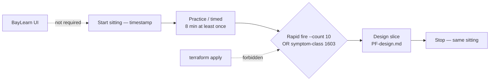

# INTERVIEW-1605 — Full mock loop

**Type:** INTERVIEW  
**Module:** 16 — Advanced Engineer Interview Simulator  
**Duration:** 90–120 minutes **in one sitting**  
**Cost:** **$0**  
**awsLab:** no  
**Region:** `us-west-2` if AWS is named  
**Lessons:** L-16.1–L-16.9 (loop, not a new lecture)  
**Rounds:** [datasets/baypay-interview/ROUNDS.md](../../datasets/baypay-interview/ROUNDS.md)  
**Modes:** [interview-bank/modes.md](../../interview-bank/modes.md)  
**Bank:** [interview-bank/questions.json](../../interview-bank/questions.json)  
**Design artifact:** [student/worksheets/PF-design.md](../../student/worksheets/PF-design.md)  
**Prior labs:** [INTERVIEW-1601](../INTERVIEW-1601/README.md) · [INTERVIEW-1602](../INTERVIEW-1602/README.md) · [INTERVIEW-1603](../INTERVIEW-1603/README.md) · [INTERVIEW-1604](../INTERVIEW-1604/README.md)

This is **several modes in one sitting**, including **one timed item**. Sequence (required):

1. **Practice or timed** (INTERVIEW-1601 shape) — at least one item on an **8-minute** clock.
2. **Rapid fire *or* troubleshooting** (INTERVIEW-1602 **or** INTERVIEW-1603) — not both required.
3. **Design slice** (INTERVIEW-1604 shape, shorter) — one BayPay decision on PF-design.md.

You are **not** required to redo all four labs from scratch if you already have notes — you **are** required to run the sequence **today**, with timestamps, without a portal and without Bedrock.

**Cost warning:** `$0` CLI plus paper. Do not apply AWS to “make the mock real.” Do not buy a coaching UI.

---

## Scenario

16:00–18:00 Pacific, synthetic loop day **2026-09-03**. Priya Nair holds a Staff mock: a practice/timed open, then either ten short items **or** one symptom-class troubleshoot, then a design slice on payment create at **99.99%** *or* modular monolith vs extract. Riley Okonkwo watches whether you switch **mode** when the clock changes. Jordan Voss will try to turn every prompt into a 40-minute whiteboard. Sam Okada will try to `apply` in `us-west-2` between rounds.

Avery Chen (`11111111-1111-1111-1111-111111111111`, account `22222222-2222-2222-2222-222222222221`) is still the create path. Example payment for the sitting: `c1605e55-0000-4000-8000-111111111605`. You are the candidate. Harbor Market still posts `POST /api/v1/payments`.

---

## Business context

A real loop does not grade one beautiful essay. Finance cares that you can (1) differentiate Engineer vs Senior on a bank id, (2) land short or gated answers when the mode says so, and (3) still make a this-quarter design call before dinner. One memorized paragraph reused in every round is a fail. A lucky RCA in the troubleshooting slot still does not max Diagnostic method.

Do not bounce `dmgr-east`. Do not disable TLS. Do not invent a 101st question. Do not require BayLearn or Bedrock. Do not lecture 1301/1402/1104/1205 instructor RCAs if you pick troubleshooting.

---

## Learning objectives

- Sit **one continuous loop** with a written schedule and actual clock times.
- Include **practice/timed** with at least one **8-minute** item and two maturity voices.
- Include **either** `--mode rapid-fire --count 10` **or** a symptom-class method page (HTTPS+RUNNING or P99+rate).
- Include a **design slice** on PF-design.md (99.99% create **or** monolith vs extract) — a slice, not a second 90-minute ARCHITECT lab if 1604 is already filled; still must have a decision and three trade-offs.
- Switch quality bars when the mode switches. Do not Staff-novel the rapid-fire slot.
- Keep Phase A: local simulator, paper briefs, `$0`.

---

## Architecture

Full mock loop is a **sequence**, not a new bank (modes.md / ROUNDS.md). Until Phase B UI exists, use the mermaid.



Alt text: One sitting starts with practice or a timed item, continues with either ten rapid-fire prompts or a troubleshooting method, and ends with a system-design slice on PF-design.md. A portal and a cloud apply are not on the path.

### Service list

| Piece | In this lab? | Live apply? |
|---|---|---|
| `simulator.py --mode practice` and/or `timed-interview` | Yes | No |
| `rapid-fire --count 10` **or** 1603 brief | Yes — pick one | No |
| PF-design.md design slice | Yes | No |
| Full 1604 rewrite | Only if PF-design is empty | No |
| Portal / Bedrock / AWS apply | Named only | Do not use |

### Region assumptions

`us-west-2` when named. Same process contract as 1601–1604: Java 21, `:8080`, Actuator, teaching host.

### Least-privilege / security notes

- Read bank and briefs. Write notes and PF-design.
- No PAN, no live keys, no Avery-on-a-label.

### Failure scenario

Doing only rapid fire, or only a design, fails the loop. Revealing the bank before the timed item fails Diagnostic method. Applying EKS between rounds fails Production awareness. Reusing one paragraph for practice, rapid, and design fails Technical accuracy.

---

## Prerequisites

- INTERVIEW-1601–1604 literacy. You may sit 1605 first; then you must still hit all three slots.
- `python3`, assembled `questions.json` (merge if needed).
- [PF-design.md](../../student/worksheets/PF-design.md) for the design slot.
- Symptom briefs if you choose troubleshooting: [INTERVIEW-1603/starter](../INTERVIEW-1603/starter/).
- A visible clock. A partner is optional; the notes are required.

---

## Environment setup

```bash
mkdir -p /tmp/aeje-interview-1605
test -f interview-bank/questions.json || python3 qa/merge_interview_bank.py
echo "sitting-start $(date -u +%Y-%m-%dT%H:%M:%SZ)" > /tmp/aeje-interview-1605/loop.md
```

Commands you will actually run (pick the mid-slot):

```bash
# Slot 1 — practice (no reveal). Timed variant: start an 8-minute clock or:
python3 interview-bank/simulator.py --mode practice
python3 interview-bank/simulator.py --mode timed-interview

# Slot 2a — rapid fire
python3 interview-bank/simulator.py --mode rapid-fire --count 10

# Slot 2b — troubleshooting instead of rapid fire
# open labs/INTERVIEW-1603/starter/symptom-https.txt
#    or labs/INTERVIEW-1603/starter/symptom-p99.txt
```

Fill PF-design.md in the **same** sitting for slot 3. Do not open `solutions/INTERVIEW-1605/` until all three timestamps exist. You will **not** run `aws` or Bedrock.

---

## Challenge/tasks

1. **Schedule the sitting.** Write start time, planned minutes (example: 25 practice/timed, 25 rapid **or** 35 troubleshoot, 40 design), and end time. Stay in one block (break ≤10 minutes).
2. **Slot 1 — practice/timed.** Answer **two** bank items at **two** maturities (Engineer + Senior or Staff). At least **one** item is **8 minutes**. No `--reveal` until both drafts exist. Name Avery or `c1605e55-…` once.
3. **Slot 2 — pick one.**
   - **Rapid:** `python3 interview-bank/simulator.py --mode rapid-fire --count 10`. Short answers. Depth is not the grade.
   - **Troubleshooting:** one symptom class, Gate 1 quotes, unproven hypotheses, next evidence class. Lucky RCA does not max method. Do not lecture 1301/1402/1104/1205 instructor RCAs.
4. **Slot 3 — design slice.** On PF-design.md: one prompt (99.99% create **or** monolith vs extract). Drawing, this-quarter decision, ≥3 trade-offs, refusals (no apply, no ND-as-HA, no Bedrock). If 1604 already filled the page, add a **loop addendum**: what you would say in 8 minutes and what you cut.
5. **Mode switch note.** Four sentences: what you shortened when you left practice; what you refused to whiteboard in slot 2; how the design slice stayed a decision.
6. **Reveal last.** Optional `--reveal` on slot-1 ids only after the loop. Gap list, do not rewrite history.
7. **Comms close.** 6–8 sentences to Priya, Riley, Jordan, Sam: you finished a Phase A loop; portal not required; Avery’s create still the spine.
8. **Honesty.** Sign PF-design plus the loop log checklist.

---

## Validation

- [ ] One sitting with start/end timestamps (same calendar day, one block).
- [ ] Slot 1: ≥2 items, two maturities, ≥1 timed **8 min**, no reveal-first.
- [ ] Slot 2: **either** rapid-fire `--count 10` **or** a 1603-shaped method page.
- [ ] Slot 3: PF-design.md has a decision (full 1604 or a dated loop addendum).
- [ ] Mode-switch note exists.
- [ ] Avery / `c1605e55-…` / `POST /api/v1/payments` named; no PAN.
- [ ] No portal, no Bedrock, no AWS apply, no leftover-cell bounce.
- [ ] A folder of leftover 1601 notes with no timestamps is not a loop.

Instructor scores with [instructor/rubrics/INTERVIEW-1605.md](../../instructor/rubrics/INTERVIEW-1605.md).

---

## Troubleshooting

| Symptom | What to check |
|---|---|
| Only finished design | The loop requires three slots. Resume the missing mode the same day. |
| Rapid fire became three Staff essays | Cut. `--count 10` short. |
| Troubleshoot became “it’s 1301” | Quotes + next gate. No instructor RCA. |
| Used 1601 notes from last week with no new timed item | Re-time one id **today**. |
| PF-design still blank | Slot 3 is the portfolio. Write the slice. |
| Opened reveal during slot 1 | Stop. Finish drafts. Compare after the sitting. |
| Applied a stack between slots | Destroy it. Production awareness fails. |
| No python3 / bank missing | Merge `qa/merge_interview_bank.py`. Do not invent ids. |

---

## Expected outcome

A loop log plus PF-design.md that prove you can change modes in one sitting: two-voice practice, a timed item, either ten shorts or a gated symptom class, and a BayPay design decision. Phase A. `$0`.

---

## Interview questions

1. What must a full mock include that a single 1602 sitting does not?
2. Why is one timed item non-negotiable?
3. How do you stop a design lecture during rapid fire without sounding unprepared?
4. Why does a lucky troubleshooting title still fail Diagnostic method inside a loop?
5. Why is the BayLearn UI still not required after you “did the full mock”?

---

## Architecture/trade-off questions

1. Practice/timed + rapid versus practice/timed + troubleshoot — what Staff signal does each mid-slot give?
2. Design slice versus a full 90-minute 1604 — what must not be cut (decision, trade-off, refusal)?
3. Reusing last week’s notes versus re-timing today — which one is the loop?
4. Paper CLI versus portal “session resume” — what failure mode do we refuse?
5. When would you *not* extract a service in the last 40 minutes even if Jordan asks?

---

## Cleanup

Keep the loop log and PF-design.md. Delete temp copies you do not need.

```bash
# keep loop.md if you are submitting; otherwise:
# rm -rf /tmp/aeje-interview-1605
```

Do not delete the bank. Destroy any AWS or Bedrock leftovers the same day — they were not asked for.

---

## Cost estimate

**Grade path: $0.** Simulator + briefs + PF-design.md. No AWS API. No portal seat. No model.

**Misuse path:** EKS, NAT, ACM, Bedrock, or a paid mock-interview product are out of scope. Idle ALB leftovers remain ~**$0.0225/hour** — this lab did not need them.

---

## Hidden/revealable solution

Timestamp three slots first. Instructor files: `solutions/INTERVIEW-1605/`. Opening them before the sitting exists is a failed Diagnostic method score. That folder is a **sequence checklist**, not a script of answers.

<details>
<summary>Reveal checklist — after the sitting has three timestamps</summary>

Required: one block; slot 1 two-voice + 8-minute item, no reveal-first; slot 2 rapid `--count 10` **or** 1603 method; slot 3 PF-design decision; mode-switch note; Avery named; no portal; no Bedrock; no apply; no instructor RCA lecture. One mode only fails the loop. Lucky RCA in slot 2 still cannot max Diagnostic method.

</details>

---

## What you learned

A full mock is a **mode switch** under a clock: two voices, then shorts or gates, then one BayPay design call. The portal is optional forever for Phase A. The bank stays 100. PF-design.md remains the portfolio artifact.

---

## Portfolio deliverable

[PF-design.md](../../student/worksheets/PF-design.md) (design slice or 1604 page plus loop addendum) **and** `/tmp/aeje-interview-1605/loop.md` (or attached schedule). Do not paste `solutions/INTERVIEW-1605/` or bank reveal text as the spoken loop.
