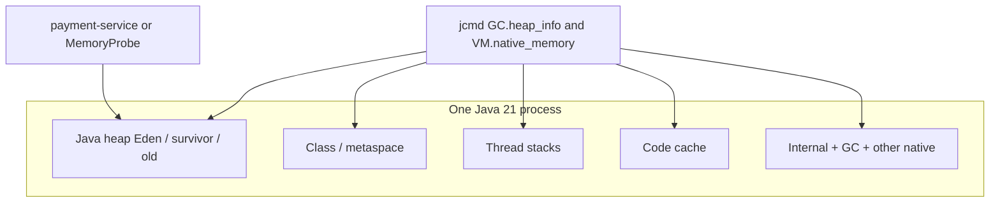

# LAB-701 — Observe JVM memory

**Type:** PERFORMANCE  
**Module:** 07 — JVM Internals and Performance  
**Duration:** 45–60 minutes  
**Cost:** $0  
**Lesson:** L-7.1 (heap, stacks, metaspace, native)  
**Starter:** [starter/MemoryProbe.java](starter/MemoryProbe.java)  
**Worksheet:** [PF-jvm-observe.md](../../student/worksheets/PF-jvm-observe.md)  
**Runtime notes:** [datasets/baypay-jvm/RUNTIME.md](../../datasets/baypay-jvm/RUNTIME.md)

Module 7 is **observe and explain**. You are not tuning G1 for a 1% win, and you are not writing a Module 8 incident RCA.

---

## Scenario

Priya Nair asks you to prove, on a laptop, that you can read a live BayPay JVM the way operations reads `payment-service` in prod-east. Riley Okonkwo will not accept “the heap looks fine” without a `jcmd` excerpt. Jordan Voss wants native memory in the same note, because the next container discussion will blame `-Xmx` for a kill that was never a Java heap OOM.

You start **either** `payment-service` **or** the tiny [MemoryProbe](starter/MemoryProbe.java) harness, enable Native Memory Tracking (NMT), and capture `GC.heap_info` plus `VM.native_memory summary`. Same JVM rules apply on historical `Pay1`; traditional WAS is not a lab target here.

---

## Business context

Avery Chen’s payments already allocate on the Java heap (`Payment`, `Money`, request DTOs). Thread stacks, metaspace, and VM internal structures do **not** live in `-Xmx`. If you cannot name those buckets, every later “we need more heap” change request is a guess.

BayPay’s teaching runtime is one local process (`reference-apps/baypay` / `payment-service`). This lab does not use AWS, a live Kubernetes cluster, or Java Flight Recorder’s GUI.

---

## Learning objectives

- Start a Java 21 process with NMT on and identify its pid.
- Capture `jcmd <pid> GC.heap_info` and record used / committed / region (or generation) numbers as **ranges you observed**, not folklore.
- Capture `jcmd <pid> VM.native_memory summary` and separate **Java Heap**, **Thread**, **Class** (metaspace-ish), **Code**, **GC**, and **Internal**.
- Explain why committed heap is not RSS, and why NMT “Java Heap” is not the whole process.
- Fill the heap and NMT sections of [PF-jvm-observe.md](../../student/worksheets/PF-jvm-observe.md). GC and container rows can stay thin until LAB-703 / LAB-704.

---

## Architecture

Course diagram **AEJE-D-028** is the concept map. Until the PNG is on disk, use this process picture plus RUNTIME.md.



`GC.heap_info` is a heap snapshot. NMT is a **category** view of reserved vs committed native tracking. They answer different questions.

---

## Prerequisites

- JDK 21 at `JAVA_HOME` (default `/opt/homebrew/opt/openjdk@21`).
- Comfort with a second terminal.
- Optional: L-7.1 if it is already published; this lab stands alone with RUNTIME.md.
- Optional PAKS: `docs/01-computer-architecture/cpu-and-memory-fundamentals.md` — not required to pass.

---

## Environment setup

```bash
export JAVA_HOME="${JAVA_HOME:-/opt/homebrew/opt/openjdk@21}"
export PATH="$JAVA_HOME/bin:$PATH"
java -version
```

You need `java`, `javac`, and `jcmd` from the **same** JDK 21. macOS HomeBrew OpenJDK 21 is the course default.

### Path A — MemoryProbe (no Spring)

```bash
export JAVA_HOME="${JAVA_HOME:-/opt/homebrew/opt/openjdk@21}"
cd labs/LAB-701
mkdir -p out
"$JAVA_HOME/bin/javac" --release 21 -d out starter/MemoryProbe.java
"$JAVA_HOME/bin/java" \
  -XX:+UnlockDiagnosticVMOptions \
  -XX:NativeMemoryTracking=summary \
  -cp out com.baypay.labs.lab701.MemoryProbe
```

The process prints `MemoryProbe pid=…` and holds for ten minutes. Default retain is eight 1 MiB chunks (~8 MiB live bytes, plus object headers and the `ArrayList`).

### Path B — payment-service

```bash
export JAVA_HOME="${JAVA_HOME:-/opt/homebrew/opt/openjdk@21}"
cd reference-apps/baypay
./mvnw -pl payment-service -am spring-boot:run \
  -Dspring-boot.run.jvmArguments="-XX:+UnlockDiagnosticVMOptions -XX:NativeMemoryTracking=summary"
```

Find the pid with `jps -l` (look for `PaymentApplication` / the Boot launcher). Either path is enough to pass.

NMT **must** be set at JVM start. You cannot enable a full summary after the fact on a process started without the flag.

---

## Challenge/tasks

1. Start Path A or Path B with NMT summary enabled. Write the pid and the command line in the worksheet.
2. Run `jcmd <pid> GC.heap_info`. Paste 6–15 lines (or a faithful table of total / used / young / metaspace).
3. Run `jcmd <pid> VM.native_memory summary`. Record committed numbers for at least: Java Heap, Class, Thread, Code, GC, Internal, and Total.
4. If you used MemoryProbe, compare **retainedApproxBytes** (~8 MiB default) to heap **used**. They will not match byte-for-byte (headers, slack, TLAB, other allocations). They should be the same **order of magnitude**.
5. Write four sentences, in your words:
   - What “used” vs “committed” means on the heap line.
   - What NMT **Thread** is counting (stacks, not `java.lang.Thread` objects).
   - What NMT **Class** is closer to (metaspace / class metadata), and what it is not (your `Payment` instances).
   - Why **Internal** + **GC** + **Code** still matter when someone says “we set `-Xmx`.”
6. Copy the numbers and sentences into [PF-jvm-observe.md](../../student/worksheets/PF-jvm-observe.md) (heap + NMT sections). Leave a one-line note that GC logs and container math come in LAB-703 / LAB-704.

Do not capture a heap dump. Do not open JFR. Do not change production flags on a real estate.

---

## Validation

Self-check before you open `solutions/LAB-701/`:

- Pid is from **your** process, not a guessed number from a blog.
- `GC.heap_info` ran against that pid (error text such as “NMT is disabled” means you skipped the start flag — restart).
- NMT table has more than “Java Heap.” A heap-only paste fails Diagnostic method.
- MemoryProbe users: used heap is **greater than a few hundred KiB** after the 8 MiB retain (typical used is roughly 8–32 MiB on a quiet JDK 21, machine-dependent).
- payment-service users: committed heap and Class/Thread committed are **larger** than MemoryProbe; that is expected for Spring + JPA.
- Worksheet heap and NMT sections are filled in your words.

Instructor scores with [instructor/rubrics/LAB-701.md](../../instructor/rubrics/LAB-701.md).

---

## Troubleshooting

| Symptom | What to check |
|---|---|
| `jcmd: command not found` | `PATH` is not `$JAVA_HOME/bin` |
| `No such process` / wrong class | `jps -l`; do not jcmd an unrelated `jcmd` helper pid |
| `Native memory tracking is not enabled` | Restart with `-XX:NativeMemoryTracking=summary` |
| `Unable to open socket file` | Same user as the JVM; on some macOS setups rerun as that user |
| Heap used ≪ 8 MiB on MemoryProbe | You started java **without** the compiled class, or you killed the probe before allocate |
| Huge reserved Class / heap | Reserved ≠ committed; grade committed first |
| Spring will not start | Use Path A; Spring is optional |
| Tempted to launch AWS or a cluster | Stop. Cost is $0 local |

---

## Expected outcome

A worksheet page with a real `GC.heap_info` excerpt, a real NMT summary (six categories + total), and four sentences that would survive a Staff review. No cloud profile. No “we should increase `-Xmx`” recommendation unless you can name the native remainder.

---

## Interview questions

1. A teammate says “NMT Java Heap is the same as RSS.” What do you answer in one minute?
2. Where do `Payment` objects live, and where does the `Payment` **class** metadata live?
3. Why might `GC.heap_info` used be several MiB above the 8 MiB you retained in MemoryProbe?
4. Same JVM rules apply on `Pay1`. What would you still refuse to do — bounce `dmgr-east` — when the question is “what is native memory on that JVM?”

---

## Architecture/trade-off questions

1. When is `jcmd GC.heap_info` enough, and when do you need a histogram (`GC.class_histogram`) without calling it a leak?
2. Why does BayPay enable NMT in **this lab** and not as a required production default on every canary?
3. If Module 6 Liberty and Module 5 `Pay1` both host payment code, which memory buckets change with the **container**, and which change with the **framework** (Spring vs Liberty)?
4. What do you refuse to set equal: `-Xmx` and the process or cgroup limit? (LAB-704 will quantify this.)

---

## Cleanup

Ctrl+C the probe or Boot process. Delete `labs/LAB-701/out/` if you created it. No cloud resources, no leftover dumps unless you created one by mistake — delete those too.

---

## Cost estimate

**$0.** Local JDK 21 CPU and RAM. Do not start an EC2 instance, EKS cluster, or managed profiler for this exercise.

---

## Hidden/revealable solution

Complete the worksheet from **your** `jcmd` output first. Exact laptop numbers vary; the instructor pack gives **ranges** and a reading guide, not a single correct megabyte.

See `solutions/LAB-701/README.md` after you have pasted your own heap and NMT excerpts.

<details>
<summary>Reveal orientation only — after you have captured jcmd</summary>

MemoryProbe default (~8 MiB retained) usually shows heap **used** on the order of **8–40 MiB** and a committed heap larger than used. NMT **Java Heap** committed tracks the heap; **Thread** is stacks; **Class** is metadata / metaspace, not `Payment` instances; **Internal** and **GC** are why `-Xmx` is not the process size. payment-service is a bigger process in every native category. If your numbers are wildly outside those ideas, you likely attached to the wrong pid or started without NMT.

</details>

---

## What you learned

- Heap used/committed and process RSS are different questions.
- NMT splits heap vs thread stacks vs class/metaspace vs internal/GC/code.
- A tiny harness is enough to practice `jcmd`; Spring is optional color, not the objective.
- The same reading applies on Boot locally and on a JVM such as `Pay1`.

---

## Portfolio deliverable

Completed heap and NMT sections of [student/worksheets/PF-jvm-observe.md](../../student/worksheets/PF-jvm-observe.md). This starts the Module 7 portfolio artifact. Do not paste the instructor range table as if it were your run.
