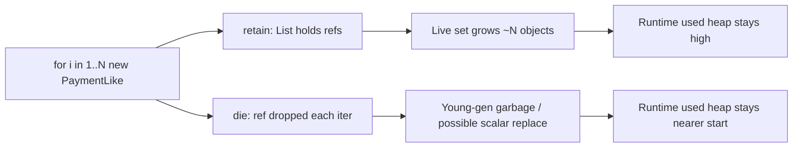

# LAB-702 — Controlled object allocation

**Type:** PERFORMANCE  
**Module:** 07 — JVM Internals and Performance  
**Duration:** 45–60 minutes  
**Cost:** $0  
**Lesson:** L-7.5 (allocation behavior)  
**Starter:** [starter/AllocationHarness.java](starter/AllocationHarness.java)  
**Worksheet:** [PF-jvm-observe.md](../../student/worksheets/PF-jvm-observe.md)

Observe and explain. You are not hunting a 1% JIT win, and you are not writing a Module 8 leak RCA.

---

## Scenario

Jordan Voss wants a Staff-level answer to “do our Payment-like records vanish if we do not keep the list?” Priya Nair has seen young-gen graphs climb during a backfill that **should** have been garbage. Riley Okonkwo will ask, in the next incident channel, whether a `record` is “stack allocated.”

You run one harness twice: **retain** every object, then **die** (drop the reference). You compare count, elapsed time, and `Runtime` used-heap. Same allocation rules apply on `Pay1`; you are not installing traditional WAS.

---

## Business context

Production `Payment` embeds `Money` (`BigDecimal` amount + currency). This lab uses a **Payment-like** record `(id, amountCents, currency)` so you can compile with `javac --release 21` and reason about allocation without starting Spring. Cents as `long` are the course money habit; the record still allocates an object (and a `String` id) on each iteration unless the JIT proves otherwise.

Finance still cares that amounts stay exact. This lab does not post ledger rows. It only makes the **live set vs garbage** distinction measurable.

---

## Learning objectives

- Run the starter in `retain` and `die` modes with the same `N`.
- Record count, elapsed milliseconds, and used-heap before/after (delta).
- Explain why retain grows the live set and why die usually does not (young garbage).
- State that a Money-like / Payment-like **record still allocates** in the interpreter and often in C1/C2 — escape analysis **might** scalar-replace a non-escaping record; do not claim it always does.
- Name at least one allocation that die mode will not eliminate (`"pay-" + i` strings).

---

## Architecture



`Runtime.totalMemory() - freeMemory()` is a **coarse** used-heap signal. It is not a profiler and it is not NMT. TLAB and delayed GC make a single delta noisy; compare **modes**, not absolute bytes.

---

## Prerequisites

- LAB-701 vocabulary (heap used vs committed) helps; not a hard gate.
- JDK 21 at `JAVA_HOME` (default `/opt/homebrew/opt/openjdk@21`).
- L-7.5 if published; the starter README is enough to finish.

---

## Environment setup

```bash
export JAVA_HOME="${JAVA_HOME:-/opt/homebrew/opt/openjdk@21}"
cd labs/LAB-702
mkdir -p out
"$JAVA_HOME/bin/javac" --release 21 -d out starter/AllocationHarness.java
```

Run both modes with the same count (250_000 is the default; raise it if deltas are invisible on your laptop):

```bash
"$JAVA_HOME/bin/java" -cp out com.baypay.labs.lab702.AllocationHarness retain 250000
"$JAVA_HOME/bin/java" -cp out com.baypay.labs.lab702.AllocationHarness die 250000
```

Optional: pin a modest heap so used-heap movement is easier to see, still local, still $0:

```bash
"$JAVA_HOME/bin/java" -Xmx128m -cp out com.baypay.labs.lab702.AllocationHarness retain 250000
"$JAVA_HOME/bin/java" -Xmx128m -cp out com.baypay.labs.lab702.AllocationHarness die 250000
```

Do not start AWS. Do not require JFR GUI.

---

## Challenge/tasks

1. Compile the starter with `--release 21`. Do not edit the starter into a different algorithm; you may copy it if you want extra printouts in **your** class.
2. Run `retain` and `die` at the same `N`. Paste both stdout blocks into your notes (mode, count, elapsedMs, used before/after/delta, retainedSize, dieSinkCents).
3. Increase `N` (for example 1_000_000) if the retain vs die used-heap delta is ambiguous. If retain throws `OutOfMemoryError`, drop `N` or raise `-Xmx` slightly and record that event — that is data, not failure.
4. Write 6–10 sentences that cover all of the following (worksheet or lab notes):
   - What **retain** keeps alive and why used-heap delta is usually larger.
   - What **die** makes eligible for GC and why used-heap can stay closer to the start (or even shrink after a collection mid-run).
   - Why `dieSinkCents` exists (keep the loop from being dead-code eliminated).
   - Why a Payment-like **record** is still an object allocation in the common case.
   - Why a Money-like value (`long` cents + `String` currency, or production `BigDecimal`) still allocates even when you “just add numbers.”
   - What **escape analysis** might eliminate, and the sentence “it does not always.”
5. Name one allocation die mode will still perform (`String` concat for ids is the intended answer).
6. Optional: rerun die a second time after a short warm-up (run twice, keep the second). If elapsed drops, do not call that “escape analysis proved”; JIT + GC both moved.

---

## Validation

- Both modes ran; `count` matches; `retain` prints `retainedSize=N` and `die` prints `retainedSize=0`.
- You recorded elapsed and used-heap for both, not “it felt faster.”
- Your write-up does **not** claim every `PaymentLike` is stack-allocated.
- You did not require a Flight Recorder recording to pass.
- Checksums are not part of this lab; `dieSinkCents` is only an anti-DCE sink.

Instructor scores with [instructor/rubrics/LAB-702.md](../../instructor/rubrics/LAB-702.md).

---

## Troubleshooting

| Symptom | What to check |
|---|---|
| `UnsupportedClassVersion` | `JAVA_HOME` is not 21 |
| retain and die deltas look identical | Raise `N`; used-heap is sampled once at the end |
| die is slower | Possible; allocation still happens; GC may run in die |
| retain OOM | Lower `N` or raise `-Xmx`; record both numbers |
| “JIT will fix it” as the only note | Insufficient; name retain vs garbage |
| Tempted to profile in the cloud | Stop. Local `Runtime` metrics are enough |

---

## Expected outcome

Two stdout captures, a short written comparison of live set vs garbage, and a careful sentence about escape analysis. You understand why a BayPay `Money` / `Payment` path still allocates even when the arithmetic is `long` cents.

---

## Interview questions

1. “Records are on the stack, right?” — your 30-second answer.
2. Why does `Runtime` used-heap lie on a 1_000-object run?
3. If die mode used-heap **grows**, does that prove a leak? (No. Say why.)
4. How would you explain this lab to someone who only knows `Pay1` verbose GC logs?

---

## Architecture/trade-off questions

1. When would you keep a retained list on purpose (batch posting, retry buffer) despite the live-set cost?
2. Why is `System.gc()` a weak way to “make die look empty,” and when might an instructor still hint it?
3. If Module 2 makes the loop concurrent, what extra allocations appear (context, boxed ids) before GC is the story?
4. Would you move this measurement to JFR allocation samples in production? What do you lose by staying on `Runtime`?

---

## Cleanup

Delete `labs/LAB-702/out/`. No services, no dumps, no AWS.

---

## Cost estimate

**$0.** Local CPU. Do not start EMR, a load-test fleet, or a commercial APM trial for this harness.

---

## Hidden/revealable solution

Run both modes and write your comparison first. The instructor class adds optional `gc` / `money` extras and a reading guide. It is not required to pass.

See `solutions/LAB-702/` after you have two stdout blocks.

<details>
<summary>Reveal orientation only — after both modes have run</summary>

Retain: the `ArrayList` keeps `N` records reachable; used-heap delta should grow with `N` (headers + payload + backing array). Die: records become unreachable; young GC may reuse Eden, so end-of-run used-heap is often much closer to the start. `"pay-" + i` still allocates. Escape analysis **may** remove some `PaymentLike` wrappers in die mode after JIT; it is not guaranteed, and it does not delete the strings. Production `Money` (`BigDecimal`) allocates more than a `long` field.

</details>

---

## What you learned

- Reachability, not “I allocated,” decides whether objects stay in the live set.
- Payment-like records and Money-like values still allocate in ordinary Java 21 runs.
- Escape analysis is a **maybe**, not a contract you design money code around.
- Coarse `Runtime` metrics are enough to compare two modes on a laptop.

---

## Portfolio deliverable

Paste the two stdout summaries and your 6–10 sentence comparison into notes or the allocation subsection of [PF-jvm-observe.md](../../student/worksheets/PF-jvm-observe.md) if you added one. Do not paste the instructor `AllocationHarness` into the portfolio.
