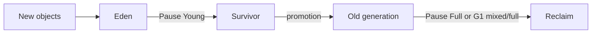

# LAB-703 — Observe GC

**Type:** PERFORMANCE  
**Module:** 07 — JVM Internals and Performance  
**Duration:** 45–75 minutes  
**Cost:** $0  
**Lesson:** L-7.4 (garbage collection)  
**Starter:** [starter/GcVisibleHarness.java](starter/GcVisibleHarness.java)  
**Related:** [LAB-702 AllocationHarness](../LAB-702/starter/AllocationHarness.java)  
**Worksheet:** [PF-jvm-observe.md](../../student/worksheets/PF-jvm-observe.md)

Observe and explain. You are not tuning pause goals, and you are not writing a Module 8 “excessive GC” RCA.

---

## Scenario

Priya Nair wants proof you can **read** a Java 21 unified GC log before anyone pages Riley about a canary. Jordan Voss will ask “was that young or old?” on a standup. You will produce that answer from **text logs**, not from a Flight Recorder GUI.

You run a small allocator (this lab’s [GcVisibleHarness](starter/GcVisibleHarness.java), or LAB-702 `die` mode) twice: once with G1 and `-Xlog:gc*:file=gc-g1.log`, once with Serial GC **or** a smaller `-Xmx` so collections are visible. You paste 3–5 lines and label young vs old / pause.

Same collector vocabulary applies on `Pay1`. You are not bouncing a cell.

---

## Business context

`payment-service` defaults to G1 (see [RUNTIME.md](../../datasets/baypay-jvm/RUNTIME.md)). Young collections reclaim short-lived request objects (`CreatePaymentRequest`, JSON buffers). Old / mixed / full collections appear when the live set (caches, pools, retained lists from LAB-702 `retain`) fills.

Avery’s traffic is not special-cased. The harness allocates byte chunks so the log is noisy enough on a laptop. Cost stays **$0**. No AWS. No live cluster.

---

## Learning objectives

- Enable Java 21 unified logging: `-Xlog:gc*:file=…:time,uptime,level,tags`.
- Capture a G1 run and a second run that makes GC obvious (`-XX:+UseSerialGC` and/or smaller `-Xmx`).
- Paste **3–5 real lines** from your logs and mark: young vs full/old, before→after heap, pause (ms).
- Explain in writing what a pause means for a payment thread (it waits; it is not “the heap is broken”).
- Fill the GC section of [PF-jvm-observe.md](../../student/worksheets/PF-jvm-observe.md).

---

## Architecture

Course diagram **AEJE-D-030** is the GC concept map. Until the PNG exists, use this flow.



G1 also has **humongous** and **concurrent mark** lines. You are not required to classify every tag. You **are** required to tell young/evacuation from a full pause.

---

## Prerequisites

- JDK 21 (`JAVA_HOME` default `/opt/homebrew/opt/openjdk@21`).
- LAB-701 / LAB-702 help; not a hard gate if you compile this starter.
- Do **not** install JMC / JFR GUI for this lab. Text logs only.

---

## Environment setup

```bash
export JAVA_HOME="${JAVA_HOME:-/opt/homebrew/opt/openjdk@21}"
cd labs/LAB-703
mkdir -p out logs
"$JAVA_HOME/bin/javac" --release 21 -d out starter/GcVisibleHarness.java
```

**Run 1 — G1** (Java 21 default) with a modest heap so the file is not empty:

```bash
"$JAVA_HOME/bin/java" \
  -Xmx64m \
  -Xlog:gc*:file=logs/gc-g1.log:time,uptime,level,tags \
  -cp out com.baypay.labs.lab703.GcVisibleHarness 400 256
```

**Run 2 — Serial, or smaller heap** (pick at least one):

```bash
"$JAVA_HOME/bin/java" \
  -Xmx32m \
  -XX:+UseSerialGC \
  -Xlog:gc*:file=logs/gc-serial.log:time,uptime,level,tags \
  -cp out com.baypay.labs.lab703.GcVisibleHarness 400 256
```

Related option: LAB-702 `die 1000000` with the same `-Xlog` flags. Either allocator is valid.

Confirm the log files are non-empty (`wc -l logs/gc-g1.log`).

---

## Challenge/tasks

1. Compile `GcVisibleHarness` with `--release 21` and produce `logs/gc-g1.log`.
2. Produce a second log (`UseSerialGC` and/or `-Xmx` smaller than run 1).
3. From **your** files, copy 3–5 lines into the worksheet. Prefer lines that include `Pause Young` or `Pause Full` and a `used->used (capacity)` triple plus a duration. Unified logging looks like `GC(n) Pause Young … 18M->6M(64M) 4.821ms` — your numbers will differ.
4. Annotate each pasted line in your own words:
   - Collector hint (G1 vs Serial) if the line or the flag set tells you.
   - Young vs full/old (or “concurrent / not a STW pause” if you picked a `gc,marking` line — say so).
   - Heap before → after → capacity.
   - Pause duration, and whether that is wall-clock stop-the-world for mutator threads.
5. Write a short paragraph: why run 2 was easier to **see** (smaller heap and/or Serial). Do not claim Serial is what BayPay should run in prod-east.
6. One sentence on what you would **not** do: open JFR GUI as a lab requirement; tune `-XX:MaxGCPauseMillis` without a latency SLO; paste a Module 8 canary RCA.

---

## Validation

- Two log files exist from **your** runs (or one file per run with distinct names).
- 3–5 pasted lines are unified-logging style (tags, `GC(n)`, `Pause` or equivalent), not a screenshot of VisualVM.
- At least one line is identified as young, and you attempted a full/old **or** honestly stated that your G1 file only showed young — then said what you would change (`-Xmx` down, more rounds, Serial).
- Worksheet GC section is filled.
- You did not require a Kubernetes job or AWS.

Instructor scores with [instructor/rubrics/LAB-703.md](../../instructor/rubrics/LAB-703.md).

---

## Troubleshooting

| Symptom | What to check |
|---|---|
| Empty log file | Relative `file=` path; cwd is `labs/LAB-703`; disk write allowed |
| No `Pause` lines | Raise rounds / chunkKb or lower `-Xmx` |
| `UseSerialGC` unrecognized | Confirm Java 21, not a JRE without that collector |
| Log is huge | `gc*` is verbose; that is fine — still pick 3–5 lines |
| Only `safepoint` noise | Scroll for `[gc]` lines with `Pause Young` / `Pause Full` |
| “I will just use JFR” | Allowed on your machine, **not** required, not a substitute for pasted text |
| OOM Java heap | Lower chunkKb or rounds; still a useful log if collections appear first |

---

## Expected outcome

Two local GC logs, 3–5 annotated lines, and a paragraph that distinguishes young vs full/old pauses. You can brief Riley without a GUI.

---

## Interview questions

1. What does `18M->6M(64M)` mean, token by token?
2. Why can a 5 ms young pause be healthy and a 200 ms full pause still be “correct” GC?
3. A partner says “G1 has no pauses.” What do you correct?
4. Why is a heap histogram after one GC still not a leak story?

---

## Architecture/trade-off questions

1. When would BayPay pick Serial or Parallel over G1 on a tiny batch CLI vs `payment-service`?
2. What do you lose if you log `gc*` to disk on every prod replica all day?
3. How does LAB-702 `retain` change the GC story compared with this harness’s dying chunks?
4. Same rules on `Pay1`: would you still refuse to bounce `dmgr-east` to “fix GC”?

---

## Cleanup

Delete `labs/LAB-703/out/` and `labs/LAB-703/logs/` when you have copied lines into the worksheet. No cloud cleanup.

---

## Cost estimate

**$0.** Local disk for two log files. Do not start CloudWatch, X-Ray, or a hosted APM to read GC.

---

## Hidden/revealable solution

Annotate **your** lines first. The instructor pack has **synthetic** Java 21 unified-logging examples with callouts. Those numbers are teaching fixtures, not your laptop.

See `solutions/LAB-703/README.md` after your paste.

<details>
<summary>Reveal orientation only — after you have two logs</summary>

Look for `Pause Young` (Eden / evacuation; short) vs `Pause Full` (whole heap; longer). The triple `before->after(capacity)` is used heap, then used after, then current capacity. `Real=` / the trailing `ms` is the mutator pause for STW events. Concurrent G1 phases are not the same as a full pause. Serial + small `-Xmx` makes Full lines more likely. Do not treat the instructor’s synthetic timestamps as your evidence.

</details>

---

## What you learned

- Java 21 GC logs are unified `-Xlog` text, readable without a GUI.
- Young vs full/old is the first classification; pause duration is the user-visible cost.
- Smaller heaps and Serial make the lesson visible; they are not a prod recommendation.
- Observation is not an incident RCA.

---

## Portfolio deliverable

GC section of [PF-jvm-observe.md](../../student/worksheets/PF-jvm-observe.md): 3–5 annotated lines, two run descriptions, young vs old paragraph. Do not paste the instructor’s synthetic log as if you ran it.
