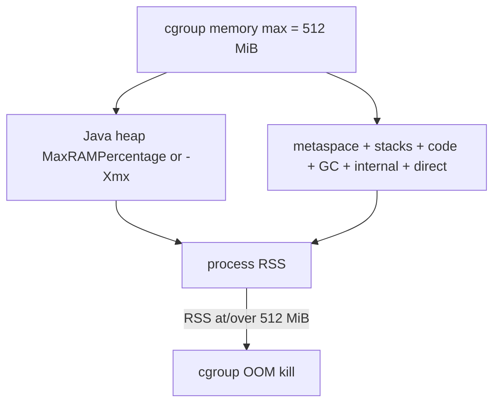

# LAB-704 — JVM and container memory experiment

**Type:** PERFORMANCE  
**Module:** 07 — JVM Internals and Performance  
**Duration:** 45–60 minutes  
**Cost:** $0  
**Lesson:** L-7.6 (JVM in containers)  
**Worksheet:** [PF-jvm-observe.md](../../student/worksheets/PF-jvm-observe.md)  
**Runtime notes:** [datasets/baypay-jvm/RUNTIME.md](../../datasets/baypay-jvm/RUNTIME.md)

**Primary path is paper + local flags.** Docker is optional extra. No live Kubernetes cluster. No AWS. Observe and explain — not a Module 8 container-OOM RCA.

---

## Scenario

Priya Nair drafts a 512 MiB cgroup limit for a future `payment-service` replica. Jordan Voss copies `-Xmx512m` from a wiki that assumed a VM with spare RAM. Riley Okonkwo has already seen the shape of the failure: the **kernel** kills the process, Java never writes a heap dump, and someone still says “we need more heap.”

You calculate heap from `MaxRAMPercentage` of a **512 MiB** limit, explain why `-Xmx512m` on a 512 MiB container is wrong, and write a flag set that leaves **native headroom**. Same JVM arithmetic applies on `Pay1` if that JVM is ever boxed by a memory limit; traditional WAS is not the lab.

---

## Business context

Java 21 (and modern 8u+) treats cgroup memory as the RAM basis when container support is on (default). Default `-XX:MaxRAMPercentage` is **25**. Heap is only one resident consumer: metaspace, thread stacks, code cache, GC structures, direct buffers, and the VM itself also count against the cgroup.

Avery’s payments do not change the arithmetic. A 512 MiB box that spends 512 MiB on heap has **zero** budget for stacks and native. That is how you get a cgroup OOM with a “healthy” Java heap.

---

## Learning objectives

- Compute max heap from `MaxRAMPercentage` of a 512 MiB cgroup for **25%** (default) and **75%** (a common explicit choice).
- Explain, with addition not slogans, why `-Xmx512m` on a 512 MiB limit leaves no native headroom.
- Propose a recommended flag set: percentage-based heap (for example `-XX:MaxRAMPercentage=75`) **plus** an explicit native-headroom story (stacks × threads, metaspace, code, direct).
- Record the arithmetic in the container section of [PF-jvm-observe.md](../../student/worksheets/PF-jvm-observe.md).
- Optional: if Docker exists, run `eclipse-temurin:21` with `-m 512m` and `-XshowSettings:vm`; **not required to pass**.

---

## Architecture

Course diagram **AEJE-D-031** is the container picture. Until the PNG exists, use this budget.



`-Xmx` caps the **Java heap**, not RSS. NMT categories from LAB-701 are the native remainder.

---

## Prerequisites

- LAB-701 NMT category names (Heap, Thread, Class, Internal).
- JDK 21 locally for optional `-XshowSettings:vm` on the host (not a container).
- Docker **optional**. Kubernetes **not** used.
- Calculator or scratch paper. No cloud account.

---

## Environment setup

Paper path (required):

```bash
export JAVA_HOME="${JAVA_HOME:-/opt/homebrew/opt/openjdk@21}"
# Optional local reminder of ergonomics on the host — this is NOT a 512 MiB cgroup:
"$JAVA_HOME/bin/java" -XshowSettings:vm -version
```

Host ergonomics use **machine** RAM. Do not treat that heap size as the 512 MiB answer. The required work is arithmetic on 512 MiB.

Optional Docker extra (skip entirely if `docker` is missing — you still pass):

```bash
docker version
# Only if the previous command works:
docker run --rm -m 512m eclipse-temurin:21-jdk \
  java -XX:MaxRAMPercentage=75.0 -XshowSettings:vm -version
```

A second optional container run with `-Xmx512m` is extra color. Do not require pulling images to pass. No `kubectl`.

---

## Challenge/tasks

1. Write the given: container / cgroup memory max = **512 MiB**. State whether you treat 1 MiB as 1024×1024 bytes (preferred) or 512 × 0.25 as a teaching approximation — then **stay consistent**.
2. Compute max heap if `MaxRAMPercentage=25` (HotSpot default). Show the multiplication. Record MiB (and bytes if you used 1024).
3. Compute max heap if `MaxRAMPercentage=75`. Show the multiplication.
4. List at least four non-heap consumers that still count against 512 MiB: thread stacks, metaspace / class, code cache, GC / internal, NIO direct (pick four or more).
5. Explain why `-Xmx512m` on this limit is wrong. Use a **sum**: heap 512 + stacks (estimate `threads × stack size`) + a metaspace allowance + a slack line. You will exceed 512. The kill is often SIGKILL / cgroup, not `java.lang.OutOfMemoryError: Java heap space`.
6. Recommend a flag set for this 512 MiB box, in writing:
   - Heap via `-XX:MaxRAMPercentage=75` **or** an explicit `-Xmx` near your 75% number — not 512.
   - A sentence that the remaining ~25% (order of 128 MiB) is **native headroom**, not wasted RAM.
   - Optional caps you might add later (`MaxMetaspaceSize`, thread-stack awareness). Do not invent a full prod SRE runbook.
7. One sentence: you would apply the same “heap ≠ cgroup” rule on `Pay1` if that JVM were memory-capped; you would not create a new traditional ND cell to “fix memory.”
8. Optional Docker: paste `Max. heap size` from `-XshowSettings:vm` under 512m + 75%. Compare to your paper 75% number (image versions differ slightly). If Docker is absent, write “Docker not used — paper path only.”
9. Copy the arithmetic into the container section of the worksheet.

---

## Validation

Self-check (no cluster required):

- 25% of 512 MiB is **128 MiB** (if 512 × 0.25) or 128 MiB from `512 × 1024 × 1024 × 0.25` bytes.
- 75% of 512 MiB is **384 MiB** on the same convention.
- You explicitly rejected `-Xmx512m` (or `-Xmx` equal to the limit).
- Recommended flags include a percentage **or** ~384 MiB heap **and** a native-headroom sentence.
- Worksheet container section has the multiplication, not only “leave headroom.”
- Docker failure or absence does **not** fail the lab.

Instructor scores with [instructor/rubrics/LAB-704.md](../../instructor/rubrics/LAB-704.md).

---

## Troubleshooting

| Symptom | What to check |
|---|---|
| Used host `-XshowSettings` as the 512 MiB answer | Host RAM ≠ cgroup; redo paper math |
| 25% computed as 512 − 25 | Percentage of the limit, not subtraction of 25 MiB |
| “Just set `-Xmx512m` and `-Xms512m`” | That is the defect this lab exists to stop |
| Docker pull blocked | Ignore Docker; paper path is primary |
| Wanted a Kind / minikube cluster | Out of scope; do not start one |
| Confused Java heap OOM vs cgroup kill | Heap OOM is a Java exception; cgroup kill is the kernel |

---

## Expected outcome

A worksheet page with visible arithmetic (128 MiB / 384 MiB), a written rejection of `-Xmx512m`, and a recommended flag set that keeps native headroom. Optional Docker screenshot or paste. Cost $0.

---

## Interview questions

1. Default `MaxRAMPercentage` is 25. Why does a 512 MiB container then look “under-heaped” and still be safer than `-Xmx512m`?
2. A wiki says “set `-Xmx` to the pod request.” What do you change in the wiki?
3. How do LAB-701 NMT **Thread** and **Class** show up in this budget?
4. Why might `OutOfMemoryError` never appear in the payment-service log?

---

## Architecture/trade-off questions

1. 75% vs 50% vs 25%: what live set (caches, JPA, direct buffers) would push you down, not up?
2. When is an explicit `-Xmx384m` clearer for operators than `MaxRAMPercentage=75`?
3. If the replica thread count doubles, which line of your budget breaks first — heap or stacks?
4. Wave-1 Liberty on a 512 MiB box: do you still refuse heap = limit, or does Liberty “use less native”? (You still refuse.)

---

## Cleanup

No cluster to delete. If you pulled `eclipse-temurin:21-jdk` optionally, you may `docker image rm` it; not required. No AWS resources exist if you followed this page.

---

## Cost estimate

**$0.** Paper arithmetic plus optional local Docker. Do not launch ECS, EKS, Fargate, or a paid registry for this experiment.

---

## Hidden/revealable solution

Do the multiplication yourself first. Instructor arithmetic and a sample flag set live in `solutions/LAB-704/README.md`.

<details>
<summary>Reveal orientation only — after you have computed 25% and 75%</summary>

512 MiB × 0.25 ≈ **128 MiB** heap (default percentage). 512 × 0.75 ≈ **384 MiB** heap. `-Xmx512m` plus metaspace, stacks, code, and GC exceeds 512 MiB → cgroup kill. A reasonable lab recommendation is `-XX:MaxRAMPercentage=75` (or `-Xmx384m`) and treat the remaining ~128 MiB as native headroom. Docker is extra. Do not copy the instructor flag paragraph until your worksheet already has the two products.

</details>

---

## What you learned

- Container RAM is a budget, not a heap size.
- Default 25% and an explicit 75% are computable; heap = limit is not a strategy.
- Native headroom is stacks, metaspace, code, GC, direct — the LAB-701 categories.
- Optional Docker confirms ergonomics; paper is enough to pass.

---

## Portfolio deliverable

Container section of [PF-jvm-observe.md](../../student/worksheets/PF-jvm-observe.md): arithmetic, rejection of `-Xmx512m`, recommended flags, Docker used or not. This completes the Module 7 observation artifact with LAB-701–703.
