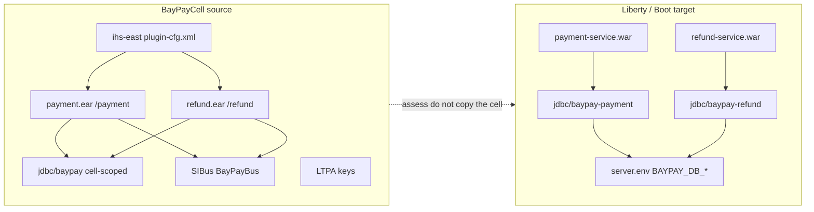

# MODERNIZE-601 — WebSphere-to-Liberty assessment

**Type:** MODERNIZE  
**Module:** 06 — WebSphere Liberty Modernization  
**Duration:** 60–90 minutes  
**Cost:** $0  
**Portfolio:** [PF-liberty-assessment.md](../../student/worksheets/PF-liberty-assessment.md)

This is **paper modernization**. You do not install traditional WebSphere ND, Open Liberty, or IBM Installation Manager. `BayPayCell` is the **source estate**. Liberty `server.xml` (or the Spring Boot reference app) is the **target**. Names come only from [datasets/baypay-cell/TOPOLOGY.md](../../datasets/baypay-cell/TOPOLOGY.md).

---

## Scenario

Jordan Voss wants a Staff-readable inventory before anyone copies `payment.ear` onto a Liberty drop-in folder. Morgan Hale can still open the cell console. Priya Nair can still page on `Pay2`. None of that is an excuse to stand up a second traditional ND cell. You classify every `payment.ear` and `refund.ear` dependency — JNDI, SIBus, cell-scoped `jdbc/baypay`, LTPA, and the IHS plugin — as **lift** (a Liberty feature or bind), **rewrite** (same job, different shape), **defer** (keep on ND until a later wave), or **drop** (do not recreate).

The artifact is [PF-liberty-assessment.md](../../student/worksheets/PF-liberty-assessment.md). Capstone 2 and ARCHITECT-604 will assume this page exists.

---

## Business context

Avery Chen (`11111111-1111-1111-1111-111111111111`) still pays Harbor Market through `payment.ear` on `PaymentCluster`. Refunds still ride `refund.ear` on `RefundCluster`. Finance cares that authorizations complete during cutover. Operations cares that a shared pool cannot starve payment the way a reporting ear already threatened in Module 5. Modernization cares that “we already have a cell” is not a design.

If you mark SIBus `BayPayBus` as a lift, someone will try to recreate a messaging engine on Liberty and call it done. If you mark cell-scoped `jdbc/baypay` as a lift, you will carry INCIDENT-503’s smell into `server.xml`. If you drop `ihs-east` because “Liberty has HTTP,” merchants lose the edge they already trust.

---

## Learning objectives

- Inventory `payment.ear` and `refund.ear` dependencies from TOPOLOGY.md only: DataSources, J2C, JMS, SIBus, LTPA, IHS plugin, packaging, and management plane.
- Classify each row as lift / rewrite / defer / drop, and name the Liberty feature or replacement (or explicitly none).
- Isolate the target binds: `jdbc/baypay-payment` and `jdbc/baypay-refund`. Refuse a cell-wide `jdbc/baypay` on the target.
- Separate serving path (IHS → cluster member → pool) from control path (`dmgr-east` → node agent). The control path is not a Liberty feature.
- Write an explicit greenfield refusal: no new traditional ND cell; Boot or Liberty is the exit.

---

## Architecture

Traditional ND remains the drawing of **today**. Liberty is a per-server config file, not a smaller cell.



Alt text: Merchants still hit ihs-east and the two ears on BayPayCell; the assessment maps those binds onto isolated Liberty DataSources and server.env, not onto a second cell.

Locked target features (Module 6): `servlet-6.0`, `jdbc-4.3`, `jndi-1.0`, `persistence-3.1`.

---

## Prerequisites

- ARCHITECT-501 worksheet completed (or TOPOLOGY.md open and the Module 5 cell drawing in reach).
- Lessons L-6.1 through L-6.3 if they are on disk; if Module 6 lessons are still arriving, TOPOLOGY.md plus this lab are sufficient.
- Optional read-only look at `reference-apps/baypay` so you can contrast YAML binds with JNDI. No live WAS. No Liberty install.

---

## Environment setup

No runtime. No AWS account. No `server start`.

```bash
# Confirm the locked inventory only
test -f datasets/baypay-cell/TOPOLOGY.md && echo "topology present"
test -f student/worksheets/PF-liberty-assessment.md && echo "worksheet present"
```

Copy [student/worksheets/PF-liberty-assessment.md](../../student/worksheets/PF-liberty-assessment.md) or fill it in place. Do not open `solutions/MODERNIZE-601/` until every required row has your classification, not a blank.

---

## Challenge/tasks

1. **Inventory from TOPOLOGY.** List `payment.ear` (`/payment` on `Pay1`/`Pay2`/`Pay3`) and `refund.ear` (`/refund` on `Ref1`/`Ref2`). Add every bind in the JNDI table: `jdbc/baypay`, `jdbc/baypayXA`, `jms/paymentEvents`, `jms/refundEvents`, `baypayDbAlias`, SIBus `BayPayBus`. Add the edge (`ihs-east` / `plugin-cfg.xml`) and LTPA / cell admin as their own rows. Do not invent a fourth payment member.
2. **Classify each row** as exactly one of: **lift** (Liberty feature or isolated bind), **rewrite** (same capability, new shape), **defer** (stay on ND until a named later wave), **drop** (do not recreate). A row may be “rewrite the bind, lift the JDBC feature” — put the primary verb in the classification column and explain in notes.
3. **Name the replacement.** For lifts and rewrites, write the Liberty feature (`servlet-6.0`, `jdbc-4.3`, `jndi-1.0`, `persistence-3.1`) or the isolated JNDI name. For drops, write `none`. For defers, write what stays on `RefundCluster` or `PaymentCluster` and until which wave.
4. **Shared pool smell.** Mark cell-scoped `jdbc/baypay` as a rewrite to `jdbc/baypay-payment` and `jdbc/baypay-refund`. Treat `3 × 50` as a question, not a fact, until Morgan Hale confirms scope. Reporting must not share the payment pool on the target.
5. **Messaging honesty.** SIBus `BayPayBus` is not a Liberty feature. Classify the **bus product** as drop (or rewrite-the-capability). Classify the **queues** as rewrite or defer — not as a lift of SIBus. Do not propose a new traditional bus for greenfield.
6. **Management plane.** `dmgr-east` and the three node agents are drop on the Liberty target. `ihs-east` is not a WAS node; classify the plugin as lift/keep-the-edge, not drop-because-Liberty-listens-on-9080.
7. **LTPA.** Cell-wide LTPA is SSO for browser/portal ears, not an API key for `/payment`. Defer or drop for the payment API. Do not lift LTPA keys as “how Liberty will authenticate Avery Chen.”
8. **Greenfield sentence.** Close the worksheet with one paragraph: what you would **not** copy (second DMGR, cell-wide `jdbc/baypay`, new SIBus) and what you would use instead (Liberty `server.xml` or the Boot reference app).
9. Transfer the table and paragraph into [PF-liberty-assessment.md](../../student/worksheets/PF-liberty-assessment.md).

---

## Validation

Self-check before you open the instructor folder:

- Every JNDI/messaging name from TOPOLOGY appears at least once.
- `jdbc/baypay` is **not** classified as a clean lift of the same cell-wide name.
- Isolated target names `jdbc/baypay-payment` and `jdbc/baypay-refund` appear.
- SIBus is not listed as “lift to a Liberty SIBus feature.”
- `dmgr-east` is drop, not lift.
- `ihs-east` is still on the serving path.
- A greenfield sentence exists and does **not** recommend traditional ND.
- No live WAS or Liberty process was required to finish the page.

Instructor scores the artifact with [instructor/rubrics/MODERNIZE-601.md](../../instructor/rubrics/MODERNIZE-601.md) after you submit.

---

## Troubleshooting

- You cannot find hostnames: they are in TOPOLOGY.md, not in `application-prod.yml`.
- You want to install Liberty “to see the features”: stop. This lab is scored on the classification page. Runtime work starts in MODERNIZE-602 as **checklist XML**, still without a required install.
- `jdbc/baypayXA` is missing on some nodes in TOPOLOGY: that incompleteness is the reason to defer or drop XA, not to lift it onto every Liberty replica.
- LTPA feels mandatory because Module 5 mentioned it: reread the three security domains. Payment API authn is not cell SSO.
- AEJE-D-023 / module README missing: this lab plus TOPOLOGY.md are sufficient.

---

## Expected outcome

A one- to two-page assessment a Staff engineer could use in a WAS-to-Liberty working session without opening `solutions/`. The worksheet is half of the Module 6 portfolio artifact (waves are ARCHITECT-604).

---

## Interview questions

1. A candidate says “Liberty is just WAS without the DMGR, so we lift `jdbc/baypay` as-is.” What do you correct first?
2. Why is “we already have SIBus” a weak reason to keep `BayPayBus` after `refund.ear` leaves `RefundCluster`?
3. Avery Chen still gets HTTP 201 while Priya cannot open the admin console. Which rows on your assessment are irrelevant to that symptom, and why?
4. What is the difference between lifting `servlet-6.0` and lifting the EAR file?

---

## Architecture/trade-off questions

1. When is Liberty a better wave-1 target than a Boot rewrite of `refund.ear`?
2. Which messaging rows are equivalences (JMS API) and which are approximations (in-process events, or “we will add Kafka later”)?
3. What shared resource would you refuse to put on a cell-wide JNDI tree for a new BayPay service, even if Morgan offers to bind it this afternoon?
4. If you defer `jms/refundEvents` until after Wave 1 HTTP cutover, what operational risk did you accept?

---

## Cleanup

No cloud resources. No profiles to delete. Leave the worksheet in `student/worksheets/`. Do not delete TOPOLOGY.md.

---

## Cost estimate

**$0.** Paper assessment, locked synthetic topology, optional local read of the Spring Boot reference app. No AWS. No licensed WebSphere ND. No Liberty runtime required.

---

## Hidden/revealable solution

Attempt the full classification table and the greenfield paragraph first. The instructor solution is `solutions/MODERNIZE-601/`. Opening that folder before you write is a failed Diagnostic method score. A compact self-check is below after you have filled the worksheet.

<details>
<summary>Reveal classification self-check — after you have attempted the worksheet</summary>

| Dependency | Primary verb you should have used |
|---|---|
| HTTP / servlet on both ears | **Lift** `servlet-6.0` (WAR, not a second EAR cell) |
| `jdbc/baypay` cell-scoped | **Rewrite** to isolated `jdbc/baypay-payment` / `jdbc/baypay-refund` |
| `jdbc/baypayXA` | **Defer** or **drop** — incomplete, not implied by local JDBC |
| `baypayDbAlias` | **Lift** into `server.env` / `${env.BAYPAY_DB_*}` — secret, not XML |
| SIBus `BayPayBus` | **Drop** the product; **rewrite** or **defer** the queues |
| `ihs-east` / plugin | **Lift** / keep the edge — not a WAS node |
| LTPA cell keys | **Defer** or **drop** for `/payment` — not API authn |
| `dmgr-east` / node agents | **Drop** |

If `jdbc/baypay` is a lift of the same name, or SIBus is a lift, fix the worksheet before you read `solutions/`.

</details>

---

## What you learned

An ear is a bundle of container contracts plus a pile of cell habits. Liberty can lift the contracts (`servlet`, JDBC, JNDI, JPA) and must not lift the habits (cell-wide pool, SIBus as HA, LTPA as an API key, a DMGR). Traditional ND stays literacy so you can operate BayPay until cutover. It is not the shape of the next service.

---

## Portfolio deliverable

Completed [student/worksheets/PF-liberty-assessment.md](../../student/worksheets/PF-liberty-assessment.md). This is the Module 6 assessment half of **Liberty migration assessment**. ARCHITECT-604 adds the wave and rollback page.
