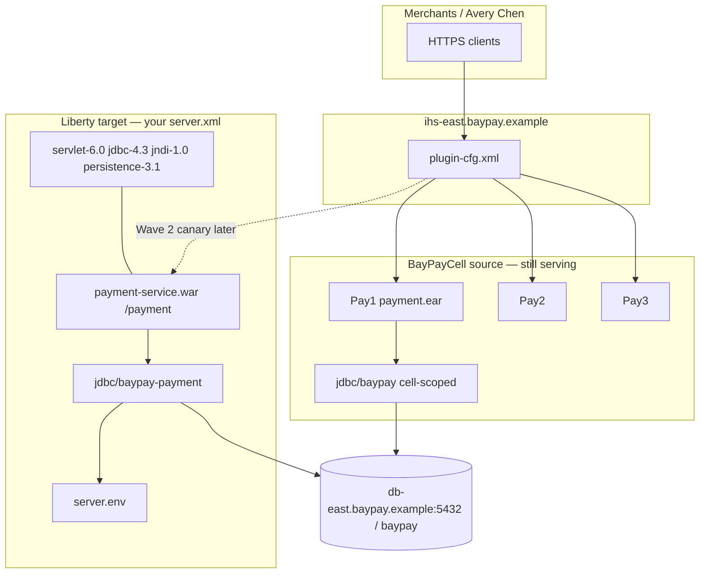

# MODERNIZE-602 — Adapt BayPay for Liberty

**Type:** MODERNIZE  
**Module:** 06 — WebSphere Liberty Modernization  
**Duration:** 60–90 minutes  
**Cost:** $0  
**Diagram:** AEJE-D-025 (BayPay Liberty adaptation)

This lab is **simulation-first**. You complete a Liberty `server.xml` on paper (and in the starter files). You do **not** install WebSphere Liberty, Open Liberty, or a traditional ND cell. Optional Docker (`icr.io/appcafe/open-liberty`) is extra credit, never required for a passing score.

Traditional ND is the **source estate**. Liberty (or the Spring Boot reference app) is the **target**.

---

## Scenario

Jordan Voss asks you to adapt `payment.ear` into a Liberty-hosted `payment-service.war` **without** carrying cell-scoped `jdbc/baypay` into the new server. Morgan Hale still owns `BayPayCell`. You own one server directory: features, an isolated DataSource named `jdbc/baypay-payment`, and environment variables instead of a console bind.

The starter in `labs/MODERNIZE-602/starter/` is **intentionally incomplete**. It is missing required features and it still binds the cell-wide JNDI name. Your job is to finish a well-formed `server.xml` and a matching `server.env` that a reviewer can check with a checklist.

---

## Business context

Avery Chen (`11111111-1111-1111-1111-111111111111`) continues to pay Harbor Bike Co through `/payment`. During Wave 2 (ARCHITECT-604) one Liberty replica will sit behind `ihs-east` next to `Pay1`/`Pay2`/`Pay3`. If that replica looks up `jdbc/baypay`, it is still sharing the scarce pool that reporting already abused. If it omits `jdbc-4.3` or `jndi-1.0`, the WAR will fail the same way a missing cell bind failed — except there is no DMGR to hide behind.

Finance does not care that the XML is elegant. Finance cares that the canary cannot starve `PaymentCluster` or point at a password pasted into a file Jordan commits.

---

## Learning objectives

- Enable exactly the Module 6 feature set: `servlet-6.0`, `jdbc-4.3`, `jndi-1.0`, `persistence-3.1`.
- Bind an isolated DataSource `jdbc/baypay-payment` (never cell-wide `jdbc/baypay`).
- Point PostgreSQL-compatible connection properties at `db-east.baypay.example:5432` / `baypay` using `${env.BAYPAY_DB_*}` — no password literal in XML.
- Keep `/payment` as the context root and treat `ihs-east` as the existing edge, not a federated node.
- Validate by checklist, not by installing Liberty.

---

## Architecture

Course diagram **AEJE-D-025** is this adaptation. Until the PNG is on disk, use the mermaid below plus TOPOLOGY.md.



Alt text: ihs-east still fans out to Pay1 Pay2 Pay3 on the ND cell; a Liberty payment WAR uses isolated jdbc/baypay-payment and server.env toward the same db-east host.

Control path on ND is `dmgr-east` → node agent. Control path on Liberty is the server directory you are editing. Do not draw a Deployment Manager around the WAR.

---

## Prerequisites

- MODERNIZE-601 classification page started (isolated binds decided).
- [datasets/baypay-cell/TOPOLOGY.md](../../datasets/baypay-cell/TOPOLOGY.md) open beside the starter.
- A text editor. JDK 21 is optional and unused unless you choose the extra Docker path.
- Lessons L-6.2 / L-6.3 if present; L-4.5 already showed a Liberty feature block.

---

## Environment setup

```bash
test -f labs/MODERNIZE-602/starter/server.xml && echo "starter xml present"
test -f labs/MODERNIZE-602/starter/server.env && echo "starter env present"
```

Copy the starter to a working folder if you want to keep the broken original for diff:

```bash
mkdir -p /tmp/aeje-modernize-602
cp labs/MODERNIZE-602/starter/server.xml /tmp/aeje-modernize-602/
cp labs/MODERNIZE-602/starter/server.env /tmp/aeje-modernize-602/
```

You may also edit the files under `labs/MODERNIZE-602/starter/` in place. The instructor key is `solutions/MODERNIZE-602/`, which you must not open until your checklist is green.

**Optional, not required:** run Open Liberty in Docker only if you already have Docker and want extra practice. Passing this lab never depends on that image.

---

## Challenge/tasks

1. **Read the starter.** Open `labs/MODERNIZE-602/starter/server.xml` and `server.env`. List every defect you see before you edit: missing `<feature>` names, wrong `jndiName`, leftover cell-wide bind, missing env keys.
2. **Features.** `featureManager` must include `servlet-6.0`, `jdbc-4.3`, `jndi-1.0`, and `persistence-3.1`. Do not add traditional ND-only admin features to compensate.
3. **Isolated JNDI.** Change the DataSource to `jdbc/baypay-payment`. Delete any `jdbc/baypay` bind. Do not add `jdbc/baypayXA` “just in case.”
4. **Connection properties.** Host `db-east.baypay.example`, port `5432`, database `baypay`. User and password come from the environment: `${env.BAYPAY_DB_USER}` and `${env.BAYPAY_DB_PASSWORD}`. Host and port should use `${env.BAYPAY_DB_HOST}` and `${env.BAYPAY_DB_PORT}` (and `${env.BAYPAY_DB_NAME}`) so MODERNIZE-603 is a tightening, not a first secret-rescue.
5. **Pool.** Give this DataSource its own `connectionManager`. Do not copy `maxConnections = 50` from the cell as if three Liberty replicas should still share one definition. Payment must not share a pool with reporting or refund.
6. **Application.** Package as a WAR: `payment-service.war` with context root `/payment`. This is not an EAR drop onto `PaymentCluster`.
7. **server.env.** Complete `BAYPAY_DB_HOST`, `BAYPAY_DB_PORT`, `BAYPAY_DB_NAME`, and `BAYPAY_DB_USER`. Do **not** write a password value into XML. Do not commit a real secret; the password is supplied at runtime as `BAYPAY_DB_PASSWORD`.
8. **Well-formed XML.** The file must parse as XML (balanced tags, quoted attributes). Reviewers may run `xmllint --noout` on your `server.xml`.
9. **Checklist only.** Do not install Liberty to “prove” the server starts. Optional Docker is extra.

---

## Validation

Self-check (this is the grade path — not `server start`):

- [ ] `servlet-6.0`, `jdbc-4.3`, `jndi-1.0`, `persistence-3.1` are all present.
- [ ] `jndiName="jdbc/baypay-payment"` exists.
- [ ] `jdbc/baypay` does **not** appear as a DataSource bind.
- [ ] Password in XML is only `${env.BAYPAY_DB_PASSWORD}` (or omitted from XML entirely, with env documented).
- [ ] No plaintext password string in `server.xml`.
- [ ] Context root is `/payment`.
- [ ] `server.env` names host `db-east.baypay.example` and database `baypay`.
- [ ] XML is well-formed.
- [ ] You did not require a live Liberty or WAS process.

Instructor scores the files with [instructor/rubrics/MODERNIZE-602.md](../../instructor/rubrics/MODERNIZE-602.md).

---

## Troubleshooting

- Starter still says `jdbc/baypay`: that is the defect. It is not a hint to keep the cell name “for compatibility.”
- Only `servlet-6.0` is in the starter: add the other three features. A servlet-only server will not bind JDBC or JPA.
- You copied L-4.5’s example `jndiName="jdbc/baypay"`: that lesson showed the *shape* of Liberty XML before Module 6 isolated names were locked. This lab overrides the name.
- `xmllint` fails: look for an unclosed `dataSource` or a `--` inside a comment.
- Tempted to install Liberty via Installation Manager: stop. Out of scope and not $0 in license terms for traditional WAS.
- Optional Docker image pull fails: ignore it. The checklist still stands.

---

## Expected outcome

A completed `server.xml` + `server.env` that a Staff engineer could drop into a Liberty server directory (when operations later chooses a runtime) without reintroducing a cell-wide pool. Files match the intent of `solutions/MODERNIZE-602/` even if attribute order differs.

---

## Interview questions

1. Why is enabling `jdbc-4.3` not the same thing as “we migrated the DataSource”?
2. What breaks if the canary and `Pay1` both look up `jdbc/baypay`?
3. Where did Morgan Hale used to type the password, and where should Jordan Voss refuse to put it now?
4. Why keep `ihs-east` in the drawing if Liberty already opens 9080?

---

## Architecture/trade-off questions

1. Liberty `server.xml` versus a Boot fat JAR for this same WAR — when do you pick each?
2. One Liberty server hosting both payment and refund wars versus two servers with `jdbc/baypay-payment` and `jdbc/baypay-refund` — what did you buy and what did you spend?
3. Why is `jdbc/baypayXA` a poor default add-on when TOPOLOGY says it is not on every node?
4. Feature set `servlet-6.0` + JPA versus “enable `jakartaee-10.0` everything” — blast radius of unused features?

---

## Cleanup

No cloud resources. No Liberty profiles. If you used `/tmp/aeje-modernize-602`, you may delete it. If you used optional Docker, stop that container; it was never required.

---

## Cost estimate

**$0.** Checklist XML and `server.env` on disk. No AWS. No licensed ND. No required Liberty install. Optional Open Liberty Docker is extra and still avoids a traditional cell.

---

## Hidden/revealable solution

Attempt the checklist on **your** files first. The instructor copies live in `solutions/MODERNIZE-602/` (`server.xml`, `server.env`, and a README). Opening them before you edit is a failed Diagnostic method score.

<details>
<summary>Reveal checklist — after you have edited the starter</summary>

Required features: `servlet-6.0`, `jdbc-4.3`, `jndi-1.0`, `persistence-3.1`. Required bind: `jdbc/baypay-payment`. Forbidden bind: cell-wide `jdbc/baypay`. Password in XML: `${env.BAYPAY_DB_PASSWORD}` only. Host in env: `db-east.baypay.example`. If any of those fail, fix your files before you read `solutions/`.

</details>

---

## What you learned

Liberty configuration is a server directory, not a cell tree. Features are explicit. JNDI names are yours to isolate. The payment canary must not inherit `jdbc/baypay` because the name is familiar. Traditional ND remains the estate you are leaving; `server.xml` is how a WAR leaves it.

---

## Portfolio deliverable

Completed Liberty `server.xml` and `server.env` for the payment WAR (working copy or edited starter). Cite AEJE-D-025. This lab is a configuration artifact; the Module 6 written portfolio pages remain [PF-liberty-assessment.md](../../student/worksheets/PF-liberty-assessment.md) and [PF-liberty-waves.md](../../student/worksheets/PF-liberty-waves.md).
