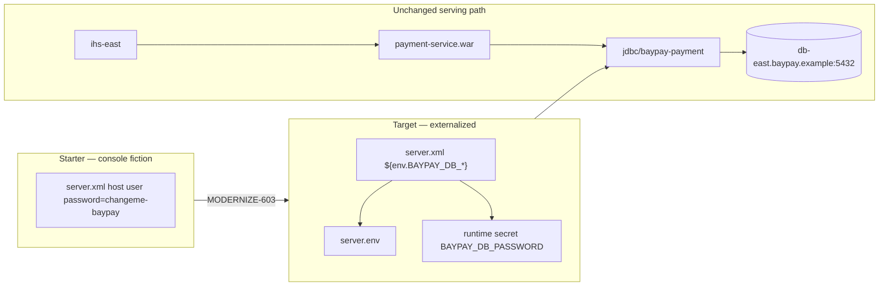

# MODERNIZE-603 — Externalize configuration

**Type:** MODERNIZE  
**Module:** 06 — WebSphere Liberty Modernization  
**Duration:** 45–75 minutes  
**Cost:** $0  
**Diagram:** AEJE-D-026 (Configuration externalization)

This lab is **simulation-first**. You repair a Liberty `server.xml` that still behaves like a cell console: host, user, and password are literals in XML. You do **not** install Liberty or traditional WAS. Validation is a checklist.

Traditional ND is the **source estate**. Liberty `server.env` / `${env.BAYPAY_DB_*}` (or Boot `BAYPAY_DB_*`) is the **target**.

---

## Scenario

Morgan Hale used to type the DataSource password into the `BayPayCell` admin console as J2C alias `baypayDbAlias`. Jordan Voss copied that habit into `server.xml` so the payment WAR would “just start.” Priya Nair refuses to commit the file. You must move host, user, password, and the idea of a console-owned JNDI secret out of XML and into `server.env` consumed as `${env.BAYPAY_DB_*}`.

The starter `labs/MODERNIZE-603/starter/server.xml` contains the fake password `changeme-baypay` on purpose. That string must not survive in XML.

---

## Business context

Avery Chen’s payments already require a database password. On ND, that secret lived in `baypayDbAlias` and in whoever had console access. On Liberty, a password element in `server.xml` is the same secret with a worse audit trail: it is a file in Git, a Slack paste, and a backup tarball.

Wave 2 will run one Liberty payment replica beside `Pay1`/`Pay2`/`Pay3`. If the canary’s password is in XML and the ND alias is in the console, you now have two places to rotate and one of them is world-readable in the repo. Harbor Market does not want a Sev-2 because a student-shaped `changeme-baypay` reached a shared folder.

---

## Learning objectives

- Find every hardcoded host, user, password, and database name in the starter XML.
- Replace them with `${env.BAYPAY_DB_HOST}`, `${env.BAYPAY_DB_PORT}`, `${env.BAYPAY_DB_NAME}`, `${env.BAYPAY_DB_USER}`, and `${env.BAYPAY_DB_PASSWORD}`.
- Author a `server.env` that supplies non-secret topology values (`db-east.baypay.example`, `5432`, `baypay`, app user) and documents that the password is injected at runtime.
- Keep isolated JNDI `jdbc/baypay-payment`. Do not reintroduce `jdbc/baypay`.
- Leave `changeme-baypay` nowhere in the finished XML.

---

## Architecture

Course diagram **AEJE-D-026** is this split. Until the PNG is on disk, use the mermaid below.



Alt text: Hardcoded password in server.xml is replaced by env placeholders; ihs-east still reaches the payment WAR and isolated DataSource toward db-east.

JNDI remains a **name** in XML (`jdbc/baypay-payment`). The **credential** must not.

---

## Prerequisites

- MODERNIZE-602 feature set and isolated bind understood (`servlet-6.0`, `jdbc-4.3`, `jndi-1.0`, `persistence-3.1`, `jdbc/baypay-payment`).
- TOPOLOGY.md for the locked DB host. Optional: `reference-apps/baypay` `application-prod.yml` already uses `BAYPAY_DB_*`.
- No live cell. No Liberty install.

---

## Environment setup

```bash
test -f labs/MODERNIZE-603/starter/server.xml && echo "starter xml present"
# Confirm the defect you must remove
grep -n "changeme-baypay" labs/MODERNIZE-603/starter/server.xml
```

Copy the starter before you edit if you want a clean diff:

```bash
mkdir -p /tmp/aeje-modernize-603
cp labs/MODERNIZE-603/starter/server.xml /tmp/aeje-modernize-603/
```

You will **create** `server.env` (there is no starter env on purpose). The instructor key is `solutions/MODERNIZE-603/`.

---

## Challenge/tasks

1. **Hunt literals.** In the starter XML, list every hardcoded value that belongs in the environment: host, port, database name, user, password. Note that `jndiName="jdbc/baypay-payment"` stays — that is an application contract, not a secret.
2. **Replace credentials.** Password must become `${env.BAYPAY_DB_PASSWORD}` and nothing else. Remove `changeme-baypay` entirely from XML.
3. **Replace topology.** `serverName`, `portNumber`, `databaseName`, and `user` must read `${env.BAYPAY_DB_HOST}`, `${env.BAYPAY_DB_PORT}`, `${env.BAYPAY_DB_NAME}`, and `${env.BAYPAY_DB_USER}`.
4. **Write server.env.** Create a sibling `server.env` with:

   - `BAYPAY_DB_HOST=db-east.baypay.example`
   - `BAYPAY_DB_PORT=5432`
   - `BAYPAY_DB_NAME=baypay`
   - `BAYPAY_DB_USER=baypay_app` (or another synthetic app user — not Morgan’s console id)

   Do **not** put a password value in `server.env` in this course repo. Document that operators inject `BAYPAY_DB_PASSWORD` at runtime (export, secret store, or platform env).
5. **Keep features and isolation.** Do not drop features to “simplify.” Do not rename the DataSource back to `jdbc/baypay`. Do not add `jdbc/baypayXA`.
6. **Well-formed XML.** Reviewers may run `xmllint --noout` on your finished `server.xml`.
7. **Contrast ND.** In three sentences on your scratch notes (or at the bottom of `server.env` as comments): where `baypayDbAlias` lived, why a cell console is not externalization, and why Boot `application-prod.yml` already did this job with `BAYPAY_DB_*`.
8. **Checklist only.** Do not start Liberty to test interpolation.

---

## Validation

Self-check before you open `solutions/MODERNIZE-603/`:

- [ ] `changeme-baypay` does not appear in your `server.xml`.
- [ ] Password attribute is exactly `${env.BAYPAY_DB_PASSWORD}`.
- [ ] Host / port / name / user are `${env.BAYPAY_DB_*}` — not literals.
- [ ] `jdbc/baypay-payment` remains; `jdbc/baypay` is absent.
- [ ] Features `servlet-6.0`, `jdbc-4.3`, `jndi-1.0`, `persistence-3.1` remain.
- [ ] `server.env` exists and lists host `db-east.baypay.example`.
- [ ] `server.env` does not contain `changeme-baypay` or any other password literal.
- [ ] XML is well-formed.
- [ ] No Liberty or WAS process was required.

Instructor scores with [instructor/rubrics/MODERNIZE-603.md](../../instructor/rubrics/MODERNIZE-603.md).

---

## Troubleshooting

- Grep still finds `changeme-baypay` in a comment: delete the comment too. Secrets in comments still leak.
- You used `${BAYPAY_DB_PASSWORD}` without `env.`: Liberty can read `server.xml` variables or env. This course standardizes on `${env.BAYPAY_DB_*}` so `server.env` is the source.
- You put `BAYPAY_DB_PASSWORD=changeme-baypay` in `server.env` “because local”: that fails Security / reliability. Document injection; do not commit the value.
- Isolated JNDI “moved to env”: JNDI is a name the WAR looks up. Externalize **connection** fields, not the contract name, unless you also change the application (out of scope).
- Tempted to open the ND console to copy the alias: there is no live cell. TOPOLOGY.md is the inventory.

---

## Expected outcome

A `server.xml` that contains no database password and a `server.env` that carries topology. A reviewer who diffs against `solutions/MODERNIZE-603/` should see the same contracts: isolated JNDI, env interpolation, no `changeme-baypay`.

---

## Interview questions

1. Why is “the password is in the admin console, not the EAR” still not externalization?
2. What do you say if a candidate commits `server.env` with `BAYPAY_DB_PASSWORD=changeme-baypay` and calls it 12-factor?
3. How would you rotate the payment database password on ND versus on this Liberty server directory?
4. Which file would you show a Spring engineer to prove Liberty and Boot agree on `BAYPAY_DB_*`?

---

## Architecture/trade-off questions

1. `server.env` versus platform secrets (Kubernetes Secret, vault) — what does this lab buy, and what must Wave 3 still replace?
2. One `server.env` shared by payment and refund versus two files — how does that recreate cell-scoped `jdbc/baypay`?
3. Why keep JNDI `jdbc/baypay-payment` in XML while moving the URL pieces out?
4. If `ihs-east` plugin XML also gained a password, which security domain did you just mix?

---

## Cleanup

No cloud resources. Delete `/tmp/aeje-modernize-603` if you used it. Do not delete TOPOLOGY.md. Do not leave `changeme-baypay` in a file you intend to submit.

---

## Cost estimate

**$0.** XML and env files on disk. No AWS. No licensed ND. No required Liberty install.

---

## Hidden/revealable solution

Fix the starter yourself first. Instructor files: `solutions/MODERNIZE-603/server.xml`, `server.env`, and `README.md`. Opening them before you remove `changeme-baypay` is a failed Diagnostic method score.

<details>
<summary>Reveal externalization check — after you have edited XML</summary>

XML password must be `${env.BAYPAY_DB_PASSWORD}`. XML must not contain `changeme-baypay`. Host in env must be `db-east.baypay.example`. Bind remains `jdbc/baypay-payment`. If grep still finds the fake password, you are not done.

</details>

---

## What you learned

A cell console is a secret store with a GUI, not a configuration strategy. Liberty makes the same mistake the moment a password is an XML attribute. `server.env` and `${env.BAYPAY_DB_*}` match the Boot contract the reference app already uses. Isolated JNDI stays; credentials leave the file.

---

## Portfolio deliverable

Completed `server.xml` + `server.env` with no password literals. Cite AEJE-D-026. The written Module 6 portfolio pages remain the assessment and waves worksheets; this lab is the configuration proof that Wave 2 can run without console fiction.
