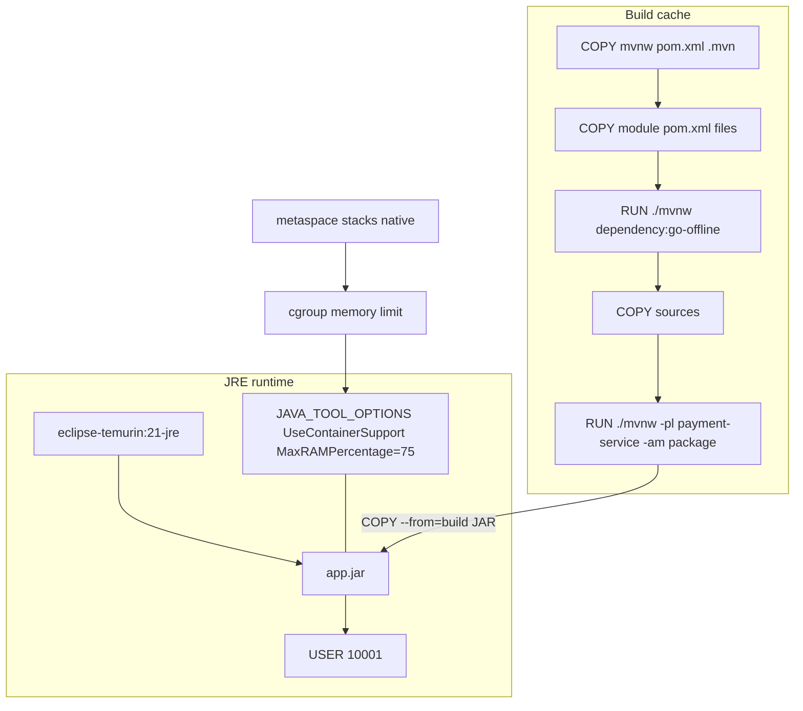

# PERFORMANCE-904 — Optimize Java container

**Type:** PERFORMANCE  
**Module:** 09 — Containers for Java  
**Duration:** 45–75 minutes  
**Cost:** $0  
**Lessons:** L-9.3, L-9.6  
**Cluster notes:** [datasets/baypay-k8s/CLUSTER.md](../../datasets/baypay-k8s/CLUSTER.md)  
**Prior labs:** BUILD-901, LAB-704, INCIDENT-806  
**Worksheet:** [student/worksheets/PF-container.md](../../student/worksheets/PF-container.md)

Optimize the image **build** (layer cache) and the Java **runtime flags**. Docker is optional. You pass by a Dockerfile and the JVM-flags section of the worksheet. Never set `-Xmx` equal to the container memory limit.

---

## Scenario

Sam Okada’s CI rebuilds `payment-service` on every comma in a Java file and waits ten minutes because the Dockerfile copies the whole tree before Maven resolves plugins. Jordan Voss then “fixed” startup by adding `JAVA_TOOL_OPTIONS=-Xmx512m` on a 512 MiB teaching limit — the INCIDENT-806 shape. Priya Nair wants layer caching and a heap that is a **percentage** of the cgroup.

You rewrite the Dockerfile so dependency layers stay warm, the runtime stays a JRE, and `JAVA_TOOL_OPTIONS` carries `UseContainerSupport` plus `MaxRAMPercentage` — not a heap that consumes the whole limit.

---

## Business context

Avery Chen’s traffic does not care about your CI minutes until a Friday patch misses the window. Harbor Market does care when the canary is OOMKilled: native memory, metaspace, and thread stacks sit **on top of** the heap. Module 7 (LAB-704) already computed 25% and 75% of 512 MiB. Module 8 (INCIDENT-806) already killed a replica that set `-Xmx` to the limit. This lab puts those flags in the **image contract**.

Finance will not accept “we use all the RAM” as a JVM strategy. Platform will not accept a Dockerfile that invalidates Maven’s download layer when you change a controller.

---

## Learning objectives

- Order `COPY` so `pom.xml` files (and the Wrapper) land **before** source, so dependency resolution can cache.
- Keep the runtime stage `eclipse-temurin:21-jre`, not `21-jdk`.
- Set `JAVA_TOOL_OPTIONS` to include `-XX:+UseContainerSupport` and `-XX:MaxRAMPercentage=75.0` (or another percentage **below** 100).
- Refuse `-Xmx` equal to the memory limit. Do not “help” by setting `-Xmx512m` on a 512 MiB container.
- `jlink` is optional conversation, not required to pass.
- Fill the worksheet **JVM flags** section.

---

## Architecture



Alt text: Maven poms copy first so dependency layers cache; source copies later. The JRE runtime sets MaxRAMPercentage in JAVA_TOOL_OPTIONS so heap is a fraction of the cgroup, leaving native headroom.

`jlink` can produce a custom runtime smaller than `21-jre`. This course does not require you to run `jlink`. Mentioning it in a trade-off answer is enough.

---

## Prerequisites

- BUILD-901 Dockerfile (multi-stage, `USER 10001`, no secrets).
- LAB-704 arithmetic: default `MaxRAMPercentage` is 25; 75% of 512 MiB is not 512 MiB.
- CLUSTER.md JVM line: `UseContainerSupport`; do not set `-Xmx` equal to the limit.
- Optional Docker / Podman. Not required.

---

## Environment setup

```bash
test -f reference-apps/baypay/pom.xml && echo "reactor pom present"
mkdir -p /tmp/aeje-performance-904
```

Copy your BUILD-901 or SECURITY-903 working Dockerfile:

```bash
cp /tmp/aeje-build-901/Dockerfile /tmp/aeje-performance-904/Dockerfile
```

Optional cache demonstration (not required):

```bash
cd reference-apps/baypay
# first build, then touch a Java file, then build again — only if you have an engine
```

Do not open `solutions/PERFORMANCE-904/` until your flag line and COPY order are written.

---

## Challenge/tasks

1. **Start from a correct BUILD-901 shape.** Two stages, Wrapper build, JRE runtime, `EXPOSE 8080`, `USER 10001`, no password `ENV`.
2. **Copy poms first.** In the build stage, `COPY` `mvnw`, `.mvn/`, the reactor `pom.xml`, and each module `pom.xml` (`shared`, `payment-service`, `refund-service`, `notification-service`, `transaction-worker`) **before** you `COPY` source trees.
3. **Resolve dependencies.** `RUN ./mvnw -pl payment-service -am dependency:go-offline -B` (or an equivalent Wrapper resolve) **before** copying sources. Then `COPY` sources and `package`.
4. **Runtime is a JRE.** Final `FROM eclipse-temurin:21-jre`. Do not “speed up” by staying on the JDK so you can `jcmd` in production. That is a debug image, not this lab.
5. **Flags.** In the runtime stage set  
   `ENV JAVA_TOOL_OPTIONS="-XX:+UseContainerSupport -XX:MaxRAMPercentage=75.0"`  
   You may choose 50.0 or 75.0. You may **not** choose 100. You may **not** set `-Xmx` to the container memory limit. You should not set `-Xmx` in this file at all.
6. **Explain the budget** on the worksheet: heap is a percentage of the cgroup; metaspace, stacks, code cache, and direct buffers need the remainder. Cite INCIDENT-806 in one sentence.
7. **Optional `jlink`.** In the trade-off answers, say when you would custom-link a runtime. Do not spend the lab building one unless you want extra credit.
8. **Parseable file.** `FROM`, `WORKDIR`, `COPY`, `USER` present.
9. **Checklist only.** A live rebuild that shows a cache hit is extra.

---

## Validation

- [ ] Module `pom.xml` files are copied before module sources.
- [ ] A Maven resolve/`go-offline` (or dependency) `RUN` appears before the source `COPY`.
- [ ] Runtime `FROM` is `eclipse-temurin:21-jre`.
- [ ] `JAVA_TOOL_OPTIONS` includes `UseContainerSupport` and `MaxRAMPercentage` with a value **less than 100**.
- [ ] No `-Xmx` equal to a stated memory limit. Prefer no `-Xmx` at all.
- [ ] `USER 10001` still present.
- [ ] No secrets in the file.
- [ ] Worksheet JVM flags section names percentage, headroom, and the INCIDENT-806 refusal.
- [ ] Docker not required to pass.

Instructor scores with [instructor/rubrics/PERFORMANCE-904.md](../../instructor/rubrics/PERFORMANCE-904.md).

---

## Troubleshooting

| Symptom | What to check |
|---|---|
| Every Java edit reruns dependency download | You `COPY`’d the whole tree before `go-offline`. |
| Runtime still `21-jdk` | You optimized the build stage and forgot the final `FROM`. |
| `-Xmx512m` “matches the 512 MiB limit” | Forbidden. That is the INCIDENT-806 failure. Use `MaxRAMPercentage`. |
| `MaxRAMPercentage=100` | Same class of mistake as heap = limit. |
| `UseContainerSupport` turned off “so the JVM sees the node” | Forbidden on BayPay images. |
| `dependency:go-offline` optional-build fails | Paper COPY order still grades. You may `package` in one RUN after poms+sources if the engine is absent — the **order** of COPY must still show poms first. |
| Wanted `-Xms` equal to the limit too | Also refuse. Initial heap at 100% of the cgroup leaves no native room. |

---

## Expected outcome

A Dockerfile whose build stage can reuse Maven downloads when only Java sources change, and whose runtime declares a percentage-based heap with container support. The worksheet shows why that is not `-Xmx` = limit.

---

## Interview questions

1. Why copy `pom.xml` before `src` if Maven needs both to compile?
2. Default `MaxRAMPercentage` is 25. Why might operations set 75 in `JAVA_TOOL_OPTIONS` and still refuse 100?
3. What did INCIDENT-806 prove about `-Xmx` equal to the pod memory limit?
4. Why is a JDK runtime a performance problem (size, attack surface) as well as a security one?

---

## Architecture/trade-off questions

1. `MaxRAMPercentage=75` versus a reviewed explicit `-Xmx384m` on a 512 MiB limit — when is the fixed heap clearer?
2. Fat JAR versus copying `BOOT-INF/lib` as its own layer — cache granularity versus complexity?
3. When would you spend time on `jlink` instead of `21-jre`?
4. CI cache (`--mount=type=cache` for Maven) versus COPY-pom-first — do you need both?

---

## Cleanup

No cluster. No AWS. Remove `/tmp/aeje-performance-904` if you used it. Optional local images may be deleted. Do not leave a teaching tag that embeds `-Xmx` equal to a limit.

```bash
rm -rf /tmp/aeje-performance-904
```

---

## Cost estimate

**$0.** Dockerfile and worksheet. No AWS. No required Docker build minutes on a paid runner. Optional local engine only.

---

## Hidden/revealable solution

Write COPY order and `JAVA_TOOL_OPTIONS` yourself first. Instructor files live in `solutions/PERFORMANCE-904/`.

<details>
<summary>Reveal orientation — after your flags are written</summary>

Poms and Wrapper copy first; `dependency:go-offline` (or equivalent) before sources; runtime `21-jre`; `JAVA_TOOL_OPTIONS` has `UseContainerSupport` and `MaxRAMPercentage` below 100. If your file sets `-Xmx` to the container limit, fix that before you open `solutions/`.

</details>

---

## What you learned

- Layer order is a performance feature: dependencies change slower than controllers.
- A JRE runtime is smaller and sufficient to run the fat JAR.
- Heap is a percentage of the cgroup. Native memory is the rest. Heap = limit is an outage.
- `jlink` exists; this lab did not require it.

---

## Portfolio deliverable

Complete the **JVM flags** section of [PF-container.md](../../student/worksheets/PF-container.md): `JAVA_TOOL_OPTIONS`, percentage, native headroom, explicit refusal of `-Xmx` = limit. Attach the optimized Dockerfile. This closes the Module 9 performance slice of the container architecture artifact.
