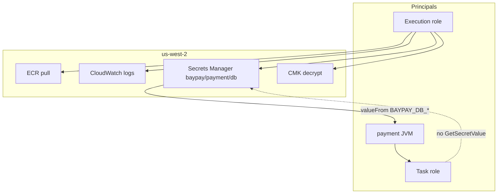

# SECURITY-1103 — IAM, secrets and KMS

**Type:** SECURITY (awsLab)  
**Module:** 11 — AWS Container Platforms  
**Duration:** 60–90 minutes  
**Cost:** $0 paper; **billable if you apply** Secrets Manager / KMS / leftover ALB  
**Lessons:** L-11.5  
**Diagram:** AEJE-D-050 (IAM, Secrets Manager and KMS)  
**Account notes:** [datasets/baypay-aws/ACCOUNT.md](../../datasets/baypay-aws/ACCOUNT.md)  
**Starter:** [starter/](starter/)  
**Worksheet:** [student/worksheets/PF-aws-platform.md](../../student/worksheets/PF-aws-platform.md)

You pass by tightening IAM JSON and a task definition. Live apply is **not** required. If you still have BUILD-1101 leftovers, destroy them — this lab does not need an ALB to grade.

---

## Scenario

Priya Nair will not sign the BUILD-1101 service until `BAYPAY_DB_*` is not sitting in the task definition as plaintext. Sam Okada attached `AdministratorAccess` to a **single** role and used it as both execution role and task role “so the first deploy would work.” Riley Okonkwo refuses a password in git. Jordan Voss still wants `changeme` in the JSON “until we have a vault.”

Split the roles, point the task definition at a Secrets Manager ARN, and encrypt that secret with a customer managed KMS key. Do not leave `AdministratorAccess` on a payment task.

---

## Business context

Avery Chen’s payment body includes account identifiers. The task that accepts that POST is a PCI-adjacent teaching surface even though this course is fictional. A combined admin role, a password in `task-definition.json`, and a secret encrypted only with the AWS-managed Secrets Manager key you never named are three different ways the same replica becomes evidence.

Module 10 used Secret `baypay-db`. ACCOUNT.md says `BAYPAY_DB_*` come from Secrets Manager — never from task-def JSON in git. If those values are already in the JSON, the secret store is theater. If the **task** role can `iam:*`, a compromised JVM is an account compromise.

---

## Learning objectives

- Split the ECS **execution** role from the **task** role. They are different principals.
- Replace `AdministratorAccess` with least-privilege JSON: execution pulls ECR, writes logs, reads **one** secret, decrypts **one** CMK; task does not get `GetSecretValue` unless the process calls the API itself (this app does not).
- Inject `BAYPAY_DB_URL`, `BAYPAY_DB_USER`, and `BAYPAY_DB_PASSWORD` via `secrets.valueFrom` (Secrets Manager ARN, including JSON key). No plaintext `environment` values.
- Write a KMS key policy that allows the execution role to `kms:Decrypt` and denies the world.
- Record the trust boundary on AEJE-D-050 and on PF-aws-platform.md.

---

## Architecture

Course diagram **AEJE-D-050** is this boundary. Until the PNG is on disk, use the mermaid plus ACCOUNT.md.

**Region:** `us-west-2`.

**Service list:** IAM roles and policies, Secrets Manager secret `baypay/payment/db`, KMS customer managed key, ECS task definition (JSON). **Not required to create:** ALB, NAT, EKS, RDS. BUILD-1101 already described compute.



Alt text: The execution role pulls the image, writes logs, reads one Secrets Manager ARN, and decrypts one KMS key. The JVM receives BAYPAY_DB_* as injected environment. The task role is a separate principal and does not need GetSecretValue for this app.

**Least privilege:** neither role is `AdministratorAccess`. The execution role’s `Resource` is the secret ARN and the CMK ARN, not `*`. The task role stays empty or narrowly named — it is **not** a copy of the execution role.

**Failure scenario:** plaintext `changeme` in git, or a combined admin role, means any cloned repo or any SSRF-shaped process can become account-admin. A 404 on `/` (INCIDENT-1104) is a different defect — do not “fix” health checks by widening IAM.

---

## Prerequisites

- BUILD-1101 attempted (two role resources exist; they were still too wide or unused).
- BUILD-901 / SECURITY-903: no password in the image. This lab is the **runtime** equivalent.
- ACCOUNT.md secrets line. Lessons L-11.5 if present.
- Optional AWS sandbox in `us-west-2`. **Not required to pass.**
- No real access keys in files. Teaching account id `123456789012` is synthetic.

---

## Environment setup

```bash
test -f labs/SECURITY-1103/starter/iam-combined.json && echo "starter IAM present"
test -f labs/SECURITY-1103/starter/task-definition.json && echo "starter task def present"
```

Copy so you can diff:

```bash
mkdir -p /tmp/aeje-security-1103
cp labs/SECURITY-1103/starter/*.json /tmp/aeje-security-1103/
```

Do not open `solutions/SECURITY-1103/` until your JSON has two roles and no `changeme`.

If you apply (optional): region `us-west-2`, tags `Course=AEJE Module=11 Lab=SECURITY-1103 Environment=student Expiration=<ISO date>`. Do not create NAT, EKS, or RDS. Destroy secrets, key material schedule, and any leftover ALB/ECS/ECR from BUILD-1101 the same day.

---

## Challenge/tasks

1. **Read the starter.** Open `iam-combined.json` and `task-definition.json`. List the defects: one role, `AdministratorAccess`, plaintext `BAYPAY_DB_*`, same ARN in `executionRoleArn` and `taskRoleArn`.
2. **Split roles.** Write `iam-execution-role.json` and `iam-task-role.json` (trust policy `ecs-tasks.amazonaws.com` on both). Different `RoleName` values.
3. **Tighten execution.** Allow only: ECR auth + pull for `baypay/payment-service`, `logs:CreateLogStream` / `PutLogEvents` on the payment log group, `secretsmanager:GetSecretValue` on `arn:aws:secretsmanager:us-west-2:123456789012:secret:baypay/payment/db*`, `kms:Decrypt` on the teaching CMK. No `Action: "*"`.
4. **Tighten task.** Do **not** attach `AdministratorAccess`. Do **not** copy `GetSecretValue` unless you write why the JVM calls the API (this app uses injected env). Empty policy or a later `s3:GetObject` on a named prefix is acceptable.
5. **Task definition.** Remove plaintext `BAYPAY_DB_*` from `environment`. Add `secrets` with `valueFrom` ARNs that include the JSON key (`:url::`, `:username::`, `:password::`). Keep `SPRING_PROFILES_ACTIVE` as a non-secret `environment` if you need it.
6. **KMS.** Write `kms-key-policy.json`: root account can administer; execution role can `kms:Decrypt` and `kms:DescribeKey`; no public `Principal: "*"`.
7. **Grep.** Confirm no `changeme`, no `AdministratorAccess`, no `AKIA` strings in your copies.
8. **Worksheet.** Fill the IAM / secrets section of [PF-aws-platform.md](../../student/worksheets/PF-aws-platform.md).

---

## Validation

Self-check (grade path — not a live `aws iam simulate-principal-policy`):

- [ ] Two roles, two names, both trust `ecs-tasks.amazonaws.com`.
- [ ] Neither role uses `AdministratorAccess` or `Action: "*"`.
- [ ] Execution can read **one** secret ARN and decrypt **one** CMK.
- [ ] Task role does not need `GetSecretValue` for this app.
- [ ] Task definition has `secrets` for `BAYPAY_DB_URL` / `USER` / `PASSWORD` and no plaintext password.
- [ ] KMS policy names the execution role; not `Principal: "*"`.
- [ ] Region in ARNs is `us-west-2`.
- [ ] You did not require a live apply to pass.

Instructor scores with [instructor/rubrics/SECURITY-1103.md](../../instructor/rubrics/SECURITY-1103.md).

**Expected final state (paper):** least-privilege JSON + a task definition that only references secret ARNs. **Expected final state (if you applied):** secret created, CMK used, task revision registered, then **destroyed** (secret, key deletion window, and any BUILD-1101 ALB/ECS/ECR leftovers).

---

## Troubleshooting

| Symptom | What to check |
|---|---|
| Starter is `AdministratorAccess` | That is the defect. Split and tighten. |
| Same ARN for execution and task | Split. Execution pulls; task is the JVM. |
| Left `changeme` “for local” | Fail. Use `valueFrom` or omit prod secrets and keep `local` without a password key. |
| Copied `GetSecretValue` onto the task role | Not needed when ECS injects env. |
| `Resource: "*"` on Secrets Manager | Narrow to `baypay/payment/db*`. |
| Tempted to apply EKS IRSA instead | Literacy only. This lab is ECS roles. |
| Wanted a live RDS to “need” the secret | Forbidden. The JSON contract is enough. |
| Optional apply: task fails to start | Execution role missing `GetSecretValue` or `kms:Decrypt` — that is an execution-role bug, not a reason to attach admin. |

---

## Expected outcome

JSON a Staff engineer could attach in `us-west-2` without reintroducing `AdministratorAccess` or a password in git. Files match the intent of `solutions/SECURITY-1103/` even if SID names differ.

---

## Interview questions

1. Why does the **execution** role need `GetSecretValue` when the JVM never calls Secrets Manager?
2. What blast radius changes if the task role is `AdministratorAccess` and the process is SSRF’d?
3. Why is `valueFrom` on a JSON key (`:password::`) better than a single string secret in the task JSON?
4. Who should be allowed to `kms:Decrypt` this CMK — the task role, the execution role, or both?

---

## Architecture/trade-off questions

1. AWS-managed Secrets Manager key versus a CMK you named — when is the extra policy worth it?
2. Injected `secrets` versus the app calling `GetSecretValue` at runtime — rotation and IAM shape?
3. One secret with three keys versus three secrets — blast radius and IAM `Resource`?
4. Why is a combined “ecs-role” with admin cheaper on day one and more expensive on day two?

---

## Cleanup

**If you only edited files:** delete `/tmp/aeje-security-1103` if you used it. Do not “fix” the starter in place for classmates.

**If you applied:** destroy **the same day**.

```text
- Secrets Manager secret baypay/payment/db (and versions)
- KMS CMK: schedule deletion (do not leave it unused-and-billed)
- IAM roles/policies you created for this lab
- Any leftover ALB, ECS service/cluster, ECR images from BUILD-1101
```

An idle ALB still bills even if this lab never asked you to create one. Empty ECR still has storage cost.

---

## Cost estimate

**$0** if you stay on paper.

**Warning — apply creates a real bill.** Secrets Manager is on the order of **$0.40/secret/month** plus API calls. A customer managed KMS key is on the order of **$1/key/month**. That is small next to an **idle ALB (~$0.0225/hour, ~$0.54/day)** left from BUILD-1101. Same-day JSON-only: **$0**. Same-day apply of secret + CMK then destroy: about **$0–$2** (prorated; KMS often bills a month). Forgotten ALB + ECS + ECR for a week: about **$5–$15**. **Destroy leftovers the same day.** Teaching estimates in USD for `us-west-2`.

---

## Hidden/revealable solution

Attempt the split on **your** JSON first. The instructor copy lives in `solutions/SECURITY-1103/`. Opening it before you edit is a failed Diagnostic method score.

<details>
<summary>Reveal checklist — after you have edited the starter</summary>

Required: two roles; no `AdministratorAccess`; execution has ECR + logs + one secret + one CMK; task does not copy admin or need `GetSecretValue`; task def uses `valueFrom` ARNs; no `changeme`. If any of those fail, fix your files before you read `solutions/`.

</details>

---

## What you learned

Execution role is the agent that starts the container. Task role is the agent the JVM becomes. Secrets Manager plus KMS replace plaintext in the task definition. `AdministratorAccess` is how a payment process inherits the account. The starter that “deploys” is not a trust boundary.

---

## Portfolio deliverable

Complete the **IAM / secrets / KMS** section of [student/worksheets/PF-aws-platform.md](../../student/worksheets/PF-aws-platform.md). Cite AEJE-D-050. Attach your role JSON and task-definition excerpt (ARNs only — no secret values).
