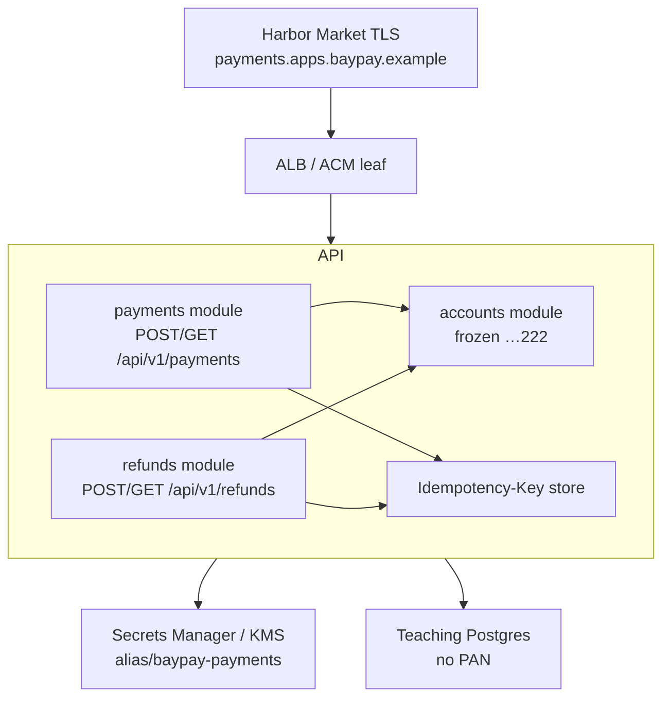

# SECURITY-1404 — Threat model BayPay

**Type:** SECURITY  
**Module:** 14 — Security, High Availability and Disaster Recovery  
**Duration:** 60–90 minutes  
**Cost:** $0 (paper — **not** an awsLab apply)  
**Lessons:** L-14.1, L-14.2, L-14.3. Stands alone with TRUST.md.  
**Diagram:** AEJE-D-067 (BayPay threat model)  
**Trust notes:** [datasets/baypay-security/TRUST.md](../../datasets/baypay-security/TRUST.md)  
**Ops notes:** [datasets/baypay-ops/OBSERVABILITY.md](../../datasets/baypay-ops/OBSERVABILITY.md)  
**Worksheet:** [student/worksheets/PF-security.md](../../student/worksheets/PF-security.md)

This is a **paper threat model**. You do not attack a live system. You do not write exploit proofs of concept, payloads, malware, or bypass recipes. You do not produce a real PCI ROC. Architecture and threat notes only.

---

## Scenario

Priya Nair wants a Staff-readable STRIDE (or equivalent) page before Harbor Market’s next volume week. The surfaces are the ones TRUST.md already named: `POST/GET /api/v1/payments`, `POST/GET /api/v1/refunds`, `Idempotency-Key`, frozen account `22222222-2222-2222-2222-222222222222`, IAM/secrets, edge TLS, and the modular monolith boundary.

Sam Okada will try to “run a scanner against prod so the model is real.” Jordan Voss will try to paste a blog OWASP list with no BayPay names. Riley Okonkwo will ask whether frozen-account checks can be skipped “inside the monolith” if the refund module is in a hurry. Morgan Hale will offer to put the model on `PaymentCluster`.

You write the model so those four sentences fail.

Avery Chen (`11111111-1111-1111-1111-111111111111`) uses active account `…221`. Teaching payment id `c1402b22-0000-4000-8000-111111111402`. Host `payments.apps.baypay.example`. Region `us-west-2`.

The page is [PF-security.md](../../student/worksheets/PF-security.md) threat-model section.

---

## Business context

BayPay is fictional. The course still treats the payment JVM as a **PCI-adjacent teaching surface**: no PAN in the database, no secrets in git, no `AdministratorAccess` on the task role (SECURITY-1103). A threat model that only says “encrypt everything” does not help Riley at 02:00.

A frozen account (`…222`) must not authorize. An `Idempotency-Key` must not become a second charge or a confused refund. Edge TLS is how merchants arrive; HTTP to `:8080` is not the customer path. The modular monolith is one deployable with internal module boundaries — not a license to call “internal” refund APIs without the same checks.

Out of scope: a real card-network certification, a real employer’s PCI ROC, attacking a live account, writing exploit steps.

---

## Learning objectives

- Produce a STRIDE (or equivalent) table on the TRUST.md in-scope surfaces, using BayPay names.
- Treat **Idempotency-Key replay** as a first-class threat (duplicate charge vs conflict vs captured key), in architecture language only.
- Treat **frozen account `…222`** as a control that every authorize path must hit — including refund-adjacent and “internal” module calls.
- Place **secrets/IAM** and **edge TLS** on the diagram as trust boundaries, not footnotes.
- Draw the **modular monolith boundary**: what a payment module may call, what it must not assume.
- Record the model on AEJE-D-067 and on PF-security.md.
- Refuse scanners-against-prod, payload write-ups, and `PaymentCluster` as the security design.

---

## Architecture

Course diagram **AEJE-D-067** is this trust map. Until the PNG is on disk, use the mermaid plus TRUST.md. Do not add a second KMS alias or a live ACM apply.



Alt text: Merchants enter only through TLS at payments.apps.baypay.example. The ALB terminates TLS toward payment-service on 8080. Inside the modular monolith, payments and refunds both consult accounts for the frozen flag and an idempotency store. Secrets and KMS sit outside the JVM. The database is teaching Postgres that must not hold PAN.

```text
In scope     POST/GET payments, POST/GET refunds, Idempotency-Key,
             frozen account …222, IAM/secrets, edge TLS, module boundary
Out of scope real PCI ROC, live attacks, exploit PoCs, PAN storage,
             PaymentCluster as the model, second-region apply
```

Health and logs stay on the OBSERVABILITY.md contract: no customer id, account id, `Idempotency-Key`, or PAN on metric **labels**.

---

## Prerequisites

- TRUST.md threat-model scope and encryption table.
- SECURITY-1103 literacy (task role ≠ execution role; no `changeme`). You may still sit this lab first if you write those sentences here.
- ARCHITECT-1401 identity/TLS row helps; INCIDENT-1402 is a separate pack.
- L-14.1–L-14.3 if present. This lab stands alone without a live account.

---

## Environment setup

```bash
test -f datasets/baypay-security/TRUST.md && echo "trust notes present"
test -f student/worksheets/PF-security.md && echo "worksheet present"
```

No runtime. No scanner. No `terraform apply`. No ACM, Route 53, RDS, or `us-east-1`. Copy the worksheet or fill it in place. Do not open `solutions/SECURITY-1404/` until the STRIDE table has BayPay names in the cells.

Do not write exploit steps, sample payloads, or bypass commands in the worksheet. If a row tempts you toward “how to,” rewrite it as “what we prevent” and “what control sits on the path.”

---

## Challenge/tasks

1. **Scope box.** On PF-security.md, copy the in-scope / out-of-scope lists from TRUST.md in your own words. Add the people (Avery, Riley, Priya, Sam, Jordan) and the teaching host.
2. **STRIDE table.** One row (or paired rows) for each in-scope surface. Use **Spoofing, Tampering, Repudiation, Information disclosure, Denial of service, Elevation of privilege** — or an equivalent named method. Each cell: threat in architecture language, existing control, gap you would ticket. No payloads.
3. **Idempotency-Key.** Dedicated paragraph: same key + same body; same key + different body; client retry after a timeout; a captured key reused later. Write **controls** (store, conflict response, TLS, short TTL policy). Do not write a replay recipe.
4. **Frozen account.** Dedicated paragraph: `…222` must fail authorize. Who enforces it (accounts module)? What happens if refunds or an “internal” call skips it? Tie to payment `c1402b22-0000-4000-8000-111111111402` only as a teaching id.
5. **Secrets / IAM.** Map execution role vs task role vs `alias/baypay-payments`. What a compromised JVM can do if the task role is still `AdministratorAccess`. No access keys in the worksheet.
6. **Edge TLS.** Merchants handshake at the ALB. Jump-box HTTP `:8080` is not a customer control. Expiry ticket at 30 days, page at 7 days (TRUST.md). Do not import an instructor RCA from INCIDENT-1402.
7. **Modular monolith boundary.** Table: payments → accounts, refunds → accounts, payments ↛ raw SQL that skips frozen, refunds ↛ “internal authorize.” One deployable, several trust checks.
8. **Refusals.** You will not scan prod, write an exploit PoC, store PAN, recreate `PaymentCluster` as the security design, or apply KMS/ACM/RDS for this lab.
9. Transfer the tables into [PF-security.md](../../student/worksheets/PF-security.md). Cite AEJE-D-067.

---

## Validation

Self-check before you open the instructor folder:

- STRIDE (or named equivalent) covers payments, refunds, idempotency, frozen `…222`, IAM/secrets, edge TLS, module boundary.
- No exploit steps, payloads, or malware language.
- No real PCI ROC claim.
- Frozen account and Idempotency-Key have their own paragraphs, not one-word cells.
- Task role ≠ execution role appears.
- `PaymentCluster` is not the model.
- You did not apply AWS objects.
- Metric-label rule from OBSERVABILITY.md is mentioned (no account id / key on labels).

Instructor scores with [instructor/rubrics/SECURITY-1404.md](../../instructor/rubrics/SECURITY-1404.md).

---

## Troubleshooting

- You pasted a generic OWASP list: rewrite with `/api/v1/payments`, `…222`, and `alias/baypay-payments`.
- You wrote “how an attacker would”: delete that paragraph. Keep “what we prevent” and the control.
- You used `PaymentCluster` / IHS as the edge: this module’s edge is `payments.apps.baypay.example` on the ALB.
- You required a live PCI assessor: out of scope.
- You opened `solutions/` for STRIDE cells: failed Diagnostic method.
- AEJE-D-067 PNG missing: the mermaid on this page is enough.
- You copied INCIDENT-1402 instructor language onto the TLS row: quote TRUST.md alerts, not the solution folder.

---

## Expected outcome

A one- to two-page threat model a Staff engineer could run a working session from without opening `solutions/`. Together with ARCHITECT-1401 this is the **security model** half of the Module 14 portfolio artifact.

---

## Interview questions

1. What is the first sentence you say if someone asks you to “just scan prod so the threat model is real”?
2. Why is `Idempotency-Key` both a safety control and a threat surface?
3. Who must enforce frozen account `…222` — the payments controller, the accounts module, or both?
4. Why does a jump-box GET on `:8080` not replace edge TLS in the model?
5. What changes if the task role is `AdministratorAccess` and the process is abused?

---

## Architecture/trade-off questions

1. Modular monolith versus extracted refund microservice — which new network trust boundary do you buy?
2. Injected Secrets Manager `valueFrom` versus the app calling `GetSecretValue` — blast radius on the task role?
3. Short-lived ACM leaves (90 days) versus long leaves — operational load versus stolen-leaf window?
4. Logging `paymentId` versus labeling metrics with `accountId` — which one violates OBSERVABILITY.md?
5. Why is a real PCI ROC the wrong deliverable for a 90-minute teaching lab?

---

## Cleanup

No cloud resources. No scanners to uninstall. Leave PF-security.md in `student/worksheets/`. Do not delete TRUST.md. If a teammate pointed a scanner at a shared account, stop; this lab did not ask for it.

---

## Cost estimate

**$0.** Paper threat model, locked synthetic trust notes, worksheet. No AWS. No ACM. No KMS apply. No required Terraform apply.

A live scanner or a “red team” against shared infrastructure is out of scope and can create a real incident. Do not buy that bill for a grade.

---

## Hidden/revealable solution

Write the STRIDE table first. The full narrative lives in `solutions/SECURITY-1404/`. Opening that folder before you write is a failed Diagnostic method score. After you have attempted the worksheet, you may reveal the compact scope check — it is not the scored model.

<details>
<summary>Reveal compact scope — after you have attempted the table</summary>

In scope: `POST/GET /api/v1/payments`, `POST/GET /api/v1/refunds`, `Idempotency-Key`, frozen `…222`, IAM/secrets, edge TLS, modular monolith boundary.

Out of scope: real PCI ROC, live attacks, exploit PoCs, `PaymentCluster` as the design, applying KMS/ACM/RDS.

If your table is generic OWASP with no BayPay names, or it includes exploit steps, fix the worksheet before you read `solutions/`. The scored work is the named controls and gaps — not this box.

</details>

---

## What you learned

A threat model is a map of **BayPay surfaces and controls**, not a scanner output and not a PCI binder. Idempotency and frozen accounts are product controls that belong on the same page as IAM and TLS. The modular monolith still has internal trust checks. Edge TLS is the merchant path. Paper is enough. Exploits are not the assignment.

---

## Portfolio deliverable

Completed **threat-model** section of [student/worksheets/PF-security.md](../../student/worksheets/PF-security.md). Cite AEJE-D-067. This is part of the Module 14 portfolio artifact: **security model**. Do not paste `solutions/SECURITY-1404/`. Do not attach payloads.
