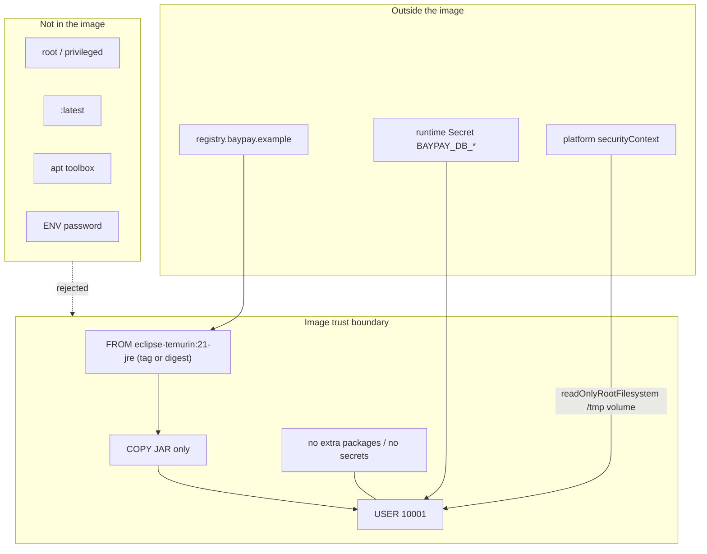

# SECURITY-903 — Harden container

**Type:** SECURITY  
**Module:** 09 — Containers for Java  
**Duration:** 60–90 minutes  
**Cost:** $0  
**Lessons:** L-9.5, L-9.7  
**Diagram:** AEJE-D-040 (Container trust boundary)  
**Cluster notes:** [datasets/baypay-k8s/CLUSTER.md](../../datasets/baypay-k8s/CLUSTER.md)  
**Worksheet:** [student/worksheets/PF-container.md](../../student/worksheets/PF-container.md)

You may start from your BUILD-901 (or repaired FIX-902) Dockerfile. Docker or Podman is optional. You pass by a hardened file and a checklist.

---

## Scenario

Priya Nair will not sign the Module 10 Deployment until the image has a trust boundary she can explain to a regulator. Sam Okada can pull `eclipse-temurin:21-jre` today; next month `:latest` will not be the same bits. Riley Okonkwo refuses `--privileged` “so the debugger can see everything.” Jordan Voss still wants `curl` and `vim` in the runtime “for the on-call.”

Harden `payment-service` so a reviewer can see: non-root, no secrets in layers, a pinned JRE (digest, or at least tag `21-jre` never `latest`), no extra packages, a written read-only root note, and no privileged flag.

---

## Business context

Avery Chen’s payment body includes account identifiers. The container that accepts that POST is a PCI-adjacent teaching surface even though this course is fictional. A root shell, a password in `docker history`, and a writable system image are three different ways the same replica becomes evidence.

Module 10 will schedule this image in `baypay-prod` with Secret `baypay-db` (`BAYPAY_DB_USER`, `BAYPAY_DB_PASSWORD`). If those values are already in the image, the kube Secret is theater. If the process is root, `readOnlyRootFilesystem` is theater. Harbor Market does not want a Sev-2 because someone added `apt-get install sudo`.

---

## Learning objectives

- Start from a working BUILD-901-shaped Dockerfile and tighten the trust boundary.
- Keep `USER 10001`. Reject `USER root` and reject privileged runtimes.
- Guarantee no secret `ENV`/`ARG` values. Config stays `BAYPAY_DB_*` at start.
- Pin the runtime base: digest preferred; tag `eclipse-temurin:21-jre` is the lab minimum; `:latest` is a fail.
- Drop extra packages (no on-call toolbox in the JRE stage).
- Write a short note: how the platform sets a read-only root filesystem and still gives Java a writable `/tmp`.
- Record the boundary on AEJE-D-040 and on PF-container.md.

---

## Architecture

Course diagram **AEJE-D-040** is this boundary. Until the PNG is on disk, use the mermaid below plus CLUSTER.md.



Alt text: The payment image boundary is a pinned JRE, a JAR copy, UID 10001, and no secrets. Privileged, latest, extra packages, and password ENV sit outside and are rejected. Runtime secrets and a read-only root policy come from the platform.

The Dockerfile cannot set Kubernetes `privileged: false` by itself. You still write the **note** so Module 10 does not invent `--privileged`.

---

## Prerequisites

- BUILD-901 Dockerfile attempted (or FIX-902 repair).
- CLUSTER.md image contract.
- L-9.5 / L-9.7 if present.
- No AWS. No cluster required.

---

## Environment setup

```bash
test -f labs/BUILD-901/starter/Dockerfile && echo "901 starter present"
mkdir -p /tmp/aeje-security-903
```

Copy **your** BUILD-901 working file (preferred) or start from the BUILD-901 starter and re-apply the multi-stage contract:

```bash
cp /tmp/aeje-build-901/Dockerfile /tmp/aeje-security-903/Dockerfile
# or edit a new file labs/SECURITY-903/Dockerfile in your notes folder
```

Optional engine (not required):

```bash
# docker build ... && docker inspect --format '{{.Config.User}}' <tag>
# docker history --no-trunc <tag> | grep -i password && echo "fail"
```

Do not open `solutions/SECURITY-903/` until the checklist is green.

---

## Challenge/tasks

1. **Baseline.** Open your BUILD-901 Dockerfile. Confirm two stages, `21-jre` runtime, `EXPOSE 8080`, `USER 10001`, Maven Wrapper build.
2. **Non-root.** Keep `USER 10001`. Do not add a later `USER root` “for chmod.” If you must `chmod` the JAR, do it in the build stage or as root **before** the final `USER`.
3. **No secrets in layers.** Grep your file for `PASSWORD`, `SECRET`, `TOKEN`, `changeme`. Those literals must not appear as values. Comments that say “do not put a password here” are fine.
4. **Pin the base.** Production: `eclipse-temurin:21-jre@sha256:<digest>`. Lab: `eclipse-temurin:21-jre` is acceptable if you **write the digest rule** on the worksheet. `:latest` is not acceptable.
5. **Drop extra packages.** No `apt-get install` in the runtime stage. No `curl`, `vim`, `sudo`, `python`, or “just one debug shell.” The JRE image is the toolbox.
6. **Read-only root note.** In the worksheet (and a Dockerfile comment is allowed), state that the **platform** should set `readOnlyRootFilesystem: true` and mount a writable volume at `/tmp` (Spring and the JVM write temp files). The Dockerfile does not have to implement the kube field.
7. **No privileged.** Write an explicit sentence: this image is not run with `--privileged` or `privileged: true`. Do not add a lab script that uses those flags.
8. **Parseable file.** `FROM`, `WORKDIR`, `COPY`, `USER` present. Runtime copies the JAR only.
9. **Checklist only.** Optional `docker build` / `trivy` / `podman` is extra. Passing never depends on a scanner license.

---

## Validation

- [ ] Runtime user is `10001`, not root.
- [ ] No secret values in the Dockerfile.
- [ ] Runtime base is `eclipse-temurin:21-jre` or that image **plus** a digest. Not `:latest`.
- [ ] No extra package installs on the runtime stage.
- [ ] Written note: read-only root filesystem + writable `/tmp`.
- [ ] Written note: not privileged.
- [ ] `FROM` / `WORKDIR` / `COPY` / `USER` present.
- [ ] `EXPOSE 8080` present.
- [ ] Worksheet **secrets** and **user** sections filled.
- [ ] No `-Xmx` equal to a memory limit (do not add that “hardening”).
- [ ] Docker not required to pass.

Instructor scores with [instructor/rubrics/SECURITY-903.md](../../instructor/rubrics/SECURITY-903.md).

---

## Troubleshooting

| Symptom | What to check |
|---|---|
| You “pinned” `:latest` because the digest is long | `:latest` is not a pin. Use `21-jre` or a digest. |
| Added `apt-get upgrade && apt-get install curl` | That is a new attack surface and a larger image. Remove it. |
| `USER 10001` then `COPY` that fails as non-root | Reorder: copy as root, then `USER`. |
| Password in a comment as the real value | Comments are in the file reviewers grep. Do not paste secrets there either. |
| Wanted `--privileged` so a volume mounted | Privileged is not how you get `/tmp`. Use a volume / emptyDir. |
| Optional scanner not installed | Skip it. The checklist is the grade path. |
| Confused with Module 10 YAML | You write the **note** now; you write the Deployment later. |

---

## Expected outcome

A hardened Dockerfile plus PF-container.md sections a Staff engineer can read in five minutes: who the process is, what is not in the layers, how the base is pinned, and what the platform must not enable.

---

## Interview questions

1. Why is a tag that is not `latest` still weaker than a digest?
2. What does `readOnlyRootFilesystem` break if `/tmp` is not mounted?
3. Why is `curl` in a payment runtime a security finding, not a convenience?
4. If the kube Secret is correct but `ENV BAYPAY_DB_PASSWORD` is in the image, who won?

---

## Architecture/trade-off questions

1. Distroless or `21-jre` versus a company gold Ubuntu image with a CIS profile — what evidence do you owe either way?
2. Digest pins versus automated rebuilds when Temurin publishes a CVE fix — who owns the bump?
3. Dropping a shell from the image versus keeping `sh` for `kubectl exec` debugging — what is BayPay’s default and why?
4. Image hardening versus Service Mesh mTLS — which problem does this lab actually close?

---

## Cleanup

No cloud resources. Delete `/tmp/aeje-security-903` if you used it. Do not push a local tag to a public registry. Optional images may be removed:

```bash
rm -rf /tmp/aeje-security-903
```

---

## Cost estimate

**$0.** Files and a checklist. No AWS. No paid image scanner. No required Docker. Optional local pulls stay on your machine.

---

## Hidden/revealable solution

Attempt the checklist on **your** hardened file first. The instructor copy lives in `solutions/SECURITY-903/`.

<details>
<summary>Reveal checklist — after you have edited</summary>

Required: `USER 10001`; no password literals; runtime `eclipse-temurin:21-jre` (digest optional, `:latest` forbidden); no runtime `apt-get`; comments or worksheet note for read-only root + `/tmp` and for not privileged. If any fail, fix your file before you read `solutions/`.

</details>

---

## What you learned

Hardening is a boundary: identity, pins, packages, secrets, and privileges. The JRE stage is not a workstation. The platform must continue the story (read-only root, no privileged) or the Dockerfile’s `USER` is only half a control.

---

## Portfolio deliverable

Finish the **user** and **secrets** sections of [PF-container.md](../../student/worksheets/PF-container.md), plus the hardening checklist on that page. Cite AEJE-D-040. Attach the hardened Dockerfile. Together with BUILD-901 this is the Module 9 portfolio artifact (“Container architecture and hardened Dockerfile”).
