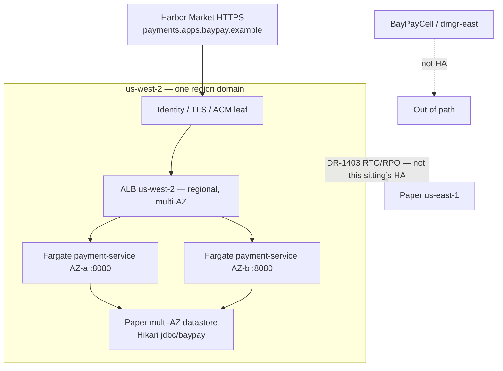

# Portfolio worksheet — System design (interview)

**Artifact:** Module 16 / [INTERVIEW-1604](../../labs/INTERVIEW-1604/README.md) · loop addendum [INTERVIEW-1605](../../labs/INTERVIEW-1605/README.md)  
**Course:** Advanced Enterprise Java Engineering  
**Case study:** BayPay Financial Services (fictional)  
**Literacy diagrams:** AEJE-D-064 (99.99% failure domains) · modular monolith (Module 3 / `reference-apps/baypay`)  
**Rounds:** [datasets/baypay-interview/ROUNDS.md](../../datasets/baypay-interview/ROUNDS.md)  
**Trust notes:** [datasets/baypay-security/TRUST.md](../../datasets/baypay-security/TRUST.md)  
**Ops notes:** [datasets/baypay-ops/OBSERVABILITY.md](../../datasets/baypay-ops/OBSERVABILITY.md)

Use this sheet as the **Module 16 portfolio artifact** (system-design response). Fill every scored section in your own words. Do not paste instructor solution text. Do not put PAN, CVV, access keys, or `BAYPAY_DB_PASSWORD` in this file. Do not apply AWS. Do not call Amazon Bedrock. A BayLearn interview UI is not required.

Pick **exactly one** design prompt for INTERVIEW-1604. INTERVIEW-1605 may add a dated loop addendum without replacing the decision.

---

## 1. Identity

| Field | Your answer |
|---|---|
| Your name | |
| Date | 2026-09-07 |
| Path (`files only` — required) | **files only** — this page. No ACM / Route 53 / RDS / NAT / EKS / `us-east-1` apply. |
| Region for the paper design (must be `us-west-2` if AWS is named) | **`us-west-2`** |
| Demo customer (Avery Chen `11111111-1111-1111-1111-111111111111`, account `…221`) | Avery Chen `…1111` / active `…221` (frozen `…222` must not authorize) |
| Example payment you cited (`c1604d44-…` / `c1605e55-…` / other) | 1604 `c1604d44-…1604`; 1605 loop **`c1605e55-0000-4000-8000-111111111605`** |
| Prompt chosen (`99.99% create` **or** `monolith vs extract`) | **`99.99% create`** |
| Reference commit or branch | Downloads workspace; `solutions/INTERVIEW-1604/` and `solutions/ARCHITECT-1401/` not pasted |
| Partner / self-timed? | Self; paper sitting |

---

## 2. Mode log (optional 1601–1603, required 1605)

| Slot | Mode | Clock | Ids or class | Notes (one line) |
|---|---|---|---|---|
| Practice / timed | INTERVIEW-1601 | **yes — IQ-064 ~8 min** | `AEJE-IQ-012` JVM, `064` AWS, `086` Prod, `031` WAS | Wrote two maturities **before** `--reveal`. Notes: `labs/INTERVIEW-1601/work/answers.md`. |
| Rapid fire **or** troubleshooting | 1602 rapid-fire **and** 1603 troubleshooting | 60–90s × 10 · 1603 written | `--count 10 --seed 16` · class **A HTTPS** | 1602: `labs/INTERVIEW-1602/work/rapid.md`. 1603: `labs/INTERVIEW-1603/work/method.md`. |
| Design (this page) | INTERVIEW-1604 + **1605 slice** | ~8 min spoken | **99.99% create** | Loop: `labs/INTERVIEW-1605/work/loop.md`. Extract still not this sitting. |

Sitting start (UTC) if INTERVIEW-1605: **2026-09-07T19:10:38Z**  
Sitting end (UTC) if INTERVIEW-1605: **2026-09-07T19:12:00Z** (same day / one block)

---

## 3. Requirements (6–10 bullets)

Cite Avery’s `POST /api/v1/payments`, idempotency, frozen `…222` if relevant, TLS at the edge, `:8080` + Actuator, leftover ND **out of path**, `$0` / no-apply constraint, operated SLO **99.9%** unless you write a contract change.

- Avery Chen `POST /api/v1/payments` for `c1604d44-…1604` on `payments.apps.baypay.example` (HTTPS). Same `Idempotency-Key` + body must not debit `…221` twice.
- Frozen `…222` fail-closed in accounts — not a skip because the call is “internal.”
- TLS at the ALB; task is HTTP **`8080`**. Health: `/actuator/health/liveness` and `/actuator/health/readiness`. Jump-box 200 ≠ merchant handshake.
- `PaymentCluster` / `dmgr-east` **out of path** — leftover ND is not HA and not a new JVM.
- Paper only this sitting: **$0**, no NAT / EKS / multi-AZ RDS / ACM / Route 53 / `us-east-1` apply.
- Architecture goal **99.99%** (~52 min/year). Operated SLO stays **99.9%** (~43 min/month) unless Priya + Finance sign a contract.
- Labels stay coarse (`uri`, `method`, `outcome`, `status`). No `customerId` / `Idempotency-Key` / PAN on metrics.
- ECS/Fargate teaching home; EKS/OpenShift valid if already the estate — not applied here.

---

## 4. Drawing

Paste mermaid or labeled boxes. Prompt 1: task / AZ / ALB / identity-TLS / datastore / region. Prompt 2: modules inside `payment-service` and the hop you would or would not buy.

Alt text (one sentence): Merchants handshake HTTPS at the teaching host; a multi-AZ ALB in us-west-2 spreads payment-service tasks in two AZs onto a paper datastore; the whole drawing is one region; leftover ND is marked out of path.

---

## 5. This-quarter decision

**Prompt 1 — payment create at 99.99%**

| Domain | What fails | Merchant symptom | Survives multi-AZ single-region? | What still kills ~52 min/year |
|---|---|---|---|---|
| Task | One JVM OOM/crash; `desired_count=1` | Late or dropped create until replace | **Yes** if count ≥ 2 and ALB health on 8080 | One fat JVM (`-Xmx` = cgroup) or count=1 |
| AZ | `us-west-2a` (or one subnet) gone | Timeout / 5xx if all tasks live there | **Yes** if tasks + ALB in ≥2 AZs | Everything in one AZ |
| ALB / edge | Regional balancer or DNS name | Cannot reach the host / empty TG | Multi-AZ **and still regional** | ALB/DNS/region object down |
| Identity / TLS | Leaf, validation, IAM, `alias/baypay-payments` | HTTPS fail; `:8080` can still 200 | In-region pages / least privilege | Forgotten leaf / failed handshake for a day |
| Datastore | Teaching Postgres / Hikari writer | Stall or 5xx if writer AZ dies | **Paper** multi-AZ — do not apply RDS | Single-AZ writer |
| Region | `us-west-2` gone | Authorize stops | **No** | 60–90 min region loss **overdraws the year** → DR, not “add a region” as HA |

Fifty-two minutes (one paragraph): what fits, what overdraws. Contrast Module 13 **99.9%**.

99.99% is ~**52 minutes/year**. That **fits** a replaced task and a short AZ blip if we are already multi-AZ. It **overdraws** on a 90-minute region loss, a leaf merchants cannot handshake for a day, or a single-AZ datastore. A 30-minute ALB misconfig plus a 25-minute IAM outage **spends the year**. Module 13 still operates **99.9%** (~43 minutes / 30-day month) on the same create SLI — monthly ops vs yearly architecture. I will not relabel the Grafana tile.

Multi-AZ single-region sketch (4–6 sentences): why this **is** allowed to be the 99.99% design. Why “just add a region” is not the only answer.

This quarter: ECS/Fargate `desired_count` ≥ 2 in **two AZs**, multi-AZ ALB, paper multi-AZ Postgres, TLS at `payments.apps.baypay.example`, health on **8080**. That **is** four nines as a *design*. `us-east-1` is **RTO/RPO** (TRUST.md starts authorize at 60 minutes) — geography and split-brain cost, not a forgotten leaf or `desired_count=1`. Jordan’s “just add a region” is the wrong *only* answer.

**Prompt 2 — modular monolith vs extract**

| Module | In-process today? | Extract this quarter? (yes/no) | Criterion that was or was not met |
|---|---|---|---|
| payments | | | |
| refunds | | | |
| posting / `transaction-worker` | | | |
| notification | | | |

Decision (4–8 sentences): stay monolith **or** extract **one** thing. What network trust boundary you refuse to buy without a criterion. Why “always microservices” fails.

**Not this sitting.** Pointer: I would **keep** the Java 21 / Boot 3.5.5 modular monolith this quarter unless Priya can show posting CPU or a queue that harms the HTTP SLO, and unless idempotency survives a hop. “Always microservices” is not a design. Extract is a later sitting, not a second half-page here.

---

## 6. Trade-offs (at least three)

| Option A | Option B | Who pays | This-quarter pick |
|---|---|---|---|
| Multi-AZ single-region 99.99% *design* | Pilot-light / warm `us-east-1` | Idle second stack vs one-region residual | **A** for four nines; **B** is DR (not this apply) |
| Operated SLO 99.9% (~43 min/mo) | Operated 99.99% (~4 min/mo) | Page noise / Finance contract | **Stay 99.9%** unless Priya + Finance sign |
| ECS/Fargate teaching home | Apply EKS/NAT “for honesty” | CP bill + lab failure | **Fargate named**; EKS/OpenShift if already home — **no apply** |

ECS/Fargate vs EKS vs OpenShift (one paragraph, paper only — do not apply):

**Fargate** this quarter: no kube CP to staff, task 8080 + ALB. **EKS** when the estate already runs kube and we will own the CP at 03:00. **OpenShift** when Route/SCC is already home. I will not apply EKS or NAT in this lab. I will not dual-home IHS + ALB. Leaving `BayPayCell` is the modernization, not collecting platforms.

Operated SLO: still **99.9%**? If you would change it, who signs and what is the new monthly budget?

**Still 99.9%.** A 99.99% *operated* SLO is ~**4 minutes/month**. Who would sign: Priya Nair + Finance, in writing, after the design is actually multi-AZ and TLS is paged. Not this 90-minute paper sitting.

---

## 7. Refusals

| Refusal | Your sentence |
|---|---|
| No `terraform apply` / NAT / EKS / multi-AZ RDS / ACM / Route 53 / `us-east-1` in this lab | Paper datastore and paper secondary. An apply is a **lab failure**, not honesty. |
| `PaymentCluster` / `dmgr-east` is not HA and not a new extract target | Source estate (Module 6). Failover to the cell is a finding. ND-in-Docker is not a platform. |
| No Amazon Bedrock design | My boxes, my decision. A model dump is not the spoken answer. |
| No BayLearn portal required | Phase A is this page. |
| No PAN / live password / Avery on a metric label | `c1604d44-…1604` in logs + `traceparent`. Labels stay coarse. |
| No invented 101st interview question | Bank stays 100. |

---

## 8. Staff spoken slice (6–8 sentences)

Four nines this quarter is **multi-AZ single-region `us-west-2`**: ALB across AZs, Fargate `desired_count` ≥ 2, paper multi-AZ datastore, HTTPS on `payments.apps.baypay.example`, health on **8080**. Avery’s `c1604d44-…1604` still needs `Idempotency-Key` and frozen `…222` — the scheduler does not authorize. Identity/TLS is a domain: jump-box `:8080` can 200 while Harbor Market cannot POST. A 60-minute region loss **overdraws** the ~52-minute year; that is **DR**, not “add `us-east-1` so we hit four nines.” Operated SLO stays **99.9%** unless Priya and Finance change the contract. I will not apply NAT/EKS/RDS, and I will not put `PaymentCluster` back as HA. Extracting five JVMs is **not this sitting**.

---

## 9. INTERVIEW-1605 loop addendum (if you sat the full mock)

| Field | Your answer |
|---|---|
| What you cut when the mode switched to rapid fire or troubleshooting | Principal/Staff novels. IQ-099 became “ADR no — design slice later.” Depth is not the grade. |
| Timed item id + elapsed minutes | **AEJE-IQ-093 ~8 min** (plus IQ-087 untimed two-voice) |
| Symptom class **or** rapid-fire seed | Rapid fire **`--count 10 --seed 17`** (not 1603 this loop) |
| What you would still say in an 8-minute design slice | Multi-AZ single-region `us-west-2` **is** 99.99%; region is DR; tile stays **99.9%**; no apply; no `PaymentCluster`; Avery `c1605e55-…1605`. |
| Lucky RCA you refused to treat as proven (if troubleshooting) | Mid-slot was rapid fire. Still refused hallway titles (IQ-038: symptom class, not an instructor RCA). |

---

## Honesty

- [x] I did not open `solutions/INTERVIEW-1604/` or `solutions/INTERVIEW-1605/` before attempting the design
- [x] I did not paste `solutions/ARCHITECT-1401/` or other instructor tables as my narrative
- [x] I chose **one** prompt and wrote a this-quarter decision
- [x] Every availability or extract claim has a source (TRUST.md, OBSERVABILITY.md, this page, or a brief I opened)
- [x] I did not put PAN, an access key, a private key, or a live password in this file
- [x] I did not apply AWS, bounce `dmgr-east`, or disable TLS
- [x] I did not require Amazon Bedrock, a BayLearn UI, NAT, EKS, or OpenSearch to pass
- [x] If I sat INTERVIEW-1605, the three slots have timestamps from one sitting
- [x] I did not add a 101st bank question or a second `questions.json`
