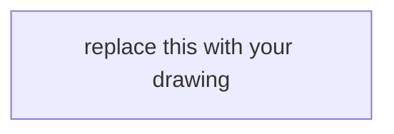

# Portfolio worksheet — System design (interview)

**Artifact:** Module 16 / [INTERVIEW-1604](../../labs/INTERVIEW-1604/README.md) · loop addendum [INTERVIEW-1605](../../labs/INTERVIEW-1605/README.md)  
**Course:** Advanced Enterprise Java Engineering  
**Case study:** BayPay Financial Services (fictional)  
**Literacy diagrams:** AEJE-D-064 (99.99% failure domains) · modular monolith (Module 3 / `reference-apps/baypay`)  
**Rounds:** [datasets/baypay-interview/ROUNDS.md](../../datasets/baypay-interview/ROUNDS.md)  
**Trust notes:** [datasets/baypay-security/TRUST.md](../../datasets/baypay-security/TRUST.md)  
**Ops notes:** [datasets/baypay-ops/OBSERVABILITY.md](../../datasets/baypay-ops/OBSERVABILITY.md)

Use this sheet as the **Module 16 portfolio artifact** (system-design response). Fill every scored section in your own words. Do not paste instructor solution text. Do not put PAN, CVV, access keys, or `BAYPAY_DB_PASSWORD` in this file. Do not apply AWS. Do not call Amazon Bedrock. A BayLearn interview UI is not required.

Pick **exactly one** design prompt for INTERVIEW-1604. INTERVIEW-1605 may add a dated loop addendum without replacing the decision.

---

## 1. Identity

| Field | Your answer |
|---|---|
| Your name | |
| Date | |
| Path (`files only` — required) | |
| Region for the paper design (must be `us-west-2` if AWS is named) | |
| Demo customer (Avery Chen `11111111-1111-1111-1111-111111111111`, account `…221`) | |
| Example payment you cited (`c1604d44-…` / `c1605e55-…` / other) | |
| Prompt chosen (`99.99% create` **or** `monolith vs extract`) | |
| Reference commit or branch | |
| Partner / self-timed? | |

---

## 2. Mode log (optional 1601–1603, required 1605)

| Slot | Mode | Clock | Ids or class | Notes (one line) |
|---|---|---|---|---|
| Practice / timed | | 8 min item? | | |
| Rapid fire **or** troubleshooting | | | `--count 10` **or** HTTPS / P99 class | |
| Design (this page) | INTERVIEW-1604 / 1605 slice | | Prompt above | |

Sitting start (UTC) if INTERVIEW-1605:  
Sitting end (UTC) if INTERVIEW-1605:

---

## 3. Requirements (6–10 bullets)

Cite Avery’s `POST /api/v1/payments`, idempotency, frozen `…222` if relevant, TLS at the edge, `:8080` + Actuator, leftover ND **out of path**, `$0` / no-apply constraint, operated SLO **99.9%** unless you write a contract change.

-

---

## 4. Drawing

Paste mermaid or labeled boxes. Prompt 1: task / AZ / ALB / identity-TLS / datastore / region. Prompt 2: modules inside `payment-service` and the hop you would or would not buy.

Alt text (one sentence):

---

## 5. This-quarter decision

**Prompt 1 — payment create at 99.99%**

| Domain | What fails | Merchant symptom | Survives multi-AZ single-region? | What still kills ~52 min/year |
|---|---|---|---|---|
| Task | | | | |
| AZ | | | | |
| ALB / edge | | | | |
| Identity / TLS | | | | |
| Datastore | | | | |
| Region | | | | |

Fifty-two minutes (one paragraph): what fits, what overdraws. Contrast Module 13 **99.9%**.

Multi-AZ single-region sketch (4–6 sentences): why this **is** allowed to be the 99.99% design. Why “just add a region” is not the only answer.

**Prompt 2 — modular monolith vs extract**

| Module | In-process today? | Extract this quarter? (yes/no) | Criterion that was or was not met |
|---|---|---|---|
| payments | | | |
| refunds | | | |
| posting / `transaction-worker` | | | |
| notification | | | |

Decision (4–8 sentences): stay monolith **or** extract **one** thing. What network trust boundary you refuse to buy without a criterion. Why “always microservices” fails.

*Fill the section that matches your prompt. Leave the other section with “not this sitting.”*

---

## 6. Trade-offs (at least three)

| Option A | Option B | Who pays | This-quarter pick |
|---|---|---|---|
| | | | |
| | | | |
| | | | |

ECS/Fargate vs EKS vs OpenShift (one paragraph, paper only — do not apply):

Operated SLO: still **99.9%**? If you would change it, who signs and what is the new monthly budget?

---

## 7. Refusals

| Refusal | Your sentence |
|---|---|
| No `terraform apply` / NAT / EKS / multi-AZ RDS / ACM / Route 53 / `us-east-1` in this lab | |
| `PaymentCluster` / `dmgr-east` is not HA and not a new extract target | |
| No Amazon Bedrock design | |
| No BayLearn portal required | |
| No PAN / live password / Avery on a metric label | |
| No invented 101st interview question | |

---

## 8. Staff spoken slice (6–8 sentences)

Say the decision to Sam Okada, Priya Nair, Riley Okonkwo, and Jordan Voss in one sitting. Name Avery’s create. Name one trade-off. Name one refusal. Do not put PAN in the answer.

---

## 9. INTERVIEW-1605 loop addendum (if you sat the full mock)

| Field | Your answer |
|---|---|
| What you cut when the mode switched to rapid fire or troubleshooting | |
| Timed item id + elapsed minutes | |
| Symptom class **or** rapid-fire seed | |
| What you would still say in an 8-minute design slice | |
| Lucky RCA you refused to treat as proven (if troubleshooting) | |

---

## Honesty

- [ ] I did not open `solutions/INTERVIEW-1604/` or `solutions/INTERVIEW-1605/` before attempting the design
- [ ] I did not paste `solutions/ARCHITECT-1401/` or other instructor tables as my narrative
- [ ] I chose **one** prompt and wrote a this-quarter decision
- [ ] Every availability or extract claim has a source (TRUST.md, OBSERVABILITY.md, this page, or a brief I opened)
- [ ] I did not put PAN, an access key, a private key, or a live password in this file
- [ ] I did not apply AWS, bounce `dmgr-east`, or disable TLS
- [ ] I did not require Amazon Bedrock, a BayLearn UI, NAT, EKS, or OpenSearch to pass
- [ ] If I sat INTERVIEW-1605, the three slots have timestamps from one sitting
- [ ] I did not add a 101st bank question or a second `questions.json`
