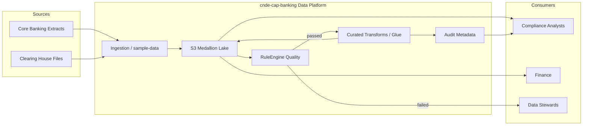
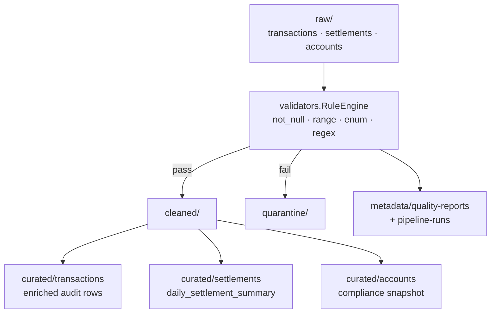
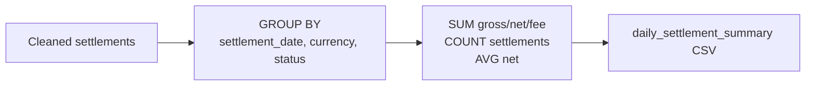
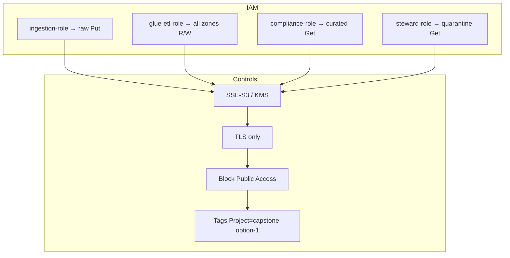

# Architecture Diagrams – Banking Regulatory Data Platform

Project: `cnde-cap-banking` · Capstone Option 1

---

## Context

---

## Component / Medallion Flow

---

## Settlement Aggregation

---

## Security Boundaries

