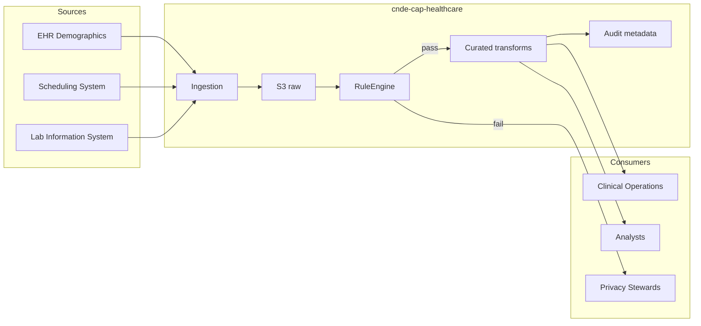
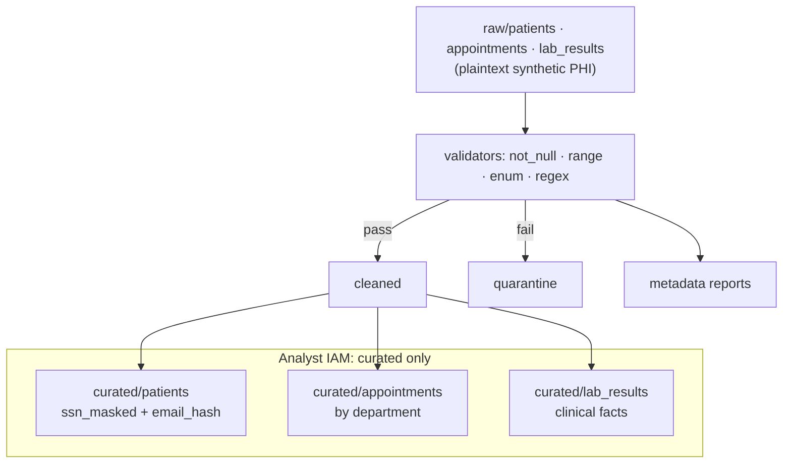
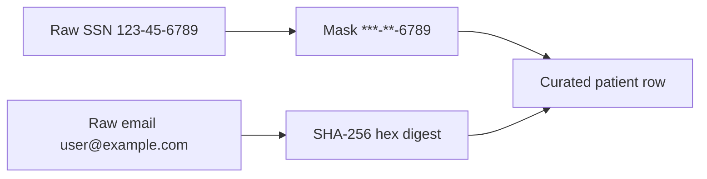
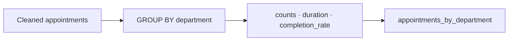

# Architecture Diagrams – Healthcare Analytics Platform

Project: `cnde-cap-healthcare` · Capstone Option 2 · SYNTHETIC data

---

## Context

---

## Medallion + PHI Boundary

---

## Patient Masking Detail

---

## Appointment Aggregation

