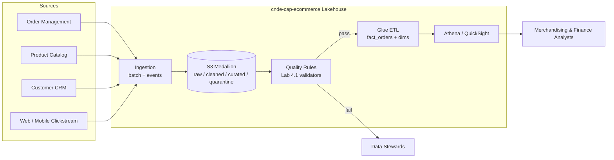
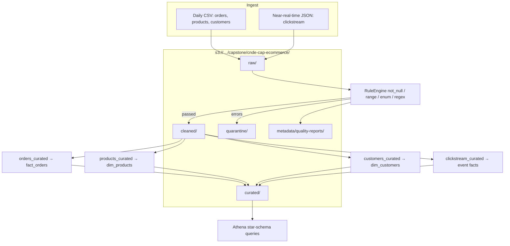
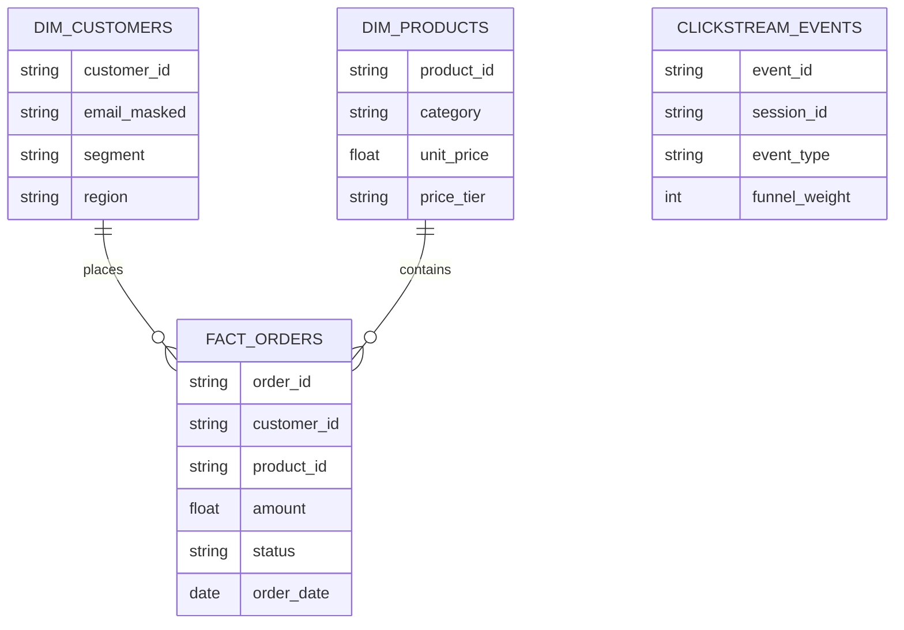
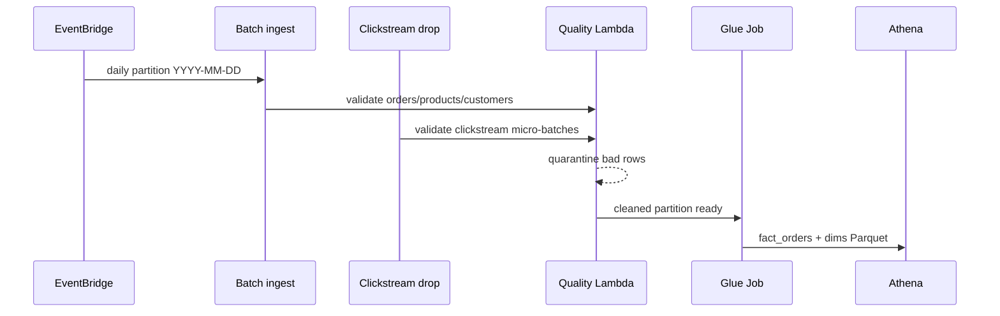

# Architecture Diagrams – Option 3 E-Commerce Analytics Lakehouse

**Project:** `cnde-cap-ecommerce`

## Context

```mermaid
flowchart LR
  subgraph Sources
    OMS[Order Management]
    PIM[Product Catalog]
    CRM[Customer CRM]
    WEB[Web / Mobile Clickstream]
  end

  subgraph Platform["cnde-cap-ecommerce Lakehouse"]
    ING[Ingestion<br/>batch + events]
    S3[(S3 Medallion<br/>raw / cleaned / curated / quarantine)]
    Q[Quality Rules<br/>Lab 4.1 validators]
    ETL[Glue ETL<br/>fact_orders + dims]
    ATH[Athena / QuickSight]
  end

  Analysts[Merchandising & Finance Analysts]
  Ops[Data Stewards]

  OMS --> ING
  PIM --> ING
  CRM --> ING
  WEB --> ING
  ING --> S3
  S3 --> Q
  Q -->|pass| ETL
  Q -->|fail| Ops
  ETL --> ATH
  ATH --> Analysts
```

## Component / data flow

```mermaid
flowchart TB
  subgraph Ingest
    B1[Daily CSV: orders, products, customers]
    B2[Near-real-time JSON: clickstream]
  end

  subgraph S3["s3://…/capstone/cnde-cap-ecommerce/"]
    RAW[raw/]
    CLN[cleaned/]
    CUR[curated/]
    QUA[quarantine/]
    META[metadata/quality-reports/]
  end

  B1 --> RAW
  B2 --> RAW
  RAW --> VAL[RuleEngine not_null / range / enum / regex]
  VAL -->|passed| CLN
  VAL -->|errors| QUA
  VAL --> META
  CLN --> FACT[orders_curated → fact_orders]
  CLN --> DP[products_curated → dim_products]
  CLN --> DC[customers_curated → dim_customers]
  CLN --> CE[clickstream_curated → event facts]
  FACT --> CUR
  DP --> CUR
  DC --> CUR
  CE --> CUR
  CUR --> ATHENA[Athena star-schema queries]
```

## Star schema

```mermaid
erDiagram
  DIM_CUSTOMERS ||--o{ FACT_ORDERS : places
  DIM_PRODUCTS ||--o{ FACT_ORDERS : contains
  FACT_ORDERS {
    string order_id
    string customer_id
    string product_id
    float amount
    string status
    date order_date
  }
  DIM_CUSTOMERS {
    string customer_id
    string email_masked
    string segment
    string region
  }
  DIM_PRODUCTS {
    string product_id
    string category
    float unit_price
    string price_tier
  }
  CLICKSTREAM_EVENTS {
    string event_id
    string session_id
    string event_type
    int funnel_weight
  }
```

## Batch vs event pattern

```mermaid
sequenceDiagram
  participant Scheduler as EventBridge
  participant Batch as Batch ingest
  participant Stream as Clickstream drop
  participant Qual as Quality Lambda
  participant Glue as Glue Job
  participant Ath as Athena

  Scheduler->>Batch: daily partition YYYY-MM-DD
  Batch->>Qual: validate orders/products/customers
  Stream->>Qual: validate clickstream micro-batches
  Qual-->>Qual: quarantine bad rows
  Qual->>Glue: cleaned partition ready
  Glue->>Ath: fact_orders + dims Parquet
```
