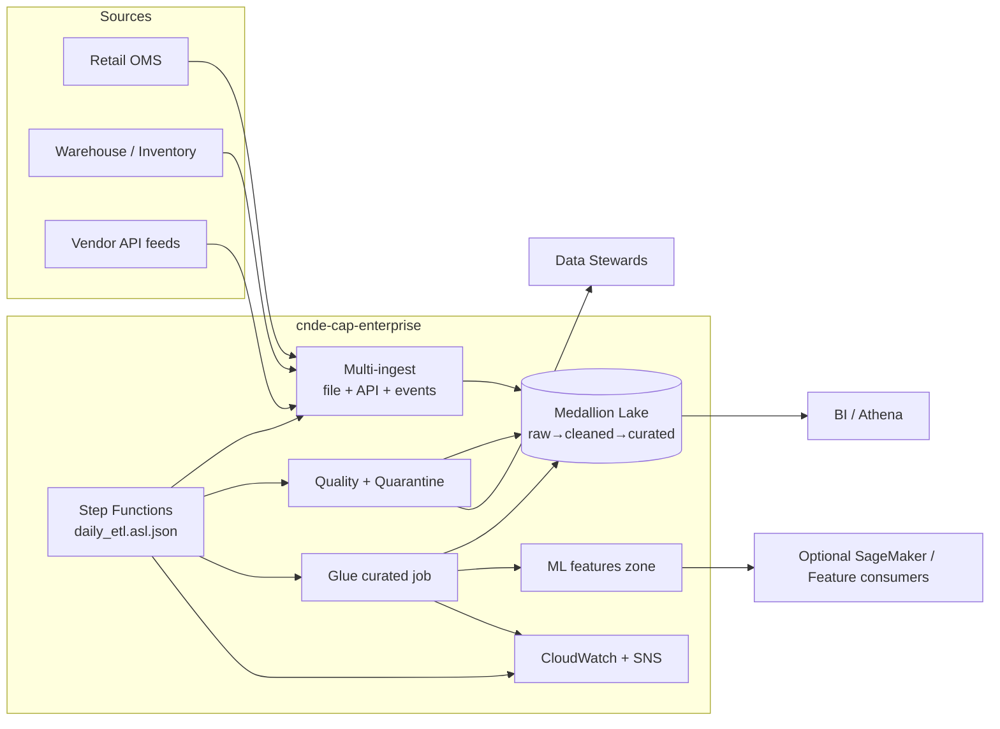
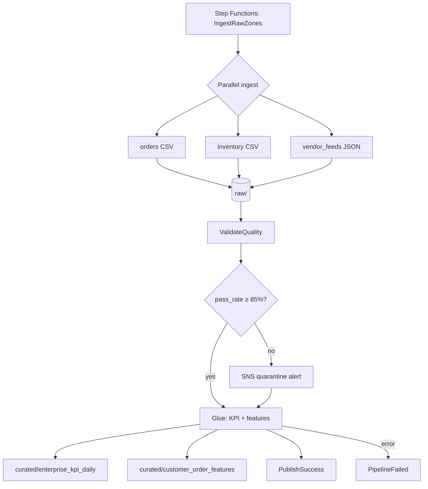
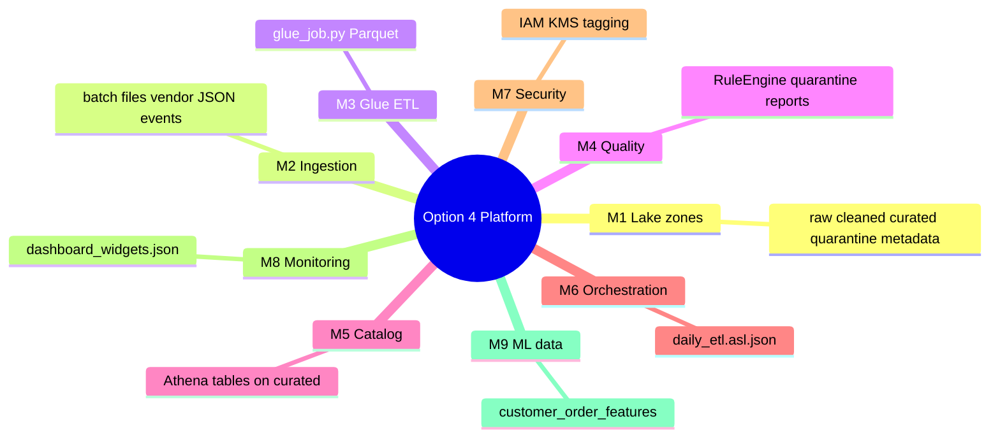
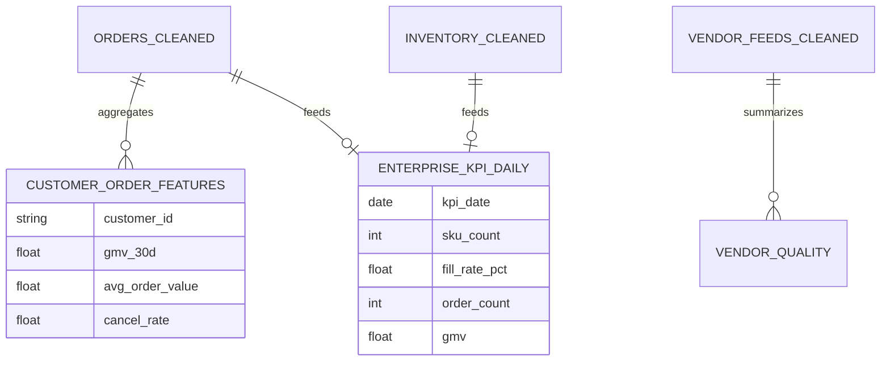

# Architecture Diagrams – Option 4 Enterprise Data Platform

**Project:** `cnde-cap-enterprise`

## Context (full platform)

## Medallion + orchestration

## Module coverage map

## Data products

