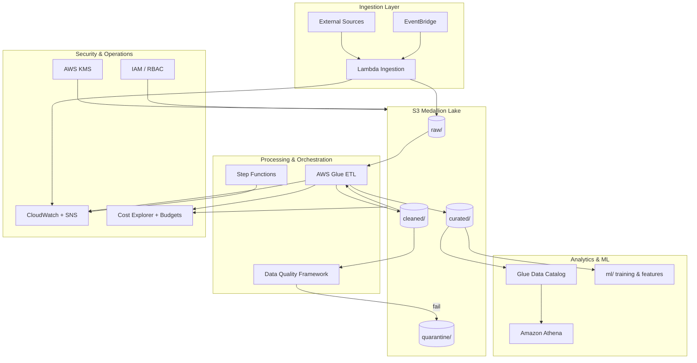
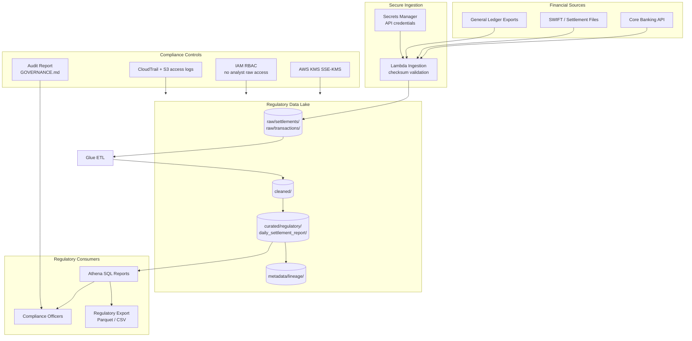
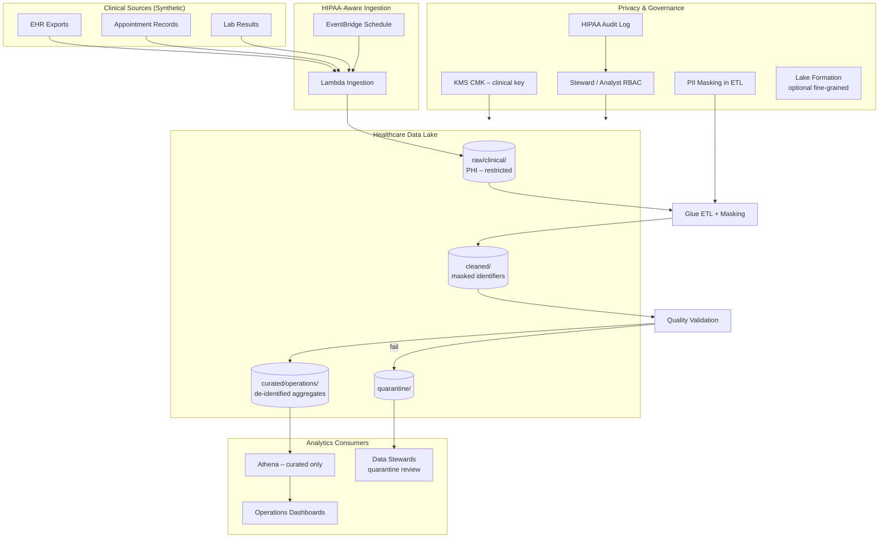
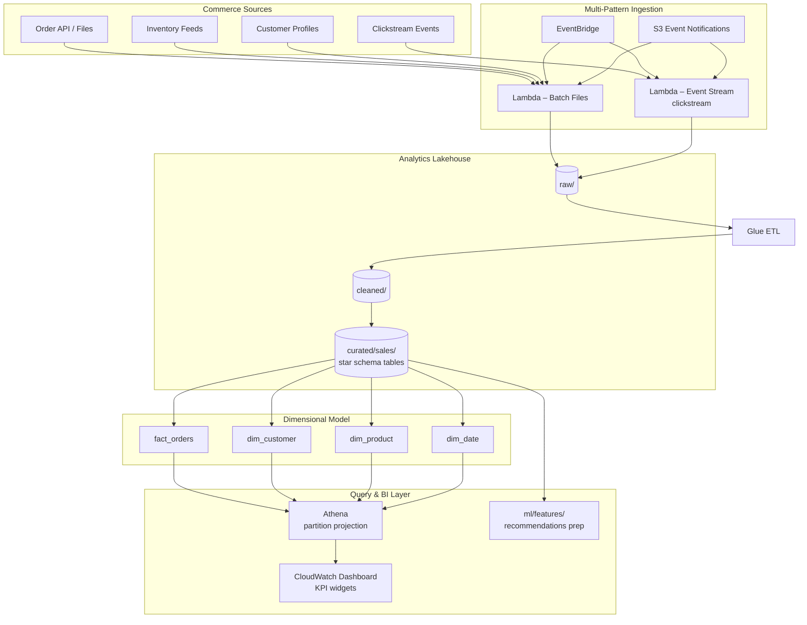
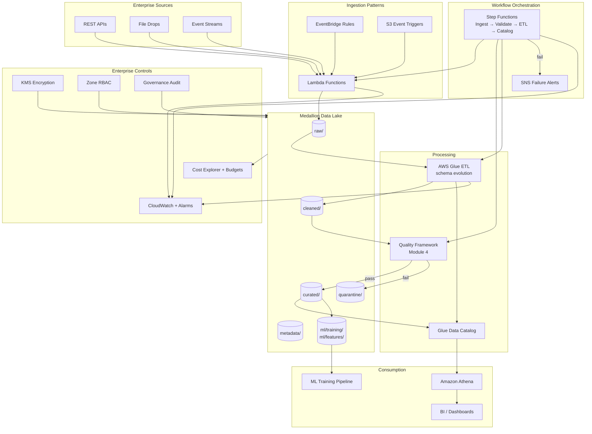

# Capstone Architecture Options

Reference architecture diagrams for the four Module 10 capstone scenarios. Each option extends the course platform (Modules 1–9) with scenario-specific sources, compliance controls, and consumers.

---

## Shared Platform Foundation

All capstone options build on the same cloud-native patterns taught in this course:

---

## Option 1: Banking Regulatory Data Platform

Build a reporting platform for financial settlement and transaction data with audit trails, lineage, and strict access controls for regulatory submissions.

### Architecture Diagram

### Key Components

| Component | Purpose |
|-----------|---------|
| Multi-source ingestion | Settlement files, transaction logs, account summaries |
| Immutable raw zone | Audit-ready source copies with versioning |
| Lineage metadata | `metadata/lineage/` documents transform provenance |
| Encryption + RBAC | KMS + zone-based IAM from Module 7 |
| Regulatory curated models | Daily settlement reports, transaction aggregates |
| Audit trail | CloudTrail + governance audit from Lab 7.3 |

### Data Flows

| Stage | Input | Process | Output |
|-------|-------|---------|--------|
| Ingest | Settlement CSV/API | Validate checksum, timestamp | `raw/settlements/` |
| Clean | Raw transactions | Type coercion, dedup | `cleaned/finance/` |
| Curate | Cleaned data | Regulatory aggregations | `curated/regulatory/daily_settlement_report/` |
| Report | Curated tables | Athena SQL + export | Compliance-ready dataset |
| Audit | All layers | CloudTrail + governance checks | Quarterly audit report |

---

## Option 2: Healthcare Analytics Platform

HIPAA-aware patient analytics with PII masking, strict governance, and operational reporting on synthetic clinical data.

### Architecture Diagram

### Key Components

| Component | Purpose |
|-----------|---------|
| PHI raw zone | Highest sensitivity; engineer/steward access only |
| Masking in cleaned | Tokenize/remove direct identifiers before curated |
| HIPAA governance | Assignment 7 framework + Lab 7.3 audit |
| Quarantine | Failed validation records with 90-day lifecycle |
| De-identified curated | Operational KPIs without PHI |
| Break-glass procedure | Documented emergency access with audit |

### Data Flows

| Stage | Input | Process | Output |
|-------|-------|---------|--------|
| Ingest | Synthetic patient JSON | Secure upload SSE-KMS | `raw/clinical/` |
| Mask | Raw PHI | Hash/tokenize identifiers | `cleaned/clinical/` |
| Validate | Cleaned records | Module 4 quality rules | Pass → curated; Fail → quarantine |
| Curate | Validated data | Appointment/lab aggregates | `curated/operations/` |
| Analyze | Curated only | Athena (analyst role) | Operational reports |

---

## Option 3: E-Commerce Analytics Lakehouse

Customer and sales analytics with star schema, batch + event-driven ingestion, KPI dashboards, and cost-optimized ad-hoc queries.

### Architecture Diagram

### Key Components

| Component | Purpose |
|-----------|---------|
| Dual ingestion | Batch (orders/inventory) + event-driven (clickstream) |
| Star schema | Module 5 fact/dimension tables in curated zone |
| Athena optimization | Partition projection, column pruning (Lab 5.2–5.3) |
| KPI dashboard | CloudWatch + business metrics (Lab 8.1) |
| ML readiness | Feature store + dataset prep (Module 9) |
| Cost controls | Tagged resources + Cost Explorer (Lab 8.3) |

### Data Flows

| Stage | Input | Process | Output |
|-------|-------|---------|--------|
| Batch ingest | Orders, inventory CSV | Lambda → raw | `raw/sales/`, `raw/inventory/` |
| Event ingest | Clickstream JSON | EventBridge → Lambda | `raw/clickstream/` |
| ETL | Raw zones | Glue transform + quality | `cleaned/` → `curated/sales/` |
| Model | Cleaned orders | Star schema build | `fact_orders`, `dim_*` |
| Query | Curated Parquet | Athena SQL | Ad-hoc analytics |
| Monitor | Pipeline metrics | CloudWatch | Revenue/inventory KPIs |

---

## Option 4: Enterprise Data Platform

Full production-grade platform demonstrating every course module: multi-source ingestion, ETL, quality, orchestration, security, monitoring, cost controls, and ML readiness.

### Architecture Diagram

### Key Components

| Layer | Services | Module Reference |
|-------|----------|------------------|
| Storage | S3 medallion zones | Module 1 |
| Ingestion | Lambda, EventBridge, S3 events | Module 2 |
| ETL | Glue jobs, crawlers | Module 3 |
| Quality | Validation, quarantine | Module 4 |
| Modeling | Star schema, Athena | Module 5 |
| Orchestration | Step Functions, SNS failures | Module 6 |
| Security | KMS, IAM RBAC, audit | Module 7 |
| Operations | Dashboards, alerts, cost | Module 8 |
| ML | Dataset prep, features, AI QA | Module 9 |

### Data Flows

| Stage | Input | Process | Output | Orchestration |
|-------|-------|---------|--------|---------------|
| Ingest | API/file/event | Lambda validation | `raw/` | Step Functions step 1 |
| Validate | Raw batch | Quality runner | Pass/fail routing | Step Functions step 2 |
| ETL | Cleaned input | Glue with bookmarks | `curated/` | Step Functions step 3 |
| Catalog | New partitions | Glue crawler | Data Catalog update | Step Functions step 4 |
| Secure | All objects | KMS + bucket policy | Encrypted at rest | Continuous |
| Monitor | Job metrics | CloudWatch alarms | SNS on failure | Event-driven |
| ML prep | Curated tables | Feature + dataset pipelines | `ml/` | Post-ETL trigger |
| Govern | All controls | Audit script | Governance report | Quarterly |

---

## Option Selection Guide

| Criterion | Option 1 Banking | Option 2 Healthcare | Option 3 E-Commerce | Option 4 Enterprise |
|-----------|------------------|---------------------|---------------------|---------------------|
| Primary focus | Regulatory reporting | HIPAA / PII | Analytics + KPIs | Full platform |
| Compliance depth | High (audit trails) | Highest (PHI) | Medium | High (all controls) |
| Ingestion complexity | Multi-file/API | Scheduled clinical | Batch + events | All patterns |
| ML component | Optional | Limited | Recommendations | Full Module 9 |
| Recommended for | Finance background | Healthcare interest | Retail/analytics focus | Portfolio showcase |

---

## Capstone Deliverable Mapping

| Deliverable | Primary Diagram Section |
|-------------|------------------------|
| `docs/ARCHITECTURE.md` | Option-specific diagram + data flows |
| `docs/GOVERNANCE.md` | Options 1, 2, 4 — security controls |
| `docs/COST-ANALYSIS.md` | All options — Cost Explorer integration |
| `architecture/diagrams/` | Export Mermaid renders as PNG for presentation |
