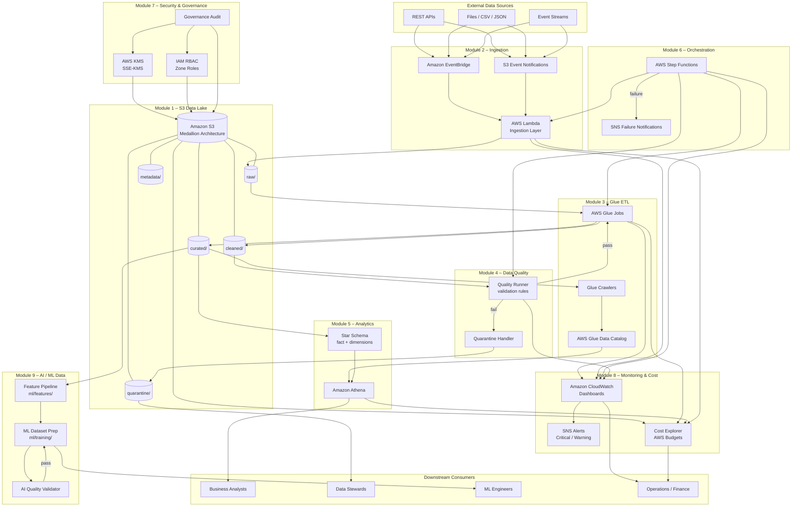
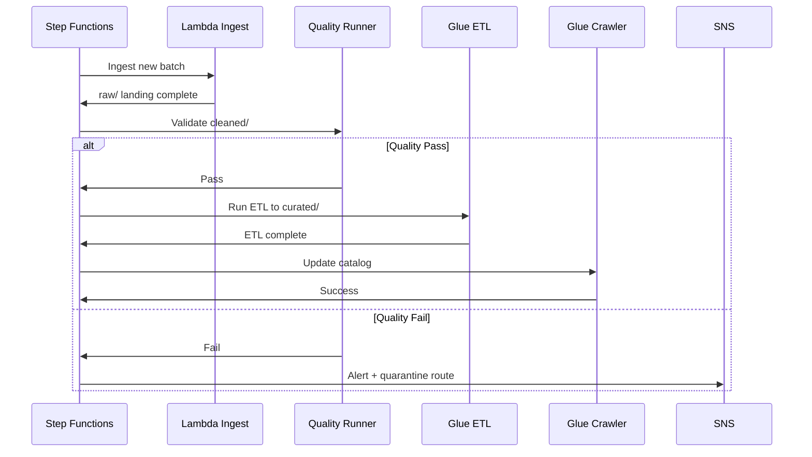
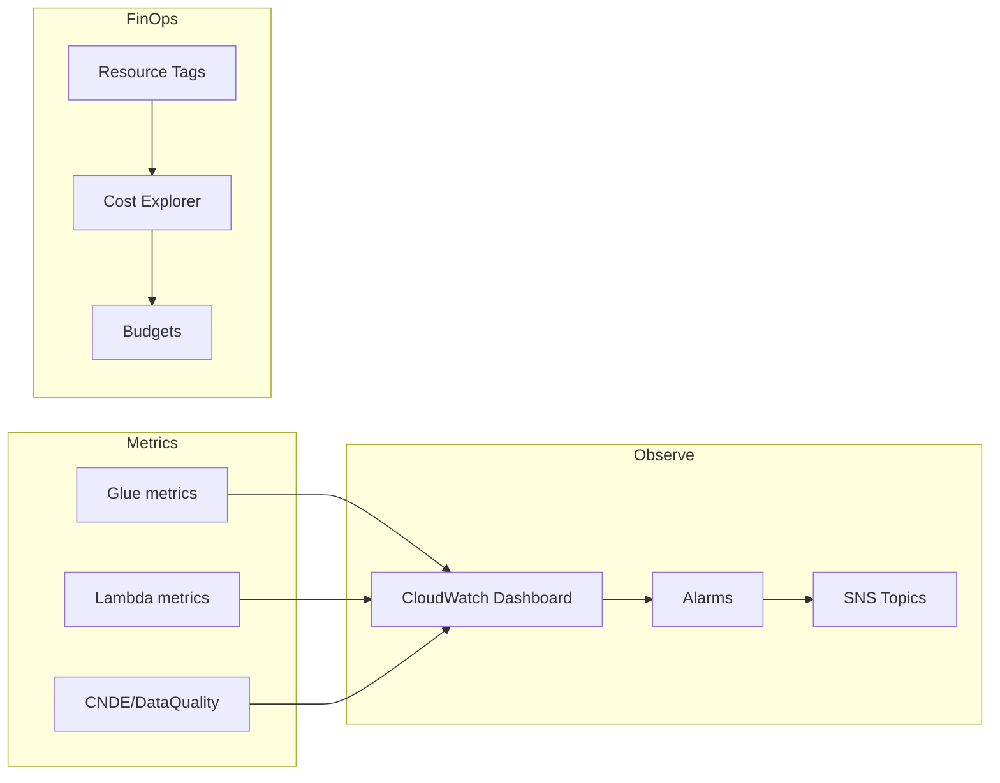
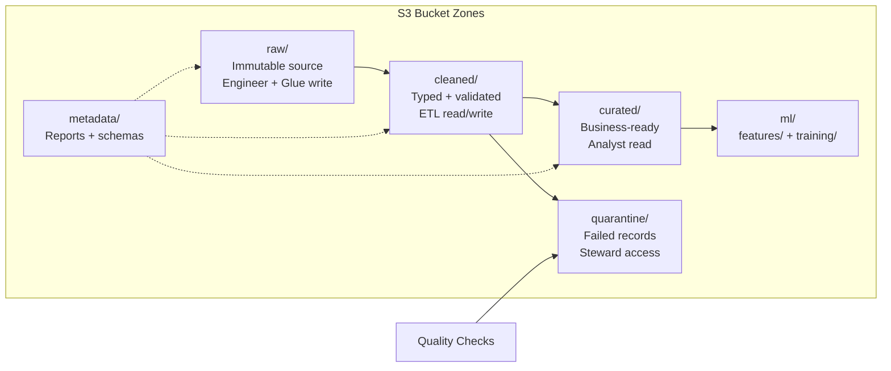

# Course Platform Overview — End-to-End Architecture

Complete architecture of the **Cloud-Native Data Engineering on AWS** platform built across Modules 1–10, showing data flows, AWS services, security boundaries, observability, and ML readiness.

---

## High-Level Platform Diagram



---

## Module Map

| Module | Week | Focus | Primary AWS Services |
|--------|------|-------|---------------------|
| 1 – Foundations | 1 | S3 data lake, zones, Terraform | S3, IAM |
| 2 – Ingestion | 2 | Event-driven ingestion | Lambda, EventBridge, S3 |
| 3 – Glue ETL | 3 | Raw → Cleaned → Curated | Glue, Data Catalog |
| 4 – Data Quality | 4 | Validation, quarantine | Lambda, S3, custom metrics |
| 5 – Modeling | 5 | Star schema, Athena | Athena, Glue Catalog |
| 6 – Orchestration | 6 | Workflow automation | Step Functions, SNS |
| 7 – Security | 7 | KMS, RBAC, audit | KMS, IAM, CloudTrail |
| 8 – Monitoring | 8 | Dashboards, alerts, cost | CloudWatch, SNS, Cost Explorer |
| 9 – AI/ML Data | 9 | Features, ML datasets, AI QA | S3, Python pipelines |
| 10 – Capstone | 10 | Enterprise project | All of the above |

---

## Key Components

| Layer | Component | Description |
|-------|-----------|-------------|
| **Ingestion** | Lambda ingestion functions | Validate and land data in `raw/` |
| **Ingestion** | EventBridge rules | Schedule and route events to targets |
| **Ingestion** | S3 event notifications | Trigger processing on object create |
| **Storage** | S3 medallion zones | raw → cleaned → curated progression |
| **Storage** | Quarantine zone | Isolated failed records for steward review |
| **Storage** | Metadata zone | Schemas, lineage, quality and audit reports |
| **Processing** | Glue ETL jobs | Spark-based transform pipelines |
| **Processing** | Glue crawlers | Discover schemas, update Data Catalog |
| **Quality** | Quality runner | Rule-based validation (Module 4) |
| **Quality** | AI quality validator | ML-specific checks (Module 9) |
| **Catalog** | Glue Data Catalog | Hive-compatible metastore for Athena |
| **Analytics** | Amazon Athena | Serverless SQL on curated Parquet |
| **Orchestration** | Step Functions | Ingest → validate → ETL → notify workflow |
| **Security** | KMS CMK | Encryption at rest for all lake objects |
| **Security** | IAM zone RBAC | Engineer / analyst / steward roles |
| **Governance** | Audit automation | Evidence collection + compliance reports |
| **Observability** | CloudWatch dashboards | Pipeline SLIs and SLO widgets |
| **Observability** | SNS alert topics | Severity-based operational alerts |
| **FinOps** | Cost allocation tags | Project/environment/student showback |
| **FinOps** | AWS Budgets | Proactive spend threshold alerts |
| **ML** | Feature store (S3) | Versioned offline features in `ml/features/` |
| **ML** | Training datasets | Parquet splits in `ml/training/` |
| **IaC** | Terraform modules | Reproducible infrastructure deployment |

---

## End-to-End Data Flows

### Flow 1: Primary Batch Pipeline

| Stage | Module | Input | Process | Output |
|-------|--------|-------|---------|--------|
| 1. Land | 2 | External file/API | Lambda ingestion | `raw/{domain}/{dataset}/` |
| 2. Transform | 3 | Raw data | Glue ETL job | `cleaned/{domain}/` |
| 3. Validate | 4 | Cleaned batch | Quality runner rules | Pass or quarantine |
| 4. Curate | 3 | Validated data | Glue aggregation/modeling | `curated/{domain}/` |
| 5. Catalog | 3 | New partitions | Glue crawler | Data Catalog tables |
| 6. Query | 5 | Curated Parquet | Athena SQL | Analyst results |

### Flow 2: Orchestrated Pipeline (Step Functions)



### Flow 3: Security Envelope

| Control | Module | Enforcement Point |
|---------|--------|-------------------|
| TLS in transit | 7 | S3 bucket policy `DenyInsecureTransport` |
| SSE-KMS at rest | 7 | Default encryption + key policy |
| Zone RBAC | 7 | IAM roles: engineer, analyst, steward |
| Audit evidence | 7 | CloudTrail + automated audit script |
| No public access | 1, 7 | S3 Block Public Access |

### Flow 4: Observability and Cost



### Flow 5: ML Data Pipeline

| Stage | Module | Input | Output |
|-------|--------|-------|--------|
| Feature engineering | 9.2 | `curated/` tables | `ml/features/{group}/v={ver}/snapshot={ts}/` |
| Dataset preparation | 9.1 | Curated + features | `ml/training/{model}/v1/` Parquet splits |
| AI quality gate | 9.3 | train/test Parquet | `ai_quality_report.json` → promote or quarantine |
| Model training | Capstone | S3 training data | SageMaker / external ML platform |

---

## S3 Zone Architecture



---

## Infrastructure Deployment

| Terraform Module | Path | Deployed In |
|------------------|------|-------------|
| S3 Data Lake | `infrastructure/modules/s3-data-lake/` | Module 1 |
| Lambda Ingestion | `infrastructure/modules/lambda-ingestion/` | Module 2 |
| Glue ETL | `infrastructure/modules/glue-etl/` | Module 3 |
| Quality Validation | `infrastructure/modules/quality-validation/` | Module 4 |
| Step Functions | `infrastructure/modules/step-functions/` | Module 6 |
| Monitoring | `infrastructure/modules/monitoring/` | Module 8 |

**Deploy command:** `./scripts/lab-cycle.sh start` (or Terraform in `infrastructure/environments/dev/`)

---

## Lab Architecture Diagram Index

| Module | Lab | Diagram |
|--------|-----|---------|
| 7.1 | KMS & Bucket Policies | [diagram.md](../../modules/module-07-security-governance/labs/lab-7.1-kms-bucket-policies/diagram.md) |
| 7.2 | IAM RBAC Data Zones | [diagram.md](../../modules/module-07-security-governance/labs/lab-7.2-iam-rbac-data-zones/diagram.md) |
| 7.3 | Governance Audit | [diagram.md](../../modules/module-07-security-governance/labs/lab-7.3-governance-audit/diagram.md) |
| 8.1 | CloudWatch Dashboards | [diagram.md](../../modules/module-08-monitoring-ops/labs/lab-8.1-cloudwatch-dashboards/diagram.md) |
| 8.2 | SNS Alerts | [diagram.md](../../modules/module-08-monitoring-ops/labs/lab-8.2-sns-alerts/diagram.md) |
| 8.3 | Cost Reporting | [diagram.md](../../modules/module-08-monitoring-ops/labs/lab-8.3-cost-reporting/diagram.md) |
| 9.1 | ML Dataset Prep | [diagram.md](../../modules/module-09-ai-ml-data/labs/lab-9.1-ml-dataset-prep/diagram.md) |
| 9.2 | Feature Store Pipeline | [diagram.md](../../modules/module-09-ai-ml-data/labs/lab-9.2-feature-store-pipeline/diagram.md) |
| 9.3 | AI Data Quality | [diagram.md](../../modules/module-09-ai-ml-data/labs/lab-9.3-ai-data-quality/diagram.md) |

**Capstone options:** [capstone-architectures.md](./capstone-architectures.md)

---

## Technology Stack Summary

```text
Sources (API, Files, Events)
        │
EventBridge / S3 Events
        │
Lambda Ingestion Layer
        │
S3 Data Lake: Raw → Cleaned → Curated (+ Quarantine)
        │
AWS Glue ETL + Data Quality Framework
        │
Glue Data Catalog → Athena Analytics
        │
Step Functions Orchestration
        │
KMS + IAM RBAC + Governance Audit
        │
CloudWatch Dashboards + SNS Alerts + Cost Explorer
        │
ML Features + Training Data + AI Quality Gates
        │
Capstone Enterprise Platform (Module 10)
```
