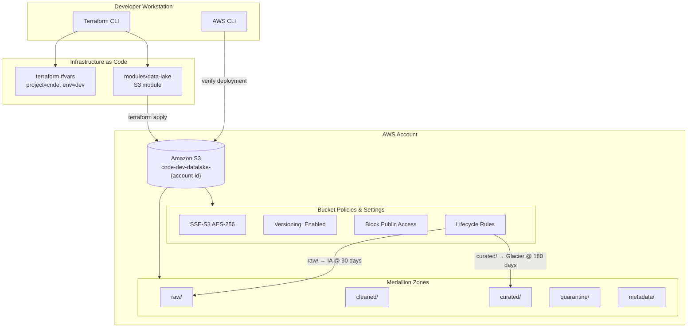
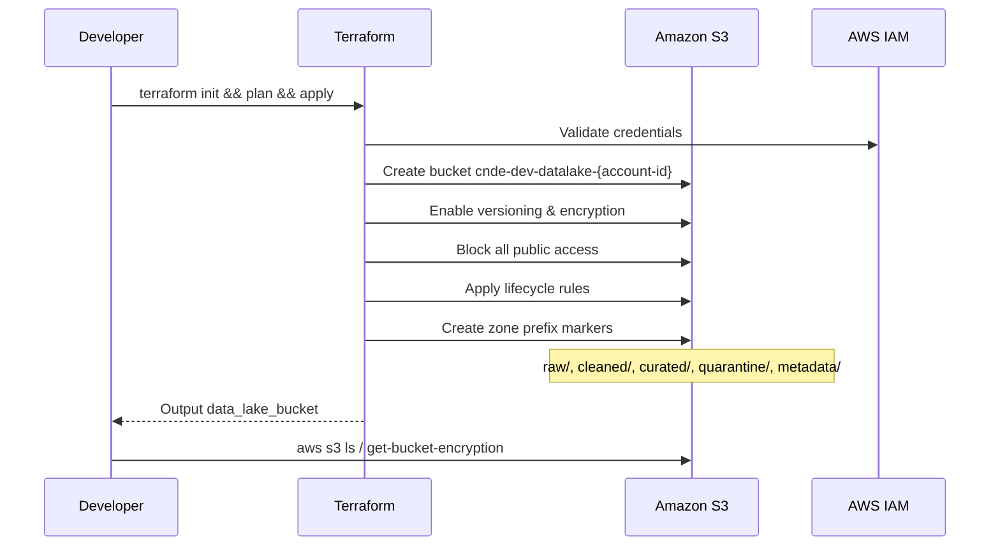

# Lab 1.1 Architecture — Build S3 Data Lake with Terraform

Deploy the RetailCo CNDE data lake foundation on S3 using Infrastructure as Code with encryption, versioning, lifecycle policies, and medallion zone prefixes.

## Infrastructure Overview

## Deployment Sequence

## Key Components

| Component | AWS Service | Purpose |
|-----------|-------------|---------|
| Data Lake Bucket | Amazon S3 | Central storage for RetailCo medallion architecture |
| Zone Prefixes | Amazon S3 | Logical separation of raw, cleaned, curated, quarantine, metadata |
| Server-Side Encryption | Amazon S3 (SSE-S3) | Encrypt all objects at rest with AES-256 |
| Versioning | Amazon S3 | Protect against accidental overwrites and enable recovery |
| Public Access Block | Amazon S3 | Prevent accidental public exposure of data |
| Lifecycle Rules | Amazon S3 | Tier raw data to IA and curated data to Glacier for cost optimization |
| IaC Deployment | Terraform | Reproducible, version-controlled infrastructure provisioning |

## S3 Path Conventions

| Zone | Path Pattern | Notes |
|------|--------------|-------|
| Bucket | `s3://cnde-dev-datalake-{account-id}/` | Globally unique; `{account-id}` from AWS account |
| Raw | `raw/` | Append-only landing zone for source data |
| Cleaned | `cleaned/` | Validated, typed data (populated in Module 3) |
| Curated | `curated/` | Business-ready aggregates and star schemas |
| Quarantine | `quarantine/` | Failed validation records and error manifests |
| Metadata | `metadata/` | Manifests, watermarks, and dataset documentation |

## Lifecycle Policy Summary

| Prefix | Transition | Timing |
|--------|------------|--------|
| `raw/` | Standard → S3 Standard-IA | 90 days |
| `curated/` | Standard → S3 Glacier | 180 days |
