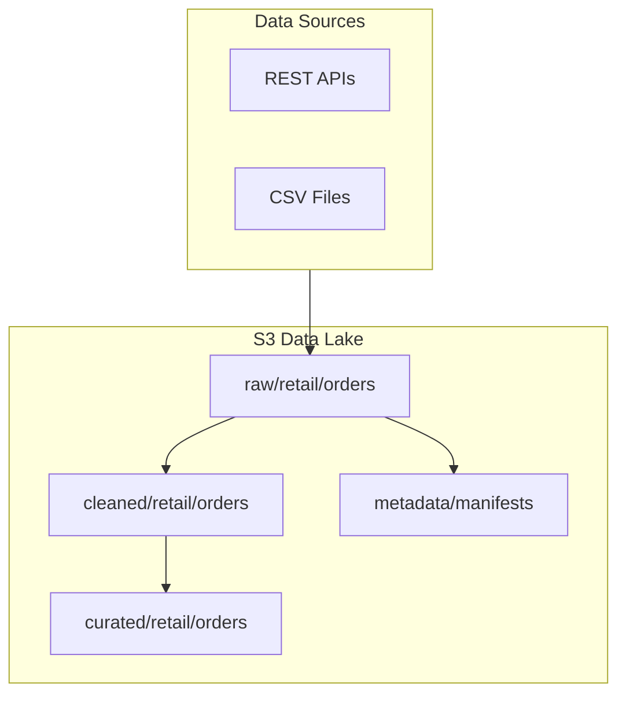

# Lab 1.2: Raw / Cleaned / Curated Data Lake Zones

> 📊 **Diagrams:** [Mermaid](diagram.md) · [Draw.io (lab-1.2-data-lake-zones.drawio)](../../../../docs/diagrams/drawio/lab-1.2-data-lake-zones.drawio) · [PNG](../../../../docs/diagrams/png/lab-1.2-data-lake-zones.png) · [SVG](../../../../docs/diagrams/svg/lab-1.2-data-lake-zones.svg)

**Estimated time:** 90 minutes · **Module 1**

---

## Objectives

- Upload sample data to the Raw zone with proper partitioning
- Understand naming conventions for enterprise data lakes
- Create a metadata manifest for ingested datasets
- Validate zone isolation and path conventions

---

## Prerequisites

- Lab 1.1 complete (S3 data lake deployed)
- Python virtual environment active

---

## Zone Conventions

Enterprise lakes use predictable paths:

```text
s3://{bucket}/raw/{source}/{dataset}/year={YYYY}/month={MM}/day={DD}/{filename}
s3://{bucket}/cleaned/{domain}/{dataset}/...
s3://{bucket}/curated/{domain}/{dataset}/...
s3://{bucket}/metadata/{dataset}/manifest.json
```

**Rules:**
- Raw data is **append-only** — never overwrite
- Use **Hive-style partitioning** (`key=value`) for Athena/Glue compatibility
- Include **ingestion timestamp** in metadata, not always in path

---

## Step 1: Generate Sample Data

Run the provided script to create synthetic retail order data:

```bash
cd modules/module-01-foundations/labs/lab-1.2-data-lake-zones
python scripts/generate_sample_orders.py
```

This creates `sample-data/orders_2024-01-15.csv` with 1,000 order records.

Inspect the file:

```bash
head -5 sample-data/orders_2024-01-15.csv
```

---

## Step 2: Upload to Raw Zone

Set your bucket name (from Lab 1.1):

```bash
export BUCKET=$(cd ../../../../infrastructure/environments/dev && terraform output -raw data_lake_bucket)
export DATE=2024-01-15
export YEAR=2024
export MONTH=01
export DAY=15

aws s3 cp sample-data/orders_${DATE}.csv \
  s3://${BUCKET}/raw/retail/orders/year=${YEAR}/month=${MONTH}/day=${DAY}/orders_${DATE}.csv \
  --metadata "source=lab-generator,ingestion_time=$(date -u +%Y-%m-%dT%H:%M:%SZ),record_count=1000"
```

Verify:

```bash
aws s3 ls s3://${BUCKET}/raw/retail/orders/ --recursive
```

---

## Step 3: Create Metadata Manifest

Create and upload a dataset manifest:

```bash
python scripts/create_manifest.py \
  --bucket $BUCKET \
  --dataset retail/orders \
  --source-file sample-data/orders_2024-01-15.csv
```

Verify manifest:

```bash
aws s3 cp s3://${BUCKET}/metadata/retail/orders/manifest.json - | python -m json.tool
```

---

## Step 4: Simulate Cleaned Zone Structure

Create a cleaned zone placeholder (full ETL in Module 3):

```bash
cat > /tmp/cleaned_readme.txt << 'EOF'
Cleaned zone: validated, typed, deduplicated data.
Populated by Glue ETL jobs (Module 3).
Format: Parquet, partitioned by year/month/day.
EOF

aws s3 cp /tmp/cleaned_readme.txt \
  s3://${BUCKET}/cleaned/retail/orders/_README.txt
```

---

## Step 5: Validate with Python

```bash
python scripts/validate_zones.py --bucket $BUCKET
```

Expected output:

```text
✓ raw/retail/orders partition exists
✓ metadata/retail/orders/manifest.json exists
✓ cleaned/ zone accessible
✓ curated/ zone accessible
✓ quarantine/ zone accessible
All zone validations passed.
```

---

## Step 6: Architecture Sketch

Draw (or use Mermaid) your data lake layout and save as `architecture.md`:



---

## Deliverables

- [ ] Sample orders CSV uploaded to raw zone with partitioning
- [ ] Metadata manifest in `metadata/retail/orders/`
- [ ] `LAB-REPORT.md` with CLI output and architecture diagram
- [ ] `validate_zones.py` passes all checks

---

## Troubleshooting

| Issue | Solution |
|-------|----------|
| `NoSuchBucket` | Re-run Lab 1.1 or check `BUCKET` env var |
| Partition path rejected by Athena | Use `year=2024` format, not `2024/01/15` |
| Manifest upload fails | Check IAM `s3:PutObject` on bucket |

---

## Cleanup

After Module 1 assignment is graded:

```bash
cd infrastructure/environments/dev && terraform destroy
```

---

**Next:** [Assignment 1 – Architecture Design](../../assignments/assignment-01.md)
