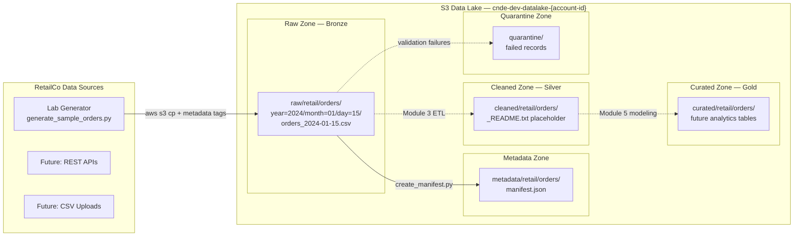
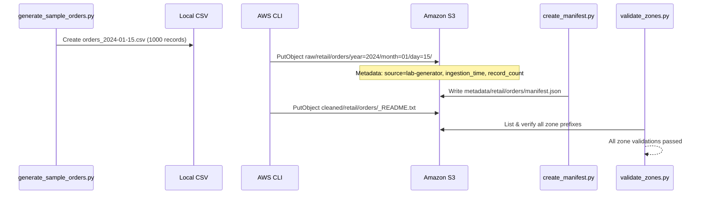

# Lab 1.2 Architecture — Raw / Cleaned / Curated Data Lake Zones

Organize RetailCo order data across medallion zones using Hive-style partitioning, metadata manifests, and enterprise path conventions.

## Medallion Zone Layout

## Data Ingestion Flow

## Key Components

| Component | AWS Service | Purpose |
|-----------|-------------|---------|
| Raw Zone | Amazon S3 | Append-only storage for RetailCo orders CSV with Hive partitions |
| Cleaned Zone | Amazon S3 | Placeholder for validated Parquet output (Module 3 Glue ETL) |
| Curated Zone | Amazon S3 | Reserved for business-ready analytics datasets |
| Quarantine Zone | Amazon S3 | Isolated storage for invalid or rejected records |
| Metadata Zone | Amazon S3 | Dataset manifests with schema, lineage, and ingestion details |
| Sample Generator | Python script | Creates synthetic RetailCo order data for lab exercises |
| Zone Validator | Python script | Confirms path conventions and zone accessibility |

## S3 Path Conventions

| Zone | Path Pattern | Example |
|------|--------------|---------|
| Raw | `s3://{bucket}/raw/{source}/{dataset}/year={YYYY}/month={MM}/day={DD}/{filename}` | `s3://cnde-dev-datalake-123456789012/raw/retail/orders/year=2024/month=01/day=15/orders_2024-01-15.csv` |
| Cleaned | `s3://{bucket}/cleaned/{domain}/{dataset}/...` | `s3://cnde-dev-datalake-123456789012/cleaned/retail/orders/_README.txt` |
| Curated | `s3://{bucket}/curated/{domain}/{dataset}/...` | `s3://cnde-dev-datalake-123456789012/curated/retail/orders/` |
| Metadata | `s3://{bucket}/metadata/{dataset}/manifest.json` | `s3://cnde-dev-datalake-123456789012/metadata/retail/orders/manifest.json` |
| Quarantine | `s3://{bucket}/quarantine/{source}/{dataset}/...` | `s3://cnde-dev-datalake-123456789012/quarantine/` |

### Naming Rules

- Raw data is **append-only** — never overwrite existing partitions
- Use **Hive-style partitioning** (`key=value`) for Athena and Glue compatibility
- Include **ingestion timestamp** in object metadata, not always in the path
- `{source}` = origin system (e.g., `retail`, `lambda-ingest`, `api-ingest`)
- `{dataset}` = logical dataset name (e.g., `orders`, `transactions`)
