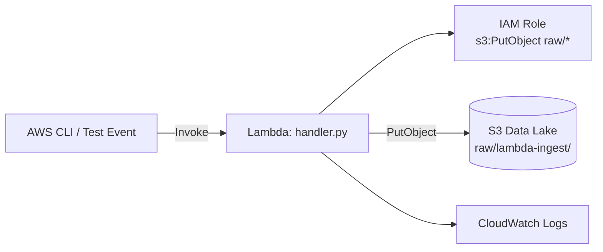

# Lab 2.1: Lambda File Ingestion to S3 Raw Zone

> 📊 **Diagrams:** [Mermaid](diagram.md) · [Draw.io (lab-2.1-lambda-ingestion.drawio)](../../../../docs/diagrams/drawio/lab-2.1-lambda-ingestion.drawio) · [PNG](../../../../docs/diagrams/png/lab-2.1-lambda-ingestion.png) · [SVG](../../../../docs/diagrams/svg/lab-2.1-lambda-ingestion.svg)

**Estimated time:** 90 minutes · **Module 2**

---

## Objectives

- Deploy a Lambda function that ingests JSON records into the S3 raw zone
- Configure environment variables and least-privilege IAM
- Test idempotent writes using deterministic S3 keys
- Verify objects with AWS CLI and structured CloudWatch logs

---

## Prerequisites

- [Environment setup](../../../../setup/SETUP.md) complete
- Module 1 Lab 1.1 complete (S3 data lake deployed)
- Python 3.10+ virtual environment active
- AWS CLI and Terraform 1.5+ installed

---


## Platform Setup

From the **repository root**, start the shared lab environment (once per session):

```bash
./scripts/lab-cycle.sh start
source ./scripts/lab-env.sh
```

Stop when finished: `./scripts/lab-cycle.sh stop --yes` (avoids ongoing AWS charges).

---


## Architecture



```text
Invoke payload (JSON)
    │
    ▼
Lambda validates record_id
    │
    ▼
s3://{bucket}/raw/lambda-ingest/transactions/year=YYYY/month=MM/day=DD/{record_id}.json
```

---

## Step 1: Set Environment Variables

From your Lab 1.1 deployment:

```bash
export BUCKET=$(cd ../../../../infrastructure/environments/dev && terraform output -raw data_lake_bucket)
export AWS_REGION=us-east-1
echo "Data lake bucket: $BUCKET"
```

---

## Step 2: Package Lambda Code

```bash
cd modules/module-02-ingestion/labs/lab-2.1-lambda-ingestion
mkdir -p build
pip install --target build boto3
cp src/handler.py build/
cd build && zip -r ../lambda-ingest.zip . && cd ..
```

---

## Step 3: Create IAM Role and Policy

Create `trust-policy.json`:

```json
{
  "Version": "2012-10-17",
  "Statement": [
    {
      "Effect": "Allow",
      "Principal": { "Service": "lambda.amazonaws.com" },
      "Action": "sts:AssumeRole"
    }
  ]
}
```

Create the role:

```bash
aws iam create-role \
  --role-name cnde-lab21-lambda-ingest \
  --assume-role-policy-document file://trust-policy.json

aws iam attach-role-policy \
  --role-name cnde-lab21-lambda-ingest \
  --policy-arn arn:aws:iam::aws:policy/service-role/AWSLambdaBasicExecutionRole
```

Create `s3-policy.json` (replace `ACCOUNT_ID` and `BUCKET`):

```json
{
  "Version": "2012-10-17",
  "Statement": [
    {
      "Sid": "WriteRawZone",
      "Effect": "Allow",
      "Action": ["s3:PutObject", "s3:PutObjectTagging"],
      "Resource": "arn:aws:s3:::BUCKET/raw/*"
    }
  ]
}
```

```bash
aws iam put-role-policy \
  --role-name cnde-lab21-lambda-ingest \
  --policy-name s3-raw-write \
  --policy-document file://s3-policy.json
```

Wait ~10 seconds for IAM propagation.

---

## Step 4: Deploy Lambda Function

```bash
ROLE_ARN=$(aws iam get-role --role-name cnde-lab21-lambda-ingest --query Role.Arn --output text)

aws lambda create-function \
  --function-name cnde-lab21-file-ingest \
  --runtime python3.11 \
  --handler handler.lambda_handler \
  --role "$ROLE_ARN" \
  --zip-file fileb://lambda-ingest.zip \
  --timeout 60 \
  --memory-size 512 \
  --environment "Variables={DATA_LAKE_BUCKET=$BUCKET,RAW_PREFIX=raw/,SOURCE_SYSTEM=lambda-ingest,DATASET=transactions}"
```

If the function already exists, update code:

```bash
aws lambda update-function-code \
  --function-name cnde-lab21-file-ingest \
  --zip-file fileb://lambda-ingest.zip
```

---

## Step 5: Invoke with Test Payload

Create `test-event.json`:

```json
{
  "record_id": "TXN-1001",
  "data": {
    "amount": 250.0,
    "currency": "USD",
    "account_last4": "1234",
    "type": "deposit"
  }
}
```

Invoke:

```bash
aws lambda invoke \
  --function-name cnde-lab21-file-ingest \
  --payload file://test-event.json \
  --cli-binary-format raw-in-base64-out \
  response.json

cat response.json | python -m json.tool
```

Invoke again with the **same** `record_id` to prove idempotency (same S3 key, safe overwrite).

---

## Step 6: Verify S3 Object

```bash
aws s3 ls s3://${BUCKET}/raw/lambda-ingest/transactions/ --recursive

aws s3 cp s3://${BUCKET}/raw/lambda-ingest/transactions/ \
  - --recursive 2>/dev/null | head -1

# Download specific object (adjust path from ls output)
aws s3 ls s3://${BUCKET}/raw/lambda-ingest/transactions/ --recursive | head -1 | awk '{print $4}' | \
  xargs -I{} aws s3 cp s3://${BUCKET}/{} - | python -m json.tool
```

Expected fields in the JSON object:

- `record_id`
- `payload`
- `source_system`
- `dataset`
- `ingested_at`

---

## Step 7: Inspect CloudWatch Logs

```bash
aws logs tail /aws/lambda/cnde-lab21-file-ingest --since 30m --format short
```

Look for structured log line `ingestion_success`.

---

## Step 8: Optional — Deploy via Terraform Module

For a reproducible deployment across labs:

```bash
cd ../../../../infrastructure/environments/dev
```

Add to `main.tf` (after Module 1 data lake):

```hcl
module "lambda_ingestion" {
  source            = "../../modules/lambda-ingestion"
  project           = var.project
  environment       = var.environment
  student           = var.student
  data_lake_bucket  = module.data_lake.bucket_name
}
```

```bash
terraform init
terraform apply
```

Use Terraform outputs for function names.

---

## Deliverables Checklist

- [ ] `lambda-ingest.zip` built successfully
- [ ] Lambda function `cnde-lab21-file-ingest` deployed
- [ ] Test invocation returns HTTP 200 / `ingested: 1`
- [ ] S3 object under `raw/lambda-ingest/transactions/` with partition path
- [ ] Second invoke with same `record_id` does not create duplicate keys
- [ ] CloudWatch log shows `ingestion_success`
- [ ] `LAB-2.1-REPORT.md` with bucket name, sample key, and screenshot

---

## Verification Steps

| Check | Command / Action | Expected |
|-------|------------------|----------|
| Function exists | `aws lambda get-function --function-name cnde-lab21-file-ingest` | `Active` |
| Invoke success | `cat response.json` | `"ingested": 1` |
| Object in raw | `aws s3 ls ... --recursive` | At least one `.json` file |
| Idempotency | Two invokes, one `record_id` | Single key path (overwrite) |
| Tags/metadata | `aws s3api head-object --bucket $BUCKET --key <key>` | Metadata present |

---

## Troubleshooting

| Issue | Solution |
|-------|----------|
| `AccessDenied` on `put_object` | Verify IAM policy `Resource` matches `arn:aws:s3:::BUCKET/raw/*` |
| `DATA_LAKE_BUCKET environment variable is not set` | Update Lambda env vars or re-deploy with `--environment` |
| `Unable to import module 'handler'` | Zip must contain `handler.py` at root; handler is `handler.lambda_handler` |
| `ResourceConflictException` on create | Function exists—use `update-function-code` |
| Empty `response.json` | Add `--cli-binary-format raw-in-base64-out` to invoke |
| Role not ready | Wait 10–30s after IAM role creation before `create-function` |

---

## Cleanup

```bash
aws lambda delete-function --function-name cnde-lab21-file-ingest
aws iam delete-role-policy --role-name cnde-lab21-lambda-ingest --policy-name s3-raw-write
aws iam detach-role-policy --role-name cnde-lab21-lambda-ingest \
  --policy-arn arn:aws:iam::aws:policy/service-role/AWSLambdaBasicExecutionRole
aws iam delete-role --role-name cnde-lab21-lambda-ingest
```

Keep S3 data lake for Labs 2.2 and 2.3.

---

## What You Learned

- Serverless ingestion with deterministic, idempotent S3 keys
- Least-privilege IAM scoped to the raw zone prefix
- Structured logging for operational troubleshooting

**Next:** [Lab 2.2 – EventBridge Scheduled Ingestion](../lab-2.2-eventbridge-automation/README.md)
