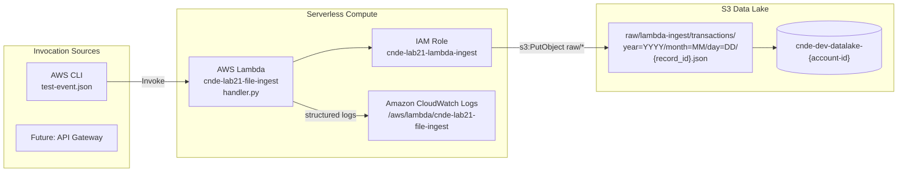
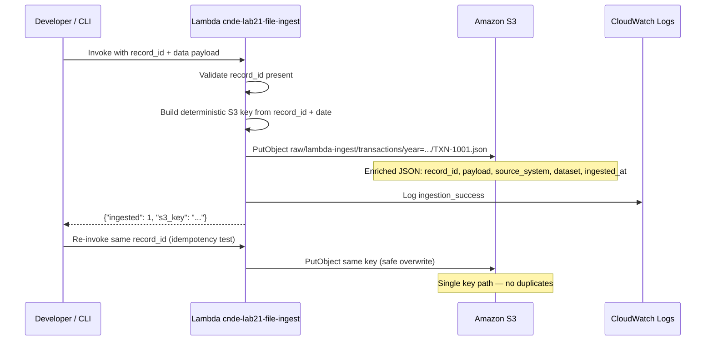

# Lab 2.1 Architecture — Lambda File Ingestion to S3 Raw Zone

Ingest JSON transaction records into the RetailCo data lake raw zone using a serverless Lambda function with deterministic, idempotent S3 keys.

## Ingestion Pipeline

## Record Ingestion Sequence

## Key Components

| Component | AWS Service | Purpose |
|-----------|-------------|---------|
| Ingestion Function | AWS Lambda | Validates JSON payload and writes to raw zone with enriched metadata |
| Execution Role | AWS IAM | Least-privilege `s3:PutObject` scoped to `raw/*` prefix only |
| Data Lake Bucket | Amazon S3 | Target storage for ingested transaction records |
| CloudWatch Logs | Amazon CloudWatch | Structured logging for operational troubleshooting |
| Environment Variables | AWS Lambda | Configures bucket, prefix, source system, and dataset name |

## S3 Path Conventions

| Path | Pattern | Example |
|------|---------|---------|
| Raw transactions | `s3://{bucket}/raw/{source}/{dataset}/year={YYYY}/month={MM}/day={DD}/{record_id}.json` | `s3://cnde-dev-datalake-123456789012/raw/lambda-ingest/transactions/year=2024/month=01/day=15/TXN-1001.json` |

### Environment Configuration

| Variable | Value | Purpose |
|----------|-------|---------|
| `DATA_LAKE_BUCKET` | `cnde-dev-datalake-{account-id}` | Target bucket from Lab 1.1 Terraform output |
| `RAW_PREFIX` | `raw/` | Base prefix for raw zone writes |
| `SOURCE_SYSTEM` | `lambda-ingest` | Lineage identifier in output JSON |
| `DATASET` | `transactions` | Dataset name segment in S3 path |

### Idempotency

Re-invoking with the same `record_id` produces the **same S3 key**, resulting in a safe overwrite rather than duplicate objects.
