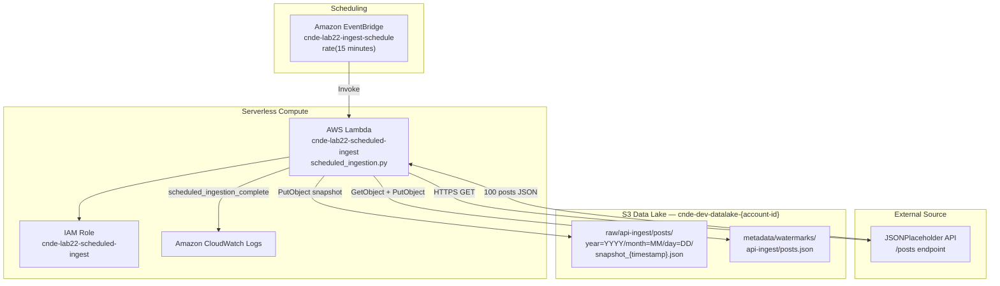
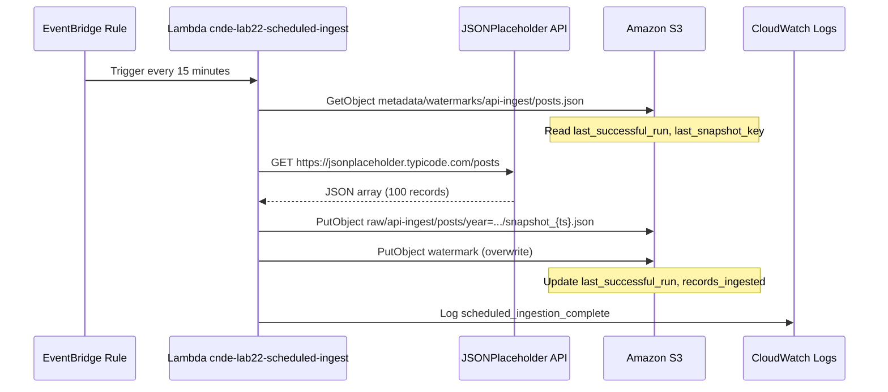

# Lab 2.2 Architecture — EventBridge Scheduled API Ingestion

Automate recurring pull-based ingestion from an external API into the RetailCo raw zone using EventBridge schedules, Lambda, and metadata watermarks.

## Scheduled Ingestion Pipeline

## Scheduled Run Sequence

## Key Components

| Component | AWS Service | Purpose |
|-----------|-------------|---------|
| Schedule Rule | Amazon EventBridge | Triggers ingestion every 15 minutes via `rate(15 minutes)` |
| Ingestion Function | AWS Lambda | Fetches API data and writes time-stamped snapshots to raw zone |
| Execution Role | AWS IAM | Read/write access to `raw/*` and `metadata/*` prefixes |
| External API | JSONPlaceholder | Simulated RetailCo upstream data source |
| Watermark File | Amazon S3 (metadata zone) | Tracks last successful run and snapshot location |
| CloudWatch Logs | Amazon CloudWatch | Monitors scheduled execution and record counts |

## S3 Path Conventions

| Path | Pattern | Example |
|------|---------|---------|
| API snapshots | `s3://{bucket}/raw/{source}/{dataset}/year={YYYY}/month={MM}/day={DD}/snapshot_{timestamp}.json` | `s3://cnde-dev-datalake-123456789012/raw/api-ingest/posts/year=2024/month=01/day=15/snapshot_20240115T143000Z.json` |
| Watermark | `s3://{bucket}/metadata/watermarks/{source}/{dataset}.json` | `s3://cnde-dev-datalake-123456789012/metadata/watermarks/api-ingest/posts.json` |

### Watermark Schema

| Field | Purpose |
|-------|---------|
| `last_successful_run` | ISO timestamp of most recent successful ingestion |
| `last_snapshot_key` | S3 key of the latest snapshot file |
| `records_ingested` | Count of records in the last snapshot |

### Environment Configuration

| Variable | Value |
|----------|-------|
| `SOURCE_SYSTEM` | `api-ingest` |
| `DATASET` | `posts` |
| `API_URL` | `https://jsonplaceholder.typicode.com/posts` |
| `WATERMARK_KEY` | `metadata/watermarks/api-ingest/posts.json` |
