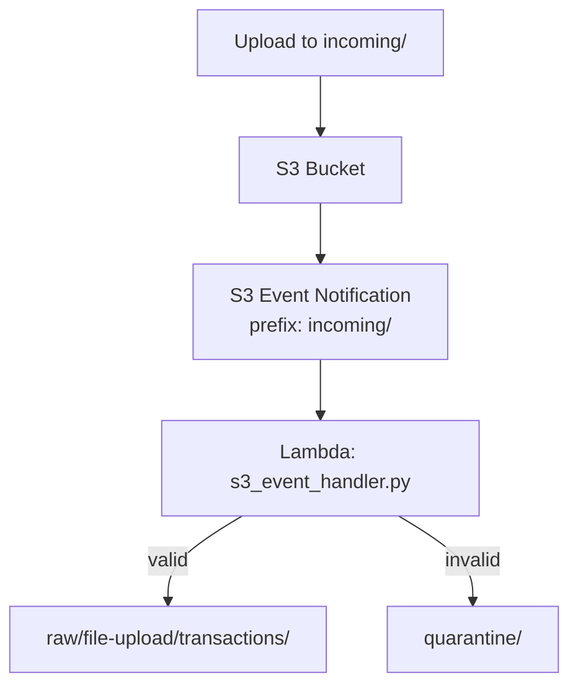

# Lab 2.3: S3 Event Processing with Lambda

> 📊 **Diagrams:** [Mermaid](diagram.md) · [Draw.io (lab-2.3-s3-event-processing.drawio)](../../../../docs/diagrams/drawio/lab-2.3-s3-event-processing.drawio) · [PNG](../../../../docs/diagrams/png/lab-2.3-s3-event-processing.png) · [SVG](../../../../docs/diagrams/svg/lab-2.3-s3-event-processing.svg)

**Estimated time:** 90 minutes · **Module 2**

---

## Objectives

- Configure S3 event notifications on the `incoming/` prefix
- Promote validated files to partitioned `raw/` paths
- Route invalid files to `quarantine/` with error manifests
- Observe event-driven, idempotent file processing

---

## Prerequisites

- S3 data lake from Module 1
- Labs 2.1–2.2 familiarity with Lambda and IAM
- Sample CSV file (use Module 1 generator or create manually)

---


## Platform Setup

From the **repository root**, start the shared lab environment (once per session):

```bash
./scripts/lab-cycle.sh start
source ./scripts/lab-env.sh
```

Stop when finished: `./scripts/lab-cycle.sh stop --yes` (avoids ongoing AWS charges).

---


## Architecture



```text
incoming/transactions/batch_2024-01-15.csv
        │ ObjectCreated
        ▼
raw/file-upload/transactions/year=2024/month=01/day=15/batch_2024-01-15.csv
```

---

## Step 1: Create Sample File

```bash
cd modules/module-02-ingestion/labs/lab-2.3-s3-event-processing
mkdir -p sample-data

cat > sample-data/batch_2024-01-15.csv << 'EOF'
transaction_id,amount,currency,posted_at
TXN-001,100.50,USD,2024-01-15T10:00:00Z
TXN-002,250.00,USD,2024-01-15T11:30:00Z
EOF
```

---

## Step 2: Package and Deploy Lambda

```bash
export BUCKET=$(cd ../../../../infrastructure/environments/dev && terraform output -raw data_lake_bucket)

mkdir -p build
pip install --target build boto3
cp src/s3_event_handler.py build/
cd build && zip -r ../s3-event.zip . && cd ..
```

`s3-policy.json`:

```json
{
  "Version": "2012-10-17",
  "Statement": [
    {
      "Sid": "ReadIncoming",
      "Effect": "Allow",
      "Action": ["s3:GetObject"],
      "Resource": "arn:aws:s3:::BUCKET/incoming/*"
    },
    {
      "Sid": "WriteRawAndQuarantine",
      "Effect": "Allow",
      "Action": ["s3:PutObject"],
      "Resource": [
        "arn:aws:s3:::BUCKET/raw/*",
        "arn:aws:s3:::BUCKET/quarantine/*"
      ]
    }
  ]
}
```

```bash
aws iam create-role \
  --role-name cnde-lab23-s3-event \
  --assume-role-policy-document file://../lab-2.1-lambda-ingestion/trust-policy.json

aws iam attach-role-policy \
  --role-name cnde-lab23-s3-event \
  --policy-arn arn:aws:iam::aws:policy/service-role/AWSLambdaBasicExecutionRole

aws iam put-role-policy \
  --role-name cnde-lab23-s3-event \
  --policy-name s3-event-process \
  --policy-document file://s3-policy.json

ROLE_ARN=$(aws iam get-role --role-name cnde-lab23-s3-event --query Role.Arn --output text)

aws lambda create-function \
  --function-name cnde-lab23-s3-event \
  --runtime python3.11 \
  --handler s3_event_handler.lambda_handler \
  --role "$ROLE_ARN" \
  --zip-file fileb://s3-event.zip \
  --timeout 60 \
  --memory-size 512 \
  --environment "Variables={DATA_LAKE_BUCKET=$BUCKET,INCOMING_PREFIX=incoming/,RAW_PREFIX=raw/,QUARANTINE_PREFIX=quarantine/,SOURCE_SYSTEM=file-upload,DATASET=transactions,MAX_FILE_BYTES=10485760}"
```

---

## Step 3: Grant S3 Permission to Invoke Lambda

```bash
FUNC_ARN=$(aws lambda get-function --function-name cnde-lab23-s3-event --query Configuration.FunctionArn --output text)

aws lambda add-permission \
  --function-name cnde-lab23-s3-event \
  --statement-id s3-invoke \
  --action lambda:InvokeFunction \
  --principal s3.amazonaws.com \
  --source-arn arn:aws:s3:::${BUCKET} \
  --source-account $(aws sts get-caller-identity --query Account --output text)
```

---

## Step 4: Configure S3 Event Notification

Create `notification.json`:

```json
{
  "LambdaFunctionConfigurations": [
    {
      "Id": "incoming-to-lambda",
      "LambdaFunctionArn": "FUNC_ARN_PLACEHOLDER",
      "Events": ["s3:ObjectCreated:*"],
      "Filter": {
        "Key": {
          "FilterRules": [
            { "Name": "prefix", "Value": "incoming/" }
          ]
        }
      }
    }
  ]
}
```

Replace `FUNC_ARN_PLACEHOLDER` with `$FUNC_ARN`, then apply:

```bash
# Use jq or sed to inject ARN
jq --arg arn "$FUNC_ARN" '.LambdaFunctionConfigurations[0].LambdaFunctionArn = $arn' notification.json > notification-resolved.json

aws s3api put-bucket-notification-configuration \
  --bucket $BUCKET \
  --notification-configuration file://notification-resolved.json
```

Verify:

```bash
aws s3api get-bucket-notification-configuration --bucket $BUCKET
```

---

## Step 5: Upload Test File (Valid)

```bash
aws s3 cp sample-data/batch_2024-01-15.csv \
  s3://${BUCKET}/incoming/transactions/batch_2024-01-15.csv
```

Wait 5–30 seconds for S3 event delivery.

---

## Step 6: Verify Promotion

```bash
aws s3 ls s3://${BUCKET}/raw/file-upload/transactions/ --recursive

aws logs tail /aws/lambda/cnde-lab23-s3-event --since 15m --format short
```

Expected log: `promotion_success` with `dest_key` under partitioned `raw/` path.

Download promoted file:

```bash
aws s3 ls s3://${BUCKET}/raw/file-upload/transactions/ --recursive | tail -1 | awk '{print $4}' | \
  xargs -I{} aws s3 cp s3://${BUCKET}/{} - | head -5
```

---

## Step 7: Test Quarantine Path

Upload invalid file (wrong extension):

```bash
echo "bad" > sample-data/malware.exe
aws s3 cp sample-data/malware.exe s3://${BUCKET}/incoming/transactions/malware.exe
```

Verify quarantine manifest:

```bash
aws s3 ls s3://${BUCKET}/quarantine/file-upload/transactions/ --recursive
aws s3 ls s3://${BUCKET}/quarantine/file-upload/transactions/ --recursive | tail -1 | awk '{print $4}' | \
  xargs -I{} aws s3 cp s3://${BUCKET}/{} - | python -m json.tool
```

---

## Step 8: Idempotency Test

Re-upload the **same** valid file to the same key:

```bash
aws s3 cp sample-data/batch_2024-01-15.csv \
  s3://${BUCKET}/incoming/transactions/batch_2024-01-15.csv
```

Confirm raw zone object is overwritten (same `batch_id` in path), not duplicated with random keys.

---

## Deliverables Checklist

- [ ] S3 notification configured for `incoming/` prefix
- [ ] Valid CSV promoted to `raw/file-upload/transactions/...`
- [ ] Invalid file generates quarantine manifest JSON
- [ ] CloudWatch logs show promotion and quarantine paths
- [ ] `LAB-2.3-REPORT.md` with event config screenshot and sample keys

---

## Verification Steps

| Check | Expected |
|-------|----------|
| Notification config | Lambda ARN listed for `s3:ObjectCreated:*` |
| Valid upload | File exists under `raw/.../year=/month=/day=` |
| Invalid upload | `.error.json` manifest in `quarantine/` |
| Lambda IAM | No `AccessDenied` on copy |
| Idempotency | Same filename → same raw key |

---

## Troubleshooting

| Issue | Solution |
|-------|----------|
| No Lambda invocation after upload | Notification must be on same bucket; check prefix `incoming/` |
| `Unable to validate the following destination configurations` | Add Lambda permission for `s3.amazonaws.com` **before** notification |
| `AccessDenied` on CopyObject | IAM needs `s3:GetObject` on source + copy permissions on dest |
| Duplicate invocations | Expected—design is idempotent via deterministic `batch_id` key |
| Lambda runs but no raw file | Check logs for `quarantined` reason (suffix, size) |
| Conflicting notification | Only one config per bucket—merge rules in single JSON |

---

## Cleanup

```bash
aws s3api put-bucket-notification-configuration --bucket $BUCKET --notification-configuration '{}'
aws lambda remove-permission --function-name cnde-lab23-s3-event --statement-id s3-invoke
aws lambda delete-function --function-name cnde-lab23-s3-event
```

---

## What You Learned

- S3 event-driven promotion from landing to raw zone
- Validation and quarantine for fail-safe ingestion
- Idempotent copy semantics for at-least-once events

**Next:** [Assignment 2](../../assignments/assignment-02.md)
