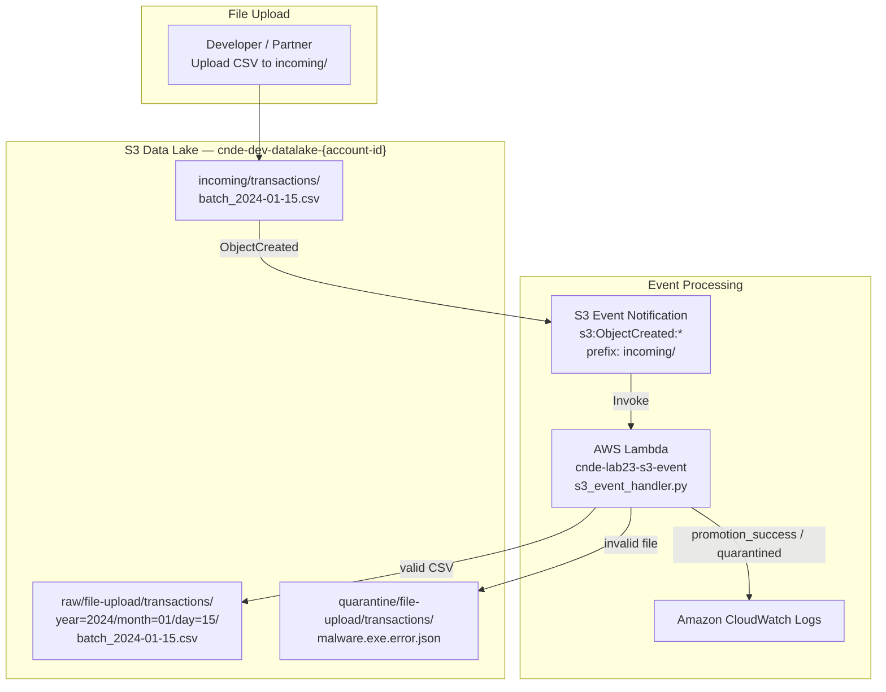
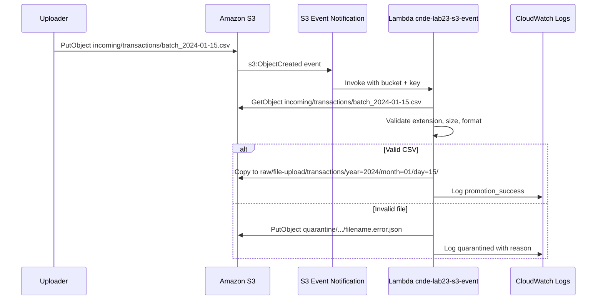
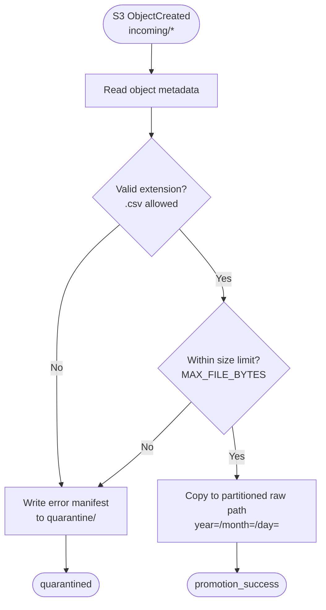

# Lab 2.3 Architecture — S3 Event Processing with Lambda

Promote uploaded files from a landing zone to partitioned raw paths using S3 event notifications, with invalid files routed to quarantine.

## Event-Driven Promotion Pipeline

## File Processing Sequence

## Validation Decision Flow

## Key Components

| Component | AWS Service | Purpose |
|-----------|-------------|---------|
| Landing Prefix | Amazon S3 (`incoming/`) | Staging area for partner file uploads before validation |
| Event Notification | Amazon S3 | Triggers Lambda on `s3:ObjectCreated:*` for `incoming/` prefix |
| Event Handler | AWS Lambda | Validates files and promotes to raw or quarantine zones |
| Raw Zone | Amazon S3 | Partitioned storage for validated transaction CSV files |
| Quarantine Zone | Amazon S3 | Isolated storage with JSON error manifests for rejected files |
| Execution Role | AWS IAM | `GetObject` on incoming, `PutObject` on raw and quarantine |
| CloudWatch Logs | Amazon CloudWatch | Audit trail for promotions and quarantine decisions |

## S3 Path Conventions

| Zone | Path Pattern | Example |
|------|--------------|---------|
| Incoming (landing) | `s3://{bucket}/incoming/{dataset}/{filename}` | `s3://cnde-dev-datalake-123456789012/incoming/transactions/batch_2024-01-15.csv` |
| Raw (promoted) | `s3://{bucket}/raw/{source}/{dataset}/year={YYYY}/month={MM}/day={DD}/{filename}` | `s3://cnde-dev-datalake-123456789012/raw/file-upload/transactions/year=2024/month=01/day=15/batch_2024-01-15.csv` |
| Quarantine | `s3://{bucket}/quarantine/{source}/{dataset}/{filename}.error.json` | `s3://cnde-dev-datalake-123456789012/quarantine/file-upload/transactions/malware.exe.error.json` |

### Environment Configuration

| Variable | Value | Purpose |
|----------|-------|---------|
| `INCOMING_PREFIX` | `incoming/` | S3 event filter prefix |
| `SOURCE_SYSTEM` | `file-upload` | Lineage identifier in raw path |
| `DATASET` | `transactions` | Dataset segment in all paths |
| `MAX_FILE_BYTES` | `10485760` | 10 MB upload size limit |

### Idempotency

Re-uploading the same file to the same incoming key triggers a new event but produces the **same deterministic raw key** (overwrite, not duplicate).
