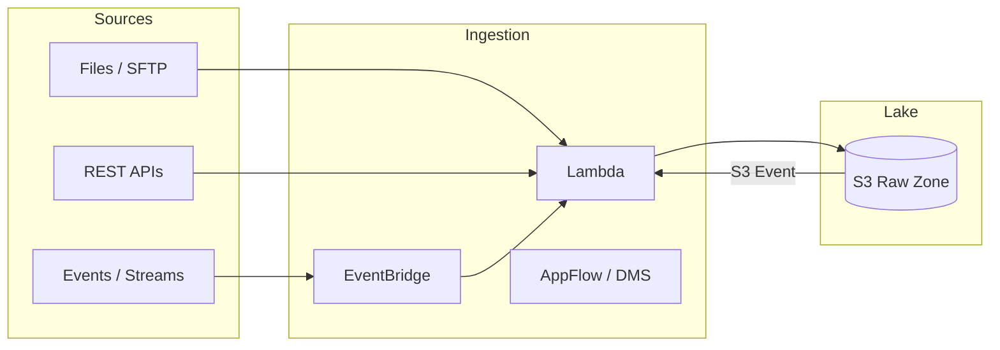
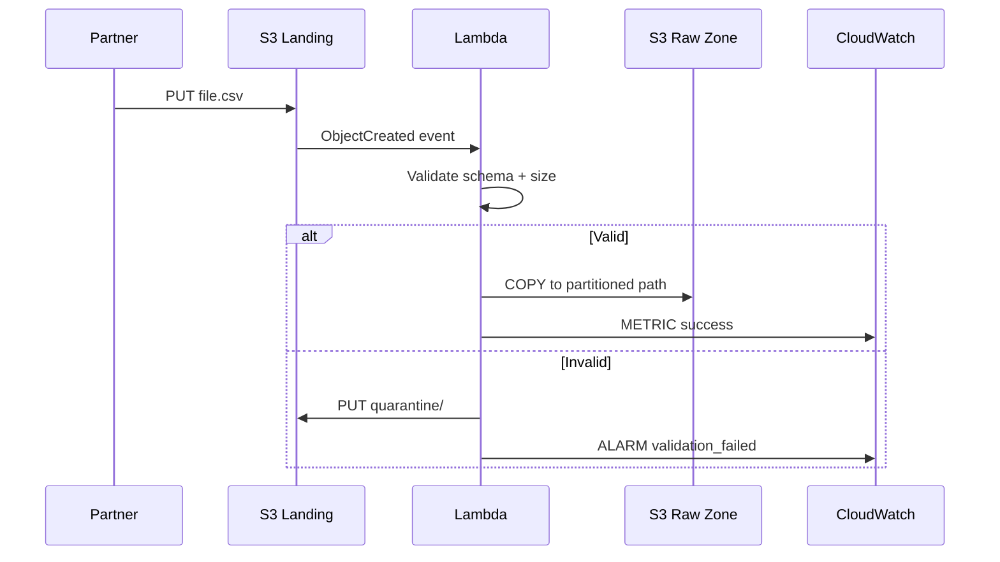
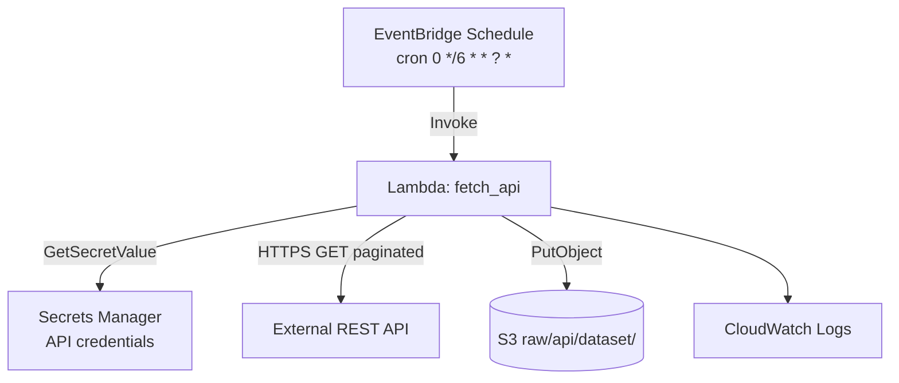
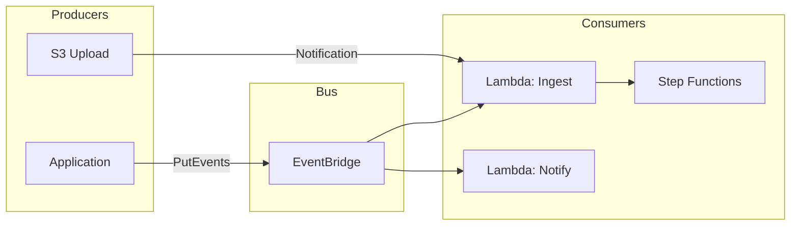
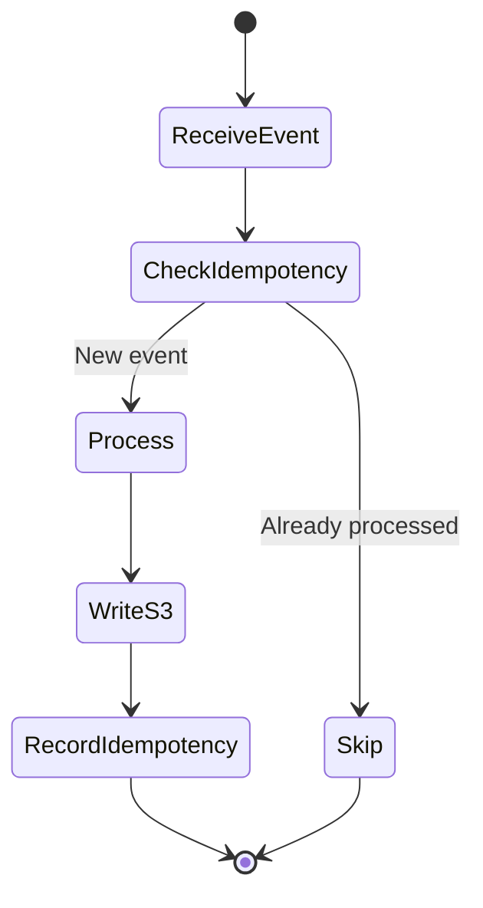
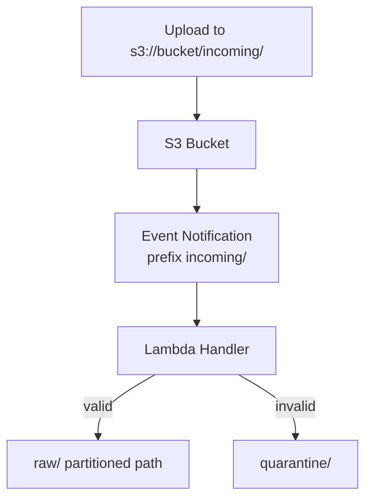
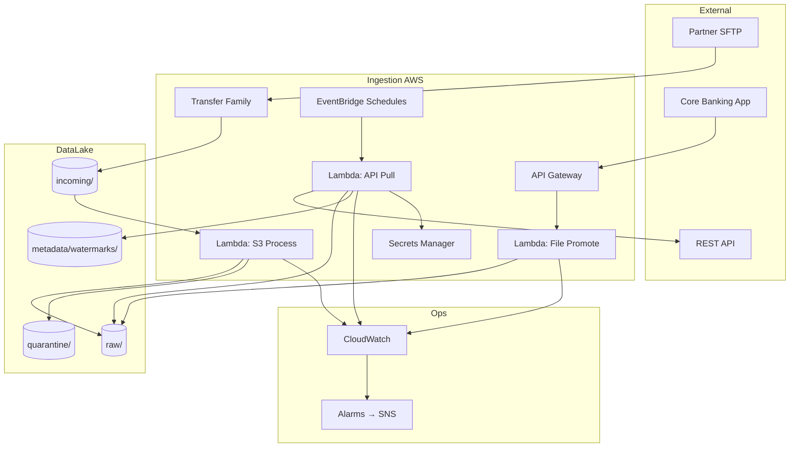

# Week 2 Lecture: Data Ingestion Patterns

**Duration:** 2 hours · **Module 2**

---

## Learning Objectives

By the end of this lecture you will:

1. Compare file-based, API-based, and event-driven ingestion patterns
2. Design incremental loads with watermarks and change detection
3. Implement idempotent ingestion that survives retries and duplicates
4. Explain when to use AWS Lambda, EventBridge, and S3 event notifications
5. Map ingestion patterns to the Raw zone of a medallion data lake

---

## 1. Why Ingestion Design Matters

Ingestion is the **front door** of your data platform. Poor ingestion design causes:

- Duplicate records in downstream analytics
- Late or missing data for regulatory reporting
- Runaway Lambda costs from unbounded retries
- Security incidents from over-permissive IAM roles

Enterprise data engineers optimize for **reliability, observability, and cost**—not just "getting data into S3."



---

## 2. File-Based Ingestion

### Patterns

| Pattern | Description | AWS Approach |
|---------|-------------|--------------|
| **Push** | Source uploads files to your landing bucket | S3 presigned URLs, Transfer Family |
| **Pull** | Pipeline fetches files from partner SFTP/FTP | Lambda + scheduled EventBridge |
| **Bulk historical** | One-time or periodic large dumps | S3 multipart upload, DataSync |
| **Micro-batch** | Small files arrive frequently | S3 + Lambda on `ObjectCreated` |

### Landing vs Raw Zone

Many teams use a **landing** prefix or bucket before promoting to `raw/`:

```text
s3://bucket/incoming/     ← untrusted, short retention
s3://bucket/raw/          ← validated, immutable, partitioned
```

**Best practice:** Validate checksum, schema, and file size in landing; only then copy to `raw/` with Hive partitions.

### Partitioning Convention

```text
s3://{bucket}/raw/{source}/{dataset}/year={YYYY}/month={MM}/day={DD}/{filename}
```

| Decision | Recommendation |
|----------|----------------|
| Partition keys | Use query patterns (usually date + business key) |
| File format | Parquet for analytics; JSON/CSV acceptable in raw |
| Filename | Include source timestamp + batch id for traceability |
| Overwrites | Avoid—append new object with unique key |

### File Ingestion Architecture



---

## 3. API-Based Ingestion

### Characteristics

- **Rate limits** and pagination must be handled explicitly
- **Authentication** via API keys, OAuth, or IAM (for AWS APIs)
- **Schema drift** when vendors version endpoints
- **Incremental sync** using `updated_since`, cursors, or ETags

### Pull Model (Scheduled)



### Push Model (Webhook)

External systems POST to **API Gateway** → Lambda → S3. Use:

- Request validation (JSON schema)
- Idempotency keys in DynamoDB
- API keys or JWT authorizers

### API Ingestion Comparison

| Aspect | Scheduled Pull | Webhook Push |
|--------|----------------|--------------|
| Latency | Minutes to hours | Seconds |
| Complexity | Pagination, backoff | Auth, replay protection |
| Cost | Predictable (schedule) | Spiky (traffic bursts) |
| Failure mode | Missed run if down | Need DLQ for failed posts |
| AWS services | EventBridge + Lambda | API Gateway + Lambda + SQS |

### Pagination and Backoff

```python
# Pseudocode — production pattern
watermark = read_watermark()  # S3 or DynamoDB
params = {"updated_since": watermark, "page": 1}
while True:
    response = http_get_with_retry(url, params)
    write_page_to_s3(response.json())
    if not response.get("next_page"):
        break
    params["page"] += 1
save_watermark(response["max_updated_at"])
```

---

## 4. Event-Driven Pipelines

### What Is Event-Driven Ingestion?

Processing is triggered by **state changes** (file uploaded, schedule fired, message received) rather than a monolithic cron job polling everything.

### AWS Event Services

| Service | Role in Ingestion |
|---------|-------------------|
| **Amazon EventBridge** | Schedule rules, custom event buses, cross-account routing |
| **Amazon S3 Event Notifications** | React to `s3:ObjectCreated:*` |
| **Amazon SQS** | Buffer events, decouple producers/consumers |
| **AWS Lambda** | Serverless compute for transform-and-load steps |

### EventBridge vs CloudWatch Events

EventBridge **is** the evolved CloudWatch Events default bus. Use **EventBridge** for:

- Cron schedules (`rate(5 minutes)` or `cron(0 12 * * ? *)`)
- Custom application events (`detail-type: OrderIngested`)
- Rules targeting Lambda, Step Functions, SQS

### Decoupled Pipeline



**Why decouple?** Adding a new consumer (e.g., audit log) does not require changing the producer.

---

## 5. Incremental Loads

### Full vs Incremental

| Load Type | When to Use | Risk |
|-----------|-------------|------|
| **Full** | Small dimensions, rare snapshots | High storage and API cost |
| **Incremental** | Large fact tables, APIs with deltas | Missed records if watermark wrong |
| **CDC** | Databases (DMS, Debezium) | Schema complexity |

### Watermark Strategies

| Strategy | Storage | Pros | Cons |
|----------|---------|------|------|
| **Timestamp** | S3 JSON / DynamoDB | Simple | Clock skew, late arrivals |
| **Surrogate ID** | DynamoDB | Monotonic | Gaps if IDs not sequential |
| **Hash / checksum** | DynamoDB | Detect changes | Not true incremental |
| **Snapshot diff** | S3 compare | No source API change | Compute-heavy |

### Late-Arriving Data

Banking and IoT often receive records **after** the business date partition closed.

**Mitigations:**

1. **Reprocess window:** Nightly job re-ingests last 3 days
2. **Partition by event time** but **cluster by ingestion date**
3. **Merge layer** in cleaned zone (Module 3 Glue jobs)

```text
# Example watermark file
s3://bucket/metadata/watermarks/api/transactions.json
{
  "last_successful_run": "2024-01-15T06:00:00Z",
  "last_updated_since": "2024-01-14T23:59:59Z",
  "records_ingested": 45230
}
```

---

## 6. Idempotent Processing

### Definition

An operation is **idempotent** if executing it once or multiple times produces the **same final state**.

In distributed systems, **at-least-once delivery** is common (Lambda retries, SQS redelivery). Your ingestion **must** tolerate duplicates.

### Idempotency Techniques

| Technique | How It Works | Example |
|-----------|--------------|---------|
| **Deterministic S3 keys** | Same input → same object key | `raw/orders/order_id=12345.json` |
| **Upsert with merge** | Downstream dedupes on primary key | Glue job with `dropDuplicates` |
| **Idempotency store** | DynamoDB tracks processed event IDs | Webhook `event_id` |
| **Conditional writes** | S3 versioning + head object check | Skip if ETag exists |

### Lambda Retry Behavior

Lambda may invoke your function **more than once** for a single logical event. Design handlers to:

1. Use **deterministic output paths** (include business key, not random UUID alone)
2. Log `aws_request_id` and `event_id` for tracing
3. Make S3 `PutObject` to the same key safe (overwrite same content) OR check existence first
4. Avoid non-reversible side effects (double charging, duplicate emails)



### Exactly-Once Illusion

True exactly-once end-to-end is rare. Enterprise pattern: **at-least-once ingestion + idempotent writes + dedupe in silver layer**.

---

## 7. AWS Lambda for Ingestion

### When Lambda Fits

| Good Fit | Poor Fit |
|----------|----------|
| Event-driven, short jobs (< 15 min) | Multi-GB file parsing |
| API pagination (< 15 min total) | Heavy Spark transforms |
| S3 event reactions | Constant high TPS (consider Kinesis) |

### Configuration Best Practices

| Setting | Recommendation |
|---------|------------------|
| **Memory** | Start 512 MB; profile duration vs cost |
| **Timeout** | API pull: 5–15 min; S3 events: 1–3 min |
| **Reserved concurrency** | Cap fan-out from S3 storms |
| **Dead-letter queue** | SQS DLQ for async failures |
| **Environment variables** | Bucket names, prefixes—no secrets |
| **Secrets** | AWS Secrets Manager or Parameter Store |

### IAM Least Privilege

```json
{
  "Effect": "Allow",
  "Action": ["s3:PutObject", "s3:PutObjectTagging"],
  "Resource": "arn:aws:s3:::BUCKET/raw/*"
}
```

Add `s3:GetObject` only on landing prefix if promoting files. Never `s3:*` on entire account.

### Observability

- **Structured JSON logs** (`print(json.dumps({...}))`)
- **Custom CloudWatch metrics** via `PutMetricData` or EMF
- **X-Ray** for API latency tracing (optional)
- **Alarms** on errors, duration, throttles

---

## 8. Amazon EventBridge for Ingestion

### Schedule Expressions

| Expression | Meaning |
|------------|---------|
| `rate(5 minutes)` | Every 5 minutes |
| `cron(0 6 * * ? *)` | Daily at 06:00 UTC |
| `cron(0/30 * * * ? *)` | Every 30 minutes |

Use **UTC** in cron. Document timezone for business stakeholders.

### Rule Target Permissions

EventBridge needs permission to invoke Lambda (`lambda:InvokeFunction`). Terraform `aws_lambda_permission` with `principal = events.amazonaws.com`.

### Custom Events

Applications publish business events for loose coupling:

```json
{
  "Source": "retailco.orders",
  "DetailType": "OrderFileReady",
  "Detail": "{\"bucket\":\"...\",\"key\":\"incoming/orders.csv\"}"
}
```

---

## 9. S3 Event Notifications

### Supported Events

- `s3:ObjectCreated:*` (Put, Post, Copy, CompleteMultipartUpload)
- `s3:ObjectRemoved:*`
- Prefix and suffix filters

### S3 → Lambda Flow



### Configuration Limits

- **One notification configuration per bucket** (multiple rules inside it)
- Fan-out to **Lambda, SQS, SNS, EventBridge**
- **No guarantee of order**; design idempotent handlers
- Events may **duplicate**—same as Lambda retries

### EventBridge vs Direct Lambda

| Approach | Use When |
|----------|----------|
| S3 → Lambda direct | Simple single consumer |
| S3 → EventBridge | Multiple subscribers, filtering, archiving |
| S3 → SQS → Lambda | Buffer spikes, batch processing |

---

## 10. End-to-End Reference Architecture



---

## 11. Security and Compliance

| Control | Implementation |
|---------|----------------|
| Encryption in transit | HTTPS only for APIs; TLS for S3 |
| Encryption at rest | S3 SSE-S3 or SSE-KMS |
| Credentials | Secrets Manager rotation; never in code |
| Network | VPC endpoints for S3/Secrets in regulated environments |
| Audit | CloudTrail for API calls; S3 access logs |
| PII | Tag objects; restrict IAM to prefix level |

**Banking scenario (preview):** Segregate PCI/PII datasets by prefix; separate KMS keys per sensitivity tier.

---

## 12. Cost and Operations

| Cost Driver | Mitigation |
|-------------|------------|
| Lambda invocations | Batch S3 events via SQS; right-size memory |
| S3 PUT/LIST | Avoid LIST in loops; use known keys |
| EventBridge | First 14M custom events/month free tier rules |
| API egress | Compress payloads; incremental sync |
| Failed retries | DLQ + alarm; fix root cause quickly |

### Runbook Essentials

1. **Ingestion lag alarm:** Max `ingestion_time` vs event time
2. **Error rate alarm:** Lambda `Errors` > threshold
3. **Dead letter review:** Weekly inspection of DLQ messages
4. **Watermark audit:** Compare source row counts vs S3 object metadata

---

## 13. Anti-Patterns to Avoid

| Anti-Pattern | Why It Fails | Better Approach |
|--------------|--------------|-----------------|
| Giant monolithic cron | Single failure stops everything | Event-driven per source |
| Random S3 keys | Duplicates on retry | Deterministic keys |
| Full reload daily | API and storage costs | Incremental watermarks |
| `*` IAM policies | Blast radius | Prefix-scoped policies |
| No quarantine | Bad data pollutes raw | Validate → quarantine |
| Ignoring S3 event delay | "Missing" data investigations | Idempotent + monitoring |

---

## 14. Pattern Selection Matrix

| Source | Volume | Latency | Recommended Pattern |
|--------|--------|---------|---------------------|
| Nightly CSV | Low | Hours | EventBridge + Lambda pull |
| Real-time clicks | High | Seconds | Kinesis (Module 5+) |
| REST API | Medium | Hourly | EventBridge schedule + watermark |
| App uploads | Medium | Minutes | Presigned S3 + S3 event |
| Database | Large | Minutes | AWS DMS or Glue JDBC |

---

## 15. Key Terminology

| Term | Definition |
|------|------------|
| **Landing zone** | Short-lived area for unvalidated files |
| **Watermark** | Pointer to last successfully processed record/time |
| **Idempotency key** | Unique identifier to detect duplicate processing |
| **At-least-once** | Delivery guarantee with possible duplicates |
| **Fan-out** | One event triggers multiple consumers |
| **DLQ** | Dead-letter queue for failed messages |
| **Cold start** | Lambda initialization latency on new execution environment |

---

## 16. Discussion Questions

1. A partner sends the same CSV file twice due to a retry bug. How does your raw zone stay correct if you use append-only storage?
2. Why might you choose SQS between S3 and Lambda instead of a direct trigger?
3. EventBridge fires your API ingestion Lambda, but the external API is down for 2 hours. How do you avoid gaps and duplicates when it recovers?
4. What metadata should every raw object contain (S3 tags vs sidecar manifest)?
5. How would you prove to an auditor that a specific transaction file was ingested exactly once from a compliance perspective?

---

## 17. This Week's Labs and Assignment

| Activity | Goal |
|----------|------|
| **Lab 2.1** | Lambda handler writes validated payloads to S3 raw zone |
| **Lab 2.2** | EventBridge schedule triggers API fetch ingestion |
| **Lab 2.3** | S3 `ObjectCreated` events drive file promotion |
| **Assignment 2** | Design event-driven ingestion for a banking scenario |

**Terraform:** Deploy shared Lambda + EventBridge infrastructure via `infrastructure/modules/lambda-ingestion/`.

---

## Further Reading

- [AWS Lambda Best Practices](https://docs.aws.amazon.com/lambda/latest/dg/best-practices.html)
- [Amazon EventBridge User Guide](https://docs.aws.amazon.com/eventbridge/latest/userguide/)
- [S3 Event Notifications](https://docs.aws.amazon.com/AmazonS3/latest/userguide/EventNotifications.html)
- [Building Data Lakes – Ingestion](https://docs.aws.amazon.com/whitepapers/latest/building-data-lakes/)

---

**Next:** [Lab 2.1 – Lambda File Ingestion](../labs/lab-2.1-lambda-ingestion/README.md)
