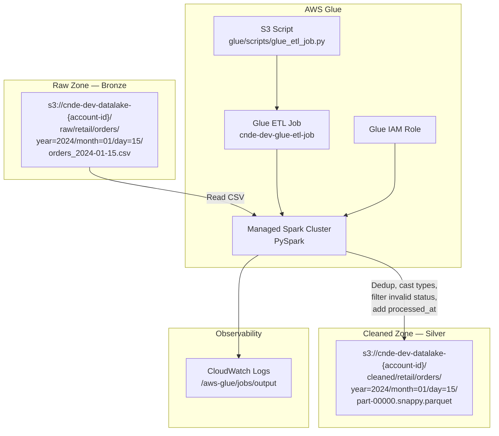
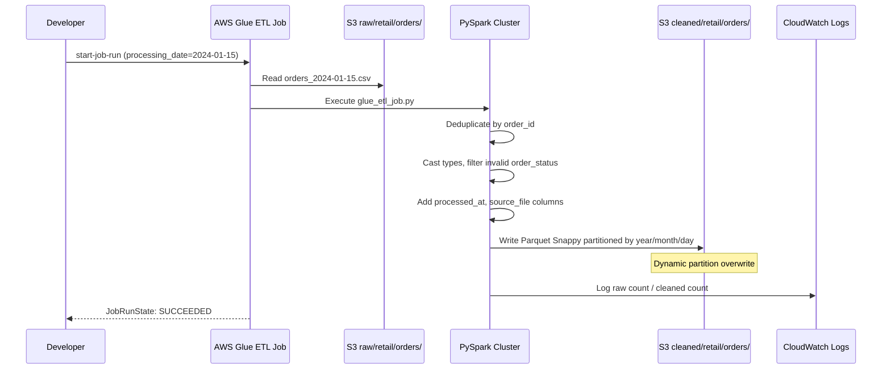

# Lab 3.1 Architecture — Build Raw → Cleaned ETL with AWS Glue

Transform RetailCo order data from raw CSV to cleaned Parquet using an AWS Glue ETL job with deduplication, type casting, and Hive partitioning.

## ETL Pipeline Overview

## ETL Job Execution Sequence

## Key Components

| Component | AWS Service | Purpose |
|-----------|-------------|---------|
| ETL Script | Amazon S3 + AWS Glue | PySpark transformation logic stored at `glue/scripts/glue_etl_job.py` |
| Glue ETL Job | AWS Glue | Managed Spark job reading raw CSV and writing cleaned Parquet |
| Glue IAM Role | AWS IAM | S3 read on `raw/*`, write on `cleaned/*`, CloudWatch logging |
| Glue Data Catalog | AWS Glue | Database `cnde_dev_datalake` for table metadata (used in Lab 3.2) |
| Raw Input | Amazon S3 | Hive-partitioned CSV from Lab 1.2 RetailCo orders |
| Cleaned Output | Amazon S3 | Snappy-compressed Parquet with schema contract enforcement |
| Terraform Module | Terraform | IaC deployment of Glue job, role, catalog, and script location |

## S3 Path Conventions

| Zone | Path Pattern | Example |
|------|--------------|---------|
| Raw input | `s3://{bucket}/raw/{domain}/{dataset}/year={YYYY}/month={MM}/day={DD}/orders_{date}.csv` | `s3://cnde-dev-datalake-123456789012/raw/retail/orders/year=2024/month=01/day=15/orders_2024-01-15.csv` |
| ETL script | `s3://{bucket}/glue/scripts/glue_etl_job.py` | `s3://cnde-dev-datalake-123456789012/glue/scripts/glue_etl_job.py` |
| Cleaned output | `s3://{bucket}/cleaned/{domain}/{dataset}/year={YYYY}/month={MM}/day={DD}/part-*.snappy.parquet` | `s3://cnde-dev-datalake-123456789012/cleaned/retail/orders/year=2024/month=01/day=15/part-00000.snappy.parquet` |

### Job Parameters

| Parameter | Example Value | Purpose |
|-----------|---------------|---------|
| `--raw_bucket` | `cnde-dev-datalake-{account-id}` | Source bucket |
| `--cleaned_bucket` | `cnde-dev-datalake-{account-id}` | Target bucket |
| `--dataset_path` | `retail/orders` | Domain/dataset path segment |
| `--processing_date` | `2024-01-15` | Partition date for idempotent overwrite |

### Transformation Summary

| Step | Action |
|------|--------|
| Read | CSV with header from Hive-partitioned raw path |
| Dedup | Remove duplicate `order_id` records |
| Cast | Apply typed schema (int, double, timestamp) |
| Filter | Exclude invalid `order_status` values |
| Enrich | Add `processed_at` and `source_file` lineage columns |
| Write | Parquet Snappy with dynamic partition overwrite |
