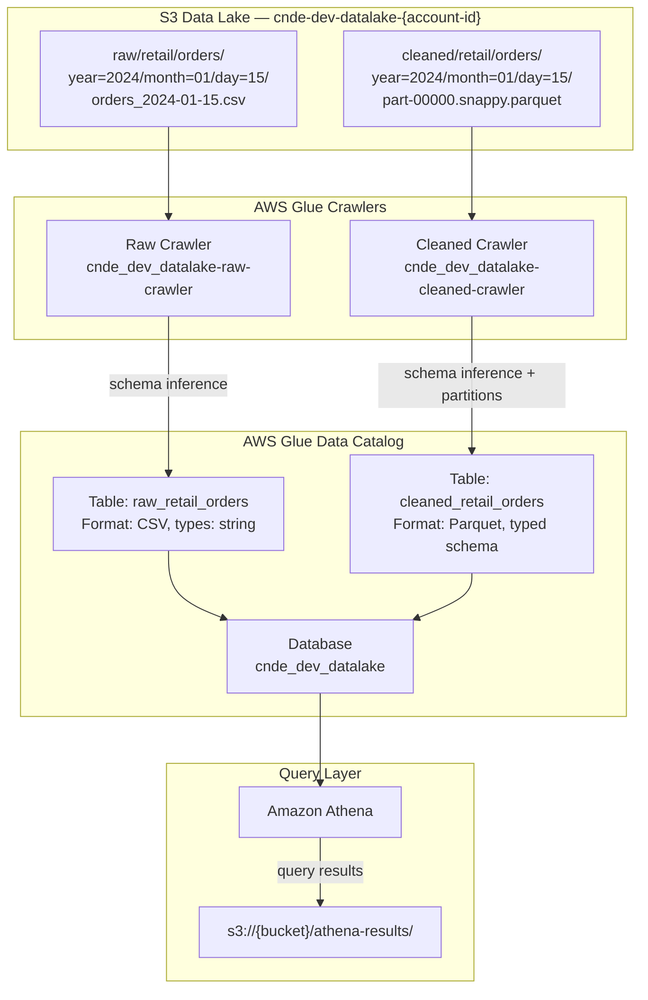
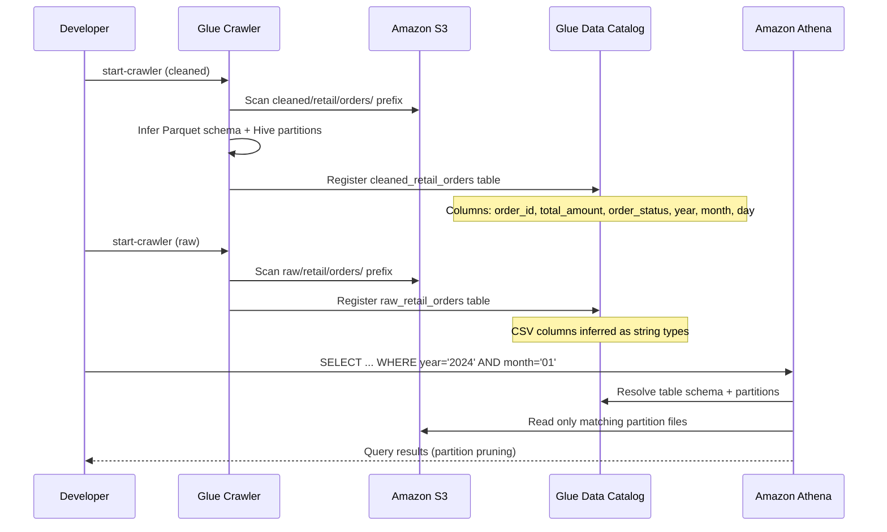
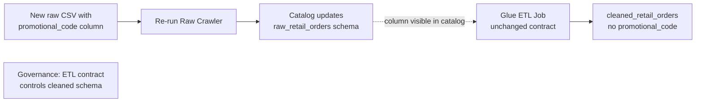

# Lab 3.2 Architecture — Glue Crawlers and the Data Catalog

Discover and register RetailCo raw and cleaned dataset schemas in the AWS Glue Data Catalog for SQL analytics via Amazon Athena.

## Catalog Discovery Architecture



## Crawler Run Sequence



## Schema Evolution Flow



## Key Components

| Component | AWS Service | Purpose |
|-----------|-------------|---------|
| Raw Crawler | AWS Glue Crawler | Discovers CSV schema and Hive partitions in `raw/retail/orders/` |
| Cleaned Crawler | AWS Glue Crawler | Registers typed Parquet schema from `cleaned/retail/orders/` |
| Data Catalog Database | AWS Glue Data Catalog | Central metadata repository (`cnde_dev_datalake`) |
| Catalog Tables | AWS Glue Data Catalog | `raw_retail_orders` and `cleaned_retail_orders` table definitions |
| Athena | Amazon Athena | Serverless SQL queries against cataloged tables |
| Query Results | Amazon S3 | Athena output stored at `athena-results/` prefix |
| Glue IAM Role | AWS IAM | Crawler execution role with S3 read and catalog write permissions |

## S3 Path Conventions

| Target | Crawler S3 Path | Catalog Table |
|--------|-----------------|---------------|
| Raw orders | `s3://{bucket}/raw/retail/orders/` | `cnde_dev_datalake.raw_retail_orders` |
| Cleaned orders | `s3://{bucket}/cleaned/retail/orders/` | `cnde_dev_datalake.cleaned_retail_orders` |
| Athena results | `s3://{bucket}/athena-results/` | N/A (query output only) |

### Crawler Configuration

| Setting | Recommended Value | Purpose |
|---------|-------------------|---------|
| Recrawl policy | `CRAWL_NEW_FOLDERS_ONLY` | Avoid re-scanning unchanged partitions |
| Schema update | `UPDATE_IN_DATABASE` | Reflect new columns in catalog |
| Schema delete | `LOG` | Never silently delete columns in production |
| Table prefix | `raw_` / `cleaned_` | Consistent naming across zones |

### Example Athena Query

```sql
SELECT order_status, COUNT(*) AS order_count, SUM(total_amount) AS revenue
FROM cnde_dev_datalake.cleaned_retail_orders
WHERE year = '2024' AND month = '01' AND day = '15'
GROUP BY order_status;
```
