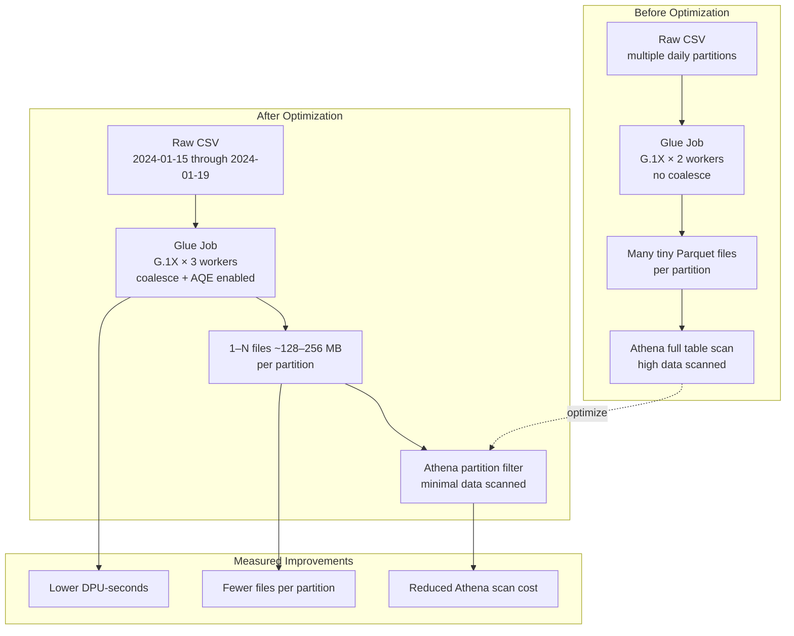
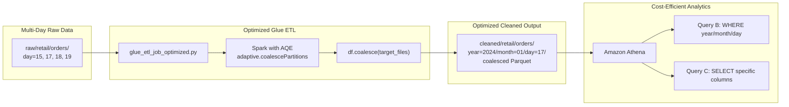
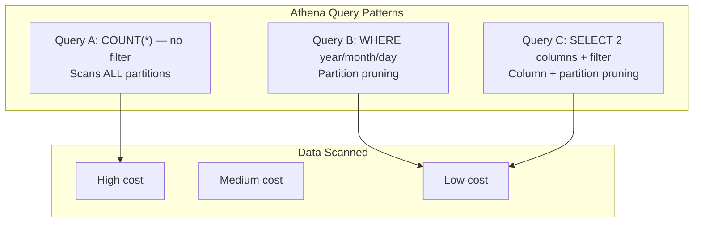

# Lab 3.3 Architecture — ETL Optimization (Partitioning and Parquet)

Optimize RetailCo Glue ETL performance and Athena query costs through file coalescing, partition pruning, worker tuning, and Spark adaptive execution.

## Before vs After Optimization

## Optimization Pipeline

## Athena Query Cost Comparison

## Key Components

| Component | AWS Service | Purpose |
|-----------|-------------|---------|
| Optimized ETL Script | AWS Glue + S3 | Coalesced Parquet writes at `glue/scripts/glue_etl_job.py` |
| Glue Workers | AWS Glue | Right-sized `G.1X` worker count (2–5) for cost/performance balance |
| Spark AQE | AWS Glue (Spark) | Adaptive query execution for runtime partition coalescing |
| Cleaned Parquet | Amazon S3 | Snappy-compressed, right-sized files in Hive partitions |
| Glue Data Catalog | AWS Glue | Partition metadata enabling Athena partition pruning |
| Athena | Amazon Athena | SQL analytics with scan cost measurement |
| CloudWatch | Amazon CloudWatch | Job metrics: ExecutionTime, DPUSeconds |

## S3 Path Conventions

| Path | Pattern | Optimization Notes |
|------|---------|-------------------|
| Raw (multi-day) | `s3://{bucket}/raw/retail/orders/year={Y}/month={M}/day={D}/orders_{date}.csv` | Load 2024-01-15, 17, 18, 19 for meaningful benchmarks |
| Cleaned (optimized) | `s3://{bucket}/cleaned/retail/orders/year={Y}/month={M}/day={D}/part-*.parquet` | Target 1–N files per partition via `coalesce()` |
| ETL script | `s3://{bucket}/glue/scripts/glue_etl_job.py` | Overwrite with optimized variant |

### Optimization Techniques Applied

| Technique | Where Applied | Expected Impact |
|-----------|---------------|-----------------|
| File coalescing | Glue ETL write step | Fewer, larger Parquet files per partition |
| Dynamic partition overwrite | Spark config | Idempotent re-runs without full dataset rewrite |
| Partition pruning | Athena WHERE clause | Scan only target day partition |
| Column pruning | Athena SELECT clause | Read only required Parquet columns |
| Worker tuning | Terraform `number_of_workers` | Balance DPU-seconds vs runtime SLA |
| AQE | Spark `--conf` settings | Adaptive shuffle partition coalescing |

### Baseline vs Optimized Metrics

| Metric | Before | After (Target) |
|--------|--------|----------------|
| DPU-seconds | Higher | 20–50% reduction |
| Files per partition | Many small files | 1–N coalesced files |
| Athena Query A scan | Full table | N/A (avoid in production) |
| Athena Query B scan | N/A | Single partition only |
