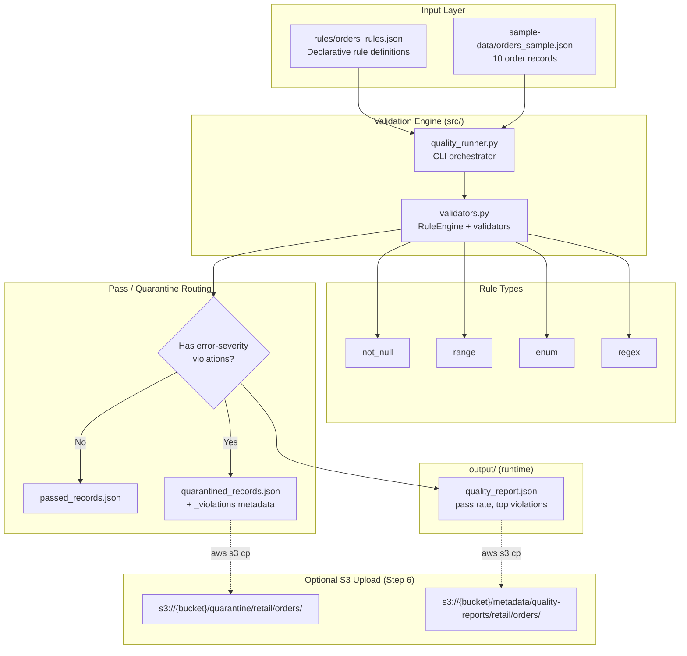
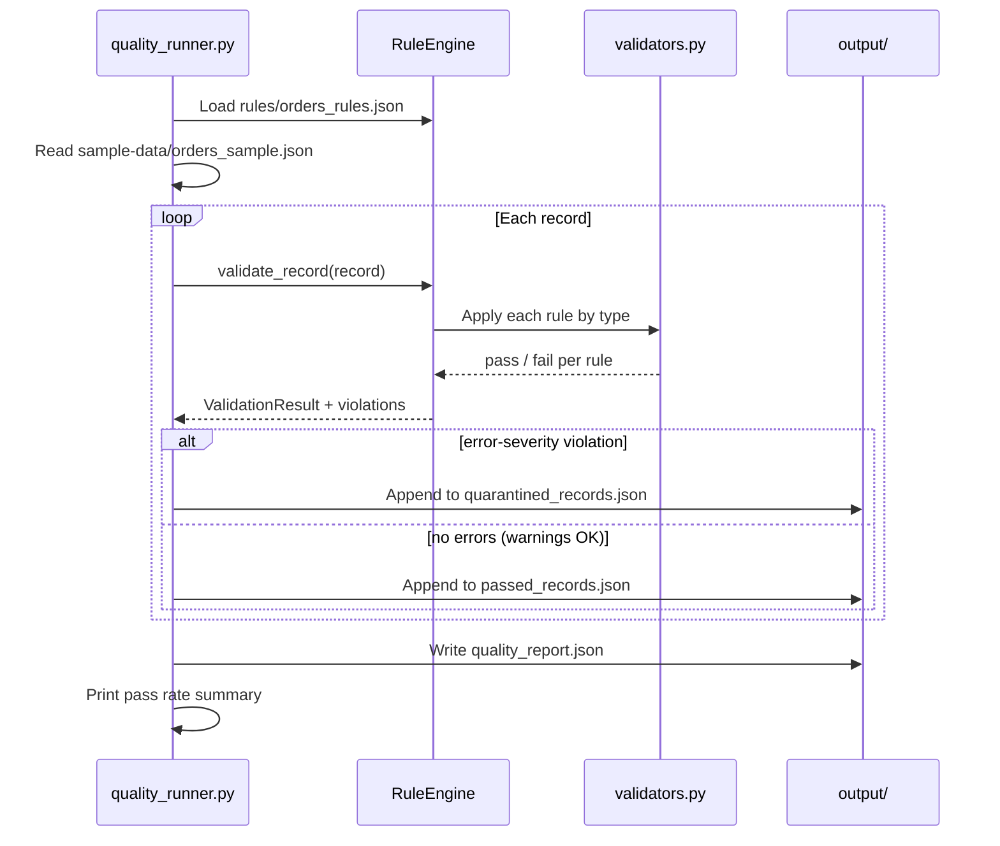

# Lab 4.1: Data Quality Validation Framework — Architecture Diagram

## Purpose

Build a declarative, reusable data quality validation framework that applies JSON-defined rules (`not_null`, `range`, `enum`, `regex`) to order records, routes passing records to output and failing records to quarantine, and generates a quality report with pass rates and violation breakdowns. This lab establishes the foundation pattern used in Labs 4.2 and 4.3 and maps to production tools like Great Expectations and AWS Deequ.

---

## Architecture Overview



---

## Validation Sequence



---

## Key Components

| Component | Location | Role |
|-----------|----------|------|
| `orders_rules.json` | `rules/` | Declarative validation policy (field, type, severity, params) |
| `orders_sample.json` | `sample-data/` | 10-record test dataset with intentional violations |
| `validators.py` | `src/` | `RuleEngine` class + `validate_not_null`, `validate_range`, `validate_enum`, `validate_regex` |
| `quality_runner.py` | `src/` | CLI entry point; batch validation, routing, report generation |
| `passed_records.json` | `output/` | Records passing all error-severity rules |
| `quarantined_records.json` | `output/` | Failed records with `_violations` array |
| `quality_report.json` | `output/` | Summary stats, pass rate, top violation counts |

---

## S3 Paths & Data Flow

| Stage | Path / Location | Format | Notes |
|-------|-----------------|--------|-------|
| Rules (local) | `rules/orders_rules.json` | JSON | Versioned policy; upload to S3 in Lab 4.2 |
| Input (local) | `sample-data/orders_sample.json` | JSON | Simulates raw ingest batch |
| Passed (local) | `output/passed_records.json` | JSON | 7 records in default sample run |
| Quarantined (local) | `output/quarantined_records.json` | JSON | 3 records; each has `_violations` |
| Quality report (local) | `output/quality_report.json` | JSON | Pass rate, batch_id, top_violations |
| Quarantine (S3, optional) | `s3://{bucket}/quarantine/retail/orders/year={Y}/month={M}/day={D}/quarantined_records.json` | JSON | Hive-style date partition |
| Quality reports (S3, optional) | `s3://{bucket}/metadata/quality-reports/retail/orders/{DATE}_report.json` | JSON | SLO tracking and audit trail |

### Data Flow Summary

```text
orders_rules.json ──┐
                    ├──► RuleEngine ──► per-record validation ──┬──► passed_records.json
orders_sample.json ─┘                                          ├──► quarantined_records.json (+ _violations)
                                                                └──► quality_report.json
                                                                          │
                                                                          ▼ (optional)
                                                              metadata/quality-reports/ + quarantine/
```

### Severity Routing Logic

| Severity | Example Rule | On Failure |
|----------|--------------|------------|
| `error` | `amount_in_range`, `status_valid` | Record quarantined |
| `warning` | `email_format` | Record passes (unless `--strict` flag) |

---

## Related Labs

- **Previous:** Module 3 Glue ETL (cleaned data source)
- **Next:** [Lab 4.2 – Validation Automation](../lab-4.2-validation-automation/diagram.md)
