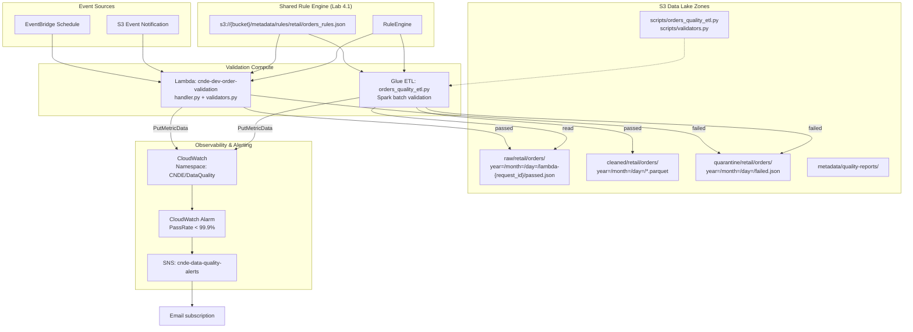
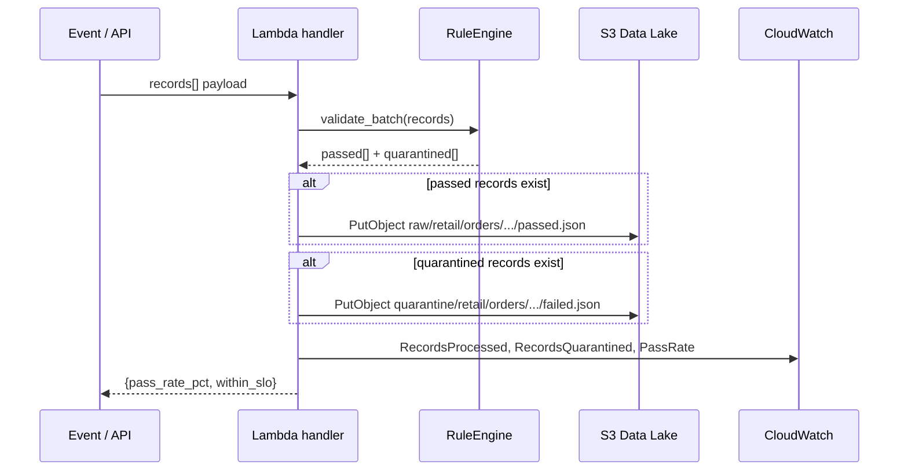
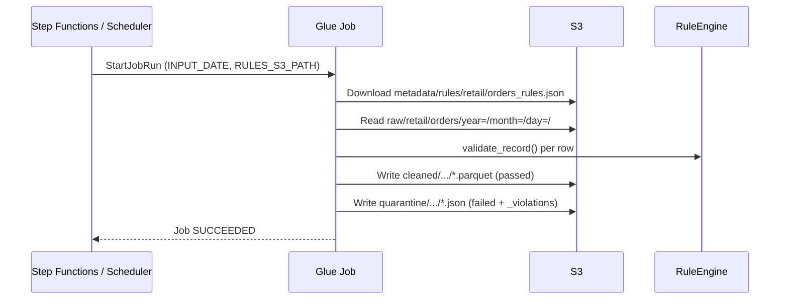

# Lab 4.2: Validation Automation in ETL Pipelines — Architecture Diagram

## Purpose

Integrate the Lab 4.1 validation framework into production AWS pipelines at two stages: lightweight **Lambda** validation at ingestion time and **Glue ETL** batch validation at scale. Publish quality metrics to **CloudWatch**, trigger **SNS** alerts when pass rate falls below the 99.9% SLO, and store versioned rules in S3 for decoupled policy management.

---

## Architecture Overview



---

## Lambda Ingestion Sequence



---

## Glue Batch Validation Sequence



---

## Key Components

| Component | Service | Role |
|-----------|---------|------|
| `cnde-dev-order-validation` | Lambda | Ingestion-time validation; writes raw/quarantine; publishes metrics |
| `orders_quality_etl.py` | Glue | Batch read raw CSV → validate → write Parquet cleaned + JSON quarantine |
| `validators.py` | Shared library | Lab 4.1 RuleEngine reused in Lambda zip and Glue Python path |
| `orders_rules.json` | S3 metadata | Versioned declarative rules; updatable without code redeploy |
| `CNDE/DataQuality` | CloudWatch | Custom namespace: `RecordsProcessed`, `RecordsQuarantined`, `PassRate` |
| `cnde-orders-pass-rate-below-slo` | CloudWatch Alarm | Fires when `PassRate` < 99.9% for `Dataset=retail/orders` |
| `cnde-data-quality-alerts` | SNS | Email/Slack notification on SLO breach |

---

## S3 Paths & Data Flow

| Zone | S3 Path Pattern | Written By | Format |
|------|-----------------|------------|--------|
| Raw (passed) | `s3://{bucket}/raw/retail/orders/year={Y}/month={M}/day={D}/lambda-{request_id}/passed.json` | Lambda | JSON |
| Cleaned | `s3://{bucket}/cleaned/retail/orders/year={Y}/month={M}/day={D}/` | Glue | Parquet |
| Quarantine (Lambda) | `s3://{bucket}/quarantine/retail/orders/year={Y}/month={M}/day={D}/lambda-{request_id}/failed.json` | Lambda | JSON |
| Quarantine (Glue) | `s3://{bucket}/quarantine/retail/orders/year={Y}/month={M}/day={D}/glue-run-{HHMMSS}/` | Glue | JSON |
| Rules | `s3://{bucket}/metadata/rules/retail/orders_rules.json` | Manual upload | JSON |
| Inventory rules | `s3://{bucket}/metadata/rules/retail/inventory_rules.json` | Example | JSON |
| Glue scripts | `s3://{bucket}/scripts/orders_quality_etl.py` | Deploy | Python |

### End-to-End Data Flow

```text
EventBridge / S3 Event
        │
        ├──► Lambda ──► RuleEngine ──┬──► raw/retail/orders/ (passed)
        │                            └──► quarantine/retail/orders/ (failed)
        │
        └──► Glue ETL ──► RuleEngine ──┬──► cleaned/retail/orders/ (Parquet)
                                       └──► quarantine/retail/orders/ (JSON)

Both paths ──► CloudWatch metrics ──► Alarm (PassRate < 99.9%) ──► SNS
```

### CloudWatch Metric Dimensions

| Metric | Unit | Dimension | SLO |
|--------|------|-----------|-----|
| `RecordsProcessed` | Count | `Dataset=retail/orders` | — |
| `RecordsQuarantined` | Count | `Dataset=retail/orders` | — |
| `PassRate` | Percent | `Dataset=retail/orders` | ≥ 99.9% |

---

## Related Labs

- **Previous:** [Lab 4.1 – Quality Framework](../lab-4.1-quality-framework/diagram.md)
- **Next:** [Lab 4.3 – Quarantine Zone](../lab-4.3-quarantine-zone/diagram.md)
