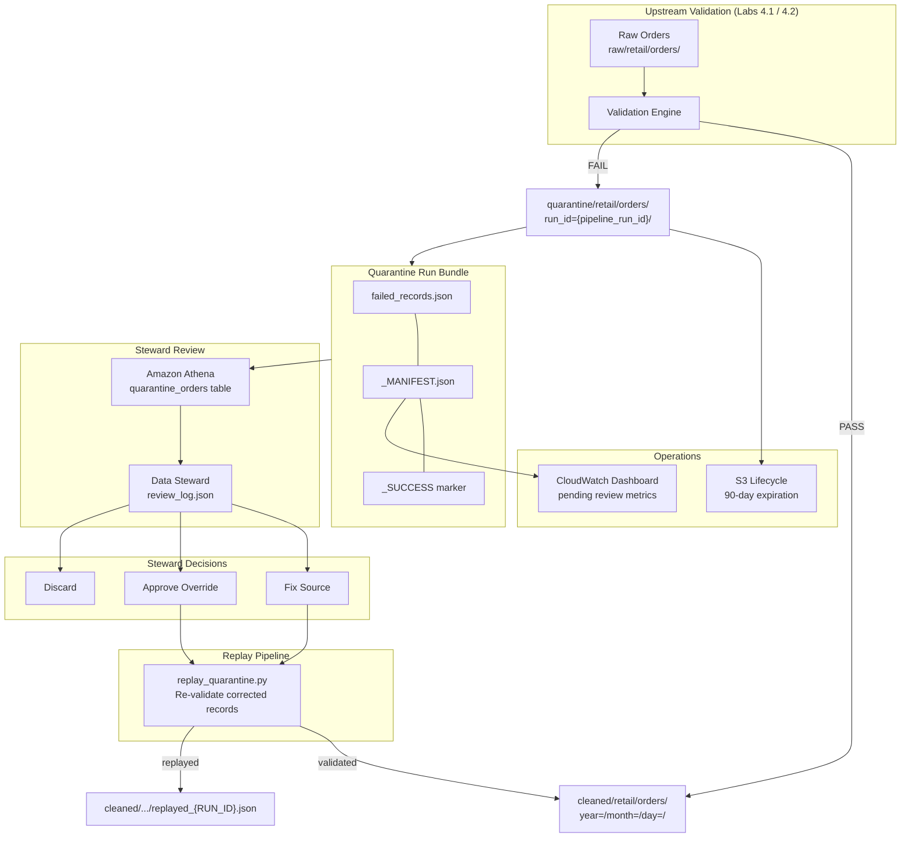
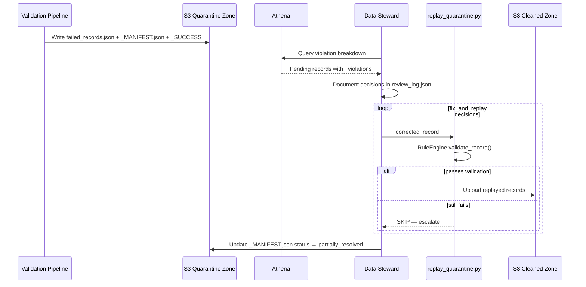

# Lab 4.3: Bad Record Isolation and Quarantine Zone — Architecture Diagram

## Purpose

Implement enterprise quarantine zone conventions on S3: isolate failed records with rich violation metadata, enable data steward review via Athena, replay corrected records back into the cleaned zone, and configure lifecycle policies for quarantine retention. This lab closes the quality loop started in Labs 4.1 and 4.2.

---

## Architecture Overview



---

## Steward Review Sequence



---

## Key Components

| Component | Location / Service | Role |
|-----------|-------------------|------|
| Quarantine zone | `s3://{bucket}/quarantine/retail/orders/` | First-class S3 zone for failed records |
| `failed_records.json` | Per run_id prefix | Enriched records with `_violations`, `_quarantine_timestamp`, `_source_path`, `_batch_id` |
| `_MANIFEST.json` | Per run_id prefix | Run metadata: violation summary, pass rate, `status=pending_review` |
| `_SUCCESS` | Per run_id prefix | Orchestration marker (Step Functions checks this) |
| `quarantine_orders` | Glue Data Catalog / Athena | External JSON table for steward queries |
| `review_log.json` | Local / metadata | Steward decisions: `fix_and_replay`, `discard`, notes |
| `replay_quarantine.py` | `scripts/` | Re-validates corrected records before cleaned zone write |
| Lifecycle rule | S3 bucket policy | 90-day expiration on `quarantine/` prefix |

---

## S3 Paths & Data Flow

### Quarantine Path Structure

```text
s3://{bucket}/quarantine/{domain}/{dataset}/year={YYYY}/month={MM}/day={DD}/
    run_id={pipeline_run_id}/
        failed_records.json
        violations_summary.json
        _MANIFEST.json
        _SUCCESS
```

### Path Reference Table

| Path | Example | Purpose |
|------|---------|---------|
| Quarantine root | `s3://{bucket}/quarantine/retail/orders/` | Athena external table LOCATION |
| Run bundle | `.../year=2024/month=01/day=15/run_id=lab43-20240115-143000/` | Isolated batch for review |
| Failed records | `.../failed_records.json` | Quarantined rows + metadata |
| Manifest | `.../_MANIFEST.json` | Run summary, violation counts, review status |
| Success marker | `.../_SUCCESS` | Signals write completion to orchestrators |
| Replay target | `s3://{bucket}/cleaned/retail/orders/year={Y}/month={M}/day={D}/replayed_{RUN_ID}.json` | Steward-corrected records |
| Cleaned (normal) | `s3://{bucket}/cleaned/retail/orders/year={Y}/month={M}/day={D}/` | Standard validated output |

### Required Record Metadata

| Field | Example | Purpose |
|-------|---------|---------|
| `_violations` | `[{"rule":"amount_in_range",...}]` | Why the record failed |
| `_quarantine_timestamp` | `2024-01-15T14:30:00Z` | When isolated |
| `_source_path` | `s3://.../raw/.../orders.csv` | Lineage / traceability |
| `_batch_id` | `lab43-20240115-143000` | Pipeline run ID |
| `_record_hash` | `sha256:abc123...` | Deduplication on replay |
| `_replayed_at` | `2024-01-15T16:30:00Z` | Set on successful replay |
| `_original_quarantine_run` | `lab43-20240115-143000` | Links replay to source run |

### Data Flow Summary

```text
Validation FAIL
      │
      ▼
quarantine/retail/orders/run_id={id}/
      ├── failed_records.json
      ├── _MANIFEST.json (status: pending_review)
      └── _SUCCESS
      │
      ▼
Athena query ──► Steward review ──► review_log.json
      │
      ▼
replay_quarantine.py (re-validate)
      │
      ├──► cleaned/retail/orders/replayed_{RUN_ID}.json
      └──► _MANIFEST.json updated (status: partially_resolved)
```

### Operational Metrics

| Metric | Source | Alert Threshold |
|--------|--------|-----------------|
| Quarantine volume (daily) | S3 inventory | > 1% of daily ingest |
| Pending review count | `_MANIFEST.json` status | > 100 records for 48h |
| Replay success rate | Replay job logs | < 95% |
| Time-to-resolution | Review − quarantine timestamp | > 72 hours |

---

## Related Labs

- **Previous:** [Lab 4.2 – Validation Automation](../lab-4.2-validation-automation/diagram.md)
- **Next:** Module 5 – Star Schema Modeling
