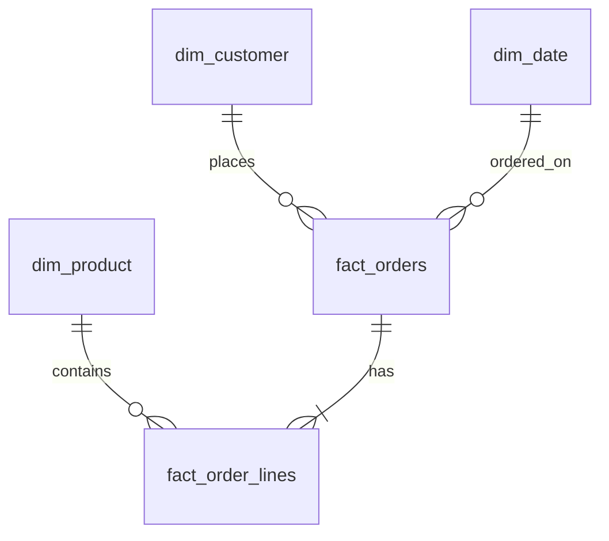

# Assignment 5: Analytics Model Design for E-Commerce

**Due:** End of Week 5 · **Weight:** Part of Assignments (20%)

---

## Scenario

**RetailCo** has operational pipelines from Modules 1–4: orders flow from Lambda ingestion → Glue ETL → quality validation → cleaned Parquet. Finance and marketing need a **curated analytics layer** they can query in Athena without understanding raw JSON or cleaned column renames.

Stakeholder requirements:

- **Finance:** Daily revenue by product category, refunds excluded, USD normalized
- **Marketing:** Customer cohort analysis by first-order month and acquisition channel
- **Operations:** Order fulfillment SLA metrics (hours from order to ship)
- **Executive:** Monthly KPI dashboard with &lt; $50/month Athena spend for scheduled queries

Current pain points:

- Analysts query `cleaned_retail_orders` directly with inconsistent filters
- Duplicate customer records appear when email changes (no SCD strategy)
- Ad hoc queries scanned 2.4 TB last month ($12,000 unbudgeted)
- Product hierarchy (category → subcategory → SKU) not modeled

---

## Your Task

Design a **complete analytics data model** for RetailCo e-commerce. Your document is the blueprint engineering will implement in curated S3 and the Glue Data Catalog.

---

## Deliverables

Submit a document (4–5 pages) containing:

### 1. Executive Summary (½ page)

- Business questions the model must answer
- Proposed star/snowflake approach and why
- Expected cost and performance improvements vs querying cleaned directly

### 2. Dimensional Model Diagram (1 page)

Include an entity diagram (draw.io, Mermaid, or ASCII) showing:

- At least **3 dimensions** (e.g., `dim_customer`, `dim_product`, `dim_date`)
- At least **2 fact tables** (e.g., `fact_orders`, `fact_order_lines` OR `fact_returns`)
- Primary keys, foreign keys, and grain statement for each fact

**Example Mermaid starter (extend in your submission):**



### 3. Table Specifications (1½ pages)

For **each** table (minimum 5 tables total), provide:

| Column | Description |
|--------|-------------|
| Table name | e.g., `fact_orders` |
| Grain | One row per … |
| S3 location | `s3://retailco-prod-datalake/curated/retail/...` |
| Format | Parquet + compression |
| Partition keys | With justification |
| Key measures / attributes | List with types |
| Source mapping | Which cleaned/raw fields populate it |
| Refresh cadence | Hourly, daily, etc. |

### 4. SCD and Conformed Dimension Strategy (½ page)

- How will changing customer emails be handled (Type 1 vs 2)?
- Is `dim_date` a conformed dimension across facts?
- Product hierarchy: flatten into `dim_product` or bridge table?

### 5. Athena Cost Control Plan (1 page)

| Element | Your Definition |
|---------|-----------------|
| Partition strategy | Per table |
| Summary / aggregate tables | Names, grain, refresh |
| View layer | List analyst-facing views with mandatory filters |
| Workgroup policies | Scan limits, engine version, result path |
| Ad hoc vs scheduled guidance | Rules for analysts |
| Target scan per dashboard query | MB or GB |

Reference Lab 5.2 and 5.3 optimization patterns.

### 6. Sample Analytics SQL (½ page)

Provide **3 production-ready queries** your model supports:

1. Daily revenue by category (last 7 days)
2. Customer cohort retention (month-over-month)
3. Fulfillment SLA breach count

Each query must use partition filters and list expected tables joined.

### 7. Migration Plan from Cleaned (½ page)

Phased rollout:

1. Phase 1 — Core star schema (which tables first)
2. Phase 2 — Summary tables and views
3. Phase 3 — Deprecate direct cleaned access for analysts

Include validation checks (row counts, revenue reconciliation tolerance 0.01%).

---

## Grading Rubric

| Criterion | Points |
|-----------|--------|
| Dimensional model completeness and correct grain | 25 |
| Partition and physical design (S3, Parquet) | 20 |
| SCD / conformed dimension rationale | 15 |
| Cost control plan realistic and measurable | 20 |
| Sample SQL correctness and partition usage | 10 |
| Clarity, professionalism, diagram quality | 10 |
| **Total** | **100** |

---

## Submission Format

- File: `assignment-05-{your-name}.md` or PDF
- Include Mermaid or diagram image
- Optional: attach Lab 5.1 DDL scripts with modifications noted

---

## Reference Paths

```text
s3://retailco-prod-datalake/cleaned/retail/orders/year=2024/month=01/day=15/
s3://retailco-prod-datalake/curated/retail/dim_customer/
s3://retailco-prod-datalake/curated/retail/dim_product/
s3://retailco-prod-datalake/curated/retail/fact_orders/year=2024/month=01/
s3://retailco-prod-datalake/athena-results/
s3://retailco-prod-datalake/metadata/dictionaries/
```

---

## Tips

- Reference [Week 5 Lecture](../lectures/week-05-lecture.md) for partitioning and cost patterns
- Build on Module 4 pass-rate: document how quarantine affects fact completeness
- Finance needs order grain; marketing may need line-item grain—justify your choice
- Pre-aggregate for executive KPIs to meet the $50/month scan budget

---

**Next week:** [Module 6 – Orchestration & Workflow Automation](../../module-06-orchestration/README.md)
