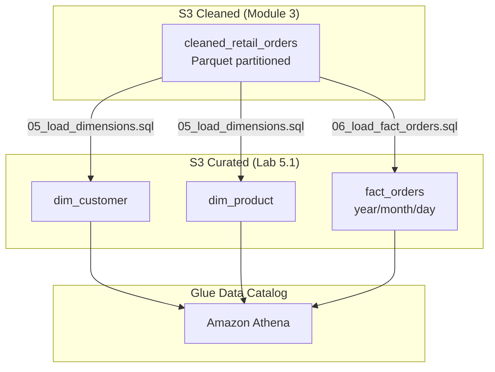

# Lab 5.1: Build Star Schema (dim_customer, dim_product, fact_orders)

> 📊 **Diagrams:** [Mermaid](diagram.md) · [Draw.io (lab-5.1-star-schema.drawio)](../../../../docs/diagrams/drawio/lab-5.1-star-schema.drawio) · [PNG](../../../../docs/diagrams/png/lab-5.1-star-schema.png) · [SVG](../../../../docs/diagrams/svg/lab-5.1-star-schema.svg)

**Estimated time:** 120 minutes · **Module 5**

---

## Objectives

- Create curated dimension and fact tables in the Glue Data Catalog
- Deploy Athena DDL for `dim_customer`, `dim_product`, and `fact_orders`
- Load data from Module 3 cleaned orders with surrogate keys
- Validate star joins and referential integrity
- Document S3 curated layout aligned with Module 1 zones

---

## Prerequisites

- Modules 1–4 complete (S3 lake, Glue ETL, cleaned orders data)
- Athena workgroup with query results path configured
- `cleaned_retail_orders` table in Glue catalog (Module 3 Lab 3.2 crawler)
- Replace `YOUR_BUCKET` in all SQL scripts with your data lake bucket

---


## Platform Setup

From the **repository root**, start the shared lab environment (once per session):

```bash
./scripts/lab-cycle.sh start
source ./scripts/lab-env.sh
```

Stop when finished: `./scripts/lab-cycle.sh stop --yes` (avoids ongoing AWS charges).

---


## Architecture



```text
s3://{bucket}/curated/retail/
├── dim_customer/*.parquet
├── dim_product/*.parquet
└── fact_orders/year=YYYY/month=MM/day=DD/*.parquet
```

---

## Project Structure

```text
lab-5.1-star-schema/
├── README.md
└── scripts/
    ├── 01_create_database.sql
    ├── 02_create_dim_customer.sql
    ├── 03_create_dim_product.sql
    ├── 04_create_fact_orders.sql
    ├── 05_load_dimensions.sql
    ├── 06_load_fact_orders.sql
    └── 07_validation_queries.sql
```

---

## Step 1: Configure Environment

```bash
export BUCKET=$(cd ../../../../../infrastructure/environments/dev && terraform output -raw data_lake_bucket)
export DATABASE=cnde_dev_datalake
export AWS_REGION=us-east-1
echo "Bucket: $BUCKET  Database: $DATABASE"
```

Replace `YOUR_BUCKET` in every script:

```bash
cd modules/module-05-modeling-analytics/labs/lab-5.1-star-schema/scripts
sed -i.bak "s/YOUR_BUCKET/${BUCKET}/g" *.sql && rm -f *.bak
```

---

## Step 2: Run DDL Scripts in Order

Open **Amazon Athena** → Query editor. Run scripts **01 through 04** sequentially.

| Script | Purpose |
|--------|---------|
| `01_create_database.sql` | Ensure catalog database exists |
| `02_create_dim_customer.sql` | External dimension table |
| `03_create_dim_product.sql` | External dimension table |
| `04_create_fact_orders.sql` | Partitioned fact table |

**Verification:**

```sql
SHOW TABLES IN cnde_dev_datalake;
```

Expected tables include `dim_customer`, `dim_product`, `fact_orders`.

---

## Step 3: Align Cleaned Table Schema (If Needed)

Lab load SQL expects cleaned columns from Module 3. If your crawler used different names, create a view:

```sql
CREATE OR REPLACE VIEW cleaned_retail_orders AS
SELECT
  order_id,
  customer_id,
  COALESCE(customer_name, 'Unknown') AS customer_name,
  customer_email,
  sku,
  COALESCE(product_name, sku) AS product_name,
  category,
  subcategory,
  brand,
  order_timestamp,
  order_date,
  status,
  quantity,
  unit_price,
  discount_amount,
  order_amount,
  currency,
  fulfillment_hours,
  source_system,
  etl_batch_id,
  year,
  month,
  day
FROM cnde_dev_datalake.cleaned_retail_orders;
```

Adjust column names to match your Module 3 output.

---

## Step 4: Load Dimensions

Run `05_load_dimensions.sql` in Athena. This uses **CTAS** to write Parquet to curated prefixes.

**Verification:**

```bash
aws s3 ls "s3://${BUCKET}/curated/retail/dim_customer/" --recursive | head
aws s3 ls "s3://${BUCKET}/curated/retail/dim_product/" --recursive | head
```

```sql
SELECT COUNT(*) AS customer_count FROM cnde_dev_datalake.dim_customer;
SELECT COUNT(*) AS product_count FROM cnde_dev_datalake.dim_product;
```

---

## Step 5: Load Fact Table

1. Confirm cleaned data exists for the target date:

```bash
aws s3 ls "s3://${BUCKET}/cleaned/retail/orders/year=2024/month=01/day=15/" --recursive | head
```

2. Run `06_load_fact_orders.sql` (adjust `year/month/day` if needed).

3. Repair partitions:

```sql
MSCK REPAIR TABLE cnde_dev_datalake.fact_orders;
```

---

## Step 6: Validate Star Schema

Run `07_validation_queries.sql`.

| Check | Expected |
|-------|----------|
| Fact row count | Matches cleaned orders for partition (minus cancelled if filtered) |
| Category revenue | Non-empty when data exists |
| Orphan facts query | **0 rows** |

---

## Step 7: Document Your Work

Create `LAB-REPORT.md`:

```markdown
# Lab 5.1 Report

## Tables Created
- dim_customer, dim_product, fact_orders

## Row Counts
| Table | Count |
|-------|-------|
| ... | ... |

## Sample Star Join
[Paste revenue-by-category result]

## S3 Paths Verified
- [ ] dim_customer
- [ ] dim_product
- [ ] fact_orders partition

## Issues Encountered
- ...
```

---

## Deliverables

- [ ] All DDL scripts executed without errors
- [ ] Dimensions and facts populated under `curated/retail/`
- [ ] `07_validation_queries.sql` passes (0 orphan rows)
- [ ] `LAB-REPORT.md` with row counts and sample join output

---

## Troubleshooting

| Issue | Solution |
|-------|----------|
| `TABLE_NOT_FOUND: cleaned_retail_orders` | Run Module 3 crawler on cleaned prefix first |
| `COLUMN_NOT_FOUND` in load SQL | Map columns via view in Step 3 |
| `HIVE_PARTITION_SCHEMA_MISMATCH` | Use zero-padded `month=01`, `day=15` |
| CTAS location already exists | Drop staging table or use new `external_location` suffix |
| `INSERT` not supported on external table | Use CTAS for initial load; or convert to Iceberg (advanced) |
| 0 rows in fact after load | Check date partition matches cleaned data; verify INNER JOIN keys |
| MSCK returns 0 partitions | Confirm S3 path `fact_orders/year=.../month=.../day=.../` exists |

---

## What You Learned

- Star schema design with surrogate keys on a data lake
- Hive-style partitions propagated from cleaned to curated
- CTAS and INSERT patterns for Athena curated loads
- Validation queries for analytics-ready datasets

---

**Next:** [Lab 5.2 – Athena Query Optimization](../lab-5.2-athena-optimization/README.md)
