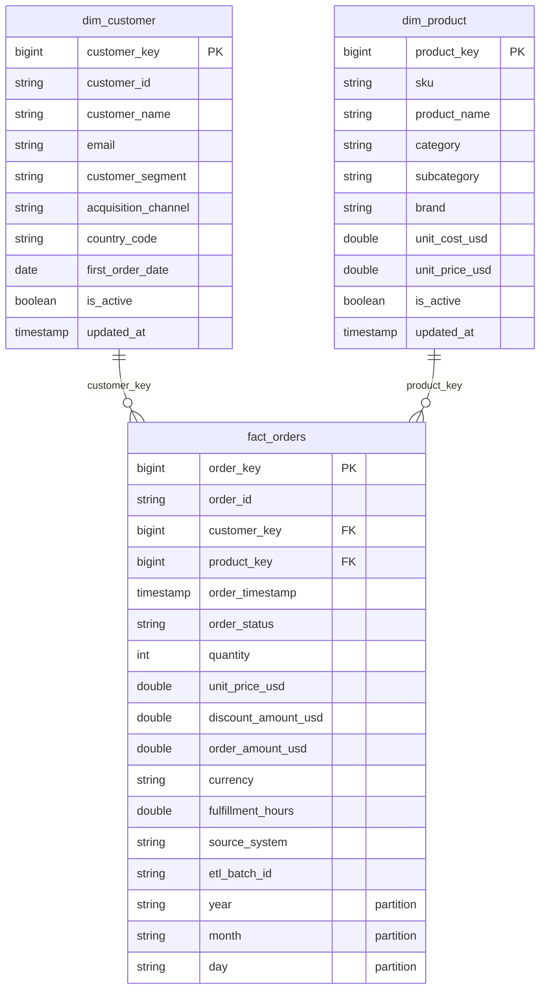
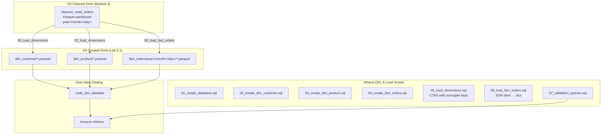
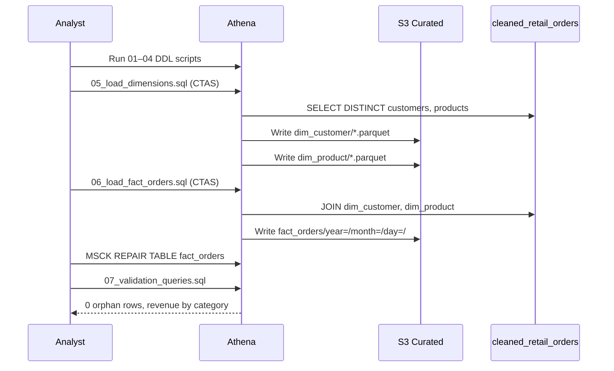

# Lab 5.1: Build Star Schema — Architecture Diagram

## Purpose

Create a curated analytics star schema in the Glue Data Catalog with dimension tables (`dim_customer`, `dim_product`) and a partitioned fact table (`fact_orders`). Load data from Module 3 cleaned orders using surrogate keys, validate referential integrity with star joins, and document the S3 curated zone layout aligned with Module 1 data lake zones.

---

## Star Schema (ER Diagram)



---

## ETL & Query Architecture



---

## Load Sequence



---

## Key Components

| Component | Type | Role |
|-----------|------|------|
| `cnde_dev_datalake` | Glue Database | Catalog namespace for curated analytics tables |
| `dim_customer` | External table (Parquet) | SCD Type 1 customer dimension with surrogate `customer_key` |
| `dim_product` | External table (Parquet) | Product hierarchy flattened for star joins |
| `fact_orders` | Partitioned external table | Grain: one row per `order_id`; partitioned by year/month/day |
| `cleaned_retail_orders` | Source table (Module 3) | Upstream cleaned Parquet data |
| Athena CTAS | Load mechanism | Creates Parquet files directly in curated S3 prefixes |
| `07_validation_queries.sql` | Validation | Orphan check, category revenue, row count reconciliation |

---

## S3 Paths & Data Flow

| Table | S3 Location | Format | Partitioned |
|-------|-------------|--------|-------------|
| Source | `s3://{bucket}/cleaned/retail/orders/year={Y}/month={M}/day={D}/` | Parquet | Yes |
| `dim_customer` | `s3://{bucket}/curated/retail/dim_customer/` | Parquet (Snappy) | No |
| `dim_product` | `s3://{bucket}/curated/retail/dim_product/` | Parquet (Snappy) | No |
| `fact_orders` | `s3://{bucket}/curated/retail/fact_orders/year={Y}/month={M}/day={D}/` | Parquet (Snappy) | Yes |
| Athena results | `s3://{bucket}/athena-results/` | CSV/Parquet | No |

### Curated Zone Layout

```text
s3://{bucket}/curated/retail/
├── dim_customer/*.parquet
├── dim_product/*.parquet
└── fact_orders/
    └── year=YYYY/month=MM/day=DD/*.parquet
```

### Data Flow Summary

```text
cleaned/retail/orders/ (Module 3)
        │
        ├── CTAS 05_load_dimensions.sql ──► curated/retail/dim_customer/
        │                              └──► curated/retail/dim_product/
        │
        └── CTAS 06_load_fact_orders.sql ──► curated/retail/fact_orders/year=/month=/day=/
                                                    │
                                                    ▼
                                            Athena star joins
                                    (fact_orders ⋈ dim_customer ⋈ dim_product)
```

### Validation Checks

| Check | Query | Expected |
|-------|-------|----------|
| Fact row count | Count vs cleaned partition | Matches (minus cancelled if filtered) |
| Orphan facts | LEFT JOIN dims WHERE key IS NULL | **0 rows** |
| Category revenue | Star join aggregation | Non-empty when data exists |

---

## Related Labs

- **Previous:** Module 4 Data Quality (cleaned data quality gates)
- **Next:** [Lab 5.2 – Athena Query Optimization](../lab-5.2-athena-optimization/diagram.md)
