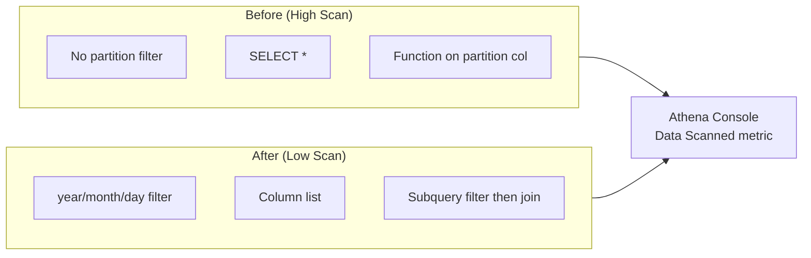

# Lab 5.2: Athena Query Optimization Exercises

> 📊 **Diagrams:** [Mermaid](diagram.md) · [Draw.io (lab-5.2-athena-optimization.drawio)](../../../../docs/diagrams/drawio/lab-5.2-athena-optimization.drawio) · [PNG](../../../../docs/diagrams/png/lab-5.2-athena-optimization.png) · [SVG](../../../../docs/diagrams/svg/lab-5.2-athena-optimization.svg)

**Estimated time:** 90 minutes · **Module 5**

---

## Objectives

- Measure **data scanned** for intentionally inefficient vs optimized queries
- Document before/after cost and performance improvements
- Apply partition pruning, column projection, and filter-pushdown patterns
- Use EXPLAIN and `$partitions` metadata for troubleshooting

---

## Prerequisites

- Lab 5.1 complete (`fact_orders`, dimensions populated)
- Athena engine version 3 enabled on workgroup (recommended)
- Spreadsheet or `LAB-REPORT.md` to record scan metrics

---

## Architecture



---

## Project Structure

```text
lab-5.2-athena-optimization/
├── README.md
└── scripts/
    ├── before_queries.sql
    ├── after_queries.sql
    └── explain_checks.sql
```

---

## Step 1: Baseline Metrics

In Athena, open **Recent queries** and note the **Data scanned** column.

Run each query in `scripts/before_queries.sql` **one at a time**. Record results:

| Query ID | Description | Data Scanned | Run Time |
|----------|-------------|--------------|----------|
| B1 | No partition filter | | |
| B2 | SELECT * year=2024 | | |
| B3 | CAST on partition cols | | |
| B4 | Join before filter | | |

**Tip:** If dataset is small, scans may look similar—add more historical partitions in Lab 5.1 or use a larger date range in B2 to amplify differences.

---

## Step 2: Optimized Queries

Run matching optimizations in `scripts/after_queries.sql`:

| Query ID | Pairs With | Optimization Applied |
|----------|------------|----------------------|
| A1 | B1, B3 | Single-day partition literals |
| A2 | B2 | Explicit column list + day range |
| A3 | B3 | IN list on day instead of CAST |
| A4 | B4 | Filtered subquery before join |

Record the same metrics table for A1–A4.

---

## Step 3: Calculate Improvement

For each pair, compute:

```text
Scan reduction % = (1 - after_scan / before_scan) × 100
Estimated cost savings = (before_scan - after_scan) / 1 TB × $5.00
```

(Use your region's Athena pricing; $5/TB is illustrative for us-east-1.)

**Target:** ≥ 80% scan reduction on B1→A1 and B2→A2 when multiple partitions exist.

---

## Step 4: EXPLAIN Analysis

Run `scripts/explain_checks.sql`. Compare plans:

- Optimized query should reference **partition filters**
- CAST/concat version may show **full table scan** or no partition constraint

---

## Step 5: Partition Inventory

```sql
SELECT year, month, day, COUNT(*) AS partition_count
FROM "cnde_dev_datalake\$partitions"
WHERE tablename = 'fact_orders'
GROUP BY year, month, day
ORDER BY year, month, day;
```

Verify partitions match S3:

```bash
aws s3 ls "s3://${BUCKET}/curated/retail/fact_orders/" --recursive | grep PRE
```

---

## Step 6: Document Before/After Report

Create `LAB-REPORT.md`:

```markdown
# Lab 5.2 Report

## Scan Comparison
| Query | Before (bytes) | After (bytes) | Reduction % |
|-------|----------------|---------------|-------------|
| B1→A1 | | | |
| B2→A2 | | | |
| B3→A3 | | | |
| B4→A4 | | | |

## Key Findings
1. ...
2. ...

## EXPLAIN Observations
- ...

## Recommendations for RetailCo Analysts
- Always include year, month, day
- Never use SELECT * on fact_orders
- ...
```

---

## Deliverables

- [ ] All before and after queries executed
- [ ] Scan metrics table with ≥ 4 rows populated
- [ ] At least 50% reduction demonstrated on one query pair (or documented why dataset is too small)
- [ ] `LAB-REPORT.md` with recommendations

---

## Verification Checklist

- [ ] A1 scans less data than B1 (when multiple partitions exist)
- [ ] A2 column list scans less than B2 SELECT *
- [ ] A3 uses partition pruning (check EXPLAIN)
- [ ] A4 returns same logical rows as B4 for same business filters
- [ ] `$partitions` metadata matches S3 folder structure

---

## Troubleshooting

| Issue | Solution |
|-------|----------|
| All scans show 0 bytes | Tables empty—complete Lab 5.1 load first |
| Before/after scan identical | Only one partition exists; load more days |
| EXPLAIN not available | Enable Athena engine v3; upgrade workgroup |
| Query fails on `$partitions` | Escape database name: `"cnde_dev_datalake\$partitions"` |
| B3 surprisingly fast | Small data—document limitation in report |
| Access denied on workgroup | Use `primary` or ask admin for analytics workgroup |

---

## What You Learned

- Data scanned is the primary Athena cost and performance lever
- Partition column expressions break pruning
- Early filtering and column lists reduce bytes read
- Operational discipline: capture metrics for every production query change

---

**Next:** [Lab 5.3 – Cost-Efficient Query Patterns](../lab-5.3-cost-efficient-queries/README.md)
