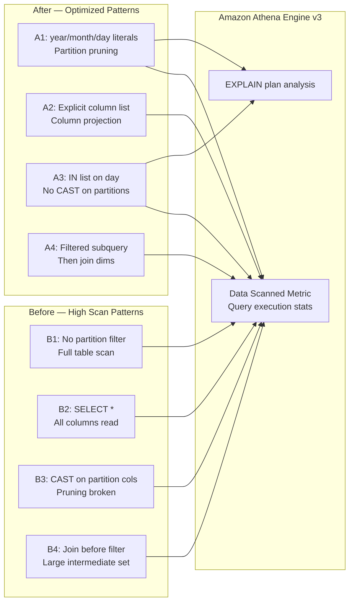
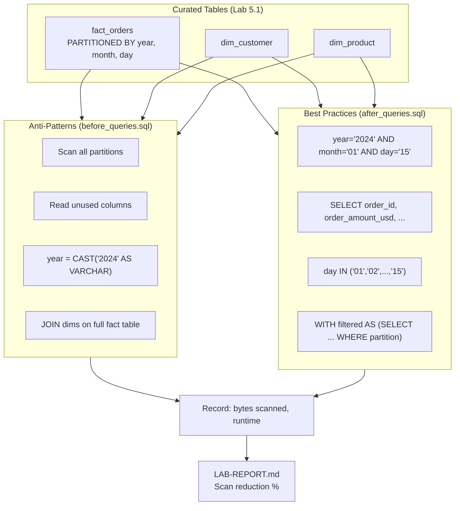
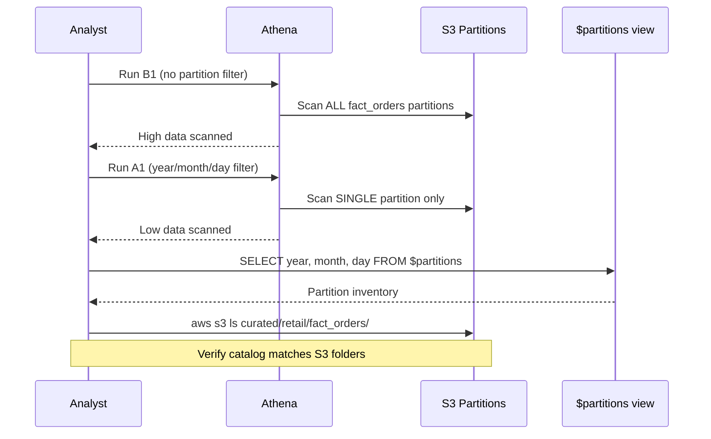

# Lab 5.2: Athena Query Optimization — Architecture Diagram

## Purpose

Measure and reduce **data scanned** by comparing intentionally inefficient queries against optimized alternatives on the Lab 5.1 star schema. Apply partition pruning, column projection, and filter-pushdown patterns; use EXPLAIN and `$partitions` metadata to verify optimization; and document before/after cost and performance improvements for RetailCo analysts.

---

## Optimization Architecture



---

## Query Optimization Flow



---

## Partition Pruning Sequence



---

## Key Components

| Component | Location | Role |
|-----------|----------|------|
| `before_queries.sql` | `scripts/` | B1–B4 intentionally inefficient baseline queries |
| `after_queries.sql` | `scripts/` | A1–A4 optimized counterparts |
| `explain_checks.sql` | `scripts/` | EXPLAIN plans to verify partition filters |
| `fact_orders` | Glue Catalog | Primary optimization target (partitioned Parquet) |
| `dim_customer`, `dim_product` | Glue Catalog | Join targets; filter facts before joining |
| `$partitions` | Athena metadata | Inventory of registered Hive partitions |
| Athena workgroup | Console | Engine v3; displays Data Scanned per query |

---

## S3 Paths & Data Flow

| Resource | S3 Path | Relevance to Optimization |
|----------|---------|----------------------------|
| Fact table | `s3://{bucket}/curated/retail/fact_orders/year={Y}/month={M}/day={D}/` | Partition pruning targets specific prefixes |
| Dimensions | `s3://{bucket}/curated/retail/dim_customer/` | Small; full scan acceptable |
| Dimensions | `s3://{bucket}/curated/retail/dim_product/` | Small; full scan acceptable |
| Query results | `s3://{bucket}/athena-results/` | Athena output staging |

### Query Pair Reference

| Pair | Before (Anti-Pattern) | After (Optimization) | Expected Reduction |
|------|----------------------|------------------------|-------------------|
| B1 → A1 | No partition filter | Single-day partition literals | ≥ 80% (multi-partition) |
| B2 → A2 | `SELECT *` | Explicit column list | Proportional to column count |
| B3 → A3 | `CAST()` on partition column | `IN` list on `day` | Restores pruning |
| B4 → A4 | Join then filter | Filtered subquery then join | Smaller join input |

### Cost Calculation

```text
Scan reduction % = (1 - after_scan / before_scan) × 100
Estimated savings  = (before_scan - after_scan) / 1 TB × $5.00  (us-east-1 illustrative)
```

### Partition Verification

```sql
-- Catalog inventory
SELECT year, month, day, COUNT(*) AS partition_count
FROM "cnde_dev_datalake$partitions"
WHERE tablename = 'fact_orders'
GROUP BY year, month, day;

-- S3 verification
aws s3 ls s3://{bucket}/curated/retail/fact_orders/ --recursive | grep PRE
```

### Data Flow (Read Path)

```text
Analyst query
      │
      ├── Partition filter present? ──YES──► Scan only matching S3 prefixes
      │                                    (year=/month=/day=/)
      │
      └── No filter / CAST on partition ──► Full table scan (all partitions)
```

---

## Related Labs

- **Previous:** [Lab 5.1 – Star Schema](../lab-5.1-star-schema/diagram.md)
- **Next:** [Lab 5.3 – Cost-Efficient Queries](../lab-5.3-cost-efficient-queries/diagram.md)
