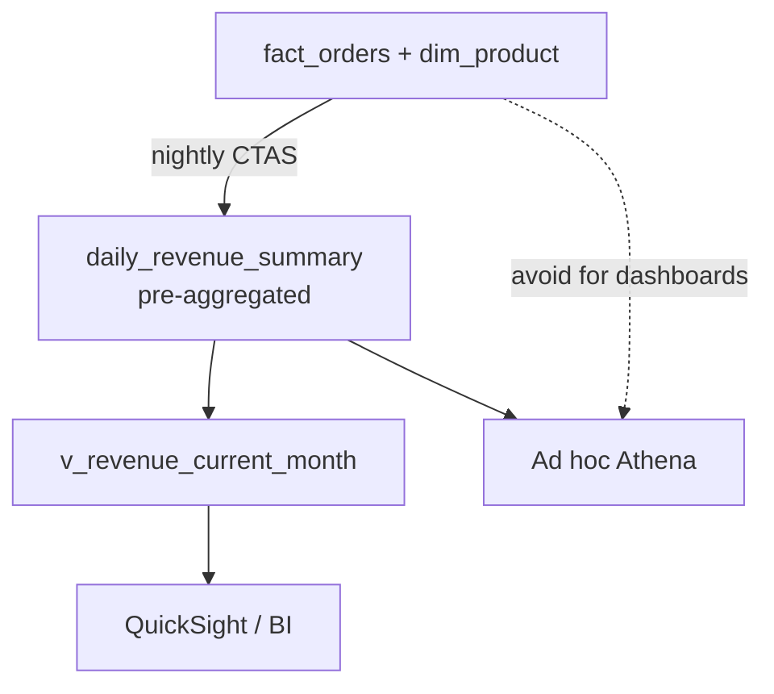

# Lab 5.3: Cost-Efficient Query Patterns and Reporting

> 📊 **Diagrams:** [Mermaid](diagram.md) · [Draw.io (lab-5.3-cost-efficient-queries.drawio)](../../../../docs/diagrams/drawio/lab-5.3-cost-efficient-queries.drawio) · [PNG](../../../../docs/diagrams/png/lab-5.3-cost-efficient-queries.png) · [SVG](../../../../docs/diagrams/svg/lab-5.3-cost-efficient-queries.svg)

**Estimated time:** 90 minutes · **Module 5**

---

## Objectives

- Build a pre-aggregated **daily revenue summary** table
- Create analyst **views** with guardrailed access patterns
- Compare fact-level vs summary-level query cost
- Configure Athena workgroup hygiene (scan limits, result path)

---

## Prerequisites

- Labs 5.1 and 5.2 complete
- IAM permission for Athena workgroup create/update (or use console)
- S3 lifecycle access for `athena-results/` prefix (optional)

---

## Architecture



---

## Project Structure

```text
lab-5.3-cost-efficient-queries/
├── README.md
└── scripts/
    ├── create_summary_table.sql
    ├── create_analyst_views.sql
    ├── dashboard_queries.sql
    └── workgroup_config.md
```

---

## Step 1: Create Summary Table

```bash
export BUCKET=$(cd ../../../../../infrastructure/environments/dev && terraform output -raw data_lake_bucket)
cd modules/module-05-modeling-analytics/labs/lab-5.3-cost-efficient-queries/scripts
sed -i.bak "s/YOUR_BUCKET/${BUCKET}/g" create_summary_table.sql && rm -f *.bak
```

Run `create_summary_table.sql` in Athena.

**Verification:**

```bash
aws s3 ls "s3://${BUCKET}/curated/retail/daily_revenue_summary/" --recursive | head
```

```sql
SELECT * FROM cnde_dev_datalake.daily_revenue_summary
WHERE year = '2024' AND month = '01'
LIMIT 10;
```

---

## Step 2: Create Analyst Views

Run `create_analyst_views.sql`.

```sql
SELECT * FROM cnde_dev_datalake.v_revenue_current_month LIMIT 10;
```

---

## Step 3: Compare Query Cost

Run both queries in `dashboard_queries.sql`. Record **Data scanned**:

| Query | Purpose | Data Scanned |
|-------|---------|--------------|
| Fact aggregation | Backfill / audit only | |
| Summary query | Dashboard default | |

**Target:** Summary query scans **at least 5× less** data than fact aggregation when ≥ 7 days of facts exist.

---

## Step 4: Configure Workgroup

Follow `scripts/workgroup_config.md`. Set:

- Result path: `s3://${BUCKET}/athena-results/`
- Bytes scanned cutoff (10 GB for dev labs)

**Verification:**

```bash
aws athena get-work-group --work-group cnde-analytics-dev \
  --query 'WorkGroup.Configuration' --output json
```

---

## Step 5: Analyst Query Policy

Create `ANALYST-GUIDE.md` (1 page) with:

- Mandatory partition filters
- When to use summary vs fact tables
- LIMIT during exploration
- Escalation for large scans

---

## Deliverables

- [ ] `daily_revenue_summary` table created and queryable
- [ ] Views `v_orders_enriched` and `v_revenue_current_month` created
- [ ] Scan comparison documented in `LAB-REPORT.md`
- [ ] Workgroup configured or documented if permissions limited
- [ ] `ANALYST-GUIDE.md` published

---

## Troubleshooting

| Issue | Solution |
|-------|----------|
| Summary CTAS fails | Check fact_orders has data for `year=2024/month=01` |
| View returns empty for current month | System date may differ—adjust view or test with fixed month |
| Cannot create workgroup | Use console with admin role; document settings in report |
| Summary scan still large | Too many categories/statuses—narrow GROUP BY grain |
| Duplicate summary rows | Re-run CTAS after `DROP TABLE` or use new S3 suffix |

---

## What You Learned

- Pre-aggregation is the strongest recurring cost control for BI
- Views encode best practices for self-serve analysts
- Workgroup limits prevent accidental full-table scans
- Separate workloads: ad hoc (facts) vs scheduled (summaries)

---

**Next:** [Assignment 5](../../assignments/assignment-05.md)
