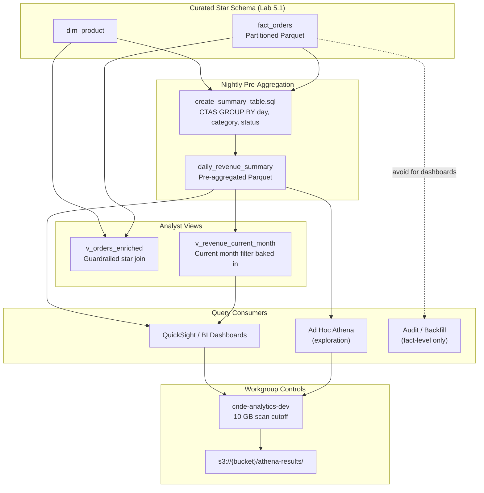
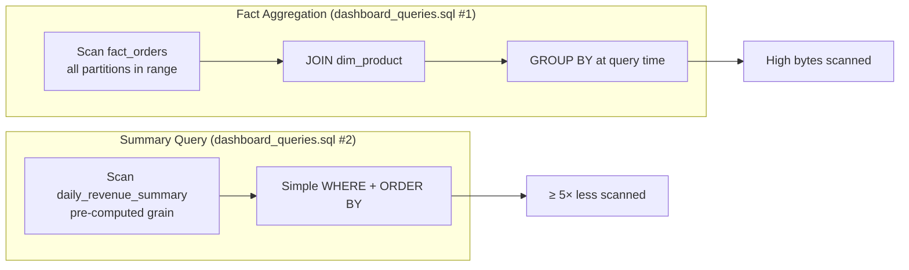
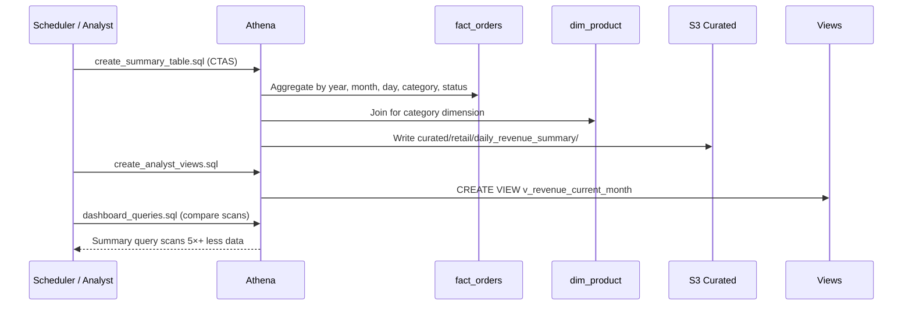

# Lab 5.3: Cost-Efficient Query Patterns and Reporting — Architecture Diagram

## Purpose

Build a pre-aggregated **daily revenue summary** table to eliminate repeated full fact-table scans for BI dashboards. Create analyst **views** with guardrailed access patterns, compare fact-level vs summary-level query cost, and configure Athena workgroup hygiene (scan limits, dedicated result path) for sustainable self-serve analytics.

---

## Architecture Overview



---

## Query Cost Comparison Flow



---

## Nightly Summary Build Sequence



---

## Key Components

| Component | Type | Role |
|-----------|------|------|
| `daily_revenue_summary` | External table (Parquet) | Pre-aggregated daily revenue by category and status |
| `v_orders_enriched` | Athena view | Guardrailed star join for ad hoc exploration |
| `v_revenue_current_month` | Athena view | Dashboard-default query with month filter |
| `create_summary_table.sql` | Script | CTAS to build summary from fact + dim |
| `create_analyst_views.sql` | Script | View definitions encoding best practices |
| `dashboard_queries.sql` | Script | Side-by-side cost comparison queries |
| `cnde-analytics-dev` | Athena workgroup | Scan cutoff (10 GB), result path, engine settings |
| `ANALYST-GUIDE.md` | Documentation | Mandatory partition filters, summary vs fact guidance |

---

## S3 Paths & Data Flow

| Table / Resource | S3 Path | Format | Use Case |
|------------------|---------|--------|----------|
| `fact_orders` | `s3://{bucket}/curated/retail/fact_orders/year={Y}/month={M}/day={D}/` | Parquet | Audit, backfill, ad hoc exploration |
| `dim_product` | `s3://{bucket}/curated/retail/dim_product/` | Parquet | Dimension lookup in summary CTAS |
| `daily_revenue_summary` | `s3://{bucket}/curated/retail/daily_revenue_summary/` | Parquet | **Default for dashboards** |
| Athena results | `s3://{bucket}/athena-results/` | CSV/Parquet | Query output staging |

### Curated Layout (Extended)

```text
s3://{bucket}/curated/retail/
├── dim_customer/
├── dim_product/
├── fact_orders/year=/month=/day=/
└── daily_revenue_summary/          ← Lab 5.3 addition
```

### Workload Routing

| Workload | Target Table | Rationale |
|----------|-------------|-----------|
| BI dashboards | `daily_revenue_summary` via `v_revenue_current_month` | Minimal scan; pre-computed aggregates |
| Ad hoc exploration | `v_orders_enriched` with LIMIT | Guardrailed join; bounded cost |
| Audit / backfill | `fact_orders` direct | Full grain needed; run off-peak only |
| Monthly reporting | `daily_revenue_summary` | Roll up pre-aggregated rows |

### Data Flow Summary

```text
fact_orders + dim_product
        │
        │ nightly CTAS (create_summary_table.sql)
        ▼
daily_revenue_summary/
        │
        ├──► v_revenue_current_month ──► QuickSight / dashboards
        │
        └──► Ad hoc queries (5×+ cheaper than fact aggregation)

fact_orders ──(avoid for recurring dashboards)──► high scan cost
```

### Workgroup Configuration

| Setting | Value | Purpose |
|---------|-------|---------|
| Result location | `s3://{bucket}/athena-results/` | Isolated query output |
| Bytes scanned cutoff | 10 GB (dev) | Prevent accidental full-table scans |
| Engine version | Athena engine v3 | EXPLAIN, performance features |

---

## Related Labs

- **Previous:** [Lab 5.2 – Athena Optimization](../lab-5.2-athena-optimization/diagram.md)
- **Next:** Module 6 – Step Functions Orchestration
