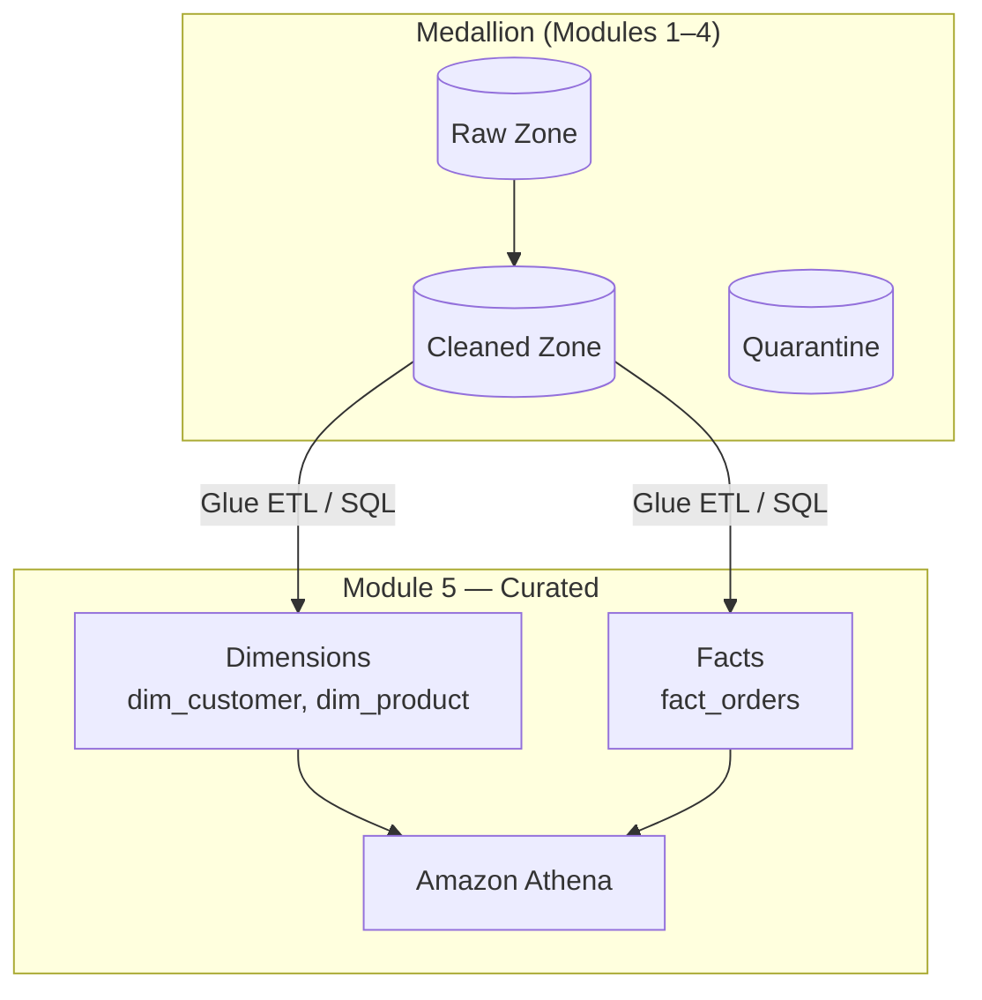
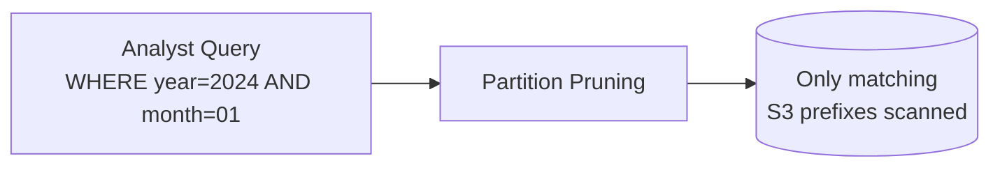
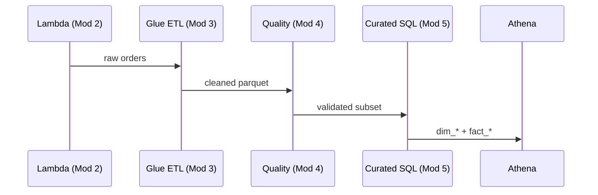

# Week 5 Lecture: Data Modeling & Analytics on the Lake

**Duration:** 2 hours · **Module 5**

---

## Learning Objectives

By the end of this lecture you will:

1. Design star schemas (facts and dimensions) for analytics on S3 and Athena
2. Choose partitioning strategies that align with query patterns and lifecycle policies
3. Optimize Athena queries for performance and cost (partition pruning, columnar formats, file sizing)
4. Apply cost-efficient SQL patterns for enterprise reporting workloads
5. Connect curated modeling to the medallion architecture built in Modules 1–4

---

## 1. From Cleaned to Curated: The Analytics Layer

Modules 1–4 established ingestion, ETL, and quality. **Module 5** transforms validated cleaned data into **business-ready curated models** that analysts, finance, and ML teams query directly.



**Key principle:** Cleaned tables preserve source fidelity; curated tables optimize for **known query patterns** and **stable business definitions**.

---

## 2. Dimensional Modeling Fundamentals

### Facts vs Dimensions

| Type | Role | Examples | Update Pattern |
|------|------|----------|----------------|
| **Fact** | Measurable events or transactions | `fact_orders`, `fact_inventory_snapshot` | Append-heavy, large volume |
| **Dimension** | Descriptive context for analysis | `dim_customer`, `dim_product`, `dim_date` | Slowly changing (SCD) |

### Star Schema (RetailCo Context)

```text
                    dim_customer
                         │
                         │ customer_key
                         ▼
    dim_product ──► fact_orders ◄── dim_date
         │              │
    product_key    order_key, measures:
                   quantity, amount, discount
```

**Why star schema on a data lake?**

- Simple joins for analysts and BI tools
- Predictable Athena query plans
- Clear ownership: dimensions = master data, facts = events
- Works with Parquet column pruning and partition elimination

### Grain

**Grain** is the finest level of detail in a fact table. For `fact_orders`:

- **Order grain:** One row per `order_id` (this course's default)
- **Line-item grain:** One row per `order_id` + `line_number` (higher volume, more flexible)

Document grain in a **data dictionary** stored under `s3://{bucket}/metadata/dictionaries/`.

---

## 3. Slowly Changing Dimensions (SCD)

Customer and product attributes change over time. Common strategies:

| Type | Behavior | Lake Implementation |
|------|----------|---------------------|
| **SCD Type 1** | Overwrite; no history | Update dimension Parquet; single current row per key |
| **SCD Type 2** | Full history with `effective_date`, `is_current` | Append new row; close prior row |
| **SCD Type 3** | Limited history (e.g., previous address) | Extra columns on current row |

**Lab 5.1** implements Type 1 for simplicity; Assignment 5 asks you to justify Type 2 for customer segments.

---

## 4. Partitioning Strategies

Partitioning is the **highest-leverage cost control** on S3 + Athena. Wrong partitions waste scans; right partitions eliminate 90%+ of data read.

### Hive-Style Partitions

```text
s3://bucket/curated/retail/fact_orders/
  year=2024/month=01/day=15/part-00000.parquet
  year=2024/month=01/day=16/part-00000.parquet
```

Athena/Glue map folder names to partition columns: `year`, `month`, `day`.

### Choosing Partition Keys

| Query Pattern | Recommended Partitions | Avoid |
|---------------|------------------------|-------|
| Daily dashboards | `year`, `month`, `day` | High-cardinality `order_id` |
| Monthly finance close | `year`, `month` | Over-partitioning by hour on batch data |
| Product category reports | `category` + `year` | Partition on free-text fields |
| Multi-tenant SaaS | `tenant_id` + `date` | Single global partition |

### Cardinality Rules

- Target **hundreds to low thousands** of partitions per table per year
- Avoid partitions with **< 128 MB** of data (small file problem)
- Align with **Module 1** zone paths: extend cleaned date partitions into curated



---

## 5. File Format and Layout

| Format | Athena | Compression | Use Case |
|--------|--------|-------------|----------|
| **Parquet** | Native, columnar | Snappy or ZSTD | Curated facts and dimensions (default) |
| **ORC** | Supported | ZSTD | Alternative columnar; less common in AWS labs |
| **JSON/CSV** | Supported | gzip | Raw/cleaned only; avoid in curated |

### File Sizing

- Target **128 MB – 512 MB** per Parquet file for fact tables
- Glue ETL: `coalesce(n)` or `repartition(n)` before write
- Too many small files → high Athena metadata overhead and slow queries

---

## 6. Athena Query Optimization

Athena charges primarily on **data scanned**. Optimization = scan less data per query.

### Partition Pruning (Required)

```sql
-- GOOD: partition columns in WHERE
SELECT SUM(order_amount) AS revenue
FROM cnde_dev_datalake.fact_orders
WHERE year = '2024' AND month = '01' AND day BETWEEN '01' AND '07';

-- BAD: function on partition column prevents pruning
SELECT SUM(order_amount)
FROM cnde_dev_datalake.fact_orders
WHERE date_parse(concat(year, '-', month, '-', day), '%Y-%m-%d') > DATE '2024-01-01';
```

### Column Projection

```sql
-- GOOD: only needed columns
SELECT customer_key, order_amount FROM fact_orders WHERE year = '2024';

-- BAD: SELECT * on wide fact table
SELECT * FROM fact_orders WHERE year = '2024';
```

### Predicate Pushdown

Filters on Parquet columns are pushed to the reader. Combine with partitions:

```sql
WHERE year = '2024' AND month = '01' AND order_status = 'shipped'
```

### JOIN Order and Broadcast

- Filter facts **before** joining large dimensions
- Small dimensions (< ~1 GB): Athena may broadcast automatically
- Pre-aggregate facts for dashboard queries (materialized summary tables)

### Approximations for Exploration

```sql
SELECT APPROX_DISTINCT(customer_key) FROM fact_orders
WHERE year = '2024' AND month = '01';
```

Use when exact distinct counts are not required—reduces memory and cost.

---

## 7. Athena Engine and Workgroup Settings

| Setting | Recommendation |
|---------|----------------|
| **Engine version** | Athena engine version 3 (Trino-based improvements) |
| **Workgroup** | Separate `analytics-dev` vs `analytics-prod` with scan limits |
| **Result location** | Dedicated `s3://{bucket}/athena-results/` with lifecycle expiration |
| **Partition projection** | For very high partition counts; define ranges in table DDL |
| **CTAS / INSERT** | Build summary tables instead of repeating heavy joins |

### EXPLAIN and Scan Metrics

After each query, check the Athena console **Data scanned** column. Lab 5.2 documents before/after scan sizes.

---

## 8. Cost-Efficient Query Patterns

### Pattern 1: Summary Tables (Gold on Gold)

Nightly Glue or Athena CTAS job:

```sql
CREATE TABLE daily_revenue_summary
WITH (
  format = 'PARQUET',
  partitioned_by = ARRAY['year', 'month'],
  external_location = 's3://{bucket}/curated/retail/daily_revenue_summary/'
) AS
SELECT
  year, month, day,
  COUNT(*) AS order_count,
  SUM(order_amount) AS revenue
FROM fact_orders
WHERE year = '2024'
GROUP BY year, month, day;
```

Dashboards query the **summary** table (KB scanned) not raw facts (GB scanned).

### Pattern 2: Incremental Curated Loads

Process only new cleaned partitions:

```sql
INSERT INTO fact_orders
SELECT ...
FROM cleaned_retail_orders
WHERE year = '2024' AND month = '01' AND day = '16'
  AND order_id NOT IN (
    SELECT order_id FROM fact_orders
    WHERE year = '2024' AND month = '01' AND day = '16'
  );
```

Prefer Glue incremental with job bookmarks for production scale.

### Pattern 3: View Layer for Analysts

```sql
CREATE OR REPLACE VIEW v_orders_current_month AS
SELECT f.order_id, f.order_amount, c.customer_name, p.product_name
FROM fact_orders f
JOIN dim_customer c ON f.customer_key = c.customer_key
JOIN dim_product p ON f.product_key = p.product_key
WHERE f.year = CAST(YEAR(CURRENT_DATE) AS VARCHAR)
  AND f.month = LPAD(CAST(MONTH(CURRENT_DATE) AS VARCHAR), 2, '0');
```

Views enforce partition filters and hide join complexity.

### Pattern 4: Scheduled vs Ad Hoc

| Workload | Approach |
|----------|----------|
| Scheduled dashboards | Pre-aggregated tables + QuickSight SPICE |
| Ad hoc exploration | Narrow date range + column list + LIMIT during discovery |
| ML feature extraction | Export subset via UNLOAD to controlled prefix |

---

## 9. Glue Data Catalog Integration

Tables created in Lab 5.1 register in the same database as Module 3 (`cnde_dev_datalake`):

```text
cnde_dev_datalake
├── cleaned_retail_orders      (Module 3 crawler)
├── dim_customer               (Lab 5.1)
├── dim_product                (Lab 5.1)
└── fact_orders                (Lab 5.1)
```

**MSCK REPAIR** or **Glue crawler** after new partitions:

```sql
MSCK REPAIR TABLE fact_orders;
```

Or use `ALTER TABLE ADD PARTITION` in DDL scripts for explicit control.

---

## 10. Building on Prior Modules

| Prior Module | Connection to Module 5 |
|--------------|------------------------|
| **Module 1** | Curated zone `s3://{bucket}/curated/retail/` |
| **Module 2** | Lambda-ingested orders land in raw → cleaned path |
| **Module 3** | Glue ETL output feeds star schema build SQL |
| **Module 4** | Only **passed** cleaned records should populate facts |



---

## 11. Industry Use Cases

### E-Commerce (RetailCo)

- Star schema for revenue by category, cohort, and campaign
- Partition by `year/month/day`; summarize for executive KPIs

### Financial Services

- Fact tables at transaction grain; strict currency and audit columns
- Cost control via workgroup scan quotas per team

### Healthcare (Preview Module 7)

- De-identified dimensions; facts without raw PHI in wide columns
- Partition by service date; access via Lake Formation tags

---

## 12. Troubleshooting Reference

| Symptom | Likely Cause | Fix |
|---------|--------------|-----|
| Athena scans entire table | Missing partition predicates | Add `year`, `month`, `day` to WHERE |
| `HIVE_PARTITION_SCHEMA_MISMATCH` | Inconsistent partition folder names | Standardize `month=01` zero-padding |
| Duplicate fact rows | Re-ran ETL without idempotency | Dedupe on `order_id` in curated load |
| Slow joins | Large dimension broadcast failure | Filter facts first; reduce dimension columns |
| High cost spike | `SELECT *` on historical range | Use summary table or narrow columns |
| Table not found | Catalog database mismatch | Verify `cnde_dev_datalake` and table names |

---

## 13. Key Terminology

| Term | Definition |
|------|------------|
| **Grain** | Level of detail represented by one fact row |
| **Surrogate key** | Integer key (`customer_key`) replacing natural IDs in facts |
| **Partition pruning** | Engine skips S3 prefixes not matching WHERE clause |
| **Data scanned** | Bytes read from S3; primary Athena cost driver |
| **CTAS** | CREATE TABLE AS SELECT — materialize query results |
| **Star schema** | Central fact table joined to denormalized dimensions |

---

## 14. Discussion Questions

1. When would you choose a snowflake schema over a star schema on Athena?
2. Should `order_status` live on the fact table or only on a dimension?
3. How do you enforce that analysts always filter partitions—views, workgroup limits, or both?
4. What grain would you use for inventory snapshots vs orders?
5. How does Module 4 quarantine policy affect curated fact completeness metrics?

---

## 15. This Week's Labs

| Lab | Goal |
|-----|------|
| **Lab 5.1** | Build `dim_customer`, `dim_product`, `fact_orders` with Athena DDL and load SQL |
| **Lab 5.2** | Before/after Athena optimization exercises with scan metrics |
| **Lab 5.3** | Cost-efficient patterns: summary tables, views, workgroup hygiene |

**Assignment 5:** Design an analytics model for RetailCo e-commerce.

---

## Further Reading

- [Athena Performance Tuning](https://docs.aws.amazon.com/athena/latest/ug/performance-tuning.html)
- [Partitioning Data in Athena](https://docs.aws.amazon.com/athena/latest/ug/partitions.html)
- [Kimball Dimensional Modeling Techniques](https://www.kimballgroup.com/data-warehouse-business-intelligence-resources/kimball-techniques/dimensional-modeling-techniques/)
- [AWS Blog: Top 10 Performance Tuning Tips for Amazon Athena](https://aws.amazon.com/blogs/big-data/top-10-performance-tuning-tips-for-amazon-athena/)

---

**Next:** [Lab 5.1 – Star Schema](../labs/lab-5.1-star-schema/README.md)
