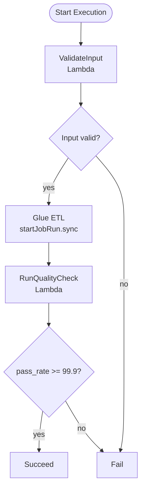

# Lab 6.1: Multi-Stage ETL Workflow with Step Functions

> 📊 **Diagrams:** [Mermaid](diagram.md) · [Draw.io (lab-6.1-step-functions-etl.drawio)](../../../../docs/diagrams/drawio/lab-6.1-step-functions-etl.drawio) · [PNG](../../../../docs/diagrams/png/lab-6.1-step-functions-etl.png) · [SVG](../../../../docs/diagrams/svg/lab-6.1-step-functions-etl.svg)

**Estimated time:** 120 minutes · **Module 6**

---

## Objectives

- Deploy a Standard workflow orchestrating Lambda validation and Glue ETL
- Use `glue:startJobRun.sync` for synchronous job completion
- Branch on quality pass rate before pipeline success
- Deploy state machine via Terraform module or AWS CLI
- Trace execution in Step Functions console and CloudWatch Logs

---

## Prerequisites

- Modules 1–5 complete (S3 lake, Glue job from Module 3)
- Terraform 1.5+ and AWS CLI configured
- Glue job name from `terraform output` (glue-etl module if deployed)

---

## Architecture



---

## Project Structure

```text
lab-6.1-step-functions-etl/
├── README.md
└── src/
    ├── daily_etl_pipeline.asl.json
    └── pipeline_validation_handler.py
```

---

## Step 1: Deploy Validation Lambda

```bash
cd modules/module-06-orchestration/labs/lab-6.1-step-functions-etl
mkdir -p build && cp src/pipeline_validation_handler.py build/
cd build && zip -r ../pipeline-validation.zip . && cd ..

export BUCKET=$(cd ../../../../../infrastructure/environments/dev && terraform output -raw data_lake_bucket)
export FUNCTION_NAME=cnde-dev-pipeline-validation
```

Create IAM role (trust `lambda.amazonaws.com`) with `lambda:BasicExecutionRole` and deploy:

```bash
aws lambda create-function \
  --function-name "$FUNCTION_NAME" \
  --runtime python3.11 \
  --handler pipeline_validation_handler.handler \
  --role arn:aws:iam::ACCOUNT_ID:role/YOUR_LAMBDA_ROLE \
  --zip-file fileb://pipeline-validation.zip

export VALIDATION_LAMBDA_ARN=$(aws lambda get-function --function-name "$FUNCTION_NAME" --query 'Configuration.FunctionArn' --output text)
```

---

## Step 2: Prepare State Machine Definition

Substitute placeholders in `src/daily_etl_pipeline.asl.json`:

```bash
export GLUE_JOB_NAME=cnde-dev-raw-to-cleaned-etl   # from Module 3 terraform output

sed -e "s|\${GLUE_JOB_NAME}|${GLUE_JOB_NAME}|g" \
    -e "s|\${VALIDATION_LAMBDA_ARN}|${VALIDATION_LAMBDA_ARN}|g" \
    src/daily_etl_pipeline.asl.json > build/daily_etl_pipeline-resolved.json
```

---

## Step 3: Deploy with Terraform (Recommended)

Add to `infrastructure/environments/dev/main.tf` (or apply module standalone):

```hcl
module "step_functions" {
  source                  = "../../modules/step-functions"
  project                 = var.project
  environment             = var.environment
  student                 = var.student
  aws_region              = var.aws_region
  bucket_name             = module.data_lake.bucket_name
  glue_job_name           = "cnde-dev-raw-to-cleaned-etl"
  validation_lambda_arn   = var.validation_lambda_arn  # set after Lab 6.1 Step 1
  state_machine_definition_path = abspath("${path.root}/../../../modules/module-06-orchestration/labs/lab-6.1-step-functions-etl/build/daily_etl_pipeline-resolved.json")
}
```

```bash
cd infrastructure/environments/dev
terraform init && terraform apply
```

**Or CLI:**

```bash
# Create execution role with glue:StartJobRun, lambda:InvokeFunction, logs:*
aws stepfunctions create-state-machine \
  --name cnde-dev-daily-etl-lab61 \
  --definition file://build/daily_etl_pipeline-resolved.json \
  --role-arn arn:aws:iam::ACCOUNT_ID:role/YOUR_SFN_ROLE
```

---

## Step 4: Start Test Execution

```bash
aws stepfunctions start-execution \
  --state-machine-arn "$STATE_MACHINE_ARN" \
  --name "lab61-$(date +%s)" \
  --input '{"processing_date":"2024-01-15","dataset":"retail/orders","triggered_by":"lab-6.1"}'
```

**Verification:**

```bash
aws stepfunctions describe-execution --execution-arn "$EXECUTION_ARN" \
  --query '{status:status, startDate:startDate, stopDate:stopDate}'
```

Console: Step Functions → Executions → Visual workflow → all states green.

---

## Step 5: Simulate Quality Failure

Re-run with mock failure payload (extend Lambda to read `mock_pass_rate`):

```bash
aws lambda update-function-configuration \
  --function-name "$FUNCTION_NAME" \
  --environment "Variables={MOCK_PASS_RATE=98.5}"

# Or pass in execution input if handler reads event.mock_pass_rate:
aws stepfunctions start-execution \
  --state-machine-arn "$STATE_MACHINE_ARN" \
  --name "lab61-fail-$(date +%s)" \
  --input '{"processing_date":"2024-01-15","dataset":"retail/orders","mock_pass_rate":98.5}'
```

Confirm execution ends in `Failed` at `EvaluateQuality` or `NotifyFailure`.

---

## Deliverables

- [ ] `daily_etl_pipeline-resolved.json` deployed to Step Functions
- [ ] Successful execution with pass_rate ≥ 99.9
- [ ] Failed execution documented with execution ARN screenshot
- [ ] `LAB-REPORT.md` with state transition timeline

---

## Troubleshooting

| Issue | Solution |
|-------|----------|
| `AccessDenied` on Glue | Add `glue:StartJobRun` to SFN execution role |
| Glue sync timeout | Increase state `TimeoutSeconds`; check job duration |
| Lambda ResourceNotFound | Verify ARN substitution in ASL JSON |
| Choice always goes to Default | Check `$.quality_result.Payload.pass_rate` path |
| Invalid State Machine Definition | Validate JSON with `python -m json.tool` |
| Placeholder ARN in definition | Re-run sed substitution before deploy |

---

## What You Learned

- Multi-stage orchestration across Lambda and Glue
- Choice states for business logic gates (quality SLO)
- Sync integrations wait for long-running Glue jobs
- Infrastructure-as-code for state machines

---

**Next:** [Lab 6.2 – Retry and Error Branching](../lab-6.2-retry-error-branching/README.md)
