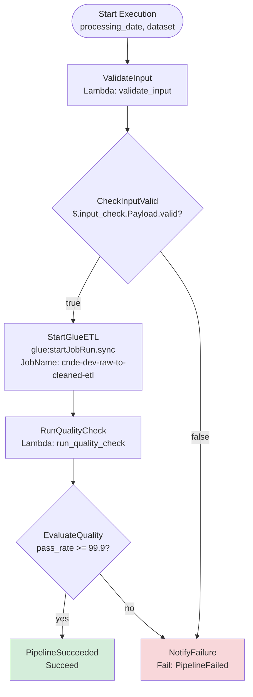
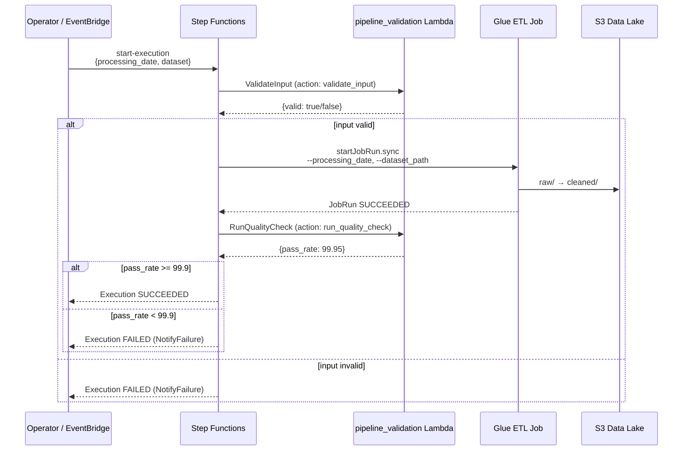
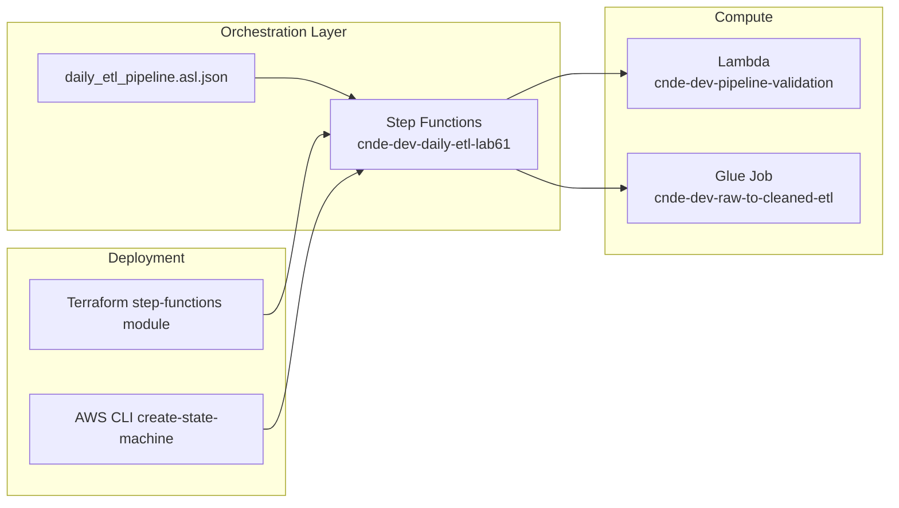

# Lab 6.1: Multi-Stage ETL Workflow with Step Functions — Architecture Diagram

## Purpose

Deploy a **Standard** Step Functions workflow that orchestrates a multi-stage daily ETL pipeline: validate input via Lambda, run Glue ETL synchronously with `glue:startJobRun.sync`, execute a post-transform quality check, and branch on pass rate (≥ 99.9%) before declaring success or failure. This lab establishes the orchestration foundation extended in Labs 6.2 and 6.3.

---

## State Machine Architecture



---

## Execution Sequence



---

## Infrastructure Components



---

## Key Components

| Component | Service | Role |
|-----------|---------|------|
| `daily_etl_pipeline.asl.json` | Step Functions | State machine definition (ASL) |
| `pipeline_validation_handler.py` | Lambda | Input validation + post-Glue quality check |
| `cnde-dev-raw-to-cleaned-etl` | Glue | Raw-to-cleaned ETL (Module 3) |
| `ValidateInput` | SFN Task | Lambda invoke with `action: validate_input` |
| `StartGlueETL` | SFN Task | Sync Glue integration; waits for job completion |
| `RunQualityCheck` | SFN Task | Lambda invoke with `action: run_quality_check` |
| `EvaluateQuality` | SFN Choice | Gates on `pass_rate >= 99.9` |
| Terraform module | IaC | Deploys state machine + IAM execution role |

---

## S3 Paths & Data Flow

| Stage | S3 Path | Direction | Triggered By |
|-------|---------|-----------|--------------|
| Raw input | `s3://{bucket}/raw/retail/orders/year={Y}/month={M}/day={D}/` | Read | Glue ETL (StartGlueETL) |
| Cleaned output | `s3://{bucket}/cleaned/retail/orders/year={Y}/month={M}/day={D}/` | Write | Glue ETL |
| Quarantine | `s3://{bucket}/quarantine/retail/orders/` | Write | Quality check failures (Module 4) |
| Pipeline metadata | `s3://{bucket}/metadata/pipeline-runs/` | Write | Execution audit (future labs) |

### Execution Input

```json
{
  "processing_date": "2024-01-15",
  "dataset": "retail/orders",
  "triggered_by": "lab-6.1"
}
```

### Data Flow Summary

```text
Step Functions execution
      │
      ├── ValidateInput (Lambda) ──► check processing_date + dataset exist
      │
      ├── StartGlueETL (Glue sync) ──► raw/retail/orders/ ──► cleaned/retail/orders/
      │
      ├── RunQualityCheck (Lambda) ──► compute pass_rate from cleaned/quarantine
      │
      └── EvaluateQuality (Choice)
              ├── pass_rate >= 99.9 ──► SUCCEED
              └── pass_rate < 99.9  ──► FAIL
```

### IAM Permissions (Execution Role)

| Action | Resource | Purpose |
|--------|----------|---------|
| `lambda:InvokeFunction` | `cnde-dev-pipeline-validation` | Validation tasks |
| `glue:StartJobRun` | `cnde-dev-raw-to-cleaned-etl` | ETL execution |
| `logs:*` | CloudWatch Logs | Execution logging |

---

## Related Labs

- **Previous:** Module 5 Analytics (curated data downstream)
- **Next:** [Lab 6.2 – Retry and Error Branching](../lab-6.2-retry-error-branching/diagram.md)
